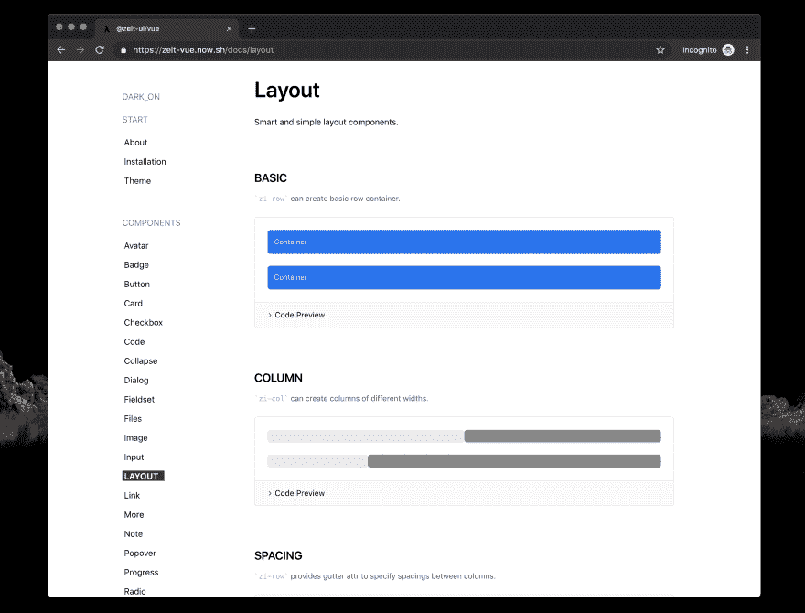

# 一个极客风格的 Vue UI 库

> 原文：<https://dev.to/witt/a-geek-style-vue-ui-library-2ieh>

[@zeit-ui/vue](https://github.com/zeit-ui/vue) 是一个非官方的 zeit UI 实现，设计原型来自 Zeit 的设计团队。

## 简称:

1.  支持黑暗模式。
2.  真的很酷。
3.  一些项目已经在使用它。

## 约 2.0

1.  重构多个组件，更高的表现力。
2.  简化代码，更好的实现。
3.  更易于使用的文档网站。

## 预览:

(任何建议都可以留言，我们愿意一起改进。)

