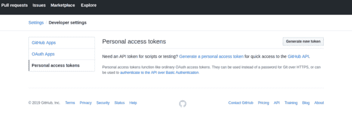
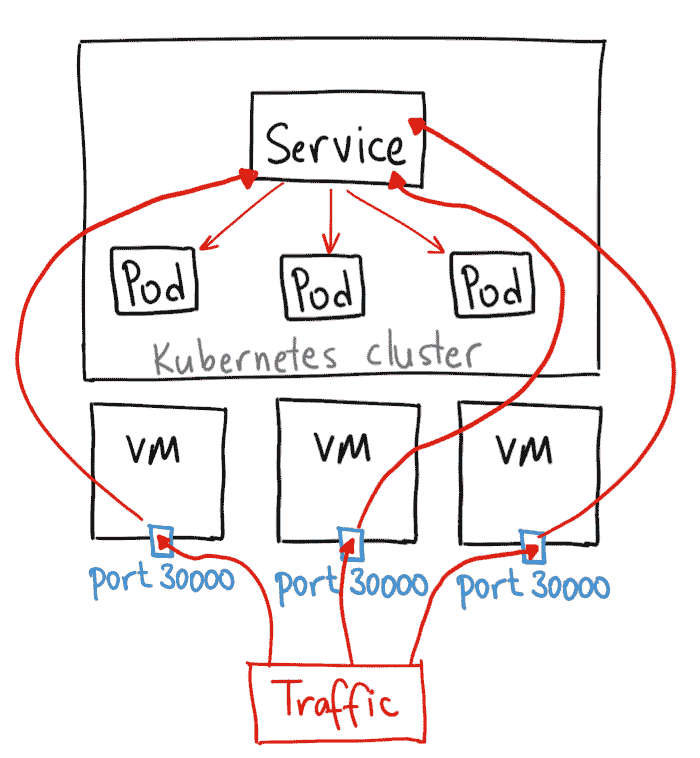
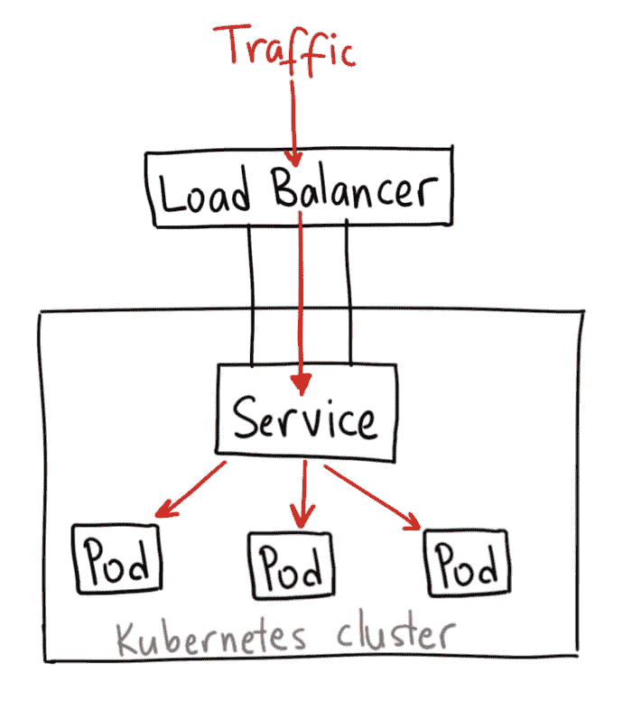
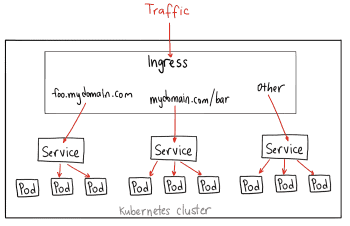

# Kubernetes 的温和介绍

> 原文：<https://dev.to/eon01/a-gentle-introduction-to-kubernetes-52en>

幻灯片可用[此处](https://slides.com/eon01/kubernetes-workshop#/)。
原文贴[此处](https://medium.com/faun/a-gentle-introduction-to-kubernetes-4961e443ba26)。
源代码[此处](https://github.com/eon01/kubernetes-workshop)。

# 简介

在本次研讨会中，我们将:

*   部署 Kubernetes 服务和大使 API 网关。
*   研究 Kubernetes 代理和 Istio 之类的服务网格之间的区别。
*   从外部和 Pod 访问 Kubernetes API。
*   了解选择什么 API。
*   了解服务帐户和 RBAC 的工作方式
*   发现一些安全陷阱时，建立 Docker 图像和许多有趣的事情。
*   其他事情:-)

我们将首先开发然后部署一个简单的 Python 应用程序(一个 Flask API，它通过编程语言返回趋势库列表)。

## 开发环境

我们将使用 Python 3.6.7

我们默认使用 Python 3.6 自带的 Ubuntu 18.04。您应该能够用 python3 命令调用它。(Ubuntu 17.10 及以上版本还附带 Python 3.6.7)

如果你用的是 Ubuntu 16.10 和 17.04，应该可以用以下命令安装:

```
sudo apt-get update
sudo apt-get install python3.6 
```

如果你使用的是 Ubuntu 14.04 或 16.04，你需要从个人包存档(PPA)中获取 Python 3:

```
sudo add-apt-repository ppa:deadsnakes/ppa
sudo apt-get update
sudo apt-get install python3.6 
```

对于其他操作系统，请访问本指南，按照说明安装 Python3。

现在安装 PIP，软件包管理器:

```
sudo apt-get install python3-pip 
```

接下来安装 Virtualenvwrapper，这是一个虚拟环境管理器:

```
sudo pip3 install virtualenvwrapper 
```

为你的 virtualenvs(我用的是~/dev/PYTHON_ENVS)创建一个文件夹，设置为 WORKON_HOME:

```
mkdir  ~/dev/PYTHON_ENVS
export WORKON_HOME=~/dev/PYTHON_ENVS 
```

为了在用户登录时获取环境详细信息，请在~/中添加以下行。巴沙尔:

```
source "/usr/local/bin/virtualenvwrapper.sh"
export WORKON_HOME="~/dev/PYTHON_ENVS" 
```

确保将工作场所调整到你真正的工作场所。
现在我们需要创建并激活新环境:

```
mkvirtualenv --python=/usr/bin/python3 trendinggitrepositories
workon trendinggitrepositories 
```

让我们创建应用程序目录:

```
mkdir trendinggitrepositories
cd trendinggitrepositories
mkdir api
cd api 
```

一旦虚拟环境被激活，我们就可以安装 Flask:

```
pip install flask 
```

## 开发一个趋势 Git 仓库 API (Flask)

在 API 文件夹`api`中，创建一个名为`app.py`的文件，并添加以下代码:

```
from flask import Flask

app = Flask(__name__)

@app.route('/')
def index():
    return "Hello, World!"

if __name__ == '__main__':
    app.run(debug=True) 
```

当用户请求“/”路线时，这将返回 hello world 消息。

现在使用:`python app.py`运行它，您将看到类似于下面的输出:

```
* Serving Flask app "api" (lazy loading)
* Environment: production
  WARNING: This is a development server. Do not use it in a production deployment.
  Use a production WSGI server instead.
* Debug mode: on
* Running on http://127.0.0.1:5000/ (Press CTRL+C to quit)
* Restarting with stat
* Debugger is active!
* Debugger PIN: 465-052-587 
```

[](https://res.cloudinary.com/practicaldev/image/fetch/s--vh5KmUFf--/c_limit%2Cf_auto%2Cfl_progressive%2Cq_auto%2Cw_880/https://miro.medium.com/max/700/0%2AKiSZZKqTjMbJctp2.png)

我们现在需要安装 PyGithub，因为我们需要它与 Github API v3 通信。

```
pip install PyGithub 
```

去 Github[创建一个新的 app](https://github.com/settings/applications/new) 。我们将需要申请“客户 ID”和“客户秘密”:

```
from github import Github
g = Github("xxxxxxxxxxxxx", "xxxxxxxxxxxxxxxxxxxxxxxxxxxxxx") 
```

这是迷你 API 的样子:

```
from flask import Flask, jsonify, abort
import urllib.request, json
from flask import request

app = Flask(__name__)

from github import Github
g = Github("xxxxxx", "xxxxxxxxxxxxx")

@app.route('/')
def get_repos():
    r = []

    try:
        args = request.args
        n = int(args['n'])
    except (ValueError, LookupError) as e:
        abort(jsonify(error="No integer provided for argument 'n' in the URL"))

    repositories = g.search_repositories(query='language:python')[:n]

    for repo in repositories:
        with urllib.request.urlopen(repo.url) as url:
            data = json.loads(url.read().decode())
        r.append(data)

    return jsonify({'repos':r })

if __name__ == '__main__':
    app.run(debug=True) 
```

让我们隐藏 Github 令牌和秘密以及环境中的其他变量。

```
from flask import Flask, jsonify, abort, request
import urllib.request, json, os
from github import Github

app = Flask(__name__)

CLIENT_ID = os.environ['CLIENT_ID']
CLIENT_SECRET = os.environ['CLIENT_SECRET']
DEBUG = os.environ['DEBUG']

g = Github(CLIENT_ID, CLIENT_SECRET)

@app.route('/')
def get_repos():
    r = []

    try:
        args = request.args
        n = int(args['n'])
    except (ValueError, LookupError) as e:
        abort(jsonify(error="No integer provided for argument 'n' in the URL"))

    repositories = g.search_repositories(query='language:python')[:n]

    for repo in repositories:
        with urllib.request.urlopen(repo.url) as url:
            data = json.loads(url.read().decode())
        r.append(data)

    return jsonify({'repos':r })

if __name__ == '__main__':
    app.run(debug=DEBUG) 
```

上面的代码将使用 Python 作为编程语言返回前“n”个存储库。我们也可以使用其他语言:

```
from flask import Flask, jsonify, abort, request
import urllib.request, json, os
from github import Github

app = Flask(__name__)

CLIENT_ID = os.environ['CLIENT_ID']
CLIENT_SECRET = os.environ['CLIENT_SECRET']
DEBUG = os.environ['DEBUG']

g = Github(CLIENT_ID, CLIENT_SECRET)

@app.route('/')
def get_repos():
    r = []

    try:
        args = request.args
        n = int(args['n'])
        l = args['l']
    except (ValueError, LookupError) as e:
        abort(jsonify(error="Please provide 'n' and 'l' parameters"))

    repositories = g.search_repositories(query='language:' + l)[:n]

    try:
        for repo in repositories:
            with urllib.request.urlopen(repo.url) as url:
                data = json.loads(url.read().decode())
            r.append(data)
        return jsonify({
            'repos':r,
            'status': 'ok'
            })
    except IndexError as e:
        return jsonify({
            'repos':r,
            'status': 'ko'
            })

if __name__ == '__main__':
    app.run(debug=DEBUG) 
```

在. env 文件中，添加您想要使用的变量:

```
CLIENT_ID="xxxxx"
CLIENT_SECRET="xxxxxx"
ENV="dev"
DEBUG="True" 
```

在运行 Flask 应用程序之前，您需要获取这些变量:

```
source .env 
```

现在，你可以去`http://0.0.0.0:5000/?n=1&l=python`获取最时髦的 Python 库，或者去`http://0.0.0.0:5000/?n=1&l=c`获取 C 编程语言。
这里有一个其他编程语言的列表，你可以用它们来测试你的代码:

```
C++
Assembly
Objective
Makefile
Shell
Perl
Python
Roff
Yacc
Lex
Awk
UnrealScript
Gherkin
M4
Clojure
XS
Perl
sed 
```

这个列表很长，但是我们的迷你 API 工作得很好。
现在，让我们冻结依赖关系:

```
pip freeze > requirements.txt 
```

在 Kubernetes 上运行 API 之前，让我们创建一个 Dockerfile 文件。这是一个 Python 应用程序的典型 docker 文件:

```
FROM python:3
ENV PYTHONUNBUFFERED 1
RUN mkdir /app
WORKDIR /app
COPY requirements.txt /app
RUN pip install --upgrade pip
RUN pip install -r requirements.txt
COPY . /app
EXPOSE 5000
CMD [ "python", "app.py" ] 
```

现在你可以构建它了:

```
docker build --no-cache -t tgr . 
```

然后运行它:

```
docker rm -f tgr
docker run --it  --name tgr -p 5000:5000 -e CLIENT_ID="xxxxxxx" -e CLIENT_SECRET="xxxxxxxxxxxxxxx" -e DEBUG="True" tgr 
```

让我们包括一些其他变量作为环境变量:

```
from flask import Flask, jsonify, abort, request
import urllib.request, json, os
from github import Github

app = Flask(__name__)

CLIENT_ID = os.environ['CLIENT_ID']
CLIENT_SECRET = os.environ['CLIENT_SECRET']
DEBUG = os.environ['DEBUG']
HOST = os.environ['HOST']
PORT = os.environ['PORT']

g = Github(CLIENT_ID, CLIENT_SECRET)

@app.route('/')
def get_repos():
    r = []

    try:
        args = request.args
        n = int(args['n'])
        l = args['l']
    except (ValueError, LookupError) as e:
        abort(jsonify(error="Please provide 'n' and 'l' parameters"))

    repositories = g.search_repositories(query='language:' + l)[:n]

    try:
        for repo in repositories:
            with urllib.request.urlopen(repo.url) as url:
                data = json.loads(url.read().decode())
            r.append(data)
        return jsonify({
            'repos':r,
            'status': 'ok'
            })
    except IndexError as e:
        return jsonify({
            'repos':r,
            'status': 'ko'
            })

if __name__ == '__main__':
    app.run(debug=DEBUG, host=HOST, port=PORT) 
```

出于安全原因，让我们将容器内的用户从 root 更改为我们创建的权限较少的用户:

```
FROM python:3
ENV PYTHONUNBUFFERED 1
RUN adduser pyuser

RUN mkdir /app
WORKDIR /app
COPY requirements.txt /app
RUN pip install --upgrade pip
RUN pip install -r requirements.txt
COPY . .
RUN chmod +x app.py

RUN chown -R pyuser:pyuser /app
USER pyuser

EXPOSE 5000
CMD ["python","./app.py"] 
```

现在，如果我们想要运行容器，我们需要向 docker run 命令添加许多环境变量。更简单的解决方案是将`--env-file`与 Docker run:
一起使用

```
docker run -it --env-file .env my_container 
```

我们的。env 文件如下所示:

```
CLIENT_ID="xxxx"
CLIENT_SECRET="xxxx"
ENV="dev"
DEBUG="True"
HOST="0.0.0.0"
PORT=5000 
```

修改之后，重新构建映像`docker build -t tgr .`并使用
运行它

```
docker rm -f tgr;
docker run -it  --name tgr -p 5000:5000 --env-file .env  tgr 
```

我们的应用程序使用`python app.py`运行，这是 Flask 附带的 web 服务器，非常适合您的程序的开发和本地执行，但是，它不是为在生产模式下运行而设计的，无论是单片应用程序还是微服务。

生产服务器通常会受到垃圾邮件发送者、脚本小子的攻击，应该能够处理高流量。在我们的例子中，一个好的解决方案是使用像 Gunicorn(或 uWsgi)这样的 WSGI HTTP 服务器。

首先，我们用下面的命令安装`gunicorn`:`pip install gunicorn`。这将要求我们用`pip freeze > requirements.txt`更新我们的`requirements.txt`

这就是为什么我们要改变我们的 Docker 文件:

```
FROM python:3
ENV PYTHONUNBUFFERED 1
RUN adduser pyuser

RUN mkdir /app
WORKDIR /app
COPY requirements.txt /app
RUN pip install --upgrade pip
RUN pip install -r requirements.txt
COPY . .
RUN chmod +x app.py

RUN chown -R pyuser:pyuser /app
USER pyuser

EXPOSE 5000
CMD ["gunicorn", "app:app", "-b", "0.0.0.0:5000"] 
```

为了优化 Wsgi 服务器，我们需要将它的工作线程数设置为:

```
workers = multiprocessing.cpu_count() * 2 + 1
threads = 2 * multiprocessing.cpu_count() 
```

这就是为什么我们要创建另一个 Python 配置文件(`config.py` ):

```
import multiprocessing
workers = multiprocessing.cpu_count() * 2 + 1
threads = 2 * multiprocessing.cpu_count() 
```

在同一个文件中，我们将包含 Gunicorn 的其他配置:

```
from os import environ as env
bind = env.get("HOST","0.0.0.0") +":"+ env.get("PORT", 5000) 
```

这是最后的`config.py`文件:

```
import multiprocessing
workers = multiprocessing.cpu_count() * 2 + 1
threads = 2 * multiprocessing.cpu_count()

from os import environ as env
bind = env.get("HOST","0.0.0.0") +":"+ env.get("PORT", 5000) 
```

因此，我们应该通过将最后一行改为:
来使 Dockerfile 适应新的 Gunicorn 配置

```
CMD ["gunicorn", "app:app", "--config=config.py"] 
```

现在，构建`docker build -t tgr .`并运行`docker run -it --env-file .env -p 5000:5000 tgr`。

# 将镜像推送到远程注册表

Docker 注册表是命名 Docker 映像的存储和分发系统。

我们构建的映像存储在本地环境中，只有在本地部署时才能使用。但是，如果您选择在云或任何不同的环境中部署 Kubernetes 集群，将找不到这些映像。这就是为什么我们需要将构建映像推送到远程注册中心。

可以把容器注册中心想象成 Docker 图像的 git 系统。

有许多容器注册中心:

*   Dockerhub
*   亚马逊弹性注册中心
*   Azure 容器注册中心(ACR)
*   谷歌容器注册(GCR)
*   科里奥斯码头

您还可以使用 Docker:
提供的注册表托管您的私有容器注册表，该注册表支持 OAuth、LDAP 和 Active Directory 认证

```
docker run -d -p 5000:5000 --restart=always --name registry registry:2 
```

关于自托管注册中心的更多信息可以在官方 Docker 文档中找到。

我们将使用 Dockerhub 这就是为什么你需要在[hub.docker.com](https://hub.docker.com/)上创建一个账户。

现在，使用 Docker CLI 登录:

```
docker login 
```

现在使用新标签:
重建图像

```
 docker build -t <username>/<image_name>:<tag_version> . 
```

示例:

```
docker build -t eon01/tgr:1 . 
```

最后推送图片:

```
docker push eon01/tgr:1 
```

## 一份安全通知

许多公开的(甚至私人的 Docker 图像)看起来是安全的，但事实并非如此。当我们构建我们的映像时，我们告诉 Docker 将应用程序文件夹中的所有映像复制到映像中，并将其推送到外部公共注册表中。

```
COPY . . 
```

或者

```
ADD . . 
```

上面的命令甚至会复制包含我们秘密的`.env`文件。

一个好的解决方案是告诉 Docker 在构建过程中忽略这些文件，使用一个. dockeringore 文件:

```
**.git
**.gitignore
**README.md
**env.*
**Dockerfile*
**docker-compose*
**.env 
```

在这一阶段，您应该删除您推送到远程注册表的任何映像，重置 Github 令牌，构建没有任何缓存的新映像:

```
docker build -t eon01/tgr:1 . --no-cache 
```

再推一次:

```
docker push eon01/tgr:1 
```

# 安装 Minikube

试用 Kubernetes 的最快方法之一是使用 Minkube，它将为您创建一个虚拟机，并部署一个随时可用的 Kubernetes 集群。

在开始安装之前，您需要确保您的笔记本电脑支持虚拟化:

如果您使用的是 Linux，运行以下命令并确保输出不是空的:

```
grep -E --color 'vmx|svm' /proc/cpuinfo 
```

Mac 用户应该执行:

```
sysctl -a | grep -E --color 'machdep.cpu.features|VMX' 
```

如果您在输出中看到`VMX`，则您的机器中的 VT-x 特性已启用。

Windows 用户应该使用`systeminfo`，您应该会看到下面的输出:

```
Hyper-V Requirements:     VM Monitor Mode Extensions: Yes
                          Virtualization Enabled In Firmware: Yes
                          Second Level Address Translation: Yes
                          Data Execution Prevention Available: Yes 
```

如果一切正常，您需要安装一个管理程序。这里有一个可能性列表:

*   [KVM](https://www.linux-kvm.org/)
*   [虚拟盒](https://www.virtualbox.org/wiki/Downloads)
*   [超链接](https://github.com/moby/hyperkit)
*   [VMware Fusion](https://www.vmware.com/products/fusion)
*   [Hyper-V](https://msdn.microsoft.com/en-us/virtualization/hyperv_on_windows/quick_start/walkthrough_install)

其中一些虚拟机管理程序仅与用于 windows 的 Hyper-V(以前称为 Windows 服务器虚拟化)等操作系统兼容。

然而，VirtualBox 是跨平台的，这也是我们在这里使用它的原因。确保[按照说明](https://www.virtualbox.org/wiki/Downloads)进行安装。

现在，安装 Minikube。

Linux 系统:

```
curl -Lo minikube https://storage.googleapis.com/minikube/releases/latest/minikube-linux-amd64 && chmod +x minikube
sudo install minikube /usr/local/bin 
```

苹果电脑:

```
brew cask install minikube
curl -Lo minikube https://storage.googleapis.com/minikube/releases/latest/minikube-darwin-amd64 && chmod +x minikube
sudo mv minikube /usr/local/bin 
```

窗口:

使用巧克力作为管理员:

```
choco install minikube 
```

或者使用[安装程序二进制文件](https://github.com/kubernetes/minikube/releases/latest/download/minikube-installer.exe)。

Minikube 并不支持 Kubernetes 的所有特性(例如负载平衡)，但是，您可以在那里找到最重要的特性:

Minikube 支持以下 Kubernetes 特性:

*   域名服务器(Domain Name Server)
*   节点端口
*   配置映射和机密
*   仪表盘
*   容器运行时:Docker、 [rkt](https://github.com/rkt/rkt) 、 [CRI-O](https://github.com/kubernetes-incubator/cri-o) 和 [containerd](https://github.com/containerd/containerd)
*   启用 CNI(容器网络接口)
*   进入

您还可以添加不同的插件，如:

*   插件管理器
*   仪表盘
*   默认存储类
*   efk
*   新鲜豆荚
*   gvisor
*   希普斯特
*   进入
*   日志查看器
*   度量-服务器
*   NVIDIA-驱动程序-安装程序
*   NVIDIA-GPU-设备-插件
*   登记处
*   注册信用记录
*   存储供应器
*   存储供应器-gluster

如果您运行`minikube start`，将会创建一个名为 minikube 的集群；但是，除了创建常规的 Minikube 集群之外，您还有其他选择。在本例中，我们将创建一个名为“workshop”的集群，启用一个 UI 来浏览 API 并激活跟踪日志:

```
minikube start -p workshop --extra-config=apiserver.enable-swagger-ui=true --alsologtostderr 
```

您有很多其他选项来启动 Minikube 集群；例如，您可以选择 Kubernetes 版本和 VM 驱动程序:

```
minikube start --kubernetes-version="v1.12.0" --vm-driver="virtualbox" 
```

启动新的集群:

```
minikube start -p workshop --extra-config=apiserver.enable-swagger-ui=true --alsologtostderr 
```

您可以使用:
获得关于集群的详细信息

```
kubectl cluster-info 
```

如果你没有安装 kubectl，[按照官方说明](https://kubernetes.io/docs/tasks/tools/install-kubectl)操作。

您可以使用`minikube -p workshop dashboard`打开仪表板

# 部署到 Kubernetes

我们有三种主要方法将容器部署到 Kubernetes，并将其扩展到 N 个副本。

第一个是 Kubernetes 中复制的原始形式，它被称为**复制控制器**。

即使副本集取代了它，它仍然在一些代码中使用。

这是一个典型的例子:

```
apiVersion: v1
kind: ReplicationController
metadata:
  name: app
spec:
  replicas: 3
  selector:
    app: app
  template:
    metadata:
      name: app
      labels:
        app: app
    spec:
      containers:
      - name: tgr
        image: reg/app:v1
        ports:
        - containerPort: 80 
```

我们还可以使用副本集，这是部署和复制应用程序的另一种方式:

```
apiVersion: extensions/v1beta1
 kind: ReplicaSet
 metadata:
   name: app
 spec:
   replicas: 3
   selector:
     matchLabels:
       app: app
   template:
     metadata:
       labels:
         app: app
         environment: dev
     spec:
       containers:
       - name: app
         image: reg/app:v1
         ports:
         - containerPort: 80 
```

副本集和复制控制器做几乎相同的事情。

它们确保您在任何给定时间都有指定数量的 pod 副本在集群中运行。

然而，还是有一些不同之处。

你可能注意到了，我们用的是`matchLabels`而不是`label`。

副本集使用基于集合选择器，而复制控制器使用基于权益的选择器。

选择器使用指定标签的约束来匹配 Kubernetes 对象(如 pods ),我们将在部署规范文件中看到一个例子。

**具有**基于平等要求的标签选择器****使用三个操作符:`=`、`==`和`!=`。

```
environment = production
tier != frontend
app == my_app (similar to app = my_app) 
```

在上一个例子中，我们使用了这个符号:

```
 ...
 spec:
   replicas: 3
   selector:
     matchLabels:
       app: app
   template:
     metadata:
... 
```

我们可以使用**基于集合的需求** :

```
...
spec:
   replicas: 3
   selector:
     matchExpressions:
      - {key: app, operator: In, values: [app]}     
  template:
     metadata:
... 
```

如果 app 键有 1 个以上的值，我们可以使用:

```
...
spec:
   replicas: 3
   selector:
     matchExpressions:
      - {key: app, operator: In, values: [app, my_app, myapp, application]}     
  template:
     metadata:
... 
```

如果我们有其他的键，我们可以像下面的例子一样使用它们:

```
...
spec:
   replicas: 3
   selector:
     matchExpressions:
      - {key: app, operator: In, values: [app]}
      - {key: tier, operator: NotIn, values: [frontend]}
      - {key: environment, operator: NotIn, values: [production]}
template:
     metadata:
... 
```

较新的 Kubernetes 资源，如 Jobs、Deployments、ReplicaSets 和 DaemonSets 都支持基于集合的需求。

这是一个我们如何用选择器来使用 Kubectl 的例子:

```
kubectl delete pods -l 'env in (production, staging, testing)' 
```

到目前为止，我们已经看到复制控制器和副本集是在 Kubernetes 集群中部署和管理容器的两种方式。但是，推荐的方法是使用配置副本集的部署。

我们不太可能直接为生产用例创建 pod，因为部署会通过复制集为我们创建 pod。

这是一个简单的 Pod 定义:

```
apiVersion: v1
kind: Pod
metadata:
  name: infinite
  labels:
    env: production
    owner: eon01
spec:
  containers:
  - name: infinite
    image: eon01/infinite 
```

在实践中，我们需要:

1.  **一个部署对象**:容器在这里指定。
2.  服务对象(Service object):一种将运行在一组 pod 上的应用程序公开为网络服务的抽象方式。

这是一个部署对象，它创建了运行映像“reg/app:v1”的容器应用程序的三个副本。使用端口 80 可以到达这些容器:

```
apiVersion: extensions/v1beta1
kind: Deployment
metadata:
  name: app
spec:
  replicas: 3
  template:
    metadata:
      labels:
        app: app
    spec:
      containers:
      - name: app
        image: reg/app:v1
        ports:
        - containerPort: 80 
```

这是我们将使用的部署文件(保存到`kubernetes/api-deployment.yaml` :

```
apiVersion: apps/v1
kind: Deployment
metadata:
  name: tgr
  labels:
    name: tgr
spec:
  replicas: 1
  selector:
    matchLabels:
      name: tgr
  template:
    metadata:
      name: tgr
      labels:
        name: tgr
    spec:
      containers:
        - name: tgr
          image: eon01/tgr:1
          ports:
            - containerPort: 5000
          resources:
            requests:
              memory: 128Mi
            limits:
              memory: 256Mi
          env:
            - name: CLIENT_ID
              value: "xxxx"
            - name: CLIENT_SECRET
              value: "xxxxxxxxxxxxxxxxxxxxx"
            - name: ENV
              value: "prod"
            - name: DEBUG
              value: "False"
            - name: HOST
              value: "0.0.0.0"
            - name: PORT
              value: "5000" 
```

先说 API 版本；在第一个例子中，我们使用了`extensions/v1beta1`，在第二个例子中，我们使用了`apps/v1`。您可能知道 Kubernetes 项目开发非常活跃，有时跟踪所有的软件更新可能会令人困惑。

在 Kubernetes 版本中，引入了`apps/v1`，弃用了`extensions/v1beta1`、`apps/v1beta1`和`apps/v1beta2`。

为了使事情更简单，要知道您需要使用哪个版本的 API，可以使用命令:

```
kubectl api-versions 
```

上面的命令将为您提供与您的集群兼容的 API 版本。

*   v1 是 Kubernetes API 的第一个稳定版本。它包含许多核心对象。

*   **apps/v1** 是 Kubernetes 中最受欢迎的 API 组，它包括与在 Kubernetes 上运行应用程序相关的功能，如部署、更新和复制集。

*   * *自动扩展/v1 * *允许根据不同的资源使用指标自动扩展 pod。

*   **batch/v1** 与批处理和 and 作业相关

*   **batch/v1beta1** 是 batch/v1 的测试版

*   **certificates.k8s.io/v1beta1**为集群中的安全通信验证网络证书。

*   **扩展/v1beta1** 包括许多新的常用功能。在 Kubernetes 1.6 中，其中一些特性从`extensions`转移到了特定的 API 组，比如`apps`。

*   **policy/v1beta1** 支持设置 pod 中断预算和新的 pod 安全规则

*   **rbac.authorization.k8s.io/v1**包括 Kubernetes RBAC(基于角色的访问控制)的额外功能

*   ..等等

现在让我们使用我们创建的部署文件来部署 pod。

```
kubcetl apply -f kubernetes/api-deployment.yaml 
```

注意，你可以使用`kubectl create -f kubernetes/api-deployment.yaml`命令。然而，`apply`和`create`是有区别的。

`kubectl create`就是我们所说的[使用配置文件对 Kubernetes 对象的命令式管理](https://kubernetes.io/docs/tutorials/object-management-kubectl/imperative-object-management-configuration/)。`kubectl create`覆盖所有更改，如果已经存在具有相同 id 的资源，它将遇到错误。

使用这种方法，您告诉 Kubernetes API 您想要创建、替换或删除什么，而不是您想要 K8s 集群世界看起来是什么样子。

`kubectl apply`是我们称之为[的使用配置文件](https://kubernetes.io/docs/tutorials/object-management-kubectl/declarative-object-management-configuration/)对 Kubernetes 对象进行声明式管理的方法。`kubectl apply`进行增量更改。如果一个对象已经存在，你想为副本应用一个新值，而不删除和重新创建对象，那么`kubectl apply`就是你需要的。`kubcetl apply`即使对象(如部署)尚不存在，也可以使用。

在部署配置中，我们还定义了我们的容器。我们将在这里运行单个容器，因为副本被设置为`1`。同时，我们的容器将使用图像`eon01/tgr:1`。因为我们的容器需要一些环境变量，所以最好的方法是使用 Kubernetes 部署定义文件来提供它们。

此外，我们可以添加许多其他配置，如请求的内存及其限制。这里的目标不是使用 Kubernetes 允许在部署文件中使用的所有内容，而是查看一些基本特性。

```
 spec:
      containers:
        - name: tgr
          image: eon01/tgr:1
          ports:
            - containerPort: 5000
          resources:
            requests:
              memory: 128Mi
            limits:
              memory: 256Mi
          env:
            - name: CLIENT_ID
              value: "xxxx"
            - name: CLIENT_SECRET
              value: "xxxxxxxxxxxxxxxxxxxxx"
            - name: ENV
              value: "prod"
            - name: DEBUG
              value: "False"
            - name: HOST
              value: "0.0.0.0"
            - name: PORT
              value: "5000" 
```

在某些情况下，Docker 注册中心可以是私有的，在这种情况下，提取图像需要身份验证。在这种情况下，我们需要添加`imagePullSecrets`配置:

```
...
  containers:
  - name: private-reg-container
    image: <your-private-image>
  imagePullSecrets:
  - name: registry-credentials
  ... 
```

这就是`registry-credentials`秘密是如何创建的:

```
kubectl create secret docker-registry registry-credentials --docker-server=<your-registry-server> --docker-username=<your-name> --docker-password=<your-pword> --docker-email=<your-email> 
```

您也可以使用 YAML 文件应用/创建`registry-credentials`。这是一个例子:

```
apiVersion: v1
kind: Secret
metadata:
  ...
  name: registry-credentials
  ...
data:
  .dockerconfigjson: adjAalkazArrA ... JHJH1QUIIAAX0=
type: kubernetes.io/dockerconfigjson 
```

如果你破译了。dockerconfigjson 文件使用`base64 --decode`命令，你会明白这是一个简单的文件，存储访问注册表的配置:

```
kubectl get secret regcred --output="jsonpath={.data.\.dockerconfigjson}" | base64 --decode 
```

您将得到与下面类似的输出:

```
{"auths":{"your.private.registry.domain.com":{"username":"eon01","password":"xxxxxxxxxxx","email":"aymen@eralabs.io","auth":"dE3xxxxxxxxx"}}} 
```

同样，让我们使用`echo "dE3xxxxxxxxx"|base64 --decode`解码“auth”值，它会给出类似于`eon01:xxxxxxxx`的格式`username:password`。

现在让我们看看部署是否完成，看看我们有多少个吊舱:

```
kubectl get pods 
```

该命令将显示集群中的所有单元。

我们可以使用类似下面的命令来扩展我们的部署:

```
kubectl scale --replicas=<expected_replica_num> deployment <deployment_name> 
```

我们的部署被称为`tgr`，因为这是我们在部署配置中给它起的名字。也可以通过输入`kubeclt get deployment`进行验证。让我们来衡量一下:

```
kubectl scale --replicas=2 deployment tgr 
```

这些容器中的每一个都可以在端口 500 上从容器外部访问，但不能从集群外部访问。

为我们的 API 运行的 pod/container 的数量是可变的，并且可以动态地改变。

我们可以设置一个负载平衡器来平衡我们创建的两个 pod 之间的流量，但是由于每个 pod 可以消失以进行重新创建，因此它的主机名和地址将会改变。

在所有情况下，pod 并不意味着直接接收流量，而是需要使用服务将它们暴露给流量。换句话说，在某一时刻运行的一组 pod 可能与稍后运行该应用程序的一组 pod 不同。

目前，唯一运行的服务是集群 IP(它与 Minikube 相关，并让我们能够访问我们创建的集群):

```
kubectl get services 
```

## 服务

在 Kubernetes 中，由于 pod 是凡人，我们应该创建一个抽象来定义一组逻辑 pod 以及如何访问它们。这就是服务的作用。

在我们的例子中，创建一个负载平衡器是一个合适的解决方案。这是一个服务对象的配置文件，该服务对象将侦听端口 80，并对标签为`name`等于`app`的 Pod 进行流量负载平衡。后者可以使用端口 5000 在内部访问，就像在部署配置中定义的一样:

```
...
          ports:
            - containerPort: 5000
... 
```

服务看起来是这样的:

```
apiVersion: v1
kind: Service
metadata:
  name: lb
  labels:
    name: lb
spec:
  ports:
  - port: 80
    targetPort: 5000
  selector:
    name: tgr
  type: LoadBalancer 
```

将该文件保存到`kubernetes/api-service.yaml`并使用`kubectl apply -f kubernetes/api-service.yaml`进行部署。

如果您键入`kubectl get service`，您将获得在我们的本地集群中运行的服务列表:

```
NAME         TYPE           CLUSTER-IP      EXTERNAL-IP   PORT(S)        AGE
kubernetes   ClusterIP      10.96.0.1       <none>        443/TCP        51m
lb           LoadBalancer   10.99.147.117   <pending>     80:30546/TCP   21s 
```

不是说当应用程序服务外部 IP 挂起时，ClusterIP 没有外部 IP。不需要等待已创建服务的外部 IP，因为 Minikube 并不真正部署负载平衡器，只有在您配置了负载平衡器提供者的情况下，此功能才会起作用。

如果你使用云提供商，比如 AWS，会为你设置一个 AWS 负载均衡器，GKE 会提供一个云负载均衡器..你也可以配置其他类型的负载平衡器。

我们可以使用不同类型的服务来公开访问 API:

*   `ClusterIP`:默认的 Kubernetes 服务。它在集群内部 IP 上公开服务。您可以使用 Kubernetes 代理来访问它。

[](https://res.cloudinary.com/practicaldev/image/fetch/s--vleHQEYZ--/c_limit%2Cf_auto%2Cfl_progressive%2Cq_auto%2Cw_880/https://miro.medium.com/max/700/0%2AmwCXFaN5w0oUBVNk.png)

([照片信用](https://medium.com/google-cloud/kubernetes-nodeport-vs-loadbalancer-vs-ingress-when-should-i-use-what-922f010849e0)

*   [`NodePort`](https://kubernetes.io/docs/concepts/services-networking/#nodeport) :在名为`NodePort`的静态端口上公开每个节点(虚拟机)IP 上的服务。(在我们的例子中，我们只有一个节点)。这是使应用程序可从集群外部访问的一种原始方式，并不适合许多使用情形，因为您的节点(虚拟机)IP 地址可能会随时更改。使用`<NodeIP>:<NodePort>`可以访问该服务。

[](https://res.cloudinary.com/practicaldev/image/fetch/s--vleHQEYZ--/c_limit%2Cf_auto%2Cfl_progressive%2Cq_auto%2Cw_880/https://miro.medium.com/max/700/0%2AmwCXFaN5w0oUBVNk.png)

([照片信用](https://medium.com/google-cloud/kubernetes-nodeport-vs-loadbalancer-vs-ingress-when-should-i-use-what-922f010849e0)

*   [`LoadBalancer`](https://kubernetes.io/docs/concepts/services-networking/#loadbalancer) :这个比一个`NodePort`服务更高级。通常，负载平衡器使用云提供商的负载平衡器对外公开服务。外部负载平衡器路由到的`NodePort`和`ClusterIP`服务是自动创建的。

[](https://res.cloudinary.com/practicaldev/image/fetch/s--tdcchvI5--/c_limit%2Cf_auto%2Cfl_progressive%2Cq_auto%2Cw_880/https://miro.medium.com/max/700/0%2AnPRugWQwhZ72uINE.png)

([照片信用](https://medium.com/google-cloud/kubernetes-nodeport-vs-loadbalancer-vs-ingress-when-should-i-use-what-922f010849e0)

我们使用 Minikube 集群上的服务创建了一个负载平衡器，但是由于我们没有运行负载平衡器，所以我们可以使用集群 IP 后跟服务内部端口来访问 API 服务:

```
minikube -p workshop ip 
```

输出:

```
192.168.99.100 
```

现在执行`kubectl get services` :

```
NAME         TYPE           CLUSTER-IP      EXTERNAL-IP   PORT(S)        AGE
kubernetes   ClusterIP      10.96.0.1       <none>        443/TCP        51m
lb           LoadBalancer   10.99.147.117   <pending>     80:30546/TCP   21s 
```

使用 IP `192.168.99.199`后跟端口`30546`来访问 API。

您可以使用`curl`命令:
对此进行测试

```
curl "http://192.168.99.100:30546/?l=python&n=1"

---
{"repos":[{"archive_url":"https://api.github.com/repos/vinta/awesome-python/{archive_format}{/ref}","archived":false,"assignees_url":"https://api.github.com/repos/vinta/awesome-python/assignees{/user}","blobs_url":"https://api.github.com/repos/vinta/awesome-python/git/blobs{/sha}","branches_url":"https://api.github.com/repos/vinta/awesome-python/branches{/branch}","clone_url":"https://github.com/vinta/awesome-python.git","collaborators_url":"https://api.github.com/repos/vinta/awesome-python/collaborators{/collaborator}","comments_url":"https://api.github.com/repos/vinta/awesome-python/comments{/number}","commits_url":"https://api.github.com/repos/vinta/awesome-python/commits{/sha}","compare_url":"https://api.github.com/repos/vinta/awesome-python/compare/{base}...{head}","contents_url":"https://api.github.com/repos/vinta/awesome-python/contents/{+path}","contributors_url":"https://api.github.com/repos/vinta/awesome-python/contributors","created_at":"2014-06-27T21:00:06Z","default_branch":"master","deployments_url":"https://api.github.com/repos/vinta/awesome-python/deployments","description":"A curated list of awesome Python frameworks, libraries, software and resources","disabled":false,"downloads_url":"https://api.github.com/repos/vinta/awesome-python/downloads","events_url":"https://api.github.com/repos/vinta/awesome-python/events","fork":false,"forks":13929,"forks_count":13929,"forks_url":"https://api.github.com/repos/vinta/awesome-python/forks","full_name":"vinta/awesome-python","git_commits_url":"https://api.github.com/repos/vinta/awesome-python/git/commits{/sha}","git_refs_url":"https://api.github.com/repos/vinta/awesome-python/git/refs{/sha}","git_tags_url":"https://api.github.com/repos/vinta/awesome-python/git/tags{/sha}","git_url":"git://github.com/vinta/awesome-python.git","has_downloads":true,"has_issues":true,"has_pages":true,"has_projects":false,"has_wiki":false,"homepage":"https://awesome-python.com/","hooks_url":"https://api.github.com/repos/vinta/awesome-python/hooks","html_url":"https://github.com/vinta/awesome-python","id":21289110,"issue_comment_url":"https://api.github.com/repos/vinta/awesome-python/issues/comments{/number}","issue_events_url":"https://api.github.com/repos/vinta/awesome-python/issues/events{/number}","issues_url":"https://api.github.com/repos/vinta/awesome-python/issues{/number}","keys_url":"https://api.github.com/repos/vinta/awesome-python/keys{/key_id}","labels_url":"https://api.github.com/repos/vinta/awesome-python/labels{/name}","language":"Python","languages_url":"https://api.github.com/repos/vinta/awesome-python/languages","license":{"key":"other","name":"Other","node_id":"MDc6TGljZW5zZTA=","spdx_id":"NOASSERTION","url":null},"merges_url":"https://api.github.com/repos/vinta/awesome-python/merges","milestones_url":"https://api.github.com/repos/vinta/awesome-python/milestones{/number}","mirror_url":null,"name":"awesome-python","network_count":13929,"node_id":"MDEwOlJlcG9zaXRvcnkyMTI4OTExMA==","notifications_url":"https://api.github.com/repos/vinta/awesome-python/notifications{?since,all,participating}","open_issues":482,"open_issues_count":482,"owner":{"avatar_url":"https://avatars2.githubusercontent.com/u/652070?v=4","events_url":"https://api.github.com/users/vinta/events{/privacy}","followers_url":"https://api.github.com/users/vinta/followers","following_url":"https://api.github.com/users/vinta/following{/other_user}","gists_url":"https://api.github.com/users/vinta/gists{/gist_id}","gravatar_id":"","html_url":"https://github.com/vinta","id":652070,"login":"vinta","node_id":"MDQ6VXNlcjY1MjA3MA==","organizations_url":"https://api.github.com/users/vinta/orgs","received_events_url":"https://api.github.com/users/vinta/received_events","repos_url":"https://api.github.com/users/vinta/repos","site_admin":false,"starred_url":"https://api.github.com/users/vinta/starred{/owner}{/repo}","subscriptions_url":"https://api.github.com/users/vinta/subscriptions","type":"User","url":"https://api.github.com/users/vinta"},"private":false,"pulls_url":"https://api.github.com/repos/vinta/awesome-python/pulls{/number}","pushed_at":"2019-08-16T15:21:42Z","releases_url":"https://api.github.com/repos/vinta/awesome-python/releases{/id}","size":4994,"ssh_url":"git@github.com:vinta/awesome-python.git","stargazers_count":71222,"stargazers_url":"https://api.github.com/repos/vinta/awesome-python/stargazers","statuses_url":"https://api.github.com/repos/vinta/awesome-python/statuses/{sha}","subscribers_count":5251,"subscribers_url":"https://api.github.com/repos/vinta/awesome-python/subscribers","subscription_url":"https://api.github.com/repos/vinta/awesome-python/subscription","svn_url":"https://github.com/vinta/awesome-python","tags_url":"https://api.github.com/repos/vinta/awesome-python/tags","teams_url":"https://api.github.com/repos/vinta/awesome-python/teams","trees_url":"https://api.github.com/repos/vinta/awesome-python/git/trees{/sha}","updated_at":"2019-08-17T16:11:44Z","url":"https://api.github.com/repos/vinta/awesome-python","watchers":71222,"watchers_count":71222}],"status":"ok"} 
```

## 负载均衡服务不方便

通常，负载平衡器由您使用的云提供商提供。

一个负载均衡器可以处理一个服务，但是想象一下，如果你有十个服务，每个服务都需要一个负载均衡器；这是它变得昂贵的时候。

在这种情况下，最佳解决方案是设置一个入口控制器，作为智能路由器，可以部署在集群的边缘，因此可以部署在所有服务的前端。

[](https://res.cloudinary.com/practicaldev/image/fetch/s--m7EMl-gY--/c_limit%2Cf_auto%2Cfl_progressive%2Cq_auto%2Cw_880/https://miro.medium.com/max/700/0%2AOlQ6zKtb0jSGz9N5.png)

([照片信用](https://medium.com/google-cloud/kubernetes-nodeport-vs-loadbalancer-vs-ingress-when-should-i-use-what-922f010849e0)

# 一个 API 网关

Ambassador 是一个开源的 Kubernetes-Native API 网关，构建在 Envoy 代理之上。它为流量管理和应用安全提供了解决方案。它被描述为一个专门的控制平面，将 Kubernetes 的注释翻译成特使配置。

所有流量都由高性能特使代理直接处理。

[](https://res.cloudinary.com/practicaldev/image/fetch/s--CwrdLGZm--/c_limit%2Cf_auto%2Cfl_progressive%2Cq_auto%2Cw_880/https://miro.medium.com/max/700/0%2AF_w9BHPSoH-AVplC.png)

([照片致谢](https://www.getambassador.io/concepts/architecture)

如[特使官网](https://www.envoyproxy.io/)所述:

> 最初建于 **Lyft** ，Envoy 是一个高性能 C++分布式代理，专为单一服务和应用程序设计，也是一个通信总线和“通用数据平面”，专为大型微服务“服务网格”架构设计。基于对 NGINX、HAProxy、硬件负载平衡器和云负载平衡器等解决方案的学习，Envoy 与每个应用程序一起运行，并通过以平台无关的方式提供通用功能来抽象网络。当基础设施中的所有服务流量都流经 Envoy mesh 时，通过一致的可观察性来可视化问题区域、调整整体性能以及在单一位置添加底层功能变得非常容易。

我们将使用 Ambassador 作为 API 网关；我们不再需要在第一部分中创建的负载平衡器服务。我们来移除它:

```
kubectl delete -f kubernetes/api-service.yaml 
```

要在您的**默认**名称空间中部署 Ambassador，首先，您需要检查 Kubernetes 是否启用了 RBAC:

```
kubectl cluster-info dump --namespace kube-system | grep authorization-mode 
```

如果启用了 RBAC:

```
kubectl apply -f https://getambassador.io/yaml/ambassador/ambassador-rbac.yaml 
```

没有 RBAC，可以用:

```
kubectl apply -f https://getambassador.io/yaml/ambassador/ambassador-no-rbac.yaml 
```

Ambassador 被部署为 Kubernetes 服务，它引用您之前部署的 ambassador 部署。创建下面的 YAML，并把它放在一个名为`kubernetes/ambassador-service.yaml`的文件中。

```
---
apiVersion: v1
kind: Service
metadata:
  name: ambassador
spec:
  type: LoadBalancer
  externalTrafficPolicy: Local
  ports:
   - port: 80
     targetPort: 8080
  selector:
    service: ambassador 
```

部署服务:

```
kubectl apply -f ambassador-service.yaml 
```

现在让我们使用这个文件，它包含我们的 API 的部署配置以及与同一个部署相关的大使服务配置。调用这个文件`kubernetes/api-deployment-with-ambassador.yaml` :

```
---
apiVersion: v1
kind: Service
metadata:
  name: tgr
  annotations:
    getambassador.io/config: |
      ---
      apiVersion: ambassador/v1
      kind: Mapping
      name: tgr_mapping
      prefix: /
      service: tgr:5000

spec:
  ports:
  - name: tgr
    port: 5000
    targetPort: 5000
  selector:
    app: tgr
---
apiVersion: apps/v1
kind: Deployment
metadata:
  name: tgr
spec:
  replicas: 1
  selector:
    matchLabels:
      app: tgr
  strategy:
    type: RollingUpdate
  template:
    metadata:
      labels:
        app: tgr
    spec:
      containers:
      - name: tgr
        image: eon01/tgr:1
        ports:
          - containerPort: 5000
        env:
          - name: CLIENT_ID
            value: "xxxx"
          - name: CLIENT_SECRET
            value: "xxxxxxxxxx"
          - name: ENV
            value: "prod"
          - name: DEBUG
            value: "False"
          - name: HOST
            value: "0.0.0.0"
          - name: PORT
            value: "5000" 
```

部署之前创建的配置:

```
kubectl apply -f kubernetes/api-deployment-with-ambassador.yaml 
```

让我们测试一下:我们需要大使的外部 IP:

```
kubectl get svc -o wide ambassador 
```

您应该会看到类似这样的内容:

```
NAME         TYPE           CLUSTER-IP       EXTERNAL-IP   PORT(S)        AGE    SELECTOR
ambassador   LoadBalancer   10.103.201.130   <pending>     80:30283/TCP   9m2s   service=ambassador 
```

如果你用的是 Minikube，看到外接 IP 在`pending`状态是正常的。

我们可以用`minikube -p workshop service list`得到大使 IP。您将得到类似如下的输出:

```
|-------------|------------------|-----------------------------|
|  NAMESPACE  |       NAME       |             URL             |
|-------------|------------------|-----------------------------|
| default     | ambassador       | http://192.168.99.100:30283 |
| default     | ambassador-admin | http://192.168.99.100:30084 |
| default     | kubernetes       | No node port                |
| default     | tgr              | No node port                |
| kube-system | kube-dns         | No node port                |
|-------------|------------------|-----------------------------| 
```

现在，您可以使用 IP `http://192.168.99.100:30283` :
来使用 API

```
curl "http://192.168.99.100:30283/?l=python&n=1"
---
{"repos":[{"archive_url":"https://api.github.com/repos/vinta/awesome-python/{archive_format}{/ref}","archived":false,"assignees_url":"https://api.github.com/repos/vinta/awesome-python/assignees{/user}","blobs_url":"https://api.github.com/repos/vinta/awesome-python/git/blobs{/sha}","branches_url":"https://api.github.com/repos/vinta/awesome-python/branches{/branch}","clone_url":"https://github.com/vinta/awesome-python.git","collaborators_url":"https://api.github.com/repos/vinta/awesome-python/collaborators{/collaborator}","comments_url":"https://api.github.com/repos/vinta/awesome-python/comments{/number}","commits_url":"https://api.github.com/repos/vinta/awesome-python/commits{/sha}","compare_url":"https://api.github.com/repos/vinta/awesome-python/compare/{base}...{head}","contents_url":"https://api.github.com/repos/vinta/awesome-python/contents/{+path}","contributors_url":"https://api.github.com/repos/vinta/awesome-python/contributors","created_at":"2014-06-27T21:00:06Z","default_branch":"master","deployments_url":"https://api.github.com/repos/vinta/awesome-python/deployments","description":"A curated list of awesome Python frameworks, libraries, software and resources","disabled":false,"downloads_url":"https://api.github.com/repos/vinta/awesome-python/downloads","events_url":"https://api.github.com/repos/vinta/awesome-python/events","fork":false,"forks":13933,"forks_count":13933,"forks_url":"https://api.github.com/repos/vinta/awesome-python/forks","full_name":"vinta/awesome-python","git_commits_url":"https://api.github.com/repos/vinta/awesome-python/git/commits{/sha}","git_refs_url":"https://api.github.com/repos/vinta/awesome-python/git/refs{/sha}","git_tags_url":"https://api.github.com/repos/vinta/awesome-python/git/tags{/sha}","git_url":"git://github.com/vinta/awesome-python.git","has_downloads":true,"has_issues":true,"has_pages":true,"has_projects":false,"has_wiki":false,"homepage":"https://awesome-python.com/","hooks_url":"https://api.github.com/repos/vinta/awesome-python/hooks","html_url":"https://github.com/vinta/awesome-python","id":21289110,"issue_comment_url":"https://api.github.com/repos/vinta/awesome-python/issues/comments{/number}","issue_events_url":"https://api.github.com/repos/vinta/awesome-python/issues/events{/number}","issues_url":"https://api.github.com/repos/vinta/awesome-python/issues{/number}","keys_url":"https://api.github.com/repos/vinta/awesome-python/keys{/key_id}","labels_url":"https://api.github.com/repos/vinta/awesome-python/labels{/name}","language":"Python","languages_url":"https://api.github.com/repos/vinta/awesome-python/languages","license":{"key":"other","name":"Other","node_id":"MDc6TGljZW5zZTA=","spdx_id":"NOASSERTION","url":null},"merges_url":"https://api.github.com/repos/vinta/awesome-python/merges","milestones_url":"https://api.github.com/repos/vinta/awesome-python/milestones{/number}","mirror_url":null,"name":"awesome-python","network_count":13933,"node_id":"MDEwOlJlcG9zaXRvcnkyMTI4OTExMA==","notifications_url":"https://api.github.com/repos/vinta/awesome-python/notifications{?since,all,participating}","open_issues":482,"open_issues_count":482,"owner":{"avatar_url":"https://avatars2.githubusercontent.com/u/652070?v=4","events_url":"https://api.github.com/users/vinta/events{/privacy}","followers_url":"https://api.github.com/users/vinta/followers","following_url":"https://api.github.com/users/vinta/following{/other_user}","gists_url":"https://api.github.com/users/vinta/gists{/gist_id}","gravatar_id":"","html_url":"https://github.com/vinta","id":652070,"login":"vinta","node_id":"MDQ6VXNlcjY1MjA3MA==","organizations_url":"https://api.github.com/users/vinta/orgs","received_events_url":"https://api.github.com/users/vinta/received_events","repos_url":"https://api.github.com/users/vinta/repos","site_admin":false,"starred_url":"https://api.github.com/users/vinta/starred{/owner}{/repo}","subscriptions_url":"https://api.github.com/users/vinta/subscriptions","type":"User","url":"https://api.github.com/users/vinta"},"private":false,"pulls_url":"https://api.github.com/repos/vinta/awesome-python/pulls{/number}","pushed_at":"2019-08-16T15:21:42Z","releases_url":"https://api.github.com/repos/vinta/awesome-python/releases{/id}","size":4994,"ssh_url":"git@github.com:vinta/awesome-python.git","stargazers_count":71269,"stargazers_url":"https://api.github.com/repos/vinta/awesome-python/stargazers","statuses_url":"https://api.github.com/repos/vinta/awesome-python/statuses/{sha}","subscribers_count":5254,"subscribers_url":"https://api.github.com/repos/vinta/awesome-python/subscribers","subscription_url":"https://api.github.com/repos/vinta/awesome-python/subscription","svn_url":"https://github.com/vinta/awesome-python","tags_url":"https://api.github.com/repos/vinta/awesome-python/tags","teams_url":"https://api.github.com/repos/vinta/awesome-python/teams","trees_url":"https://api.github.com/repos/vinta/awesome-python/git/trees{/sha}","updated_at":"2019-08-19T08:21:51Z","url":"https://api.github.com/repos/vinta/awesome-python","watchers":71269,"watchers_count":71269}],"status":"ok"} 
```

## 边缘代理 vs 服务网格

您可能听说过 Istio 和 Linkerd 等工具，将大使或特使与这些工具进行比较可能会令人困惑。我们将理解这里的不同之处。

Istio 被描述为连接、保护、控制和观察服务的工具。相同的特性由它的替代品如 Linkerd 或 Consul 实现。这些工具被称为服务网格。

Ambassador 是用于服务(或微服务)的 API 网关，它部署在您网络的边缘。它将传入流量路由到群集内部服务，这就是我们所说的“南北”流量。

另一方面，Istio 是 Kubernetes 服务(或微服务)的服务网。它旨在为服务到服务的流量增加应用层(L7)可观察性、路由和弹性，这就是我们所说的“东西”流量。

Istio 和 Ambassador 都是使用 Envoy 构建的，这并不意味着它们具有相同的功能或可用性。因此，它们可以一起部署在同一个集群中。

# 访问 Kubernetes API

如果你还记得，当我们创建我们的 Minikube 集群时，我们使用了`--extra-config=apiserver.enable-swagger-ui=true`。这种配置使得 Kubernetes API 可以通过 web 浏览器“浏览”。

当使用 Minikube 时，为了使用浏览器访问 Kubernetes API，我们需要创建一个代理:

```
kubectl proxy --port=8080 & 
```

现在我们可以用 Curl:
来测试一下

```
curl http://localhost:8080/api/
---
{
  "kind": "APIVersions",
  "versions": [
    "v1"
  ],
  "serverAddressByClientCIDRs": [
    {
      "clientCIDR": "0.0.0.0/0",
      "serverAddress": "192.168.99.100:8443"
    }
  ]
} 
```

我们可以通过访问:`http://localhost:8080/`获得我们可以访问的 API 和资源的列表。

例如，我们可以在这里得到一个度量列表`http://localhost:8080/metrics`。

## 使用 API 客户端

我们将使用 Kubernetes 客户端:

```
pip install kubernetes 
```

```
# import json
# import requests
# @app.route('/pods')
# def monitor():
#
#     api_url = "http://kubernetes.default.svc/api/v1/pods/"
#     response = requests.get(api_url)
#     if response.status_code == 200:
#         return json.loads(response.content.decode('utf-8'))
#     else:
#         return None 
```

## 从 POD 内部访问 API

默认情况下，一个 Pod 与一个服务帐户相关联，在`/var/run/secrets/kubernetes.io/serviceaccount/token`处，该服务帐户的凭证(令牌)被放入该 Pod 中每个容器的文件系统树中。

让我们尝试进入 Pod 并访问 API。使用`kubectl get pods`获取一个 pod 列表

```
NAME                          READY   STATUS    RESTARTS   AGE
ambassador-64d8b877f9-4bzvn   1/1     Running   0          103m
ambassador-64d8b877f9-b68w6   1/1     Running   0          103m
ambassador-64d8b877f9-vw9mm   1/1     Running   0          103m
tgr-8d78d599f-pt5xx           1/1     Running   0          4m17s 
```

现在登录 API Pod:

```
kubectl exec -it tgr-8d78d599f-pt5xx bash 
```

将令牌分配给变量:

```
KUBE_TOKEN=$(cat /var/run/secrets/kubernetes.io/serviceaccount/token) 
```

注意，令牌文件是由 Kubernetes 自动添加的。

我们还设置了其他变量，如:

```
echo $KUBERNETES_SERVICE_HOST
10.96.0.1

echo $KUBERNETES_PORT_443_TCP_PORT
443

echo $HOSTNAME
tgr-8d78d599f-pt5xx 
```

我们将使用这些变量通过 Curl 命令来访问 pod 列表:

```
curl -sSk -H "Authorization: Bearer $KUBE_TOKEN" https://$KUBERNETES_SERVICE_HOST:$KUBERNETES_PORT_443_TCP_PORT/api/v1/namespaces/default/pods/$HOSTNAME 
```

在这个阶段，您应该有一个错误输出，说明您没有权限访问这个 API 端点，这是正常的:

```
{
  "kind": "Status",
  "apiVersion": "v1",
  "metadata": {

  },
  "status": "Failure",
  "message": "pods \"tgr-8d78d599f-pt5xx\" is forbidden: User \"system:serviceaccount:default:default\" cannot get resource \"pods\" in API group \"\" in the namespace \"default\"",
  "reason": "Forbidden",
  "details": {
    "name": "tgr-8d78d599f-pt5xx",
    "kind": "pods"
  },
  "code": 403
} 
```

Pod 正在使用默认服务帐户，它无权列出 Pod。

为了解决这个问题，退出容器并创建一个名为`kubernetes/service-account.yaml`的文件，添加下面几行:

```
kind: ClusterRole
apiVersion: rbac.authorization.k8s.io/v1
metadata:
  name: pods-list
rules:
- apiGroups: [""]
  resources: ["pods"]
  verbs: ["list"]
---
kind: ClusterRoleBinding
apiVersion: rbac.authorization.k8s.io/v1
metadata:
  name: pods-list
subjects:
- kind: ServiceAccount
  name: default
  namespace: default
roleRef:
  kind: ClusterRole
  name: pods-list
  apiGroup: rbac.authorization.k8s.io 
```

然后使用`kubectl apply -f kubernetes/service-account.yaml`应用新配置。

现在您可以访问 pod 列表:

```
{
  "kind": "PodList",
  "apiVersion": "v1",
  "metadata": {
    "selfLink": "/api/v1/namespaces/default/pods/",
    "resourceVersion": "19589"
  },
  "items": [
    {
      "metadata": {
        "name": "ambassador-64d8b877f9-4bzvn",
        "generateName": "ambassador-64d8b877f9-",
        "namespace": "default",
        "selfLink": "/api/v1/namespaces/default/pods/ambassador-64d8b877f9-4bzvn",
        "uid": "63f62ede-de77-441d-85f7-daf9cbc7040f",
        "resourceVersion": "1047",
        "creationTimestamp": "2019-08-19T08:12:47Z",
        "labels": {
          "pod-template-hash": "64d8b877f9",
          "service": "ambassador"
        },
        "annotations": {
          "consul.hashicorp.com/connect-inject": "false",
          "sidecar.istio.io/inject": "false"
        },
        "ownerReferences": [
          {
            "apiVersion": "apps/v1",
            "kind": "ReplicaSet",
            "name": "ambassador-64d8b877f9",
            "uid": "383c2e4b-7179-4806-b7bf-3682c7873a10",
            "controller": true,
            "blockOwnerDeletion": true
          }
        ]
      },
      "spec": {
        "volumes": [
          {
            "name": "ambassador-token-rdqq6",
            "secret": {
              "secretName": "ambassador-token-rdqq6",
              "defaultMode": 420
            }
          }
        ],
        "containers": [
          {
            "name": "ambassador",
            "image": "quay.io/datawire/ambassador:0.75.0",
            "ports": [
              {
                "name": "http",
                "containerPort": 8080,
                "protocol": "TCP"
              },
... 
```

使用 Python(或任何其他编程语言)和 Kubernetes API 创建自己的监控/可观察性解决方案怎么样？这可能是即将举行的研讨会的主题。

你可以克隆并贡献给[git repos](https://github.com/eon01/kubernetes-workshop)。喜欢就给它一颗星:)