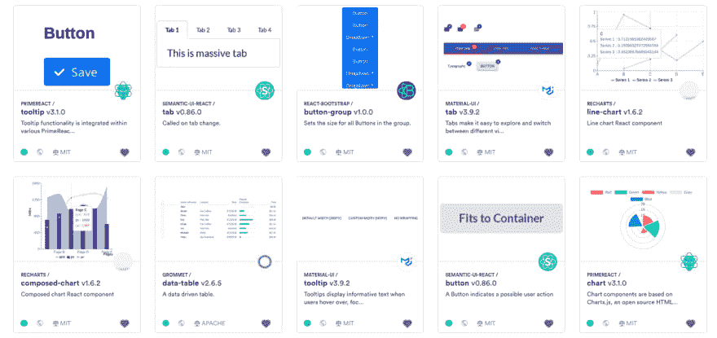
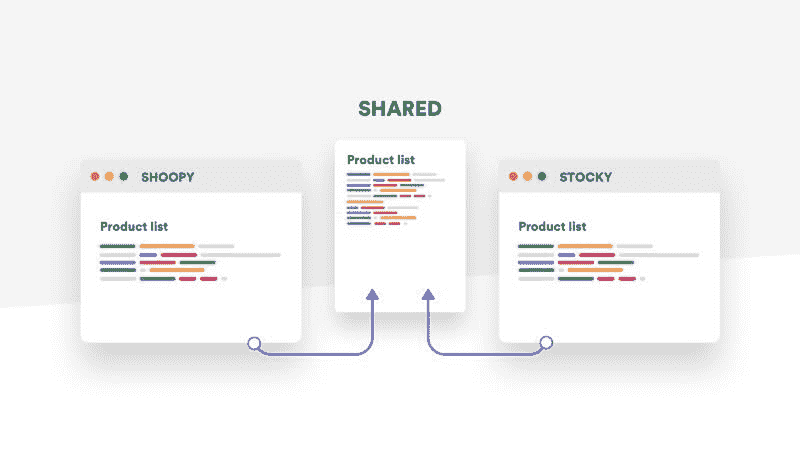

# 组件驱动开发指南(CDD)

> 原文：<https://dev.to/giteden/a-guide-to-component-driven-development-cdd-1fo1>

### 让组件驱动你的应用开发。

。自 20 世纪 60 年代以来，模块化一直是软件开发的关键原则。它在软件开发中提供了许多优势，利用关注点的分离来获得更好的可重用性、可组合性、开发等。

在现代，模块化在软件应用程序的设计中呈现出一种新的形式，通过[组件](https://blog.bitsrc.io/independent-components-the-webs-new-building-blocks-59c893ef0f65)。现代的 UI 库和框架，如 [React](https://reactjs.org/) 、 [Vue](https://vuejs.org/) 和 [Angular](https://angular.io/) ，以及面向 CDD 的工具，如 [Bit](https://bit.dev) ，让我们通过模块化组件构建我们的应用程序，提供独立开发每个组件并将它们组合在一起所需的模式和工具。

组件是我们应用程序 UI 中定义良好的独立部分。聊天窗口、按钮、滑块都是组件。组件也可以由更小的组件和片段组成。每一个都是一个积木。

这种方法催生了一种新的模块化形式，名为 **CDD** ，或**组件驱动开发**。通过理解 CDD 以及如何利用它，我们可以使用[组件](https://blog.bitsrc.io/independent-components-the-webs-new-building-blocks-59c893ef0f65)来驱动我们应用的开发，从这种新发现的模块化带给我们的优势中获益。

展望 web 组件的世界，CDD 成为开发应用前端的标准方法。

## UI 组件驱动开发

简单地说，组件驱动开发意味着通过构建松散耦合的独立组件来设计你的软件应用程序。每个组件都有一个与系统其余部分通信的接口，多个组件被组合成一个模块化的应用程序。

例如，当构建 React 应用程序时，这意味着首先构建组件作为应用程序的基础，然后向上构建 UI 的更大部分，例如应用程序中的整个页面和功能。

CDD 方法与诸如[原子设计](http://bradfrost.com/blog/post/atomic-web-design/)(参见:[React 中的原子设计:简化复杂的 UI](https://blog.bitsrc.io/simplify-complex-ui-by-implementing-the-atomic-design-in-react-with-bit-f4ad116ec8db) )和[微前端](https://micro-frontends.org/)等原则相关。

CDD 帮助你把开发分成几个部分。每一个都是独立于应用程序的其他部分而设计的，并且是为了与应用程序通信而构建的。将每个组件设计为独立的单元会带来有益的优势。

[Addy Osmani](https://dev.toundefined) 在他的[首要原则](https://addyosmani.com/first/)中列出了 CDD 的一些关键利益:

*   **更快的开发**:将开发分解成组件，让你可以用专注的 API 构建模块化的部分。这意味着构建每个组件并了解它何时足够好会更快。

*   **更简单的维护**:当你需要修改或更新应用程序的一部分时，你可以扩展或更新组件，而不必重构应用程序的更大部分。把它想象成对一个特定的器官进行手术，而不是对身体的整个系统进行手术。

*   更好的可重用性:通过关注点的分离，组件可以被重用和扩展来构建多个应用程序，而不是一遍又一遍地重写它们(参见:[共享(组件)是关怀](https://blog.bitsrc.io/sharing-components-is-caring-f8235cf1a0c))。

*   更好的 TDD:当构建模块化组件时，实现单元测试来验证每个组件的功能变得更加容易。更大的系统更容易测试，因为更容易理解和分离系统每个部分的职责。

*   **更短的学习曲线**:当开发人员不得不投入到一个新项目中时，学习和理解一个已定义组件的结构比投入到整个应用程序中要容易得多。

*   **更好的系统建模**:当系统由模块化组件组成时，更容易掌握、理解和操作。

## 构件驱动开发的工具

当组件驱动开发时，需要专用工具来开发、测试、共享和协作组件。

特别是，独立开发和测试组件非常重要，以确保它们作为独立单元在应用程序中使用。为组件提供可重用性和共享性也很重要，这样您就不必在每次需要组件时都重新发明轮子。

这里有一些有用的工具，可以帮助您的 CDD 工作流程。在下一节中，我们将讨论 CDD 实施的推荐架构。

### 组件开发与协作:Bit

[https://www.youtube.com/embed/E5lgoz6-nfs](https://www.youtube.com/embed/E5lgoz6-nfs)

[Bit](https://bit.dev) 是[一个开源工具](https://github.com/teambit/bit)，本质上是为组件驱动开发而构建的。它帮助您开发、协作和构建组件。

Bit 可以用来虚拟地隔离应用程序或库中正在开发的组件。Bit 在一个 CLI 命令中封装组件及其所有文件和依赖项，并允许您单独开发和测试封装组件的虚拟表示。

这意味着在你的应用中编写的一个组件突然被捆绑、封装并准备在你的应用之外使用(和测试)。

然后，bit 让您打包捆绑和封装的组件，并[将它们共享到云](https://blog.bitsrc.io/meet-bits-atomic-component-cloud-521160de4f0c)。在那里，您的团队可以可视化地探索和发现您所有的共享组件。社区中有近 50，000 名开发人员，您也可以找到其他人共享的数以千计的开源组件。

 * CDD:用组件构建*

[从组件云](http://https;//bit.dev)中，您的团队可以在新的应用程序中安装组件，甚至从使用组件的新项目中建议更新。Bit 扩展了 Git 来跟踪和同步不同项目中组件源代码的变化，因此您可以获得对变化和更新的控制。

由于 Bit 定义了每个组件的整个依赖图，所以当您更新组件时，您可以准确地了解哪个依赖组件将受到影响，并且在您进行更改时可能会中断。这意味着全面的组件驱动开发体验，从开发到测试，跨应用程序和人员共享和协作组件。

 *组件驱动开发穿越云端*

另一个有用的优势是，tour team 可以做的不仅仅是在一个地方探索所有的组件:开发人员实际上可以使用他们找到的现成组件，甚至可以建议更新。

设计师、产品和其他所有人都在同一页面上协作开发实际的源代码，这是一个可视化的游乐场视图。设计和开发之间的差距缩短了，大家都赢了。尤其是你的用户，他们会经历更少的不一致和令人困惑的错误。

**学习**:

*   " [Meet Bit 的共享组件云](https://medium.com/p/521160de4f0c/edit)"

*   [“如何在位为](https://blog.bitsrc.io/how-to-easily-share-react-components-between-projects-3dd42149c09)的应用程序之间共享 React 组件”

*   "[用 React 和 Bit](https://blog.bitsrc.io/build-a-super-modular-todo-app-with-react-and-bit-components-aa06bbac4084) 构建一个 supermodular Todo App。

### UI 组件资源管理器:StoryBook 和 Styleguidist

Storybook 和 Styleguidist 是 React 中快速 UI 开发的环境。两者都是加速组件开发的好工具。

这里有一个简短的纲要。

[故事书](https://storybook.js.org/) —交互 UI 组件开发&测试:React，React Native，Vue，Angular
([https://github.com/storybooks/storybook](https://github.com/storybooks/storybook))

[Storybook](https://github.com/storybooks/storybook) 是一个 UI 组件的快速开发环境。

它允许您浏览组件库，查看每个组件的不同状态，并以交互方式开发和测试组件。

StoryBook 帮助你开发独立于应用程序的组件，这也鼓励你的组件有更好的可重用性和可测试性。

你可以从你的库中浏览组件，摆弄它们的属性，并通过网络上的热重装获得即时印象。你可以在这里找到一些流行的例子[。](https://storybook.js.org/examples/)

不同的插件可以让你的开发过程更快，所以你可以缩短代码调整到可视化输出的周期。StoryBook 还支持 [React Native](https://facebook.github.io/react-native/) 和 [Vue.js](https://vuejs.org/) 。

React [Styleguidist](https://github.com/styleguidist/react-styleguidist) 是一个组件开发环境，带有热重装开发服务器和一个生活方式指南，该指南列出了组件属性类型并显示了基于。md 文件。

它支持 ES6、Flow 和 TypeScript，并与 Create React 应用程序一起使用。自动生成的使用文档可以帮助 Styleguidist 作为团队不同组件的可视化文档门户。

*   还可以查看由强大实验室提供的 [**React Live](https://github.com/FormidableLabs/react-live) **服务。

**故事书和 StyleGuidist 的区别**

使用 Storybook，您可以在 JavaScript 文件中编写*个故事*。使用 Styleguidist，您可以在 Markdown 文件中编写*示例*。Storybook 一次显示一个组件的一个变体，而 Styleguidist 可以显示不同组件的多个变体。Storybook 非常适合显示组件的状态，Styleguidist 对于不同组件的文档和演示非常有用。

## 构件驱动开发的架构

CDD 暗示你首先构建你的组件，尽可能独立于应用程序的其他部分。这意味着你不仅仅是在构建一组组件，你还在实现一个 [UI 组件设计系统](https://blog.bitsrc.io/building-a-consistent-ui-design-system-4481fb37470f)。

您可以将组件实现为应用程序本身的一部分(即在同一个项目中)，或者实现为一个单独的存储库(即组件库)。像 [Bit](//httpS://bit.dev) 这样的工具可以让你隔离和封装每个组件，因此它可以在任何地方被开发、测试、重用甚至更新——不管它是在哪里写的。

当开始设计组件时，你想让它们可重用来构建不同的应用程序。所以，你应该明白如何让它们变得可重用。没有什么比花 6 个月时间建造一个没人使用的图书馆更糟糕的了。是的，很多球队都会这样。

### 为什么要建图书馆？

所以事实是这样的。Git 存储库不是为项目间共享的原子组件而构建的。包经理也不是。两者都是为仓库而建的。组件不是存储库。

这就是为什么当我们想在我们的应用程序中获取一个组件并在另一个应用程序中使用它时，我们必须创建一个新的存储库。为了节省开销，大多数团队创建一个共享存储库来托管 20–30 个组件。

如果使用 Bit，你可能不需要库。您可以直接将应用程序中的组件共享到您的云中，并将其安装到其他项目中。这有点像 CD 音乐专辑和 Spotify 之间的区别。但是，你也可以在共享库中使用 Bit 和 StoryBook，所以不用担心。

设计库时，您应该做出几个关键决定。几个关键原则将引导你通过，要点如下:你想开发独立的组件。剩下的应该是一个乐高式的组合。否则，当有人第一次需要与你在库中定义的不同的东西时，事情就会碰壁。然后，他们就不会用了。

假设你建了一个图书馆…这里有一些可靠的建议。

## 打造一个好的面向 CDD 的 UI 库的 7 个关键

1.  **标准** —你们图书馆的开发标准是什么？组件在哪里？考试在哪里？造型？您的堆栈是什么(例如，您是否打算使用 TS)？组件是如何划分的？“表格”是由“行”和“单元格”组成的吗？“tab”是由“tab”等组成的吗？你明白了。让设计师也参与到这个过程中来**非常重要**，以确保你的库足够灵活，也能满足他们未来的需求。

2.  **设计** -你[将如何设计组件](https://blog.bitsrc.io/5-ways-to-style-react-components-in-2019-30f1ccc2b5b)？* * * *你会把 CSS 耦合到每个组件吗？如果是这样，当一个设计师只需要为一个不同的应用程序改变一些东西时会发生什么？或许，在 JS 库中使用 [CSS 来更好地解耦它们？如果使用](https://blog.bitsrc.io/9-css-in-js-libraries-you-should-know-in-2018-25afb4025b9b) [bit.dev](https://bit.dev) ，您可以将主题分离为独立的组件，这些组件可以与逻辑组件组合在一起，因此您可以在每个应用程序中组合正确的逻辑和风格。通过模块化实现最大的灵活性，不错吧？

3.  **测试** -你将如何[测试你库中的组件](https://blog.bitsrc.io/7-react-testing-libraries-you-should-know-b20ca97422a4)？Jest 和酵素？在选择正确的框架+实用工具+工具组合之前，您最好进行彻底的检查，以确保您的测试不会碍事，并且 insteads 提供了有价值的数据来帮助您进行 CDD。单元测试很好，但是应该测试组件的功能 API，而不是实现细节。集成和端到端测试同样重要。Bit 让 TDD 成为 CDD 的驱动力。它可以让你在应用环境之外即时捆绑、封装和测试组件，以验证它们的独立性。当您更新组件时，您还可以了解哪些相关组件可能会因此而损坏。在云中，组件单元测试结果是可发现性的关键因素。

4.  **构建过程**——代码需要编译。您将如何定义库的构建过程？释放机制？只需将你的应用程序复制粘贴到库中就可以了(也许可以)？定义每个组件的构建配置(Lerna)以便可以发布？用 Bit 定义一个编译器应用于所有(或一些)单独的组件？如果你把事情搞得太复杂，开发会变得很痛苦，模块化会被削弱，公关的学习曲线会很烦人。

5.  所有权 -谁拥有图书馆？较大的组织通常有一个前端基础架构团队，有时还有一个架构师。他们正在建立一个叫做共享图书馆的产品。组织中构建应用程序的其他前端团队是消费者。然后，为他们创造可发现性(Bit，StoryBook)变得非常重要，让他们建议更新(Bit)更是如此。否则，消费型开发人员不会希望将他们的应用程序耦合到库中，并等待 PR(它可能会来，也可能不会来)。不要强迫，要合作。如果你不这样做，人们只会复制粘贴代码，没有人会知道。这是你的错。如果你是一个较小的团队，定义一个明确的所有者。即使没有人全职工作，定义 1-3 个维护者。剩下的会公关，就像 GitHub 一样。

6.  可发现性(Discoverability)-库没有多大用处，人们不容易找到组件，了解它们如何工作，并在代码中使用它们。如果你把组件分享给 [bit.dev](https://bit.dev) ，你[就能获得你的库的开箱即用](https://bit.dev/components):组件搜索、可视化预览、标签标记、现场游戏、示例、从代码和测试结果中提取的 API 参考。然后，您将获得一个用于搜索、选择和使用组件的一体化门户。如果没有(或在其之上)，您可以添加一个故事书文档门户和/或您自己的网站到文档组件。 [Codesandbox](https://codesandbox.io/) 也很有用。

7.  **协作** -当另一个开发人员(可能在另一个团队或另一个国家)需要对你的库中的某个组件进行更改时会发生什么？他们会不会一头扎进你的回购协议里，祈祷并等待？对许多人来说，这太痛苦了，即使你试图强迫他们，他们也可能不会接受。相反，允许任何开发人员对组件进行开发和建议更新，以供您(和设计人员)审查。使用 Bit，开发人员可以直接从他们自己的项目中完成这项工作，而无需设置任何东西或等待 PR。知道人们在做什么和交流比让他们在你不知道的情况下复制粘贴代码并在他们的应用程序中修改更好，

**记住** —库只是另一个回购协议集，在两个回购协议之间共享一些组件。它们不能很好地扩展或老化，并且受到额外开销和工具的困扰。通过云在应用程序之间直接[共享组件通常更好。](https://blog.bitsrc.io/meet-bits-atomic-component-cloud-521160de4f0c)

## CDD 对开发团队的好处

当利用 CDD 开发团队享受更快的开发时间，更多的代码重用，更好的 TDD 和统一一致的 UI 设计系统。

人们可以通过访问已经编写好的组件进行编码，并协作进行修改。新的功能或应用程序只是意味着调整和调整你的基本组件，并防止后来在生产中发现的错误。

代码共享也意味着需要维护的代码更少，因此您可以专注于构建新的东西。当您从组件开始构建时，您还可以使用相同的构建块让每个人都在同一个页面上保持一致，因此您的整个开发工作流变得标准化，同时保持灵活性。

一些团队报告说，通过基于作为 React 组件实现的 UI 组件设计系统的模块化组件，开发速度提高了 60%。一些组织发现，通过采用 CDD，他们可以删除大约 30%代码库。优步、Airbnb、Shopify &越来越多的公司开始转向零部件业务。

## 结论

个人觉得 CDD5 更有效并不奇怪。正如布拉德·弗罗斯特在《原子设计》中所说，模块化和组合是物理、生物、经济等领域效率的基础。在软件中，模块化孕育了同样的优势:速度、可靠性、简单性、可重用性、可测试性、可扩展性和可组合性。这样更好。

在我们应用程序的前端，通过 CDD，我们还为用户提供了一致的 UI 和体验。这让他们喜欢我们所建造的东西，并感到更加快乐。每个人都赢了。

感谢阅读！🍻

## 相关岗位

 [## 构建一个适合采用和扩展的 React 设计系统|作者 Eden Ella | 2021 年 5 月|零碎

### 伊登艾拉<time datetime="2021-05-12T18:45:05.065Z">2021 年 5 月 12 日</time>T3】中](https://medium.com/bitsrc/building-a-react-design-system-for-adoption-and-scale-1d34538619d1)