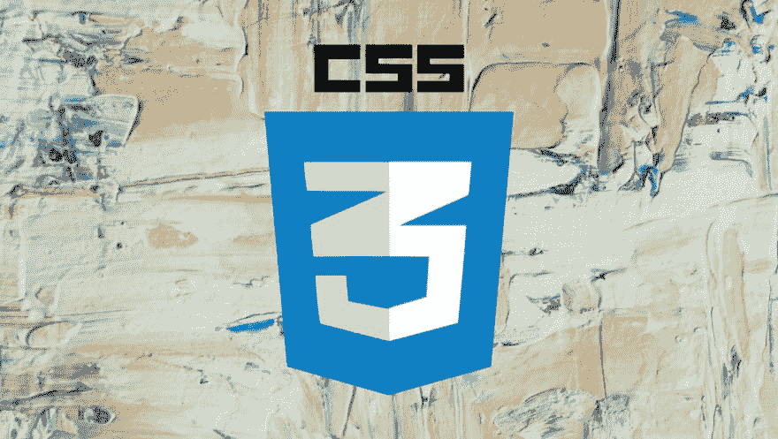
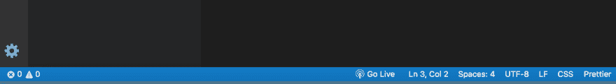
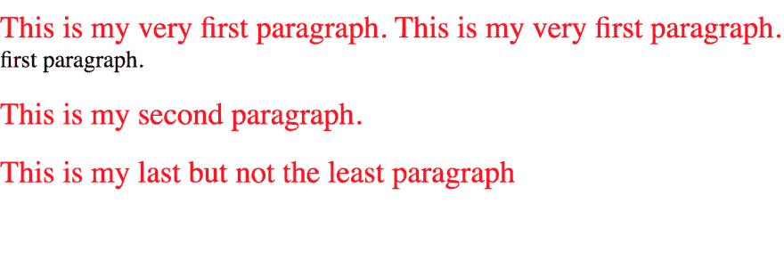
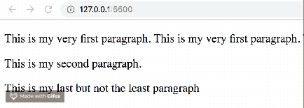

# CSS 伪元素指南

> 原文：<https://dev.to/bnevilleoneill/a-guide-to-css-pseudo-elements-e8n>

[](https://res.cloudinary.com/practicaldev/image/fetch/s--hJga92zQ--/c_limit%2Cf_auto%2Cfl_progressive%2Cq_auto%2Cw_880/https://thepracticaldev.s3.amazonaws.com/i/8qctirey1zg3uyeng1st.png)

[层叠样式表(CSS)](https://developer.mozilla.org/en-US/docs/Web/CSS) 是一种独立的语言，用于描述 web 应用程序的表现形式，这涉及到颜色、字体和 HTML 元素布局的完全控制等概念。

*   这延伸到呈现这些网络应用的不同屏幕(移动设备、平板电脑、甚至打印机)
*   CSS 也可以和任何以 XML 为中心的标记语言一起使用
*   HTML 本身提供了一半的能力来控制内容和结构，剩下的一半留给了外观和感觉，这就是样式派上用场的地方

在本文中，将向您介绍级联样式表中的伪元素，以及它们的用法和兼容性的实际例子。

## CSS 中的伪元素有哪些？

一个 [CSS 伪元素](https://developer.mozilla.org/en-US/docs/Web/CSS)是添加到一个 [CSS 选择器](https://www.w3schools.com/cssref/css_selectors.asp)中的一个关键字，它可以让你对所选 HTML 元素的特定部分进行样式化。它们通常由两个冒号表示，例如，`::first-line.`

## 伪元素语法

CSS 伪元素的一般语法如下:

```
selector::pseudo-element {
  property: value;
} 
```

Enter fullscreen mode Exit fullscreen mode

它看起来就像普通的样式化语句，但是用冒号来表示选择器中包含的元素的特定部分，您希望对其进行样式化。

[](https://logrocket.com/signup/)

## CSS 中的伪元素

CSS 中目前有七个伪元素，它们是:

1.  [:](https://developer.mozilla.org/en-US/docs/Web/CSS/Pseudo-elements)之后
2.  [:](https://developer.mozilla.org/en-US/docs/Web/CSS/Pseudo-elements)之前
3.  [::第一个字母](https://developer.mozilla.org/en-US/docs/Web/CSS/Pseudo-elements)
4.  [::一线](https://developer.mozilla.org/en-US/docs/Web/CSS/Pseudo-elements)
5.  [::标记](https://developer.mozilla.org/en-US/docs/Web/CSS/Pseudo-elements)
6.  [:](https://developer.mozilla.org/en-US/docs/Web/CSS/Pseudo-elements)占位符
7.  [::选择](https://developer.mozilla.org/en-US/docs/Web/CSS/Pseudo-elements)

还有其他的，但是它们被认为是实验性的技术，所以在这篇文章中，重点将放在主要的七个伪元素上。

## 工作演示

在本帖中，将在一个简单的演示文件夹中向您介绍这些伪元素。要跟进，您需要:

*   建议使用代码编辑器 [Visual Studio 代码](https://code.visualstudio.com/)
*   一个为你的 HTML 代码服务的服务器，你可以下载一个 VS 代码。首先，转到扩展选项卡，搜索栏会显示在一个最喜欢的扩展列表旁边，搜索“live server”(它有近 500 万次下载)

现在，创建一个文件夹，命名为 pseudo，用 VS 代码打开。创建两个文件:

1.  index.html:这是我们的内容 html 代码的位置
2.  main.css:这是进行样式化的地方

将下面的起始代码复制到您的 index.html 文件中:

```
<!DOCTYPE html>
<html lang=”en”>
 <head>
  <meta charset=”UTF-8">
  <meta name=”viewport” content=”width=device-width, initial-scale=1.0">
  <meta http-equiv=”X-UA-Compatible” content=”ie=edge”>
  Document
  <link rel=”stylesheet” type=”text/css” href=”main.css”>
 </head>
 <body>
  <p>hello world!</p>
 </body>
</html> 
```

Enter fullscreen mode Exit fullscreen mode

粗体显示的代码表明我们已经将内容链接到一个样式表，在您的例子中是 main.css

```
p{
color: aqua;
} 
```

Enter fullscreen mode Exit fullscreen mode

如果你点击 VS 代码应用程序页脚处的“上线”按钮，你将被重定向到你的默认浏览器，在那里一个运行网页的远程服务器已经为你启动。

[](https://res.cloudinary.com/practicaldev/image/fetch/s--h_-0-ybf--/c_limit%2Cf_auto%2Cfl_progressive%2Cq_auto%2Cw_880/https://i1.wp.com/cdn-images-1.medium.com/max/1600/1%2ABIAsNxH6Elz6P_UjTGm6xg.png%3Fssl%3D1)

## ::(之后)

::after 创建一个伪元素，表示所选 HTML 元素的最后一个子元素。它用于与 [CSS 内容](https://developer.mozilla.org/en-US/docs/Web/CSS/content)属性一起为这个特定元素添加样式。语法看起来像这样:

```
selector::after {
  content: "value";
} 
```

Enter fullscreen mode Exit fullscreen mode

将下面的代码复制到您的 index.html 文件中:

```
<!DOCTYPE html>
<html lang=”en”>
 <head>
  <meta charset=”UTF-8">
  <meta name=”viewport” content=”width=device-width, initial-scale=1.0">
  <meta http-equiv=”X-UA-Compatible” content=”ie=edge”>
  Document
  <link rel=”stylesheet” type=”text/css” href=”main.css”>
 </head>
 <body>
  <p class=”one”>This is my very first paragraph.
   This is my very first paragraph.
   This is my very first paragraph.
   This is my very first paragraph.</p>
  <p class=”three”>This is my second paragraph.</p>
  <p class=”two”>This is my last but not the least paragraph</p>
 </body>
</html> 
```

Enter fullscreen mode Exit fullscreen mode

现在在你的 main.css 文件中复制下面的代码:

```
.one::after {
 content: “ — 1”;
 color: blue;
}
.two::after {
 content: “ — 2”;
 color: red;
} 
```

Enter fullscreen mode Exit fullscreen mode

这只是将字符串添加到所选元素之前，在本例中，该类指向不同的段落，并更新它们的颜色。

## :::之前(:之前)

::before 创建一个伪元素，表示所选 HTML 元素的第一个子元素。默认情况下，它是内联的，用于与 [CSS content](https://developer.mozilla.org/en-US/docs/Web/CSS/content) 属性一起为这个特定元素添加样式。语法看起来像这样:

```
selector::before {
  content: "value";
} 
```

Enter fullscreen mode Exit fullscreen mode

你的 index.html 文件将保持原样，但是在你的 main.css 文件中复制下面的代码:

```
.one::before {
content: “1--”;
color: blue;
}
.two::before {
content: “2--”;
color: red;
} 
```

Enter fullscreen mode Exit fullscreen mode

这只是将字符串添加到所选元素之前，在本例中，该类指向不同的段落，并更新它们的颜色。

## :::首字母(:首字母)

::first-letter 创建一个伪元素，表示 block 元素第一行的第一个字母，只要它不在图像或表格之后。

```
selector::first-letter {
  property: value;
} 
```

Enter fullscreen mode Exit fullscreen mode

然而，重要的是要认识到元素的第一个字母可能很难识别。像标点符号这样的东西，逻辑上可以算作第一个字母。一些语言有两个总是大写在一起的数字，比如荷兰语中的`IJ`。在这些情况下，有向图的两个字母都应该由::首字母伪元素匹配。

::before 伪元素结合 content 属性也可以创建第一个元素，所以在调试 CSS 时要记住这些。

将下面的样式代码复制到 main.css 文件中，查看::第一个字母:

```
p::first-letter {
 color: red;
 font-size: 130%;
} 
```

Enter fullscreen mode Exit fullscreen mode

## :::一线(:一线)

::first-line 创建一个伪元素，表示块元素的第一行。就像第一个字母一样，第一行也取决于一些因素，如元素的宽度、文档的宽度和元素的字体大小。:第一行伪元素的语法如下:

```
selector::first-line {
  property: value;
} 
```

Enter fullscreen mode Exit fullscreen mode

将下面的样式复制到你的 main.css 文件中:

```
p {
font-size: 130%;
}
p::first-line {
color: red;
font-size: 130%;
} 
```

Enter fullscreen mode Exit fullscreen mode

第一个段落样式将放大段落的字体，以便从给定的字符串中获得一行。

[](https://res.cloudinary.com/practicaldev/image/fetch/s--dZ5Rp719--/c_limit%2Cf_auto%2Cfl_progressive%2Cq_auto%2Cw_880/https://i2.wp.com/cdn-images-1.medium.com/max/1600/1%2AnPhOQrUfO3jyS9U_F9GRcg.png%3Fssl%3D1)

## :::标记

::marker 伪元素选择列表项的标记框，通常包含项目符号或编号，它用于列表项和摘要元素。语法如下:

```
selector ::marker {
  property: value;
} 
```

Enter fullscreen mode Exit fullscreen mode

将以下列表项目代码添加到您的 index.html 文件:

```
<ul>
 <li>One</li>
 <li>Two</li>
 <li>Three</li>
</ul> 
```

Enter fullscreen mode Exit fullscreen mode

将下面的::marker 样式复制到 main.css 文件中以查看它的运行:

```
ul li::marker {
  color: blue;
  font-size: 130%;
} 
```

Enter fullscreen mode Exit fullscreen mode

## :::占位符

::placeholder 伪元素指向表示中输入元素的占位符，通常在表单中可以找到。默认情况下，大多数浏览器对占位符应用浅灰色。语法看起来像这样:

```
selector ::placeholder {
  property: value;
} 
```

Enter fullscreen mode Exit fullscreen mode

将该输入行复制到您的 index.html 文件:

```
<input placeholder="Type something here!"> 
```

Enter fullscreen mode Exit fullscreen mode

将下面的样式复制到 main.css 文件以查看更改:

```
input::placeholder {
  color: red;
  font-size: 1.2em;
  font-style: italic;
} 
```

Enter fullscreen mode Exit fullscreen mode

## :::选择

::selection 伪元素适用于 DOM 上突出显示的元素。这是我最喜欢的伪元素之一，语法如下:

```
selector ::selection {
  property: value;
} 
```

Enter fullscreen mode Exit fullscreen mode

有几个属性可以用在::selection 伪元素上，它们是颜色、背景颜色、光标、插入符号颜色、轮廓、文本修饰、文本强调颜色和文本阴影。

将下面的样式复制到你的 main.css 文件中:

```
p::selection {
 background-color: red;
} 
```

Enter fullscreen mode Exit fullscreen mode

如果您在浏览器中查看它，它将如下所示:

[](https://res.cloudinary.com/practicaldev/image/fetch/s--TUVLmEp4--/c_limit%2Cf_auto%2Cfl_progressive%2Cq_66%2Cw_880/https://i2.wp.com/cdn-images-1.medium.com/max/1600/1%2AwNACTCo3fN2OncmSmjagxA.gif%3Fresize%3D434%252C155%26ssl%3D1)

## 浏览器兼容性

这里有一些关于浏览器支持的伪元素的有用信息。

*   除了 Safari 和 Opera 之外的所有流行浏览器都完全支持伪元素之后的
*   除了 Safari、Internet explorer 9 和 Opera 之外的所有流行浏览器都完全支持伪元素之前的
*   只有 Firefox 浏览器支持[::标记伪元素](https://caniuse.com/#search=%3A%3Amarker)
*   除了 IOS 设备上的 Safari 之外，所有浏览器都支持:[:首字母伪元素](https://caniuse.com/#search=%3A%3Afirst-letter)
*   每个浏览器和每个屏幕尺寸都完全支持第一行伪元素
*   除了 Internet Explorer 之外，所有浏览器都支持[::占位符伪元素](https://caniuse.com/#search=%3A%3Aplaceholder)
*   所有 web 浏览器都支持[::选择伪元素](https://caniuse.com/#search=%3A%3Aselection)

## 结论

CSS 仍然是现代 web 开发过程中不可或缺的一部分，web 开发人员花些时间学习 CSS 的基础知识是至关重要的。CSS 中的伪元素将帮助您扩展知识，并为您的样式提供更多令人兴奋的选项。黑客快乐！

* * *

## Plug: [LogRocket](https://logrocket.com/signup/) ，一款适用于网络应用的 DVR

[](https://logrocket.com/signup/)

[log rocket](https://logrocket.com/signup/)是一个前端日志工具，让你重放问题，就像它们发生在你自己的浏览器中一样。LogRocket 不需要猜测错误发生的原因，也不需要向用户询问截图和日志转储，而是让您重放会话以快速了解哪里出错了。它可以与任何应用程序完美配合，不管是什么框架，并且有插件可以记录来自 Redux、Vuex 和@ngrx/store 的额外上下文。

除了记录 Redux 动作和状态，LogRocket 还记录控制台日志、JavaScript 错误、stacktraces、带有头+体的网络请求/响应、浏览器元数据、自定义日志。它还使用 DOM 来记录页面上的 HTML 和 CSS，甚至为最复杂的单页面应用程序重新创建像素级完美视频。

[免费试用](https://logrocket.com/signup/)。

* * *

帖子[CSS 伪元素指南](https://blog.logrocket.com/a-guide-to-css-pseudo-elements/)首先出现在[博客](https://blog.logrocket.com)上。