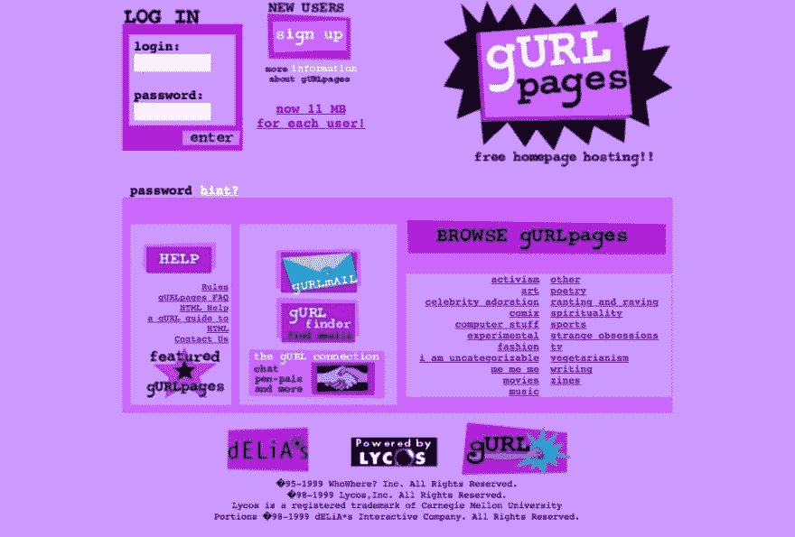

# 漫长而曲折的职业道路

> 原文：<https://dev.to/alli/a-long-and-winding-career-path-42aa>

## 我的非技术技能很有价值。你的也是。

当我 11 岁告诉我爸爸我想做自己的网站时，我并没有意识到这会引领我的职业生涯。我的职业生涯漫长而曲折，证明了成为一名开发人员并不是只有一条路可走。有无数的路径。

我遇到过最近的编码训练营毕业生，他们完全忽略了自己在学习编码之前所做的事情，认为这完全无关紧要。但事实并非如此。你的经历很有意义。

我爸爸让我从我们当地的 ISP 和 HTML 白痴指南那里得到了一些托管服务。我发布了自己的网站，甚至还收到了我所在的密歇根州小镇的市长发来的一封邮件。主要是关于我，我的宠物和豆豆娃。那是九十年代中期。

最终，我转到了 Geocities，学习了更多的 HTML。我有一个 GURLpage 赢了他们的奖，最终学会了 CSS，一点 JavaScript，有了自己的域名。

在大学时，LiveJournal 上有人在寻找有 HTML 技能的人，和他们一起在玩具公司工作。我没有写太多 HTML，相反，我每周花大约 10 个小时用 PHP mySQL 建立一个在线玩具店。后来，我被学校的研究生部雇佣来重做他们的网站，这是一份我热爱的工作。

我不能假装你很可能在 LiveJournal 上找到一份编码工作，但这并不意味着你不能利用你已经在做的事情来做一些涉及编码的事情。我听说有人喜欢更新他们的公司网站，并从那里学习做更多的事情。我认识一个在 mom n pop 五金店工作的人，他开发了一种在 Excel 中进行库存管理的新方法。当我在研究生部工作时，那里有许多研究生实习生，做一些像归档这样的普通工作。如果他们中的一个人开始在网站上工作，他们就不需要雇佣我了。

但是我不认为我想以编程为职业。尽管我热爱我的研究生工作，但我想象编程就像男人在黑暗的地下室里喝着激浪，不知道如何社交。

我很感激旧的开发者模式正在消失。我志愿加入了一个名为 Bit Camp 的组织，该组织向中学女生教授基本的 web 开发。我总是试图强调这份工作到底是什么样的:创造性，协作性，没有地下室(除非你真的想在地下室工作)。

我尝试了一些完全不同的东西，然后重新开始编码。我对语言学感兴趣，所以我毕业时获得了英语学位，进入了语言治疗领域。在 DC 攻读语音语言病理学硕士学位的中途，我艰难地意识到这个职业不适合我。我的同学充满热情，但我几乎不能离开我的公寓去上课，更不用说给真正的人实际治疗了。我还在为了好玩而制作网站。我知道我需要做什么。

我给自己一个月的时间在 DC 找一份技术工作。如果我找不到工作，我会搬回密歇根，回到学校。几周后我找到了一份工作:为美国国会工作。我一半时间在国会网站上工作，一半时间在修理员工电脑和安装服务器。在这份工作中，我学到了项目管理，并认为这个职业可能适合我的技能。

我受雇于一家软件公司，担任一个额外的技术支持/客户经理的角色，我认为这可能会导致项目管理。是的，但是我的职责不仅仅是管理项目，还包括为客户进行定制开发。对于一些项目，我会“管理项目”,然后开始工作。

我给那些想进入编程领域但没有背景或不知道是否适合自己的人的一条建议是，考虑在网络开发机构或软件公司担任客户支持角色。这让你了解在这种类型的公司工作是什么样的，让你与程序员一起工作，看看他们的工作实际上是什么样的，甚至可能会有一些培训机会或学费报销。在我现在工作的公司，客户支持代表已经成为公司内部的 QA 工程师和软件工程师。

我的下一份工作非常奇怪，我不可能用一段话来描述它，但我根本没有编码，而是花了更多的时间做人员管理。那是一家小公司，我的职责还包括人力资源和确保一天的订单顺利完成。我错过了编码。为了招聘，我做了几个公司网站。在业余时间，我想出了一份前端开发人员的工作需要哪些技能，并对它们进行了复习。

在这一点上，我已经以这样或那样的形式编码超过 10 年了，但仍然不觉得自己有资格做编码工作。我还没有听说过“冒名顶替综合症”这个术语；当我这样做的时候，我会立刻回想起这段时间。我做过一些自由职业者的工作，并最终说服一家公司雇佣我作为初级前端开发人员。

我在那里工作了四年。在那段时间里:我的老板很快意识到我低估了自己的技能，而且不是初级员工，我被非正式地贴上了“高级”标签(公司没有分级头衔)，我被提升为团队领导。我所做的所有管理工作结果都是有益的。

你的非技术背景也有好处。我的项目管理经验意味着，当我现在的公司要求开发人员在每个 sprint 向整个公司演示他们最近的工作时，我不会眨一下眼睛。为国会工作意味着当我目前公司的客户支持人员处理客户投诉时，我知道那是什么感觉。我和产品经理合作得很好，因为我有过类似的经历。我的英语学位呢？我一直在撰写和编辑每份工作的公司博客帖子，我离开的公司仍然在使用我多年前写的工作描述。我的 PRs 经常被用作其他开发人员的范例。

当我离开那家公司时，我清楚地知道我下一步想去什么样的地方工作，而且我找到了。我被聘为高级软件工程师，一年多后，我被提升为首席软件工程师。我学到的最重要的事情之一是，我的背景虽然不是传统的，但仍然是有价值的。

*图片来源:尤金·扎伊斯夫在 [Unsplash](https://www.unsplash.com) 的封面图片。三个女人在笔记本电脑上的照片由 [WOCTechChat](https://www.wocintechchat.com) 拍摄。*