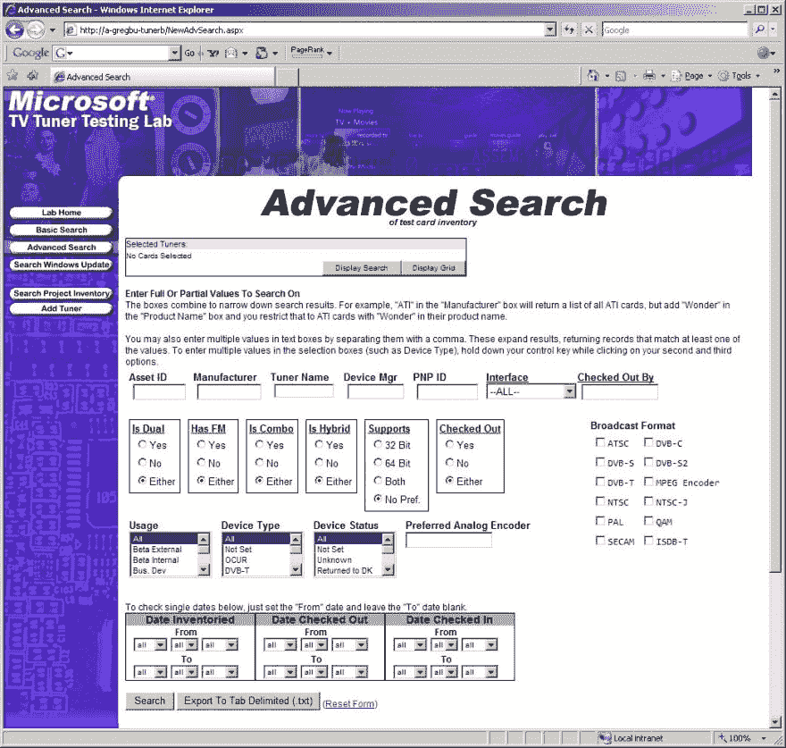

# 一次漫长而奇怪的旅行

> 原文：<https://dev.to/letmypeoplecode/a-long-strange-trip-35ij>

2005 年，我辞去了在 IMDb 的作家兼图片编辑的工作，创办了自己的小型网络孵化器，并自学了 PHP、MySQL 和 JavaScript。

2007 年，孵化器没有提供足够的收入，我开始收缩。我作为开发人员的第一份合同是在微软，12 年前的这个月，建立了这个内部网站点。

为了完成它，我在飞行中学习了 C#和 ASP.net。

清理旧文件时发现了这张图片。当 Vista 和 IE7 独领风骚的时候，Firefox 具有颠覆性，但仍然只有 17%的市场份额，Chrome 离发布还有一年时间。啊，回忆。