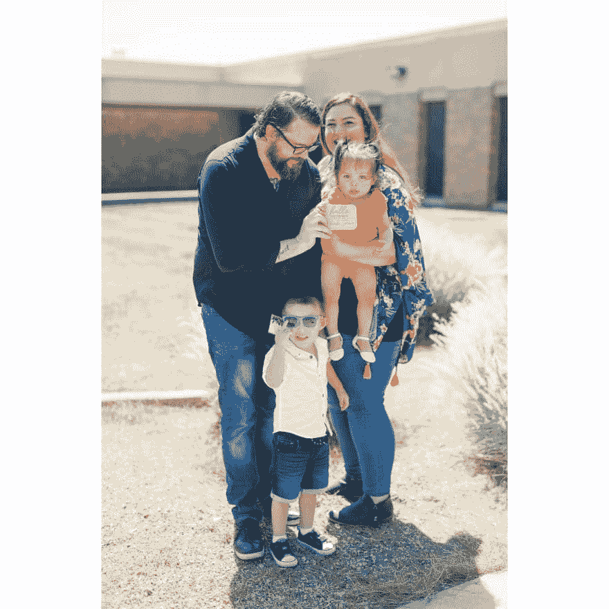

# 非常感谢你们所有人！

> 原文：<https://dev.to/dechamp/a-million-thanks-to-all-of-you-43oa>

我和我的家人为你们所有人的善良感动得热泪盈眶。

从在这个网站的第一天起，我们就要互相培养。永远不要打架或试图证明对方的自我。

当我真正需要帮助的时候，我的家人需要帮助的时候，你们都在我身边。

你们友好的话语、支持和捐赠帮助了我们，更重要的是帮助了一个正在为自己的生命而奋斗的 4 岁孩子。

你们都很棒，我无法释怀。我的妻子感谢你，我的家人感谢你，我感谢你和我的孩子感谢你！

[我们是！作为一个社区足够接近](https://dev.to/dechamp/are-we-close-enough-as-a-community-to-help-each-other-out-in-hard-times-50gl)

