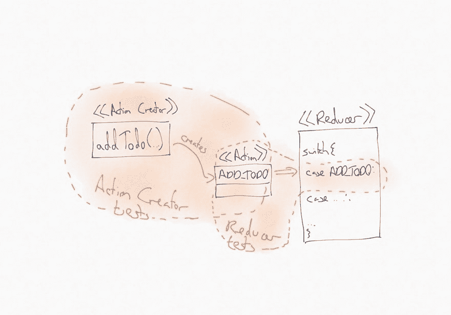
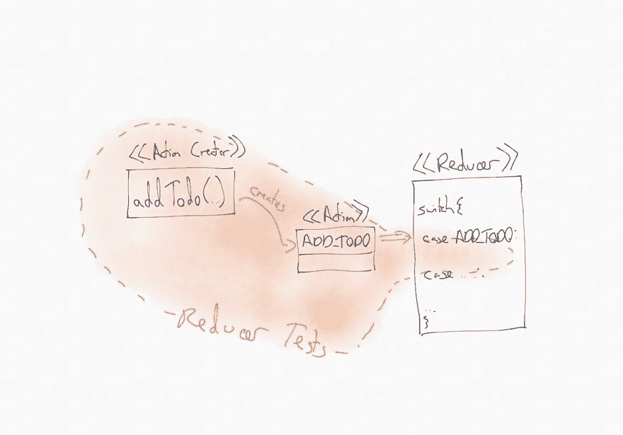

# 测试 redux reducers 拥抱动作创造者

> 原文：<https://dev.to/ph1/a-nice-way-to-test-redux-reducers-and-actions-2npe>

使用 redux 的一个好处是易于测试。将状态管理与应用程序的其余部分分开，可以更容易地进行隔离测试。

也就是说，测试 redux 应用程序中各种活动部件的机制——商店、还原器、动作、动作创建器、选择器——并不完全清楚。我经常看到的一个问题是我们的测试应该有多细粒度。我们应该单独测试这些活动部件，还是在更完整的分组中进行测试？

## 默认隔离

我们将通过测试一个简单的 redux reducer 来探索一些不同的选项。正在讨论的 reducer 负责管理一个 todos 列表。这是我们到目前为止的实现，它只支持一个将 todo 添加到列表中的操作。

```
// actions.js
import * as types from './types';

export function addTodo(text){
  return {
    type: types.ADD_TODO,
    text
  };
} 
```

```
// reducer.js
import * as types from './types';

const initialState = [];

export default function reducer(state=initialState,action){
  switch(action.type){
    case types.ADD_TODO:
      const newTodo = {
        text: action.text,
        completed: false
      };
      return [
        ...state,
        newTodo
      ];
  }
  return state;
}; 
```

我们将从我们的测试应该尽可能集中的位置开始，孤立地测试小的代码单元。这里有一个对我们的减速器的测试:

```
import * as types from './types';
import reducer from './reducer';

describe('todos reducer', () => {
  describe('adding todo items', () => {
    it('adds an item', () => {
      const action = {
        type: types.ADD_TODO,
        text: 'write tests'
      };
      const initialState = undefined;
      const nextState = reducer(initialState,action);

      expect(nextState).toEqual([
        {
          text: 'write tests',
          completed: false
        }
      ]);
    });
  });
}); 
```

这里有一个针对我们的`addTodo`动作创建者的独立测试:

```
import * as types from './types';
import * as actions from './actions';

describe('todos actions', () => {
  test('addTodo', () => {
    const action = actions.addTodo('my new todo');

    expect(action).toEqual({
      type: types.ADD_TODO,
      text: 'my new todo'
    });
  });
}); 
```

这些测试看起来很合理——事实上，它们与你在 redux 文档中找到的测试示例极其相似。他们当然专注于一小块孤立的代码，很容易理解他们在做什么。

然而，这种极其细粒度的测试并不是没有缺点。这些细粒度的测试非常冗长，并且不像我希望的那样有表现力。reducer 测试的目的是创建一个正确形状的动作，然后验证 reducer 在处理该动作时产生的状态细节。此外，当我们构建我们的应用程序逻辑时，我们会发现自己不得不编写一大堆这种类型的测试。尽管我是测试的强烈支持者(并且已经花了十多年的时间实践 TDD ),但是当我为了构建新的行为而复制 pasta 样板测试代码时，我发现自己悄悄地叹了口气。

### 脆性试验

更麻烦的是这些测试有多脆弱。让我们考虑一下，如果我们决定重构`addTodo`动作的内部结构以符合[通量标准动作](https://github.com/redux-utilities/flux-standard-action)格式，会发生什么。当然，我们必须改变我们的 action creator 实现，以及相应的测试:

```
import * as types from './types';

export function addTodo(text){
  return {
    type: types.ADD_TODO,
    payload: {            // 👈 add payload wrapper
      text
    }
  };
} 
```

```
import * as types from './types';
import * as actions from './actions';

describe('todos actions', () => {
  test('addTodo', () => {
    const action = actions.addTodo('my new todo');

    expect(action).toEqual({
      type: types.ADD_TODO,
      payload: {
        text: 'my new todo'
      }
    });
  });
}); 
```

我们还需要对我们的 reducer 实现做一点小小的改动，这样它仍然可以正确地从动作中提取信息:

```
import * as types from './types';

const initialState = [];

export default function reducer(state=initialState,action){
  switch(action.type){
    case types.ADD_TODO:
      const newTodo = {
        text: action.payload.text, // 👈 one-line change
        completed: false
      };
      return [
        ...state,
        newTodo
      ];
  }
  return state;
}; 
```

不幸的是，这一行缩减器更改也意味着我们必须更改缩减器的每个相关测试:

```
import * as types from './types';
import reducer from './reducer';

describe('todos reducer', () => {
  describe('adding todo items', () => {
    it('adds an item', () => {
      const action = {
        type: types.ADD_TODO,
        // 👇 we also have change how we're building our action here in this test
        payload: {
          text: 'write tests'
        }
      };
      const initialState = undefined;
      const nextState = reducer(initialState,action);

      expect(nextState).toEqual([
        {
          text: 'write tests',
          completed: false
        }
      ]);
    });
  });
}); 
```

这是一个遗憾，因为这个 reducer 测试不应该真正关心像动作的内部结构这样的实现细节——测试的重点是 reducer 的行为，而不是动作的形状。我们在这里看到了脆弱测试的一个典型特征——重构的变化迫使我们更新与变化没有直接联系的测试。现在，对于我们当前的测试套件来说，这没什么大不了的——我们只需要更新一个测试——但是在现实世界的测试套件中，这些类型的脆弱测试会成为严重的负担。它们给重构工作增加了巨大的额外开销，这反过来又阻碍了工程师进行小规模的、机会主义的[“保持营地清洁”](https://www.oreilly.com/library/view/97-things-every/9780596809515/ch08.html)改进，这有助于保持代码库的常青。

### 假阴性检测

对于我们当前的测试策略，还有一个更可怕的问题，一个我稍微忽略了的问题。当我们刚才改变动作的内部结构时，我们的 reducer 被破坏了，直到我们对 reducer 如何处理该动作进行了相应的更新。然而，我们的 reducer 测试**不会检测到这个**并且会继续通过，尽管事实上 reducer 在集成到我们真正的代码库时不会工作。这是因为我们的 reducer 测试没有使用我们的常规生产代码所使用的 action creator。

这种类型的*假阴性*测试结果是隔离测试的一个常见挑战——在测试过程中一个单元与其依赖项隔离的事实意味着测试不会检测到那些依赖项中的突破性变化。

## 越来越不孤立

让我们通过调整测试策略来解决这些问题。我们最初方法的问题是，我们的 reducer 测试将我们的 reducer 与 action creator 隔离开来，导致了假阴性。此外，这种隔离是通过在测试中重新实现我们的 action creator 逻辑来实现的，这导致了脆弱的测试。

如果我们改变我们的 reducer 测试，使用真实的 action creator 实现，使测试不那么孤立，这两个问题都会消失

```
import * as actions from './actions';
import reducer from './reducer';

describe('todos reducer', () => {
  describe('adding todo items', () => {
    it('adds an item', () => {
      const initialState = undefined;
      const nextState = reducer(
        initialState,
        actions.addTodo('write tests') // 👈 use action creator
      );

      expect(nextState).toEqual([
        {
          text: 'write tests',
          completed: false
        }
      ]);
    });
  });
}); 
```

当动作的内部形状改变时，使用这种方法的 Reducer 测试不再需要改变。此外，如果在 action creator 实现中进行了更改，而在 reducer 实现中没有相应的更改，那么这样的测试将会失败。赢了！

事实上，我们不再孤立地测试我们的 reducer 可能会引起关注——我们正在使用一个 action creator，它不是被测试单元的一部分。我们还能称之为单元测试吗？

如果我们把减压器孤立地看作是我们正在测试的单元，这种担心可能是有道理的。然而，我认为将减速器单独视为一个内聚单元是没有意义的。缩减器只能与动作配合使用——动作应该总是由动作创建者创建的。孤立地考虑这些事情是没有意义的，因此孤立地尝试和测试它们也是没有意义的。因此，这些将动作创建者和缩减者都考虑在其范围内的更广泛的测试仍然是单元测试。我们仍在测试一个单元；只是测试中的“单元”的范围扩大了一点，包括了减速器*和*这两个减速器要处理的动作。

### 动作创建者测试是不必要的

既然我们的测试涵盖了 reducer 和 action creator 的实现，那么我们最初编写的隔离的 action creator 测试就变得多余了。我们已经通过新的、更广泛的 reducer 测试验证了 action creator 的实现——如果我们以某种方式破坏了 action creator 的输出，这些测试会给我们很好的反馈。我们不再需要编写或维护 action creator 测试，减少了我们的测试负担，并使我们的测试套件更加灵活。随着这些测试的消失，我们现在可以重构一个动作的内部结构，而不必接触任何测试，同时仍然保留了测试失败的安全网，如果我们在动作创建器中改变了实现，而在缩减器中没有正确的相应改变。双赢。

## 输入鸭子

让我们后退一步，看看我们是如何改变我们的测试策略的，看看这可能会告诉我们关于我们正在测试的系统的什么。

我们从细粒度的、独立的测试开始，这些测试独立地锻炼了我们的动作创建者和缩减者。

[](https://res.cloudinary.com/practicaldev/image/fetch/s--gTPVhiiE--/c_limit%2Cf_auto%2Cfl_progressive%2Cq_auto%2Cw_880/https://blog.thepete.nimg/post_images/testing-redux-reducers/diagram-isolated.jpg)

我们所做的是一个更广泛的测试，将动作创建者和缩减者作为一个单元一起覆盖。

[](https://res.cloudinary.com/practicaldev/image/fetch/s--8SkBqo7L--/c_limit%2Cf_auto%2Cfl_progressive%2Cq_auto%2Cw_880/https://blog.thepete.nimg/post_images/testing-redux-reducers/diagram-integrated.jpg)

我们的测试让我们认识到，我们不应该把我们的 reducer 和它处理的动作看作独立的部分——它们是一个内聚的单元。事实上，我们可以把动作创建者看作是一个缩减器的公共 API 当我们想要使用一个缩减器时，它们是我们与之交互的接口——我们从不直接与一个缩减器交互。

[](https://res.cloudinary.com/practicaldev/image/fetch/s--unUx0TBS--/c_limit%2Cf_auto%2Cfl_progressive%2Cq_auto%2Cw_880/https://blog.thepete.nimg/post_images/testing-redux-reducers/diagram-duck.jpg)

当我们的测试让我们对代码的设计有更深的理解时，总是令人兴奋的！

我们不是第一个走这条路的人。Erik Rasmussen 走在我们前面，创造了一个 [*鸭*](https://github.com/erikras/ducks-modular-redux) 的概念:减速器+动作的正式模块化分组。

当我们开始把我们的 reducers 和 action 作为一个模块(一只鸭子)来实现时，我们就明白了为什么直接测试 action creators 的输出不是一个好的方法。动作创建者创建的动作的形状是那只鸭子的内部实现细节。我们不应该直接测试这些内部，就像我们不应该直接测试面向对象系统中的私有方法或类的内部状态一样。我们隔离的 reducer 测试滚动它们自己的动作数据结构的事实是同样违反我们模块的私有内部结构的另一个例子。

好了，现在我们已经接受了鸭子的概念，让我们重构现有的实现，使其成为一个鸭子模块:

```
//duck.js
const ADD_TODO = 'todos/ADD_TODO';

export function addTodo(text){
  return {
    type: ADD_TODO,
    payload: {
      text
    }
  };
}

const initialState = [];

export default function reducer(state=initialState,action){
  switch(action.type){
    case ADD_TODO:
      const newTodo = {
        text: action.payload.text,
        completed: false
      };
      return [
        ...state,
        newTodo
      ];
  }
  return state;
}; 
```

```
//duck.test.js
import reducer, {addTodo} from './duck';

describe('todos duck', () => {
  it('adds an item to an empty list', () => {
    const initialState = undefined;
    const nextState = reducer(
      initialState,
      addTodo('my initial todo')
    );

    expect(nextState).toEqual([
      {
        text: 'my initial todo',
        completed: false
      }
    ]);
  });
}); 
```

老实说，这里没有什么令人兴奋的事情。我们只是把鸭子的各个部分合并成一个文件。

## 鸭子是正确的测试单位

我们开始这篇文章是为了寻找一个测试 reducers 和它们处理的动作的好策略，我要说我们已经找到了一个。通过将这些视为一个内聚的单元，我们可以创建更短、更有表现力、对重构和代码清理更有弹性的单元测试，而不会丢失任何测试覆盖率。一路走来，我们的测试让我们认识到模块化 redux 代码的好方法。

但是为什么要在这里停下来呢？我们可以让我们的测试更好！我将很快发表一篇后续文章，在这篇文章中，我们将探索在我们的 reducers 中更复杂的有状态行为的测试技术。我们还将看到如何通过稍微扩展我们单元的范围，引入 redux 的另一部分，使我们的 reducer 测试更具表现力和弹性。

如果你想知道我什么时候发表后续文章，请在 twitter 上关注我。