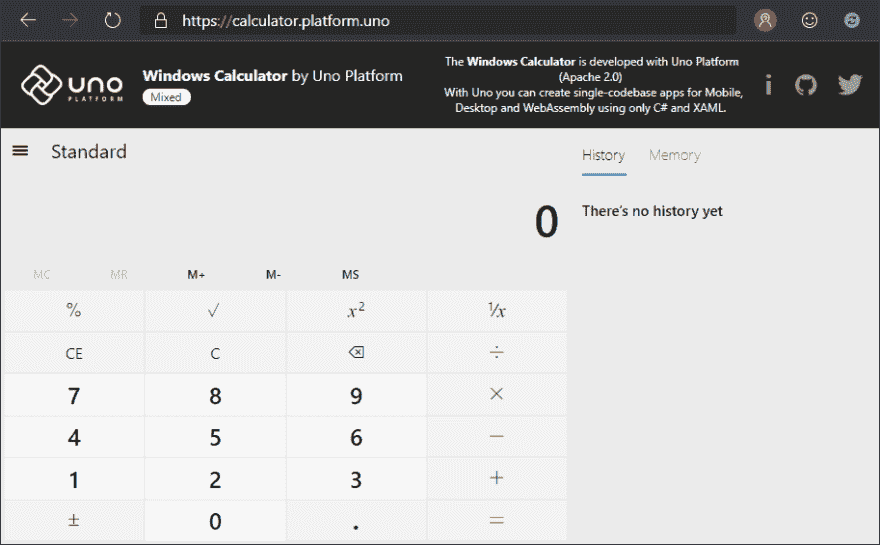
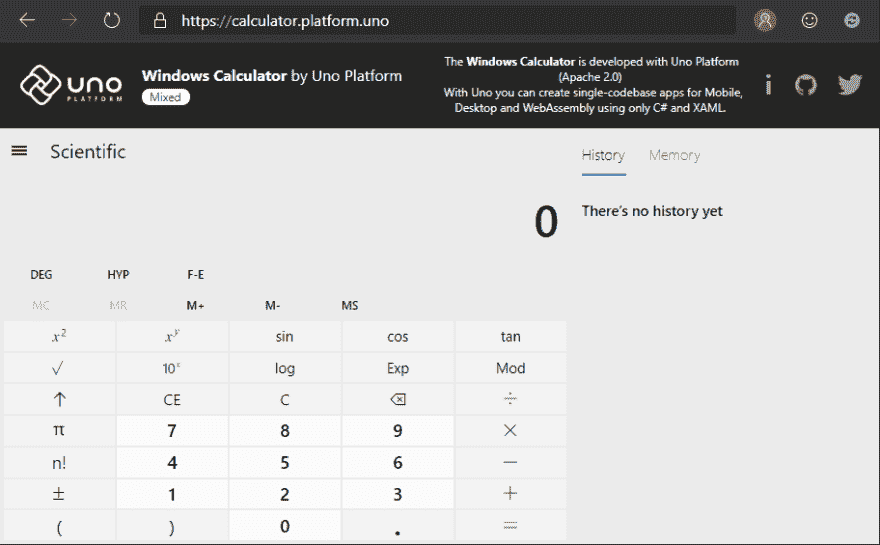
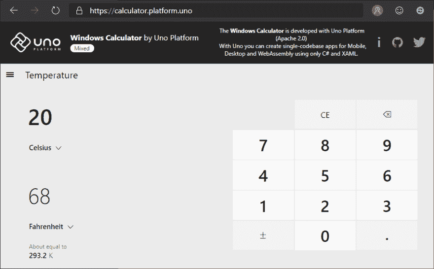
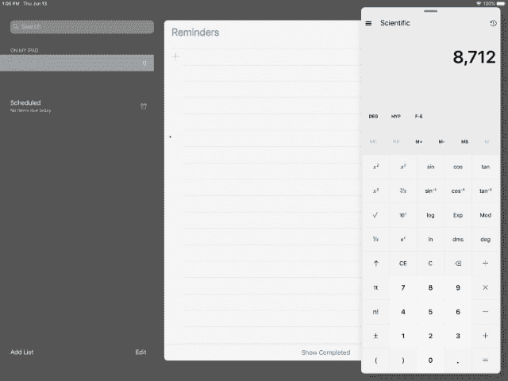
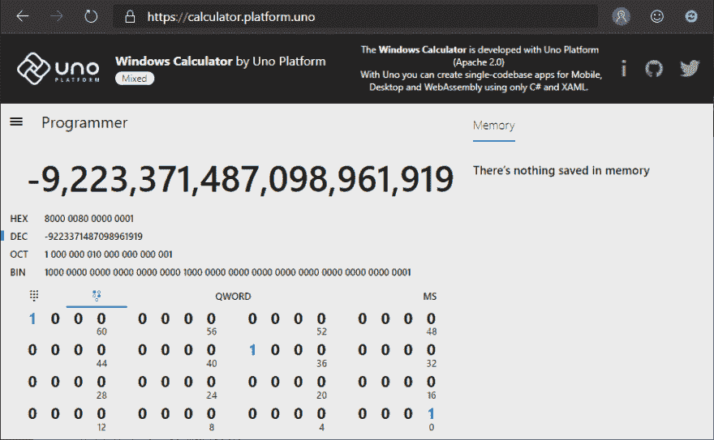
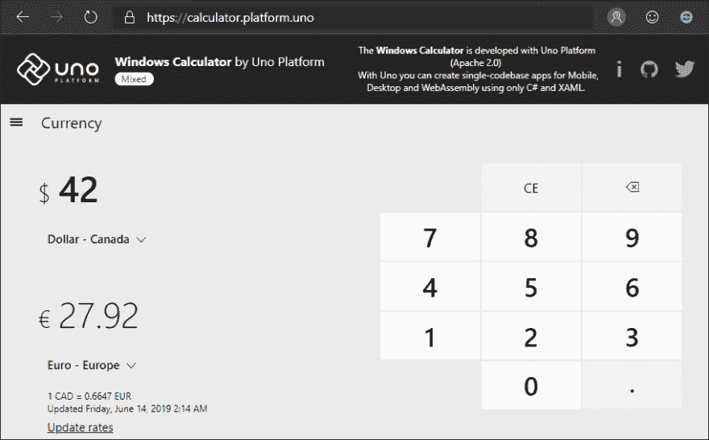

# Windows 10 的一部分现在运行在 WebAssembly 上，原生于 iOS 和 Android 上

> 原文：<https://dev.to/uno-platform/a-piece-of-windows-10-is-now-running-on-webassembly-natively-on-ios-and-android-3666>

几个月前，微软[开源了 Windows 计算器](https://blogs.windows.com/buildingapps/2019/03/06/announcing-the-open-sourcing-of-windows-calculator/)，这正是 Windows 10 附带的计算器。

我们决定[将它移植到 C#和 Uno 平台](https://github.com/nventive/calculator)，这样 iOS 和 Android 用户可以使用它，也可以通过 WebAssembly 从网络上使用它。为什么——这就是我们 Uno Platform 的工作😊–支持相同的 C#和 XAML 代码在网络、手机和桌面上运行。

**您今天可以在:**使用它

*   [苹果应用商店](https://apps.apple.com/app/id1464736591)
*   [Android Play 商店](https://play.google.com/store/apps/details?id=uno.platform.calculator)
*   web assembly:[https://calculator . platform . uno](https://calculator.platform.uno/)
*   Windows 10——嗯，在 Windows 10 上打开它就行了😊

[](https://github.com/nventive/Uno/blob/master/doc/blog/Assets/20190612-Calculator-01.png?raw=true)

## 解剖 Windows 计算器

Windows 计算器是一款有趣而不简单的软件。你在启动时看到的简单的初始用户界面可能具有欺骗性。当然，这是微软做出的一个很好的 UX 选择，因为计算器的大多数用途都相当简单。然而，这个计算器是复杂的，不仅因为它多年来的编码方式，也因为它拥有的高级功能。

首先，它完全是使用标准的 C++ 11 和 C++/CX 构建的，带有一个可以追溯到 1995 年的计算引擎。历史上，部分 C++代码实际上是用 C 语言构建的。

[](https://raw.githubusercontent.com/nventive/Uno/master/doc/blog/Assets/20190612-Calculator-02.png)

第二，计算器包含的功能有:标准模式、科学模式、具有多基数转换的程序员模式、移位操作和交互式位字段视图、日期计算器、大量转换器(货币、体积、长度、温度、角度……)、无限精度算术运算、带括号支持的表达式视图、具有可选项目的历史视图和可编辑的内存视图。它还拥有窗口和方向感知设备的响应设计，具有按钮和历史动态可见性，65 种语言的本地化，旁白/画外音辅助功能支持，剪贴板支持等…

[](https://raw.githubusercontent.com/nventive/Uno/master/doc/blog/Assets/20190612-Calculator-03.png)

## 将引擎移植到 Uno 平台

Uno 平台是用 C#开发的，为了能够支持 iOS、Android 和 WebAssembly 上的计算器，需要将部分代码翻译成 C#。其他的需要调整以符合 clang 的 C++ 11 支持。

在接下来的部分中，我们将剖析通过 Uno 平台的 WebAssembly 支持，以及原生 iOS 和 Android 应用程序，将这些代码移植到 Web 所需解决的挑战。

### 挑战#1:调整计算引擎的 C++

保持 C++代码原样的主要原因是使用了不容易映射到 C#的指针和低级内存技术，而且计算引擎不直接使用任何 UI。代码使用`CalculatorManager`类封装，一个`IResourceProvider`回调接口和`ICalcDisplay` UI 更新回调接口。

这部分代码大部分不需要更新，除了使用 C99 **[灵活数组成员特性](https://en.wikipedia.org/wiki/Flexible_array_member)** 。这个特性在 C++中不受支持(原因很好)，但是微软工程师为这个特性添加了一个排除。然而 Clang 没有这个功能，依赖它的代码需要一些调整才能使用普通数组。

构建脚本用于 [iOS](https://github.com/nventive/calculator/blob/uno/src/CalcManager/build_ios.sh) 和 [WebAssembly](https://github.com/nventive/calculator/blob/uno/src/CalcManager/build.sh) 生成它们的本地有效负载，而 Windows 和 Android 使用它们自己的`C++` Visual Studio 项目进行集成。

Android 的 NDK 也有令人惊讶的地方，对于 ARM32 ABIs 的 r19 以下的 ndk，默认情况下不支持异常处理。计算引擎依靠使用异常来处理诸如被零除之类的情况，使得应用程序在这种情况下崩溃。将`-lunwind`库添加到链接器解决了这个问题。

### 挑战 2:本机代码互操作细节

构建和使用本机代码有许多微妙之处:

*   对于 iOS，[需要使用`__Internal`](https://github.com/nventive/calculator/blob/2657413f889ba26f2e3d78e82d384794fdad3aec/src/Calculator.Shared/CalcManager/CalculatorManager.Interop.cs#L16) 已知名称，因为本地库是静态链接到主可执行文件的。
*   对于 Android，集成 VS 项目不会自动为所有目标平台(x86、armv7 和 arm64)构建，这意味着必须执行[额外的 CI 构建步骤](https://github.com/nventive/calculator/blob/2657413f889ba26f2e3d78e82d384794fdad3aec/.vsts-ci.Windows.yml#L37)，以便在创建最终 APK 时一次性使用正确的二进制文件。此外，不能使用标准的项目依赖关系(因为有多个 ABI 版本)，并且必须在项目中添加 [`AndroidNativeLibrary`](https://github.com/nventive/calculator/blob/2657413f889ba26f2e3d78e82d384794fdad3aec/src/Calculator.Droid/Calculator.Droid.csproj#L101) 项。
*   对于 WebAssembly，需要使用`-s SIDE_MODULE=1`支持来构建模块，并额外支持 C++标准库，因为它不是由 em scriten 为动态模块自动添加的[。](https://github.com/emscripten-core/emscripten/wiki/Linking#system-libraries)

### 挑战 3:将 C++/CX 代码转换成 C

应用程序的其余部分使用微软的 C++/CX 来使用 WinRT APIs，尤其是 WinUI APIs。这使得代码非常像 C#，可以使用一组正则表达式将`::`转换为`.`，或者将`dynamic_cast<FrameworkElement>(fe)`转换为`((FrameworkElement)fe)`转换为 C#，并且 WinRT API 调用的其余部分直接匹配，因为 Uno 平台提供了 WinRT 的完整 API 签名。

这种转换将大约 80%的 C++/CX 代码转换为兼容 C#的代码，并进行一些手动调整以获得全功能的 C#。例如，C++迭代器需要转换成`foreach`循环，或者使用。净内置转换。

代码的某些其他部分无法按原样转换，尤其是那些依赖 Win32 APIs 的部分，如货币或日历功能等当前区域性属性。那些需要转换使用。NET 自己的 API。

### 挑战四:转换 XAML

这一部分非常简单:没有什么要转换的！

唯一需要做的就是适应 Uno 平台的差异，比如缺少对主题资源或 RevealBrush 的支持。

[](https://raw.githubusercontent.com/nventive/Uno/master/doc/blog/Assets/20190612-Calculator-07.png)

计算器的界面布局也非常灵敏，可以根据许多断点进行调整。这使得在 iPad 上进行多任务处理和对接变得非常容易。

### 挑战五:本地化资源

Uno 平台支持使用 resw 文件，这意味着这些文件与原始计算器使用的文件完全相同。

注意，资源使用[附加属性语法](https://github.com/microsoft/calculator/blob/06c0dd9bd0f5971db9b17a782e1386037da38026/src/Calculator/Resources/de-DE/Resources.resw#L460)来支持讲述人和工具提示，例如:

```
\<data name="MemoryPivotItem.[using:Windows.UI.Xaml.Automation]AutomationProperties.Name" xml:space="preserve"\> \<value\>Arbeitsspeicher\</value\> \<comment\>The automation name for the Memory pivot item that is shown when Calculator is in wide layout.\</comment\> \</data\> 
```

-形成无杂乱的局部 XAML。

Uno 平台也直接支持图像资产，尽管一些原始资产不能直接使用，因为它们使用 Uno 平台尚不支持的语义特征，例如高对比度。那些暂时被排除了。

## 将 C++和 C#连接在一起

这部分是利用 [P/Invoke](https://docs.microsoft.com/en-us/cpp/dotnet/how-to-call-native-dlls-from-managed-code-using-pinvoke?view=vs-2019) 的移植工作的核心。

### 挑战#6: Mono for WebAssembly 动态和静态链接支持

为了能够使用 P/Invoke 直接从 C#调用 WebAssembly 代码， [Mono 必须更新为](https://github.com/mono/mono/pull/14259)来支持它。有两种模式可用，一种用于基于解释器的构建，另一种用于基于 AOT 的构建。

基于解释器的模式使用 [emscripten 的动态链接特性](https://github.com/emscripten-core/emscripten/wiki/Linking#overview-of-dynamic-linking)，并且需要能够在 windows 下构建 Wasm 应用，而不必依赖于 emscripten 的工具。这确保了开发循环尽可能高效，尽管代价是运行时性能。

基于 AOT 的模式使用 emscripten 和 [Mono 的静态链接特性](https://github.com/mono/mono/pull/14253)，其中 Mono 将一组“已知的 p/invoke”方法生成到 LLRM 位代码模块中。这种模式效率最高，但生成速度也最慢。通常最好在发布 CI 构建中使用它。

[](https://raw.githubusercontent.com/nventive/Uno/master/doc/blog/Assets/20190612-Calculator-06.png)

### 挑战# 7:C 适配层

P/Invoke 只能调用 C 函数，这里通过`extern "C" { }` cdecl 调用约定公开。这意味着为了能够调用计算引擎的 C++部分，需要创建一个 [C 到 C++的转换层](https://github.com/nventive/calculator/blob/uno/src/CalcManager/CCalcManager.h)。它公开了一组可以[创建 C++实例](https://github.com/nventive/calculator/blob/2657413f889ba26f2e3d78e82d384794fdad3aec/src/CalcManager/CCalcManager.h#L86)的方法，并返回不透明的标识符，这些标识符[随后被显式](https://github.com/nventive/calculator/blob/2657413f889ba26f2e3d78e82d384794fdad3aec/src/CalcManager/CCalcManager.h#L87)传递给 C++类实例方法。

这种技术需要手工操作，但是由于计算引擎并不特别复杂，所以添加所有需要的方法很容易。

### 挑战 8:c++到 C#回调的案例

回调一般通过 [`Marshal.GetFunctionPointerForDelegates`](https://github.com/nventive/calculator/blob/2657413f889ba26f2e3d78e82d384794fdad3aec/src/Calculator.Shared/CalcManager/CalculatorManager.cs#L139) 在 C#中处理。

虽然这对于 JIT 兼容的平台(Android 和 Windows)通过在运行时创建 stubs 或 trampolines 工作得很好，但 iOS 和 WebAssembly 不支持这一点。

对于 iOS，需要添加 [`UnmanagedFuntionPointer`](https://github.com/nventive/calculator/blob/2657413f889ba26f2e3d78e82d384794fdad3aec/src/Calculator.Shared/CalcManager/CalculatorManager.Interop.cs#L128) ，以便在编译时生成回调指针。

Mono-wasm 还不支持这个特性，而且[需要依靠](https://github.com/nventive/calculator/blob/2657413f889ba26f2e3d78e82d384794fdad3aec/src/Calculator.Wasm/WasmScripts/CalcManager.js#L18)的 [emscripten 保留函数指针](https://emscripten.org/docs/porting/connecting_cpp_and_javascript/Interacting-with-code.html#calling-javascript-functions-as-function-pointers-from-c)和`addFunction`帮助函数来获得 WebAssembly 对 C#的可调用回调。然后，每个 Javascript 注册函数使用 Mono 的绑定助手回调 C#。

### 挑战九:字符串编组

字符串编组是一件棘手的事情。Windows 系统使用 UTF16 编码，而*nix 系统使用 UTF32 编码。默认的 p/invoke 编组不支持从 UF32 到 UF32 的隐式转换，需要添加一些对字符串的[显式管理来支持 C++ `wchar_t`类型。](https://github.com/nventive/calculator/blob/2657413f889ba26f2e3d78e82d384794fdad3aec/src/Calculator.Shared/CalcManager/CalculatorManager.Interop.cs#L326)

### 挑战#10:向 Uno 平台添加功能

在移植计算器的过程中，我们必须添加对计算器所依赖的许多 XAML 和 WinRT 特性的支持。

诸如 Grid 的[RowDefinitions.MaxWith/MaxHeight 支持](https://github.com/nventive/Uno/pull/1048)、[使用资源](https://github.com/nventive/Uno/pull/966)的附加属性本地化、WebAssembly 的[文本测量](https://github.com/nventive/Uno/pull/1034)和[缓存](https://github.com/nventive/Uno/pull/931)等修复、使用 [VisualState 触发器](https://github.com/nventive/Uno/pull/1008)、 [Javascript 封送](https://github.com/nventive/Uno/pull/970)的性能改进以及对新 [`x:Load`属性](https://github.com/nventive/Uno/pull/870)的支持是我们对 Uno 平台的一些改进。

为了适应 Uno 平台，还对计算器的原始源代码进行了其他调整，随着我们逐渐向 Uno 平台添加新功能，我们将在未来添加对这些内容的支持。

## 附加注释

货币转换器使用 API 调用来获取最新的汇率，并且端点不支持 CORS，这使得从 web 浏览器调用变得困难。API 调用现在通过 [CORS-anywhere 示例应用](https://cors-anywhere.herokuapp.com/)进行，但最终微软可能会更新其端点以正确支持它。

[](https://raw.githubusercontent.com/nventive/Uno/master/doc/blog/Assets/20190612-Calculator-05.png)

此外，如果您正在尝试计算器，或任何其他 WASM 相关的应用程序，由于 WebAssembly 的限制，您应该记住以下几点。

1.  WebAssembly 正在进行中——随着 emscripten、LLVM、Mono 和 Uno 平台的改进，性能越来越好。
2.  许多开发者使用 Chrome 作为他们的主要浏览器。目前 Chrome 自己对 WebAssembly 的支持还不太到位(目前的 canary 好得多！)，所以您可能想使用其他浏览器来尝试计算器。

### 关于 C++转换

将 C++翻译成 C#对于理解代码非常有用，并使其更为一般 Windows 开发人员所熟悉，但是它的缺点是使得对原始源代码的变更跟踪更加困难。

这就是为什么我们选择尽可能少地重构代码(例如，不做任何调整以符合 C#通用命名约定)并尽可能保持 C#代码接近原始 C++代码。这简化了将上游 C++更新应用到 C#代码库的过程。

### 最后的想法

计算器的移植是一个非常有趣的项目，也是一个可以在所有平台上使用的非常好的计算器。

你可以去 GitHub repo 尝试自己构建它[。](https://github.com/nventive/calculator)

我们希望帮助开发人员编写能够在 Web、移动和桌面上运行的单代码应用程序。为了帮助你做到这一点，我们[创建了一个简单的教程](https://platform.uno/docs/articles/getting-started-tutorial-1.html)，这样你就可以在你自己的环境中进行测试。如果你能试一试，我们将不胜感激。

让我们知道你的想法！

*特别感谢***团队为实现该应用的移植所做的辛勤工作！**

 *帖子[一片 Windows 10 现在运行在 WebAssembly 上，原生在 iOS 和 Android 上](https://platform.uno/a-piece-of-windows-10-is-now-running-on-webassembly-natively-on-ios-and-android/)最早出现在 [Uno 平台](https://platform.uno)。*