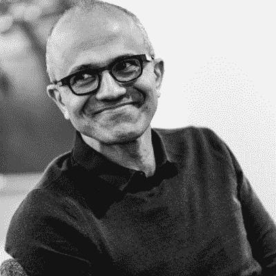

# 对微软探索实习的反思

> 原文：<https://dev.to/thejameswang/a-reflection-of-the-microsoft-explore-internship-59j>

2019 年 1 月 11 日，我获得了微软的 explore 实习机会。给了我四天的时间来决定这份工作，我决定在华盛顿州的雷德蒙度过我的 2019 年夏天，上周，我结束了这段经历，回到了大学。

## 背景

关于我自己，当我申请这个职位的时候，我是佐治亚理工学院的二年级学生(或者如果你是一个很酷的孩子，佐治亚理工大学)。我正在学习计算机科学，重点是人工智能和信息网络。

我之前有过实习/初创工作@GEDigital 和@AnoraAI。我还积极参加学生组织/非营利组织。

## 什么是探索实习？

### 概述

像其他一些大型科技公司一样，微软为大学生提供一年级和二年级课程。与那些项目不同，新实习生将学习项目管理和软件工程。学生将被分配到包括 Xbox、Bing、One Drive 和 M365 等产品在内的整个公司的团队中，每组 3 人，共同完成一个项目。

### 地点

*   华盛顿州雷德蒙
*   加州桑尼维尔

### 资历

*   必须是在美国、加拿大或墨西哥注册学士学位课程的大一或大二学生，表现出对计算机科学、计算机工程、软件工程或相关技术专业的兴趣。
*   必须完成计算机科学入门课程(或同等课程)以及一学期的微积分课程
*   最后，必须对软件行业感兴趣

## 我的申请流程

我的过程有三个步骤。

免责声明！这纯粹是我的经验，而其他人(可能包括你)可能有一个完全不同的经验！

1.  应用
    *   我最初是在 2018 年秋季学期初在一位前一年参加该项目的朋友的推荐下在线申请的。
    *   申请过程永远是大海里的一个瓶子，希望有人正在阅读你希望的文字。当我得到校园面试时，我很惊讶
2.  校园面试
    *   10 月初，我接受了一次 30 分钟的面试，被问到一个设计问题。举例:你会如何设计一个在线井字游戏？
3.  现场面试
    *   一月初，我在雷德蒙接受采访，在那里我接受了两次 45 分钟的采访。我被问及行为和基本技术问题。
    *   技术主题示例:数组操作、基本数据结构等。

我在期末面试几天后收到了我的信，几天后我做出了决定。

## 实际实习

2019 年 5 月 13 日开始实习。我坐飞机离开，给了我一辆车，给了我一个住的地方。接下来的 12 周，我会在微软的国度，塞特亚·纳德拉是我们的上帝，我们是住在昂贵的农贸市场的天使，只在我们的房子里喝酒，还有 C#。

玩笑归玩笑，

我在实习前收到了一些建议，这些建议完美地体现了每个人在实习时应该考虑的问题。

> “你有能力创造自己的实习经历”

实习项目体现了这一点，它试图让所有实习生通过微软实现他们的个人目标。

### 我的团队

我在 One Drive Sharepoint 团队工作，特别是他们的服务结构团队。我们在一个驱动器消费者的基础设施上工作，我处理一个低级的问题。我的项目部分只使用 C#，构建配置和一个 API。

### 日复一日

敏捷仍然是一种实践，它以不同的速度影响着 MSFT 的每个团队。我的团队每周有两次“站立会议”,我们在会上讨论项目的更新。我有机会灵活安排自己的时间。有些日子我早上 6:30 到，而有些时候是 10 点。

我的一天被会议、开发/产品管理、网络和实习生活动分割开来。很多实习活动。

我通常在下午 4:30 到 6:30 离开办公室。不过，我会在下班后使用办公室进行非微软的活动。

### 我的项目

在我的三人小组中，我们根据自己的兴趣将项目分成三个部分。实习本身有两个部分，基于软件工程和项目管理。

在最初的四周，我们学习成为一名项目经理，[这是微软不同于大多数地方的](https://www.quora.com/What-is-program-management-at-Microsoft)。在这四周里，会议、交流和对我们项目的详细了解是必要的。

接下来的八周围绕着开发我们的功能。一个做前端，另一个做数据收集。我聚合了配置，并创建了聚合方法作为 API 供前端使用。

最后，我们在 CVP、经理和其他实习生面前展示了我们的项目。我个人认为我们的项目做得很好！

显然，在这一过程中会遇到一些困难，但总体来说，这就是我的项目进展的计划。

### 联网

不，不是那个网络。

那好一点了。

这家公司的一个亮点是每个人如何对待实习生。如果你想认识 CVP 级别以下的人，你所要做的就是在[团队](https://products.office.com/en-us/microsoft-teams/group-chat-software)中给他们发消息。

与 FTEs(全职工程师)建立联系非常容易。。。如果你能找到合适的 FTE。微软有几个寻人系统，但都不完整。这取决于你来找出最好的方法，但是我建议你先和你楼里的人谈谈来找出答案！实习初期，我每天都会遇到来自华盛顿各地(主要是贝尔维尤和雷德蒙)的新 FTE。

我在下班后认识了实习生，既认识了新朋友，也认识了新朋友！最终，我成为了一个由亚马逊、Qualtrics 和偶尔的其他大 4 实习生组成的团队的一员。

我认为网络是交朋友的另一种方式，就像朋友一样，你必须以某种方式保持交谈，才能对彼此投入！这意味着我不得不偶尔跟进。

### 事件

对于实习生和全职员工来说，这个夏天充满了许多活动，有些活动比其他活动更具排他性

#### 实习生事件

有许多实习活动，平均来说，它们组织得并不太好，也没有做广告。你可以认识很棒的新朋友，但是最好找到其他渠道来接触很酷的实习生。

我那年实习生计划停止举办[实习生签名活动](https://www.geekwire.com/2018/microsoft-throws-concert-summer-interns-seattle-featuring-pitbull-julia-michaels/)。相反，我们有“实习生日”从我对签名活动的了解来看，主要的区别是它现在在微软的校园里，没有礼物(以前所有的实习生都有一个 Xbox 或 Chromebook)。

你的组织，我的是一个司机，也将有特别活动。这些更好！

#### 定期事件

从[一周](https://news.microsoft.com/life/one-week-microsoftlife/)到惊人的比赛(另一项 FTE 赛事)，微软举办的赛事作为一个整体都做得很好。他们把一切都考虑进去了，我建议每个人都参与进来。

#### 非微软事件

在西雅图/华盛顿寻找活动的最佳方式是在城市中建立网络。通过在其他公司的朋友，不要害怕探索新的风景和结识陌生人。我使用 facebook events 来帮助我参加当地的聚会，但微软在实习开始时也有几个建议来帮助你，比如应用程序“living social”

### 挣扎

#### 技术

*   证明文件

    *   由于大公司的性质和我的团队的历史，没有关于如何处理现有代码的文档。
*   灵活性

    *   在大公司里，对自己的技术没有选择可能会令人沮丧。学习新技术很好，但是如果兴趣不一致，你就会停滞不前。
    *   C#是微软；微软是 C# -至少后端是这样。

#### 团队

*   探索

    *   作为一名 explore 实习生，团队成员的技能水平各不相同。由于进入的技术门槛较低，团队将拥有更强的技能和经验。这可能会令人沮丧。
*   3 人小组

    *   在一个团队中，一个项目取决于三个人，这可能是有局限性的。许多项目可能基于他人的结果，这可能会限制你的参与，直到他们完成。它会打乱最后期限。

## 总体优点、缺点、遗憾和积极方面

### 优点

*   人
    *   微软的员工是科技行业中最好的，作为一名实习生，全职员工对你的待遇非常好。
*   建立工作关系网
    *   全职和其他实习生是你最大的资源，也是你从实习中学到的东西。世界上一些最聪明的人每天都在和你一起/在你附近工作，所以这绝对是需要利用的东西！
*   舒适
    *   从生活到交通，几乎所有的事情都照顾到你了。它会给你带来很大的压力。
*   返回
    *   微软的退货是很正常的。你很可能会有安全保障，能够以某种方式返回。
    *   你将有机会根据自己的兴趣和*努力*换队，换回来。

### 弊

*   变化性
    *   没有决定你的团队将会是什么样的结构。你将别无选择。这是一个令人沮丧的情况。
    *   在你最初的实习中，你的兴趣没有被考虑在内，在你第一天到达之前，你很难获得关于你的团队的任何信息。
*   寻找人员/机会
    *   社会影响对我来说非常重要，微软也爱谈论他们的贡献。也就是说，根据你的兴趣去寻找机会和人是非常困难的。
    *   这需要人脉和时间，但最终，你会找到合适的人。这取决于你的努力。

### 感慨

*   预订过多
    *   我把大学的额外项目和我在微软找到的项目都加入了我的日程表。
    *   相反，我会用更多的时间与队友和同龄人联系，并参观更多的徒步旅行路线

### 正面外卖

*   连接
    *   你遇到的人将真正能够跟随你很长一段时间。见到这么多伟大的人绝对是我不会交易的亮点。
*   探测
    *   我参观了波特兰、温哥华和华盛顿的多条徒步旅行路线。这些绝对是这次实习中我最怀念的

## 结论

我抱着开放的心态去实习。虽然我的经历比我希望的要平凡得多，但微软在培养有利于我成长和学习的文化方面做得很好。这是一个有趣的夏天，它让我更好地了解了传统的开发人员生活。我不后悔接受了这份工作，这也是一个很好的方式来了解我在大公司工作的感受。

#### 暂且不提

这也是我的第一个帖子，所以如果你想让我添加任何部分，请告诉我！我很难选择我应该包括和排除什么。