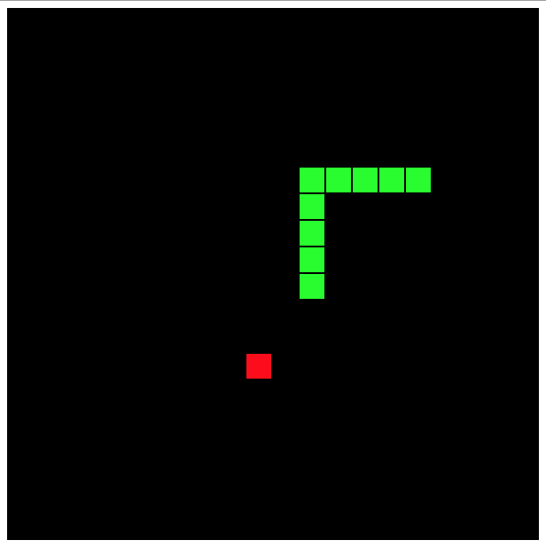

# 一条非常优雅的蛇

> 原文：<https://dev.to/oinak/a-very-classy-snake-8e3>

我习惯于从其他人的建议中分支开始我的编码思考。

在这种情况下，我发现自己在看这个视频，作者在 4'30'' 中编码

视频非常好，代码是有目的的和无情的 hacky。在那段时间之后，这个游戏确实有效。当我看着它的时候，我在想，哇，
我不能在他自己的游戏中打败他，但是那段
乱涂乱画的代码和我会自豪地在面试/工作申请中展示的东西真的有那么大的不同吗？

于是我着手进行了一系列的约束，即:

*   呈现完全相同的用户界面

|  |
| --- |
| 一个简陋但熟悉的用户界面 |

*   在相同的介质上完成(仅浏览器 javascript)
*   不要使用库/外部资源
*   相当于半个工作日做这件事:大约 4 个小时
*   使用尽可能多的 os ES6，所以它是 ES6 练习的两倍。
    *   不要担心浏览器兼容性，假设 es6 可用
*   不要添加额外的功能

这是运行游戏
所需的`index.html`

```
<!DOCTYPE html>
<html>
  <head>
    <meta charset="utf-8">
    <meta name="viewport" content="width=device-width">
    repl.it
    <link href="style.css" rel="stylesheet" type="text/css" />
  </head>
  <body>
    <canvas id='field' width='600' height='600'>Loading...</div>
    <script src='script.js'></script> 
    <script>
      window.onload = () => { let game = new Game({canvasId: 'field'}); };  
    </script>
  </body>
</html> 
```

Enter fullscreen mode Exit fullscreen mode

这是肉:

### 主`Game`类

```
// Usage: 
//   <canvas id='field' width='600' height='600'>Loading...</div>
//   <script src='script.js'></script> 
//   <script>
//     window.onload = () => { let game = new Game({canvasId: 'field'}); }; 
//   </script>
class Game {
  constructor({ canvasId }){
    this.grid = { tiles: 20 , size: 30 };
    this.apple = new Apple(); //{ position: { x: 15 , y: 15 }, calories: 1 };
    this.snake = new Snake();
    this.init(canvasId);
  }

  init(canvasId){
    let canvas = document.getElementById(canvasId);
    this.context = canvas.getContext('2d');                     // GUI
    addEventListener('keydown', (e) => { this.userInput(e) } ); // User input
    setInterval( () => { this.game() }, 1000 / 8);              // Game loop 
  }

  userInput(event){
    const north = { x: +0, y: -1 };
    const east  = { x: +1, y: +0 };
    const south = { x: +0, y: +1 };
    const west  = { x: -1, y: +0 };
    const arrows = { left: 37, up: 38, right: 39, down: 40};
    const bearings = {
      [arrows.left]: west,
      [arrows.up]: north,
      [arrows.right]: east,
      [arrows.down]: south
    }

    let bearing = bearings[event.keyCode];
    this.snake.head(bearing);
  }

  game(){
    this.snake.move();
    let ap = this.apple.position;
    let sp = this.snake.position;
    // console.log(`apple: ${ap.x},${ap.y} snake: ${sp.x},${sp.y} `)
    if (this.snake.position.x === this.apple.position.x &&
        this.snake.position.y === this.apple.position.y) {
      this.levelUp();
    }

    this.draw();
  }

  levelUp(){
    let calories = this.apple.calories; 
    this.snake.eat(this.apple);
    delete this.apple;
    // optional: randomly increase apple nutritive value:
    // calories += ( Math.random(5) > 3 ? 0 : 1 );
    this.apple = Apple.spawn({ max: this.grid.tiles, calories: calories });
  }

  draw() {
    // canvas
    this.context.fillStyle = "black";
    this.context.fillRect(0, 0, this.grid.tiles * this.grid.size, this.grid.tiles * this.grid.size);

    // snake
    for(var i = 0; i < this.snake.trail.length; i++) {
      this.drawSquare(this.snake.trail[i], "lime");
    }

    // apple
    this.drawSquare(this.apple.position, "red");
  }

  drawSquare(object, color){
    this.context.fillStyle = color;
    this.context.fillRect(
      object.x * this.grid.size,
      object.y * this.grid.size,
      this.grid.size - 2,
      this.grid.size - 2);
  }
} 
```

Enter fullscreen mode Exit fullscreen mode

### 非常滑`Snake`级

```
class Snake {
  constructor(options = {}) {
    const defaults = {
      x: 10 , y: 10, max: 20,
      tail: 3,
      velocity: {x: 0, y: 0}
    };
    Object.assign(this, defaults, options);
    this.initialLength = options.tail || defaults.tail;
    this.trail = [];
  }

  get position(){
    return { x: this.x, y: this.y };
  }

  head(bearing){
    this.velocity.x = bearing.x;
    this.velocity.y = bearing.y;
  }

  move(){
    this.x += this.velocity.x;
    this.y += this.velocity.y;
    this._wrapWalls();
    this._detectCollision();
    this._updateTrail();
  }

  eat (food){
    this.tail += food.calories;
  }

  die (){
    this.tail = this.initialLength;
  }

  _wrapWalls(){
    if (this.x < 0) { this.x = this.max - 1; } // wrap left->right
    if (this.x > this.max - 1) { this.x = 0; } // wrap right->left
    if (this.y < 0) { this.y = this.max - 1; } // wrap bottom->top
    if (this.y > this.max - 1) { this.y = 0; } // wrap top->bottom
  }

  _detectCollision(){
    for(var i = 0; i < this.trail.length; i++) {
      if (this.trail[i].x === this.x && this.trail[i].y === this.y) {
        this.die();
      }
    }
  }

  _updateTrail(){
    this.trail.push({ x: this.x, y: this.y });
    while(this.trail.length > this.tail) {
      this.trail.shift();
    }
  }
} 
```

Enter fullscreen mode Exit fullscreen mode

### ...还有不起眼的美味`Apple`类

```
 class Apple {
  constructor(options = {}) {
    const defaults = { x: 15 , y: 15, calories: 1};
    Object.assign(this, defaults, options);
  }

  get position(){
    return { x: this.x, y: this.y };
  }

  static spawn({ max, calories }){
    let ax = Math.floor(Math.random() * max);
    let ay = Math.floor(Math.random() * max);
    let sprout = new Apple({ x: ax, y: ay, calories: calories});
    return sprout;
  }
} 
```

Enter fullscreen mode Exit fullscreen mode

## 事后诸葛亮

然而，添加其他修改相对容易:

*   随着游戏的进行，苹果可以让你变得更长(这就是卡路里的概念)。
*   每次升级游戏速度都会加快:

```
 init(canvasId){
    //...
    this.inpetrval = setInterval( () => { this.game() }, 1000 / this.speed);     // Game loop 
  }
  //...
  levelUp(){
    //...
    this.speed += 1;
    this.clearInterval(this.interval);
    this.inpetrval = setInterval( () => { this.game() }, 1000 / this.speed);     // Game loop updated
  } 
```

Enter fullscreen mode Exit fullscreen mode

## 现在怎么办？

你怎么想呢?你会有什么不同的做法？你介意像这样继承代码吗？