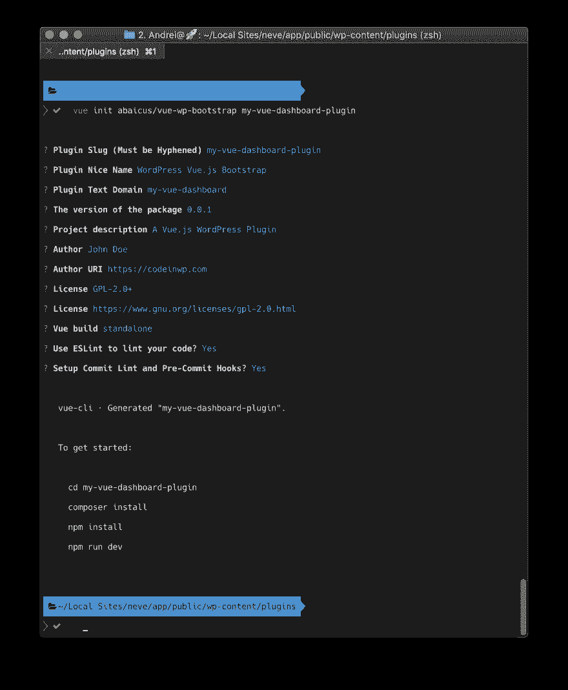
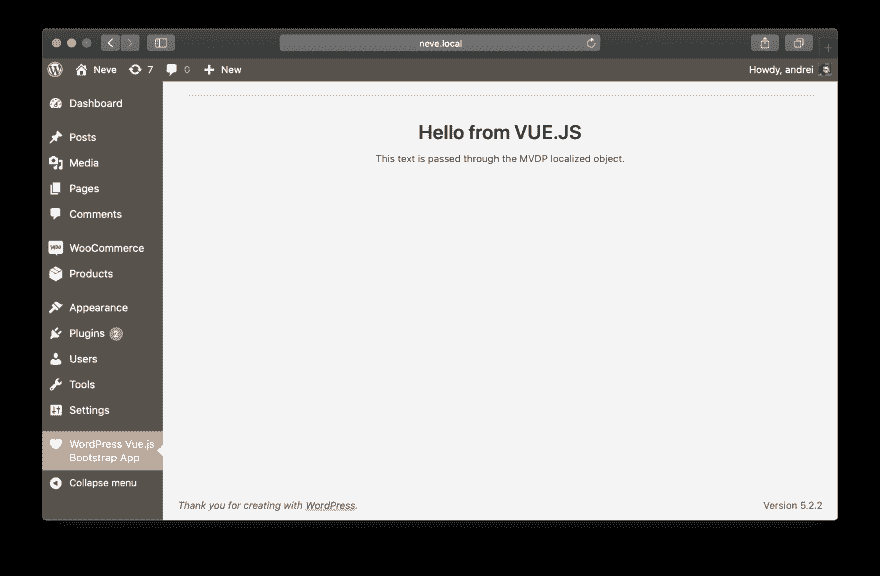
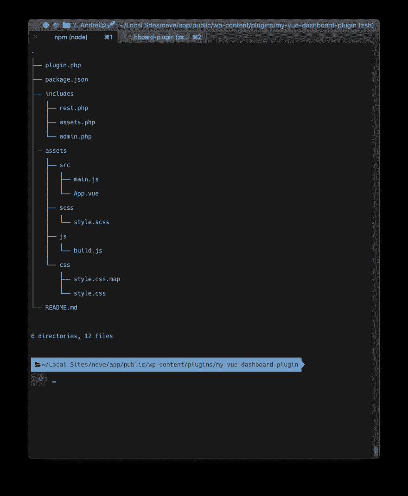

# 初学者开发人员的 Vue.js 教程:学习基础知识并使用这个初学者 Vue 结构

> 原文：<https://dev.to/codeinwp/a-vue-js-tutorial-for-beginner-developers-learn-the-basics-and-use-this-starter-vue-structure-2mii>

每当您开始在开发流程中使用新技术时，您可能会感到至少有点害怕。尤其是当有无数的 npm 包在外面的时候。混合和搭配东西有时会花费很多时间和精力，而且通常会令人沮丧。这就是下面的 Vue.js 初学者教程发挥作用的地方。

### **什么是 Vue.js？你为什么要在乎？**🤔

Vue.js 或简称 Vue 是一个用于构建用户界面的 [JavaScript](https://www.codeinwp.com/blog/learning-javascript-for-wordpress/) 框架。与其他框架相比，如 [Angular 或 React](https://www.codeinwp.com/blog/angular-vs-vue-vs-react/) ，Vue 更加平易近人，学习曲线也不那么陡峭。

Vue 也是模块化的，它允许你将你的代码分割成可重用的组件。它们都有自己的 HTML 标记、CSS 和 JavaScript 代码。

### **这个 Vue.js 教程的范围是什么？**🔍

这个简短的 Vue.js 教程的目的是为您提供一些可以构建和试验 Vue 的脚手架。我们将在 [WordPress dashboard](https://www.codeinwp.com/blog/evolution-of-wordpress-ui/) 中查看一个 Vue 应用的基本设置。

(注；在本指南中，我们不会教你 Vue 本身，但是在你在这里建立项目之后，你可以继续从[官方指南](https://vuejs.org/v2/guide/)中学习更多关于这个框架的知识——在我们完成之后，你可以继续在上面进行实验。)

我们要做的是使用 Vue 为 WordPress 插件使用一个预定义的模板。如果你想深入了解，可以在下面的 GitHub 资源库中找到:[https://github.com/abaicus/vue-wp-bootstrap](https://github.com/abaicus/vue-wp-bootstrap)。

### **Vue.js 教程:先决条件**🚀

要继续遵循本指南，您应该已经在计算机上设置了一些内容:

首先，你需要一个灯组——你可以在 Windows 或 Mac 上使用 XAMPP，或者在 Mac 上使用本地飞轮，然后给自己设置一个新的[本地 WordPress 安装](https://www.codeinwp.com/blog/local-wordpress-development-tools/)。

确保您的机器上安装了 [NodeJS 包管理器](https://nodejs.org/en/) (npm)。您还需要通过终端安装另外两个包 Vue CLI 和 Vue 模板初始化工具。像这样:

```
$ npm install -g @vue/cli
$ npm install -g @vue/cli-init 
```

安装完这两个依赖项后，您需要将活动目录更改为本地 WordPress 实例的 wp-content/plugins 目录，然后在那里运行下面的命令:

```
$ vue init abaicus/vue-wp-bootstrap my-vue-dashboard-plugin 
```

接下来，将提示您回答一些关于项目设置的问题。

对于构建提示，现在选择第一个选项“运行时+编译器:推荐给大多数用户”。

如果你愿意，可以启用 ESLint linter。它会检测项目中的任何林挺错误，但是你现在不必担心这个。

Commit Lint 和 Pre-Commit 挂钩是为了在向 GitHub 发送 Commit 之前检查您的提交消息和代码——以保持一切整洁和格式良好。

完成后，您将看到一个看起来或多或少像这样的终端:

[](https://res.cloudinary.com/practicaldev/image/fetch/s--fQRMHQEX--/c_limit%2Cf_auto%2Cfl_progressive%2Cq_auto%2Cw_880/https://www.codeinwp.com/wp-content/uploads/2019/06/vue-bootstrap-terminal.png)

你可以按照屏幕上的指示做。将目录更改为新生成的插件目录，并运行终端提示符中显示的命令。这将启动并运行您的应用程序，等待代码内部的更改，并将 Vue 代码转换为 JavaScript。

### **它是做什么的？**💻

不多。这只是一个从后端显示一些数据的基本应用程序。引擎盖下没多少 Vue。您可以转到插件仪表板页面并激活它。它将在您的管理菜单中添加一个新页面。导航到该页面后，您会发现一个带有两个字符串的仪表板页面:

[](https://res.cloudinary.com/practicaldev/image/fetch/s--efuoumuC--/c_limit%2Cf_auto%2Cfl_progressive%2Cq_auto%2Cw_880/https://www.codeinwp.com/wp-content/uploads/2019/06/vue-dashboard.png)

### **外挂脚手架结构**👨🏼‍💻

让我们来看看新生成的插件的文件结构。我们将忽略本 Vue.js 教程中的大多数配置文件，以便我们可以专注于应用程序的结构:

[](https://res.cloudinary.com/practicaldev/image/fetch/s--racgYyuZ--/c_limit%2Cf_auto%2Cfl_progressive%2Cq_auto%2Cw_880/https://www.codeinwp.com/wp-content/uploads/2019/06/vue-file-tree.png)

首先，我们已经得到了*plugin.php*文件，这是实际插件的入口点。这里，我们有主**插件**类。这是应用程序的主要组件被包含和运行的地方。

接下来是 *package.json* 文件，其中定义了所有的依赖项和一系列其他项目信息。您可能感兴趣的部分位于“脚本”字段下。在那里，您可以运行带有 *npm run* 前缀的所有命令。目前，最重要的应该是 *npm run dev* (为开发构建应用程序)和 *npm run build* (一旦您准备好为生产部署您的应用程序，您应该运行它们)。其他命令与这两个命令相邻，或者做其他你现在不需要担心的事情。

在*包括*目录中，有三个文件:

*   *rest.php*类目前不做任何事情，但是您已经有了一个添加 RestAPI 路由的结构

*   assets.php 类处理样式和脚本入队。这里，JavaScript 文件被本地化以将起始数据从 PHP 传递到我们的 Vue 应用程序。目前，只有两个文本发送，但你可以包括任何你想要的。

*   *admin.php*文件负责在仪表板中添加新页面，并呈现实际的插件页面。你会注意到应用程序本身呈现为两个空的

    tags inside the plugin_page() function. That’s because the JavaScript will handle the actual rendering of the application after it loads.

    在*资产*目录中，您会发现另外四个目录:

    *   *src* 目录——我们的 Vue 应用程序的源文件，我们稍后会谈到。
    *   *scss* 目录——我们从中生成 css 样式表的 scss 风格文件。
    *   *js* 目录——从 src 目录中的文件生成的编译代码。
    *   *css* 目录——来自 SCSS 文件的编译风格。

    ### ***src*目录和 Vue 模板文件**

    在这个目录中，有两个文件: *main.js* 和 *App.vue* 。main.js 文件是应用程序的入口点。它将 Vue app 组件附加到具有相应 id 的 DOM 元素上。

    ```
    /* jshint esversion: 6 */
    import Vue from 'vue'
    import App from './App.vue'

    window.addEventListener('load', function () {
      new Vue({ // eslint-disable-line no-new
        el: '#mvdp-app',
        components: { App },
        render: (h) => h(App)
      })
    }) 
    ```

    实际的应用程序标记在 *App.vue* 模板中:

    ```
    /* jshint esversion: 6 */
    <template>
      <div>
        <h1>{{this.strings.title}}</h1>
        <p>{{this.strings.description}}</p>
      </div>
    </template>

    <script>
      /* global MVDP */
      export default {
        data () {
          return {
            strings: MVDP.strings
          }
        },
        name: 'App.vue'
      }
    </script>

    <style scoped>

    </style> 
    ```

    您可以在上面的代码片段中看到，我们使用了在 *Assets* 类中本地化的字符串。Vue 的一个重要特性是组件的代码被整齐地组织成模板、脚本和样式，这使得理解其结构变得很容易。

    就这样，无论您想用 Vue.js 进一步开发什么，现在都有了一个坚实的起点！希望这篇 Vue.js 教程有所帮助。

    *文章最初发表于[CodeinWP.com](https://www.codeinwp.com/blog/vue-js-tutorial/)T3】*