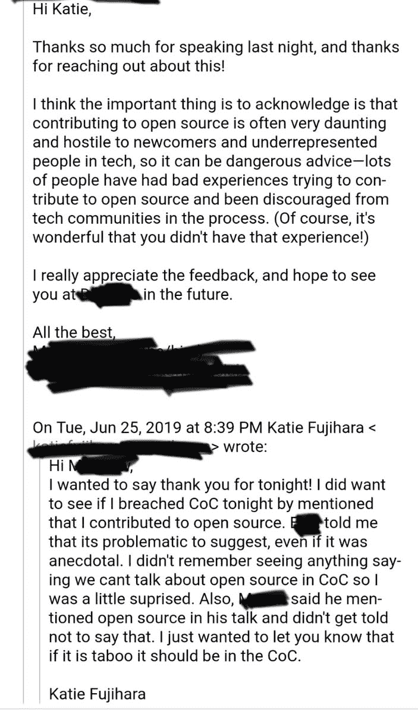

# 开源观念的一个令人担忧的变化

> 原文：<https://dev.to/codepo8/a-worrying-change-in-open-source-perception-30m7>

开源是一个很好的想法。它证明了自己可以用共享的劳动力创造大型复杂的产品。它还允许产品遵循几个玩家的输入和指导。产品不必遵循一家公司或其利益相关者的要求。我们为平台和社区建设，而不是为下一个财政季度。

## 开源对公司来说是一种胜利

对于公司来说，开源他们的产品意味着让他们接受大众的审查。人们可以贡献和构建公司没有考虑到的功能，因为公司没有这个需求。这也是一个惊人的招聘机会。雇人又难又贵。减少培养新员工所需的时间是真正的商业利益。贡献者是已经具备专业知识的潜在雇员。这也是保证质量的一种方式。在众目睽睽之下隐藏有缺陷的代码比在公司内部存储库中要困难得多。

## 开源是我的出路

我的职业生涯在很大程度上归功于开源和类似的想法，如知识共享。这就是我不断投稿和发表的原因。没有共享的、开放的、免费的知识，我就不会开始从事网络开发。我买不起 Frontpage，也找不到破解版。相反，我从 htmlhelp.com 下载了 HTML 和 CSS 规范，打开一个文本编辑器，开始工作。那时我在家里没有任何联系，所以我需要离线文档。

由此开始，我一直觉得从一开始就保持开放是正确的。可以说，是为了回报我所享受的。

当我开始的时候，发布开源和使用开源产品并不是规范。作为一名专业人士，你必须使用专业工具，当你可以让人们付费时，为什么要免费提供呢？

## 开源现在是前端和中心

现在，事情看起来不同了。开源已经成为一种家喻户晓的现象，不再是一小群热衷者。这证明了它的价值，社区的规模和开源软件的发布呈爆炸式增长。

开源的问题和许多其他东西的问题是一样的:人。沟通是困难的，在做之前考虑你所说的和所做的似乎要求太多了。一开始我对此也很天真。我以为分享东西的人会是友好开放的人。我以为他们中的很多人也会赞同我对其他话题的自由主义观点。我错了。人就是人，他们有自己的缺点和想法，偏见和成见。他们也有自己处理的问题。这些会影响他们与他人交流的方式。

而通信是开源的生命血液。这不是写一些代码，把它扔出去，让人们去处理它。它是关于围绕你的代码建立一个社区。这是关于对其他人的请求和功能进行分类。这确保了当你厌倦了或者你的公司停止赞助它的时候，产品能够成长和繁荣。它让分享、贡献、使用和调整变得容易。

这与 10 倍开发者的形象以及市场不断变化和增长的驱动力不相符。随着大量的金钱和机会而来的是贪婪和傲慢。因此，我不断听到开源的恐怖故事:

*   孤独、疲惫的 OSS 开发人员被数百万的请求压垮，对自己的时间没有同情心。
*   傲慢的编码者不关心文档，拒绝任何贡献。给人一种不够好的感觉去使用代码，因为他们不理解它。
*   第一次投稿者淹没在负面反馈的雪崩中。
*   热心的贡献者被过分热心的代码风格和贡献指南拒之门外
*   由于产品的构建过程，可能的贡献者未能提供帮助。
*   贡献者之间的激烈竞争，人身攻击和自动拒绝拉请求。

这个问题影响深远。开源正以傲慢、好斗、难以进入而闻名。在最极端的情况下，它甚至建议 OSS 违反行为准则。

> 凯蒂🌸@ Katie fujihara最近，我在一个当地的聚会上讲述了我闯入科技行业的经历和我所做的事情，人们也可以这样做。事实上，我说为 OSS 做贡献是一件很棒的事情，我因为违反 CoC 而被标记，因为这是一个“微进步”我非常震惊。2019 年 6 月 26 日 21 点 55 分3862139

撇开这个有问题的论点不谈，这里有一个问题。令人沮丧的是，像开源这样一个开放的、协作的想法正得到一个坏名声。一种排外和令人沮丧的情绪。它想要颠覆和改变的东西。

## 开源应该带来积极的体验

我在 OSS 工作了很长时间，总的来说我有很好的经历。我也是一个白人，由于我过去的所作所为，我赢得了很多信任。所以我的个人经历并不是普遍的——差得远了。我也有不好的经历。我见过偏执、傲慢和十足的恶意。我见过很多“按那些规则玩，或者离开沙箱”。我经历了太多“你比这个人更好吗？”。我经历过关联屏蔽和其他人影响我声誉的行为。

在某种程度上，在社交媒体和“角色”崇拜出现之前，情况要好得多。在我们通过产品数量相互比较之前，情况要好得多。在我们的在线形象成为获得工作或赞助的一种方式之前。

也许是时候放弃为了可见性而发布，回到 OSS 更人性化和协作的理念上来了。雇佣一个在 OSS 交易中表现出很好的沟通技巧和同情心的人对你的公司来说是一项巨大的投资。这些人将推动长期增长和稳定。雇佣声音最大、最活跃、最有进取心的人是一个很好的短期激励。科技媒体和股东喜欢“积极进取”和“创新和颠覆性”的故事。让这些人在公司里开心是一个不同的任务，尽管公司经常失败。

同样的道理也适用于开源摇滚明星，他们通过围绕产品创建公司，将产品推向了一个新的高度。我很乐意看到围绕这方面的精彩故事。相反，我看到了雇佣关系中仓促的人性一面的爆炸式增长。从程序员到雇主和公司所有者的转变是艰难的。你需要处理很多人的问题，而所有的“忙碌”只会适得其反。

忽视 OSS 是软件开发的惊人发展和基于个人行为的伟大想法是不公平的，也是没有意义的。人类互动是这个过程的一部分，这一事实让我对开源感兴趣。考虑机会:

*   通过为开源做贡献，你可以学到很多东西
*   你可以在其他人的工作基础上，通过观察他们的工作学到很多东西
*   无论何时何地，你都可以投稿
*   你可以在很多方面做出贡献:代码、文档、错误修复、测试...
*   通过贡献(构建过程、linters、编译器),你了解了这个行业的工具...)

当然，这也有另一面:

*   你免费工作。这不应该是一件只为那些有能力免费工作的人准备的事情。开源应该是因为你想而选择的东西，而不是因为你负担得起。
*   你的贡献的货币是影响和反馈。如果你花了很多时间和精力的结果是“这还不够好”或者“我们这里不这样工作”，你会觉得被亏待了。
*   OSS 产品的质量如此之高，令人望而生畏。当你考虑做出贡献的时候，觉得自己不够有帮助。
*   围绕产品的贡献和沟通的长度是压倒性的。

这意味着我们必须遵守人类交往的规则。如果我们这样做了，开源可能会再次获得更好的声誉。

*   假设人们知道你所知道的永远不会是一个胜利的举动。向别人解释你做了什么让你学到很多东西。你通过教学来学习。因此，与其扔掉代码并希望它成功，不如多走一步并记录下来才是大赢家。你可以在这方面合作。
*   将我们的立场从“这是解决这个问题的方法”转变为“这是解决这个问题的方法，你怎么看”邀请参与。
*   没有时间给别人贡献是可以的。呵斥他们或让他们悬着都是不对的。一句简单的“对不起，我现在没空”，然后让别人帮你解决这个问题，会好得多。
*   我们应该考虑可能的贡献者的设置。添加一个 JavaScript 包并不意味着下载千兆字节的文件或者拥有一台 3000 美元的电脑。
*   人身攻击从来都不行。这是关于人们一起工作。你不知道在你试图“赢”的那个人的生活中发生了什么。我们都曾一度感到沮丧和恐惧，还记得那时候如果有人袭击了你，你会有什么感觉吗？
*   仅仅因为联系某人很容易，并不意味着这样做是可以的。尤其是当你联系他们的原因与项目无关的时候。
*   仅仅因为有人发布了一些代码，他们不会自动成为您的帮助台。他们投入了大量的精力来发布这个，这是公平的，你被期望投入一些使用它。与其要求更好的文档，为什么不记录你的旅程并贡献出来呢？
*   我们都有不同水平的技能。如果有人不如你“优秀”，并不意味着那个人不能随着时间的推移成为一个伟大的贡献者。如果你预先劝阻他们，那就不会发生。是的，从你的角度来看，他们可能做了“错误的”事情，但是让别人解释为什么比你发泄更有帮助。

我讨厌一些有影响力和伟大的东西被一些坏的或受蒙蔽的演员的行为所摧毁。