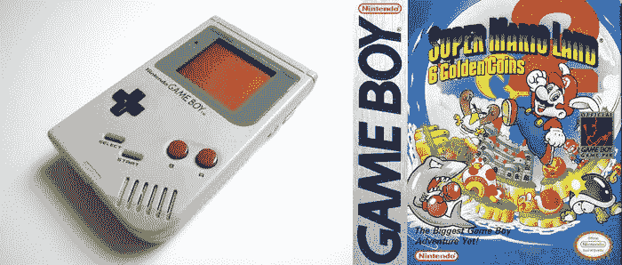
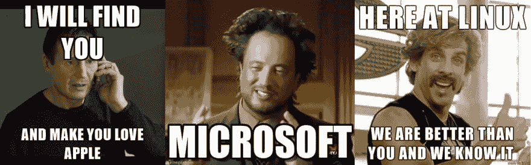

# 关于我

> 原文：<https://dev.to/chicio/about-me-1eid>

是我，费比诺·杜罗尼。一个真正热爱自己工作的软件开发人员。计算机图形爱好者。等等，又一个博客？是的，你说得对，可能会很无聊。我希望这不会是
我的案子。

你好！我是费比诺·杜罗尼。我和我的家人、我的女朋友 Chiara 以及很多电脑住在意大利的科莫。我从 7 岁开始喜欢上科技，那年圣诞节，我收到了我的第一个
[游戏机](https://en.wikipedia.org/wiki/Game_Boy)。我还记得我玩
到[超级马里奥大陆 2](https://en.wikipedia.org/wiki/Super_Mario_Land_2:_6_Golden_Coins) 的第一天。真是
惊人。

我带着另一台游戏机[任天堂 NES](https://en.wikipedia.org/wiki/Nintendo_Entertainment_System) 继续我的旅程。
澄清一下(如果你还不明白的话)，电子游戏是主要爱好之一。在前两款任天堂游戏机之后，
我成为了 Playstation 的粉丝，我买了索尼自 1995 年发布以来的每一款游戏机。我 10 岁的时候买了我的第一台电脑。它配备了 AMD K5(没有英特尔奔腾？！！！😮)处理器和 64 MB 内存。我记得用它做的第一次实验，每天发现计算机科学的新事物是多么有趣。

我从 14 岁开始学习编程。我在高中
开始学习 Pascal，然后在我的学士学位期间继续学习 C、Java、PHP 。2009 年，我爱上了苹果📱(什么？？！！！！😆)，而我是 2010 年开始开发 iOS 应用的。因此，你可以理解为什么我会爱上斯威夫特和目标。这也是我开始关于苹果和微软哪个更好的内部斗争的时候，当然，不要忘记 Linux(我不认为这种内部斗争将永远不会结束😅).

2013 年，我开始攻读硕士学位，在那里我学习了计算机图形学，这是我最喜欢的计算机科学领域。
这就是为什么我也爱上了 **C++** 。我还知道 **Javascript** 和 **TypeScript** 。

如果你想看我计算机科学之旅的其他细节，请看我的[主页](https://www.fabrizioduroni.it)。我认为自己是一名经验丰富的开发人员。我非常喜欢我的工作。我认为这是每天挑战自我的一种方式，也让我有机会接触许多非常聪明的人。

### **对了，Chicio 是什么意思？**

从我记事起，奇乔就是我的昵称。大家都习惯这样叫我。有时候我觉得这是我的
真名。它的起源将保持未知(对你来说)...😜)，但是我真的很喜欢。

### **你为什么要开博客？**

只是出于自私的原因。主要是因为我想记录我在编程、计算机图形学以及与计算机科学相关的所有方面的进展。就是这样。

### **博客名称附近的 logo 图像是什么？**

这是草帽星系的图像。你可以在 Robert c . Martin“Bob 叔叔”的[Clean Code:A Handbook of Agile Software crafts](https://cleancoders.com)
的封面上找到这个星系
的图像。当我开始写这个博客的时候，我已经深入到了干净代码的世界，我想我也会就这个话题谈很多。

### **计算机科学之后还有东西吗？**

显然 Chiara，我生命中最重要的人💘。

曾经有一段时间，我是一块巨大的金属🤘和摇滚音乐迷。我试着弹了几年低音吉他，但是我悲惨地失败了
(真的，这不是我的工作😁).事实上，我的皮肤上有“签名”(纹身！！)从那个时期开始。现在我享受着与音乐更“开放”的关系，没有太多的压力(但我最终希望在不久的将来再次开始在我的皮肤上留下一些签名😌).
我也非常喜欢骑自行车。我可以说我是某种运动员。

演示结束了，我希望你还没有感到厌烦。

享受阅读。

*原载于[https://www . fabrizioduroni . it](https://www.fabrizioduroni.it/2017/05/10/about-me.html)2017 年 5 月 10 日。*