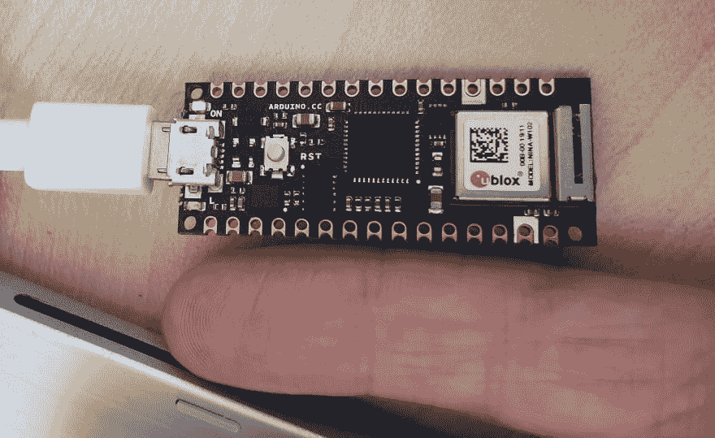
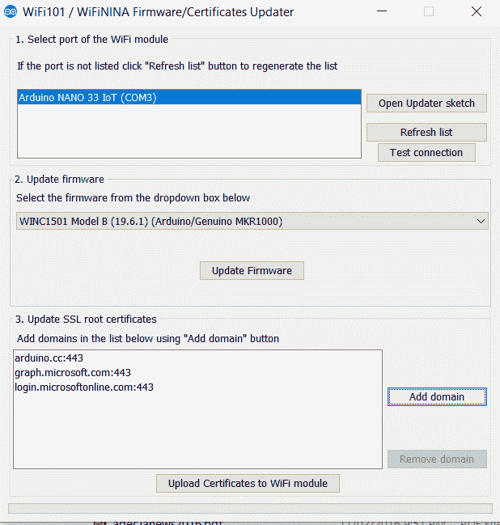

# 从新的 Arduino nano 33 IOT 直接访问 Microsoft Graph

> 原文：<https://dev.to/gscales/accessing-the-microsoft-graph-directly-from-the-new-arduino-nano-33-iot-g3o>

最近发布的 Arduino nano 33 IOT 是 Arduino 令人印象深刻的开源微控制器系列中的最新产品。这个小设备给我留下最深印象的是它的大小

[](https://res.cloudinary.com/practicaldev/image/fetch/s--rkbwlyEL--/c_limit%2Cf_auto%2Cfl_progressive%2Cq_auto%2Cw_880/https://gscales.github.img/DevTo/20190902_113107.jpg)

比你的小手指还小，但装有 wifi 和蓝牙，虽然这些东西在计算能力方面并不逊色于 Nix 驱动的单板计算机，如 Raspberry Pi 或新的 Azure Sphere 设备，但在简单性、可扩展性和成本方面很难击败这些东西。随着 AWS lamba、Azure Functions 和 Google Cloud Functions 等无服务器计算功能的巨大改进，您可以用最少的客户端代码创建一些非常酷的解决方案。然而，在本文中，我将探讨如何创建完全在本地运行的代码，从而不需要计算端(以及与此相关的成本和复杂性)。

**启动并运行您的设备**

1.  第一步是更新你的设备上的固件，用我最近带来的 Nano，发布固件中的错误会导致一系列问题和时间损失。但是一般来说，运行最新的固件会对你有好处。
2.  更新设备上的根证书，因为默认情况下 Arduino 只安装了一小部分根证书，您需要安装到 Microsoft Graph 和 Azure OAuth 登录端点所需的根证书。这里有一篇关于如何做到这一点的好文章[https://www.arduino.cc/en/Tutorial/FirmwareUpdater](https://www.arduino.cc/en/Tutorial/FirmwareUpdater)，你应该使用下面的配置来确保你得到所有的证书
3.  一旦你完成了，你所需要的就是你的 wifi 用户名和密码以及一些 Office365 证书。

## 一言以蔽之

与我在这里使用的方法相比，使用服务器或无服务器计算方法的一大优势是，您不再需要在设备上存储凭据(基本上是纯文本),这些凭据可以很容易地从设备上拆卸下来。因此，在创建一个与你正在做的任务相关的账户时，一定要小心。

## 使用的库

Arduino IDE 有一个非常丰富的库生态系统，使得编码变得不那么繁重。我在图表项目中使用的是

1.  ArduinoHttpClient -用于发出所有的 HTTP 请求
2.  ArduinoJson——用于解析 Json 响应，由于设备的内存量有限，最大的挑战是解析响应的有效载荷，但是这个库有一些好的方法来处理严格的内存限制。##身份验证 Arduino 连接到 Wifi 后需要做的第一件事是向 Azure 进行身份验证，并获取可用于访问 Microsoft Graph 的 AccessToken。在这个例子中，我为 Azure 使用了 username@password 授权，这意味着 Auth 基本上只是一个 Post 请求。然而，在您提出请求之前，您需要在 Azure 中创建一个应用程序，例如 https://docs . Microsoft . com/en-us/Azure/active-directory/develop/quick start-register-app(它将为您提供一个 ClientId)，并且该应用程序需要得到您的租户(或至少是您使用的用户)的同意，然后授予 Microsoft Graph 您想要做的事情的权限。例如，如果你发送电子邮件，给它 SendMail 授权等，见[https://docs . Microsoft . com/en-us/azure/active-directory/develop/v2-permissions-and-consent](https://docs.microsoft.com/en-us/azure/active-directory/develop/v2-permissions-and-consent)。##访问 Microsoft Graph

一旦你有了一个访问图函数的访问权标，你只需要做一个 REST Get，POST 或 PATCH(取决于你想做什么),然后发送权标就可以了，比如下面展示了一个简单的 REST GET 来检索图配置文件，其中包含电话号码和显示名称等

```
 String GetRequest(String AccessToken) {
  HttpClient httpClient(wifiClient, "graph.microsoft.com", 443);
  httpClient.beginRequest();
  httpClient.get("/v1.0/me/");
  httpClient.sendHeader("Authorization", ("Bearer " + AccessToken));
  httpClient.endRequest();
  // read the status code and body of the response
  int statusCode = httpClient.responseStatusCode();
  String response = httpClient.responseBody();

  Serial.print("Status code: ");
  Serial.println(statusCode);
  Serial.print("Response: ");
  Serial.println(response);
} 
```

如果您想获得特定用户的信息，只需将第四行修改为

```
httpClient.get("/v1.0/users/gscales@domain.com/"); 
```

我在下面的 Git hub repo[https://github.com/gscales/MS-Graph-Arduino/](https://github.com/gscales/MS-Graph-Arduino/)中创建了 3 个例子，用于获取用户的 Microsoft Graph 配置文件，
发送电子邮件和创建日历约会。所有这些都使用 Arduino _ secrets[https://create . Arduino . cc/project hub/Arduino _ genu ino/store-your-sensitive-data-safely-when-sharing-a-sketch-e7d0f 0](https://create.arduino.cc/projecthub/Arduino_Genuino/store-your-sensitive-data-safely-when-sharing-a-sketch-e7d0f0)来存储 Wifi 用户名和密码的私人信息、office365 凭据和应用程序的 clientId。

**[例 1 获取用户简介](https://github.com/gscales/MS-Graph-Arduino/blob/master/MSGraph-Profile/MSGraph-Profile.ino)**

**[例 2 发送和邮件](https://github.com/gscales/MS-Graph-Arduino/blob/master/MSGraph-SendMail/MSGraph-SendMail.ino)**

**[例 3 创建预约](https://github.com/gscales/MS-Graph-Arduino/blob/master/MSGraph-CreateEvent/MSGraph-CreateEvent.ino)**