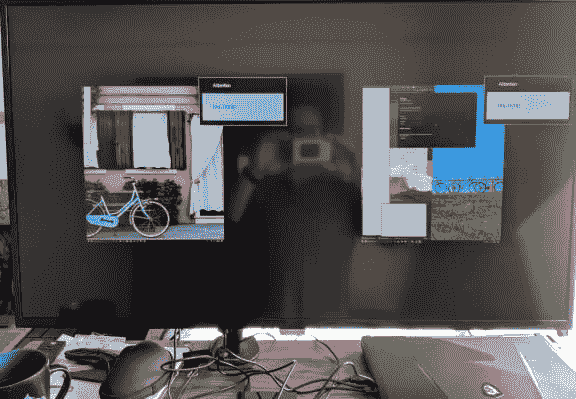
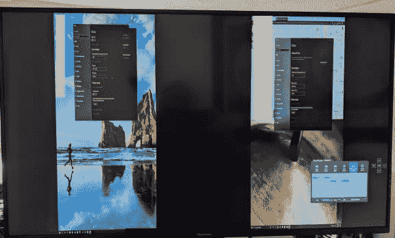
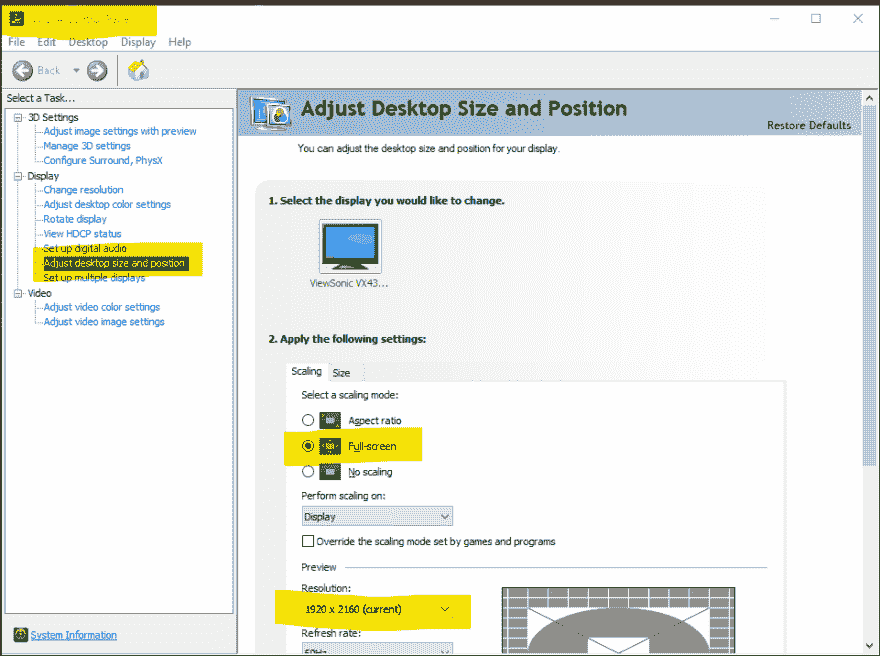
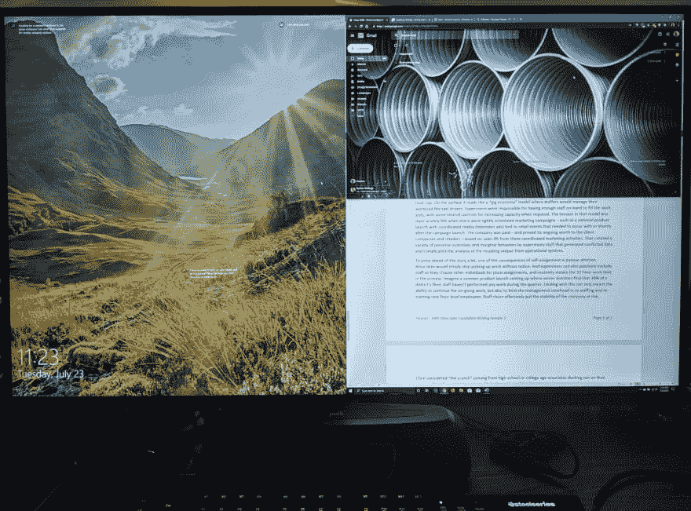

# 在 4K 实现全屏 PBP，一个人的旅程

> 原文：<https://dev.to/houstonhhaynes/achieving-full-screen-pbp-in-4k-one-person-s-journey-4akp>

# 理论 vs 实践

看起来很简单。使用 4K 显示器同时运行多个计算机屏幕。这个有几十个选择。逐图(PBP)是一个如此常见的功能，你几乎不会在描述中看到它的长形式。仅仅是首字母缩略词就足以推销这个概念。但是，并非所有的 PBP 设计和显示器驱动程序都是相同的。虽然指出某些供应商很有诱惑力，但驱动程序实现(以及显示器硬件技术的各代)的半衰期如此之短，以至于当您阅读本文时，它可能已经过时了。因此，如果您正在考虑在一个显示器上运行多个系统，请考虑这一点。

## 更大(更宽)并不总是更好

这段旅程始于我的 55 英寸 4K 电视，在家里工作时偶尔会用到它。在视频和幻灯片/白板演示的小组工作会议期间，它主要充当白板的代理。最终，我开始更广泛地使用它，但是对于详细的编码工作，它造成了太多的视觉疲劳。这是上一代 4K 电视，并不是为远距离观看而设计的。因此，当我开始全职远程工作时，我寻找了一款专用的 4K 显示器。我还希望它能同时处理多个输入，这样我就可以跨多个系统工作。在研究过程中，我很快就放弃了超宽曲面显示器的想法。我不想以 120fps 的速度击碎虚拟敌人。我计划的工作更侧重于使用我的系统 GPU 进行小规模 TensorFlow 实验。事实上，我早期的一个用例是设置我的个人机器进行各种机器学习基准测试(在 Windows 10 和 Ubuntu 中)，而工作笔记本则处理一般的办公和轻型开发任务。因此，用例相当简单明了，至少我是这样认为的。

## 阅读小字

这是我买的第一台 4K 显示器的照片，下面是我对 PBP 的初次尝试。

不用说，这根本不是我所期待的。我尝试了所有显示属性的组合，从 1:1 到全幅，没有任何效果。我联系了制造商的技术支持团队，几天后我收到了一个相当简短的回复。

> *请确保您运行的是 HDMI 2.0 3840x2160@60hz，翻到用户手册第 10 页，PBP 的顶部和底部会有横条。*

[cue sad trombone]

因此，实际上客户必须使用他们的精神力量来知道深入 10 页的手册有一个但书，说*全屏 PBP **是不可能的*** 。那一刻，我意识到我没有买显示器。我买了一个 600 美元的回旋镖。至少产品退货流程运行得很完美，所以**的那个**功能完全实现了。

## 取两个，这个时候用感觉

第二台显示器更轻，耗电更少，几乎不会灼伤屏幕，而且比我的首选便宜了近 100 美元。所以我觉得自己在很多方面都很幸运。然而，第二次 PBP 结果并不比第一次好多少。

当全屏运行时，图像缩放到显示区域的最大高度，仍然会出现文字框。

所以我给第二家制造商的技术支持小组发了一条消息。虽然这个团队更有礼貌，但最初的反应并不那么有帮助。他们所有的建议只是简单地重复了我已经尝试过的设置组合，没有正面的结果。我们甚至进行了一次电话会议，以确保我们在设置和输出上是对等的。它一直困扰着我，这不是制造商已经解决的问题。两个独立的显示器输入并行运行 1920X2160 似乎(至少对我来说)是能够同时处理多个输入的 4K 显示器的标准用例。但是我只能在 3840X2160 的分辨率下在两个输入之间单独切换——使用后面板监视器控件在它们之间切换。事实上，这是一个很好的“问题”。

## (其他)发动机罩下检查

一周后，我收到了第二个技术支持团队的电子邮件，通过电话联系，尝试另一种可能的解决方案。我并不抱什么希望，但一旦我们开始讨论这个问题，我就明白了这个想法:电脑的视频驱动程序可能会按照 16:9 的纵横比来调整输出。

一旦我们检查了 NVidia 控制面板，我们看到它被设置为将选择的分辨率格式化为“纵横比”。这实际上意味着，当分辨率设置为非 16:9 分辨率时，驱动程序会对显示器的输出进行字母装箱。一旦设置变成了“全屏”，一切就水落石出了。

这就是——两个独立的系统填充了屏幕的左右两边，每个都有自己的上/下窗口排列。对于 43 英寸的屏幕，每边可以提供两个 21 英寸的 1080p 区域。并且可以设置上下 PBP，所以 3840X1080 也是可以的。但是在确认了这也像预期的那样起作用后，我又回到了左右排列。这是光荣的。

[cue angels singing]

我添加了一个 USB 开关来切换两个系统之间的外部键盘和鼠标。由于工作笔记本电脑连接到自己的 VNET，类似 Synergy 的软件解决方案不是一个选项。然而，物理“非 V KVM”工作得非常好，我在不到一天的时间里就适应了它。

## 大于其各部分之和

所以这是一堂分层的实物课。我真的很惊讶，两家不同的制造商*不知道如何解决这个问题。在计算世界中，如此多的消费级硬件都是即插即用的，这是一件令人惊讶的高摩擦事件。我很高兴这个问题最终得到了解决，但是这表明你不能指望所有领域的知识都在一个地方。这也是我在这里留下痕迹的原因之一。我想知道在第一台显示器上尝试 NVidia 控制面板设置是否会有效。但是考虑到模型*也*有潜在的屏幕烧伤问题(**怎么**那些设计*还是*一个东西？)不管怎样，我都会还回去的。*

最终结果比我预期的好得多，提供了跨两台本地机器管理工作负载的灵活性。它还为我提供了更多附加到虚拟机的选项——无论是 AWS 中由 GPU 提供的 ami 还是 Azure 中的数据科学虚拟机。我基本上可以运行一个“四方”设置，其中第三个和第四个“盒子”是在云中执行全负荷工作负载的机器学习实例，负责为我桌子下面的两个平板上的那些会话运行虚拟桌面。但是这是一个我会留到以后讨论的话题。目前，我很高兴能够在家庭办公室中实现真正的多任务处理。