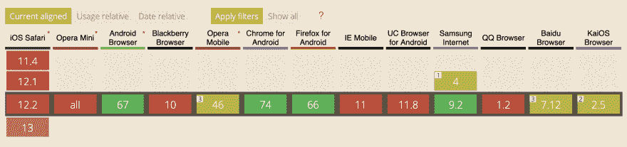

# 使用服务工作者的自适应媒体服务

> 原文：<https://dev.to/magarcia/adaptive-media-serving-using-service-workers-1ok2>

*与**[@埃斯特马蒂](https://github.com/estermv)*** 配对

每个人都经历过如何通过慢速网络连接访问一个网站，通常需要很长时间才能加载，使体验非常痛苦或完全不可能。

当谈到 web 开发时，我们通常倾向于忘记负载性能，而更多地关注于添加新的功能。但很可能我们的用户并没有使用最后一台连接到 1Gps 网络的全新 MacBook Pro。更有可能的是，他们使用的是中档或低端移动设备，其网络连接最好的情况是 3G 连接。

> [2018 年，全球所有网页的 52.2%被提供给手机。](https://www.statista.com/statistics/241462/global-mobile-phone-website-traffic-share/)

因此，关注性能非常重要，而最消耗资源的是媒体交付。我们将展示如何使用[网络信息 API](http://wicg.github.io/netinfo/) 基于网络连接调整媒体
传送。这是我和我的同事 [@Eduardo Aquiles](https://twitter.com/eduaquiles) 作为 React 组件做的一个实验的改进版本，类似于[Max bck](https://mxb.dev/)在他关于[连接感知组件](https://mxb.dev/blog/connection-aware-components/)的文章中解释的内容，但是在这种情况下，使用服务工作者。

## 网络信息 API

网络信息 API 是一个规范草案，它向 JavaScript 提供了一个接口，其中包含有关设备连接的信息。

该接口由一组不同的属性组成，为我们提供了关于网络的多种信息。本文中与我们最相关的是:

*   **类型:**用户代理正在使用的[连接类型](http://wicg.github.io/netinfo/#dfn-connection-type)。(例如“wifi”、“蜂窝”、“以太网”等。)
*   **有效类型**使用最近观察到的 [rtt](http://wicg.github.io/netinfo/#dom-networkinformation-rtt) 和[下行链路](http://wicg.github.io/netinfo/#dom-networkinformation-downlink)值的组合确定的[有效连接类型](http://wicg.github.io/netinfo/#dfn-effective-connection-type)。( *[见表](#effectivetype-values)* )
*   **保存数据**指示用户何时请求减少数据使用。

### effectiveType 值

Table of [effective connection types (ECT)](http://wicg.github.io/netinfo/#dfn-effective-connection-type)

| 电惊厥疗法 | 最小 RTT(毫秒) | 最大下行链路(Kbps) | 说明 |
| --- | --- | --- | --- |
| 慢速 2g | Two thousand | Fifty | 该网络仅适用于小型传输，如纯文本页面。 |
| 2g | One thousand four hundred | Seventy | 该网络适合传输小图像。 |
| 3g | Two hundred and seventy | Seven hundred | 该网络适合传输大型资产，如高分辨率图像、音频和标清视频。 |
| 第四代移动通信技术 | Zero | ∞ | 该网络适用于高清视频、实时视频等。 |

### 浏览器支持

该 API 还没有完全的浏览器支持，但是被最流行的移动浏览器
所支持，这是该技术将会产生更大影响的地方。

[](https://res.cloudinary.com/practicaldev/image/fetch/s--bfpgCR4H--/c_limit%2Cf_auto%2Cfl_progressive%2Cq_auto%2Cw_880/https://thepracticaldev.s3.amazonaws.com/i/p70qnco3xhwvy8o2ar40.png)

事实上，70%的移动用户在他们的设备上启用了这个 API。

## 自适应媒体服务

我们的目的是根据从`effectiveType`属性中获得的信息提供不同的媒体资源。当我们谈论不同的媒体资源时，它可能是完全不同的媒体，如在高清视频、高清图像或低质量图像之间切换，这是由[艾迪·奥斯马尼](https://addyosmani.com/blog/adaptive-serving/)提出的方法。

在本例中，我们将对同一幅图像使用不同的压缩级别。

首先，我们需要根据网络条件获得合适的质量。使用下一个代码片段:
很容易实现这一点

```
function getMediaQuality() {
  const connection = navigator.connection || navigator.mozConnection || navigator.webkitConnection;

  if (!connection) {
    return 'medium';
  }

  switch (connection.effectiveType) {
    case 'slow-2g':
    case '2g':
      return 'low';
    case '3g':
      return 'medium';
    case '4g':
      return 'high';
    default:
      return 'low';
  }
} 
```

想象一下，我们有一个图像服务器，在那里我们可以用查询参数**质量**作为`low`、`medium`或`high`来指定我们想要的图像质量。因此，我们可以在图像标签的`src`属性上设置质量，如下所示:

```
 
```

```
const images = document.querySelectorAll('img');
images.forEach(img => {
  img.src = img.src.replace('low', getMediaQuality());
}); 
```

需要注意的是，图像的默认质量设置是`low`，这意味着设备将首先加载低质量的图像，然后如果有高速连接，将加载质量较好的图像。

然后，上面的 JavaScript 代码片段将获取文档中的所有图像，并根据`getMediaQuality`函数返回的内容将质量参数替换为合适的参数。如果质量是`low`就不会做更多的请求，但是如果它改变了，它会做两个请求:一个是在浏览器解析`img`标签时使用`low`质量的图像，另一个是在 JavaScript 代码执行时使用`medium`或`high`质量的图像。

这并不理想，但它将改善低速网络的加载时间。但是对于中/高连接网络，正如我们之前提到的，它将对每个图像发出两个请求，消耗比所需更多的数据。

## 使用服务人员

提到的关于两个请求的问题可以通过使用
[服务人员](https://developers.google.com/web/fundamentals/primers/service-workers/)来解决，拦截浏览器发出的请求并用合适的图像质量替换它。

首先，我们需要注册我们的服务人员:

```
if ('serviceWorker' in navigator) {
  window.addEventListener('load', function() {
    navigator.serviceWorker.register('/sw.js').then(
      function(registration) {
        console.log('ServiceWorker registration successful with scope: ', registration.scope);
      },
      function(err) {
        console.log('ServiceWorker registration failed: ', err);
      }
    );
  });
} 
```

接下来，我们为 fetch 事件添加一个监听器，对于从站点请求的所有图像，它将使用上一节中创建的`getMediaQuality`函数附加正确的质量参数。

```
self.addEventListener('fetch', function(event) {
  if (/\.jpg$|.png$|.webp$/.test(event.request.url)) {
    const url = event.request.url + `?quality=${getMediaQuality()}`;
    event.respondWith(fetch(url));
  }
}); 
```

我们不再需要在`img`标签上指定质量参数，因为服务人员会负责这项工作。

```
 
```

## 代码

你可以在 GitHub repo 的[上找到这篇文章的代码(更完整，更干净，bug 更少)。](https://github.com/estermv/adaptative-media-serving)

## 进一步阅读

*   [网络信息 API](http://wicg.github.io/netinfo/)
*   [网络信息 API-Web API | MDN](https://developer.mozilla.org/en-US/docs/Web/API/Network_Information_API)

* * *

*最初发布于[https://magarcia . io](https://magarcia.io/2019/06/17/adaptative-media-serving-using-service-workers/)2019 年 6 月 17 日。*