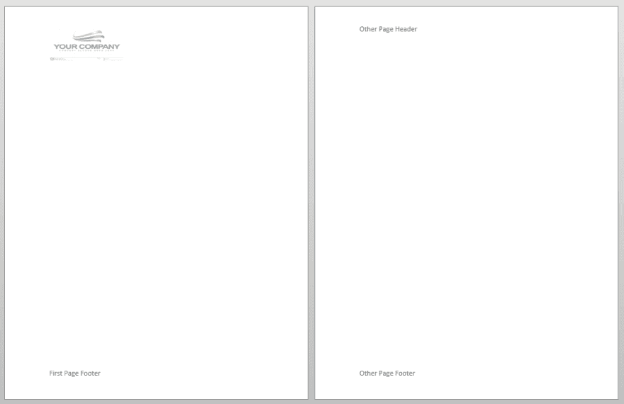

# 在 Java 中给 Word 文档添加页眉和页脚

> 原文：<https://dev.to/eiceblue/add-headers-and-footers-to-word-document-in-java-dah>

页眉和页脚对于在 Word 文档中添加页码、公司名称和徽标等相关信息非常有用。在本文中，我们将介绍如何使用 [Free Spire 在 Java 中给 Word 文档添加页眉和页脚。Java API 的文档](https://www.e-iceblue.com/Introduce/free-doc-for-java.html)。

在下面的例子中，我们将看到如何使用 free Spire 向 Word 文档添加不同类型的页眉和页脚。Java 文档:

添加简单的页眉和页脚
添加不同的首页页眉和页脚
为奇数页和偶数页添加不同的页眉和页脚

## 1。添加简单的页眉和页脚

要在文档中添加页眉和页脚，首先，我们需要使用 getHeadersFooters 方法获取该节中所有页眉和页脚的集合，然后使用 getHeader 或 getFooter 方法返回简单的页眉或页脚对象，接下来，我们可以在页眉或页脚中添加文本、图像或表格。

```
private static void addHeaderFooter(Section section){
    //Add header
    HeadersFooters headersFooters = section.getHeadersFooters();
    HeaderFooter header = headersFooters.getHeader();
    Paragraph headerParagraph = header.addParagraph();
    TextRange hText = headerParagraph.appendText("Page Header");
    //Set header text format
    hText.getCharacterFormat().setFontName("Calibri");
    hText.getCharacterFormat().setFontSize(15f);
    hText.getCharacterFormat().setTextColor(Color.blue);
    //Set header paragraph format
    headerParagraph.getFormat().setHorizontalAlignment(HorizontalAlignment.Left);
    //border
    headerParagraph.getFormat().getBorders().getBottom().setBorderType(BorderStyle.Thick_Thin_Small_Gap);
    headerParagraph.getFormat().getBorders().getBottom().setSpace(0.05f);
    headerParagraph.getFormat().getBorders().getBottom().setColor(Color.darkGray);

    //Add footer
    com.spire.doc.HeaderFooter footer = section.getHeadersFooters().getFooter();
    Paragraph footerParagraph = footer.addParagraph();
    //Insert page number
    footerParagraph.appendField("page number", FieldType.Field_Page);
    footerParagraph.appendText(" of ");
    footerParagraph.appendField("number of pages", FieldType.Field_Num_Pages);
    footerParagraph.getFormat().setHorizontalAlignment(HorizontalAlignment.Center);
    //Border
    footerParagraph.getFormat().getBorders().getTop().setBorderType(BorderStyle.Thick_Thin_Small_Gap);
    footerParagraph.getFormat().getBorders().getTop().setSpace(0.05f);
} 
```

[](https://res.cloudinary.com/practicaldev/image/fetch/s--rEcEIb2C--/c_limit%2Cf_auto%2Cfl_progressive%2Cq_auto%2Cw_880/https://thepracticaldev.s3.amazonaws.com/i/pe7qr169jtuqkpdjvgie.png)

## 2。添加不同的首页页眉和页脚

我们可以使用带有 PageSetup 对象的 setDifferentFirstPageHeaderFooter 方法来指定第一页的页眉/页脚是否与其他页面不同。

```
private static void addDifferentFirstPageHeaderFooter(Section section){
    //Specify different headers and footers for the first page
    section.getPageSetup().setDifferentFirstPageHeaderFooter(true);

    //First page header
    Paragraph headerParagraph1 = section.getHeadersFooters().getFirstPageHeader().addParagraph();
    headerParagraph1.getFormat().setHorizontalAlignment(HorizontalAlignment.Left);
    //Header image
    DocPicture headerImage = headerParagraph1.appendPicture("C:\\Users\\Administrator\\Desktop\\PIC\\th.jpg");
    headerImage.setWidth(150f);
    headerImage.setHeight(75f);

    //First page footer
    Paragraph footerParagraph1 = section.getHeadersFooters().getFirstPageFooter().addParagraph();
    footerParagraph1.getFormat().setHorizontalAlignment(HorizontalAlignment.Left);
    TextRange fText = footerParagraph1.appendText("First Page Footer");
    fText.getCharacterFormat().setFontSize(15f);

    //Header for other pages
    Paragraph headerParagraph2 = section.getHeadersFooters().getHeader().addParagraph();
    headerParagraph2.getFormat().setHorizontalAlignment(HorizontalAlignment.Left);
    TextRange hText = headerParagraph2.appendText("Other Page Header");
    hText.getCharacterFormat().setFontSize(15f);

    //Footer for other pages
    Paragraph footerParagraph2 = section.getHeadersFooters().getFooter().addParagraph();
    footerParagraph2.getFormat().setHorizontalAlignment(HorizontalAlignment.Left);
    fText = footerParagraph2.appendText("Other Page Footer");
    fText.getCharacterFormat().setFontSize(15f);
} 
```

[](https://res.cloudinary.com/practicaldev/image/fetch/s--rmPFcBY0--/c_limit%2Cf_auto%2Cfl_progressive%2Cq_auto%2Cw_880/https://thepracticaldev.s3.amazonaws.com/i/x1lihu900c906m0ma7c5.png)

## 3。为奇数页和偶数页添加不同的页眉和页脚

我们可以使用带有 PageSetup 对象的 setDifferentOddAndEvenPagesHeaderFooter 方法为奇数页和偶数页指定不同的页眉/页脚。

```
private static void addOddAndEvenPagesHeaderAndFooter(Section section){
    //Specify different headers and footers for odd and even pages
    section.getPageSetup().setDifferentOddAndEvenPagesHeaderFooter(true);

    //Odd page header
    Paragraph oddHeader = section.getHeadersFooters().getOddHeader().addParagraph();
    oddHeader.getFormat().setHorizontalAlignment(HorizontalAlignment.Left);
    TextRange oHText = oddHeader.appendText("Odd Page Header");
    //Set header text format
    oHText.getCharacterFormat().setFontName("Calibri");
    oHText.getCharacterFormat().setFontSize(15f);
    oHText.getCharacterFormat().setTextColor(Color.blue);

    //Odd page footer
    Paragraph oddFooter = section.getHeadersFooters().getOddFooter().addParagraph();
    oddFooter.getFormat().setHorizontalAlignment(HorizontalAlignment.Left);
    TextRange oFText = oddFooter.appendText("Odd Page Footer");
    oFText.getCharacterFormat().setFontName("Calibri");
    oFText.getCharacterFormat().setFontSize(15f);
    oFText.getCharacterFormat().setTextColor(Color.blue);

    //Even page header
    Paragraph evenHeader = section.getHeadersFooters().getEvenHeader().addParagraph();
    evenHeader.getFormat().setHorizontalAlignment(HorizontalAlignment.Left);
    TextRange eHText = evenHeader.appendText("Even Page Header");
    eHText.getCharacterFormat().setFontName("Calibri");
    eHText.getCharacterFormat().setFontSize(15f);
    eHText.getCharacterFormat().setTextColor(Color.green);

    //Even page footer
    Paragraph evenFooter = section.getHeadersFooters().getEvenFooter().addParagraph();
    evenFooter.getFormat().setHorizontalAlignment(HorizontalAlignment.Left);
    TextRange eFText = evenFooter.appendText("Even Page Footer");
    eFText.getCharacterFormat().setFontName("Calibri");
    eFText.getCharacterFormat().setFontSize(15f);
    eFText.getCharacterFormat().setTextColor(Color.green);
} 
```

[](https://res.cloudinary.com/practicaldev/image/fetch/s--AIQgZTeO--/c_limit%2Cf_auto%2Cfl_progressive%2Cq_auto%2Cw_880/https://thepracticaldev.s3.amazonaws.com/i/en3qiemibh6xieqzgq1k.png)

## 更多信息

网址:[https://www.e-iceblue.com/](https://www.e-iceblue.com/)
T3】支持论坛:[免费尖塔。Java 文档](https://www.e-iceblue.com/forum/spire-doc-f6.html)