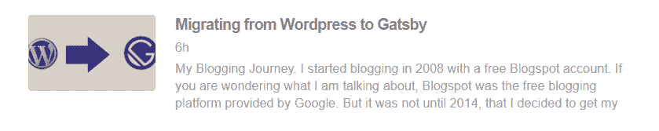

# 将带有图像的 RSS 源添加到 Gatsby 站点

> 原文：<https://dev.to/ankursheel/adding-an-rss-feed-with-images-to-a-gatsby-site-1ldk>

Gatsby 有一篇很好的[文章](https://www.gatsbyjs.org/docs/adding-an-rss-feed/)讲述了如何在你的 Gatsby 网站上添加 RSS 提要。虽然在大多数情况下这已经足够了，并且是一个很好的起点，但是它并不完全适合我。

*   我的帖子在["*/博客/* "](//www.ankursheel.com/blog/) 下，但页面在 ["www.ankursheel.com/"](//www.ankursheel.com) 下。
*   我正在使用 MDX，但该文档处理的是降价帖子。
*   它没有解释如何在列表视图中添加特色图片。

一旦我们有了盖茨比文章的基础，让我们开始修改选项。

## 获取数据

```
query  `  {  site  {  siteMetadata  {  siteUrl  }  }  allMdx(  limit:  1000  filter:  {  fileAbsolutePath:  {  regex:  "//content/posts//"  }  }  sort:  {  order:  DESC,  fields:  [frontmatter___date]  }  )  {  edges  {  node  {  excerpt(pruneLength:  140)  html  frontmatter  {  slug  title  date  featuredImage  {  publicURL  }  }  }  }  }  }  ` 
```

那我在这里做什么

*   ***第 3-7 行*** :我从站点元数据中获取 siteUrl。我们将需要这一点来建立帖子的 URL。
*   ***第 9 行*** :由于我所有的内容都在 MDX 文件中，而不是 markdown，所以我用 ***allMdx*** 。
    *   ***第 10 行*** :我限定为 1000 条记录。我猜这可能是一个小得多的值，但目前还可以。
    *   ***第 11 行*** :我想只为我的帖子构建提要，所以我添加了一个正则表达式，只获取那些出现在*“内容/帖子”*中的记录。
    *   ***第 12 行*** :我按照日期降序排列记录。
*   ***第 14-26 行*** :获取*摘录*和 *html* 。我还从 frontmatter 得到了 *slug* 、 *title* 、 *date* 和*特色图片 url* 。该摘录也被删减到最大长度为 140 个字符。

## 构建 feed 对象

文档规定每个提要必须包括*选项*、*查询*和*标题*。它还建议传递一个 serialize 函数来定制提要结构。这是最终的*提要*数组的样子

```
feeds: [
    {
        serialize: ({ query: { site, allMdx } }) => {
            const {
                siteMetadata: { siteUrl },
            } = site;

            return allMdx.edges.map(edge => {
                const {
                    node: {
                        frontmatter: { title, date, slug, featuredImage },
                        excerpt,
                        html,
                    },
                } = edge;

                const blogUrl = `${siteUrl}/blog/${slug}`;

                return Object.assign({}, edge.node.frontmatter, {
                    title,
                    description: excerpt,
                    date,
                    url: blogUrl,
                    guid: blogUrl,
                    enclosure: featuredImage && {
                        url: siteUrl + featuredImage.publicURL,
                    },
                    custom_elements: [{ 'content:encoded': html }],
                });
            });
        },

        output: '/blog/rss.xml',
        title: "Ankur Sheel's Ramblings",
    },
], 
```

让我们来分析一下

*   ***第 3 行*** :创建序列化函数，从查询对象中析构*站点*和 *allMdx* 。
*   ***第 4-6 行*** :从*站点*对象中析构*站点 Url* 。
*   ***第 8 行*** :循环遍历所有边，映射到一个 feed 项。
    *   ***第 9-15 行*** :析构*标题*，*日期*， *slug* ， *featuredImage* ，*摘录*和 *html* 。
    *   ***第 17 行*** :创建博文的 url。
    *   ***第 19 行*** :创建要返回的 feed 项。
    *   ***第 20-24 行*** :这里没发生什么奇特的事情。只是设置提要条目属性。
    *   ***第 25-27 行*** : ***圈地*** 是设置特色图片所需要的。它接受一个 URL，该 URL 被设置为特色图片的公共 URL。如果没有特色图像，则该外壳将是空的。
    *   ***第 28 行*** :设置内容为 HTML 内容。
*   ***第 33 行*** :设置 RSS 提要的路径和文件名。
*   ***第 34 行*** :设置 RSS 提要的标题。

## 结论

经过修改后，我博客的 RSS 提要现在看起来像 [](https://res.cloudinary.com/practicaldev/image/fetch/s--ECnDS9mW--/c_limit%2Cf_auto%2Cfl_progressive%2Cq_auto%2Cw_880/https://thepracticaldev.s3.amazonaws.com/i/k5y81qv4fqq2l5bgdurv.png)

你在你的 RSS 订阅中显示图片了吗？你是怎么做的？请在评论中告诉我。