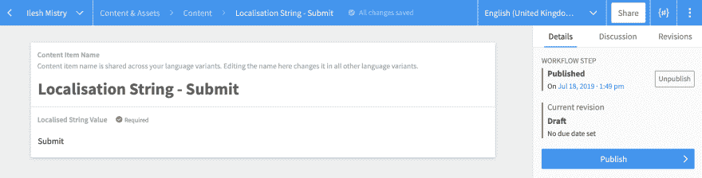
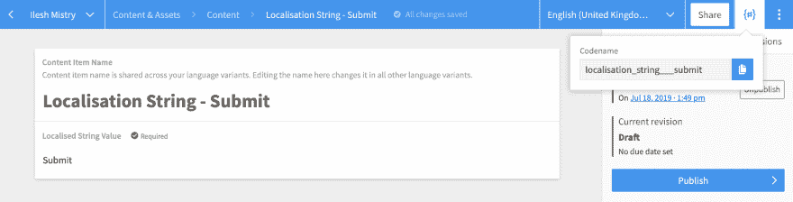
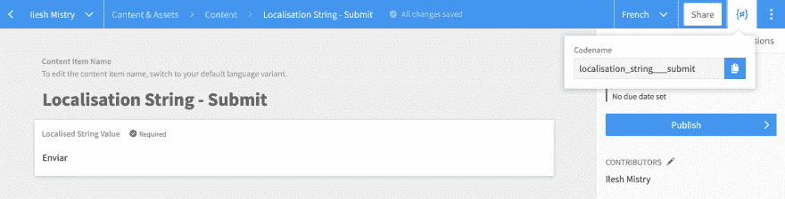
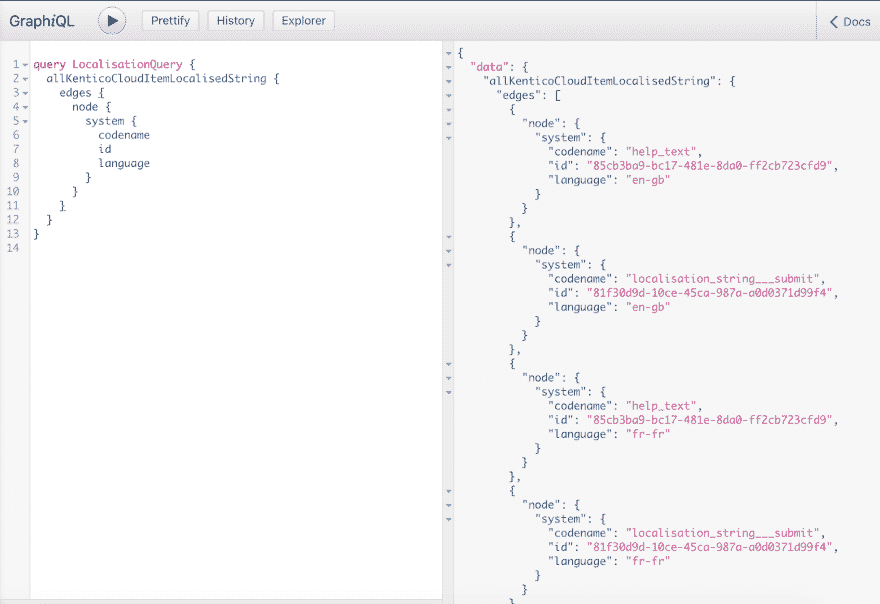
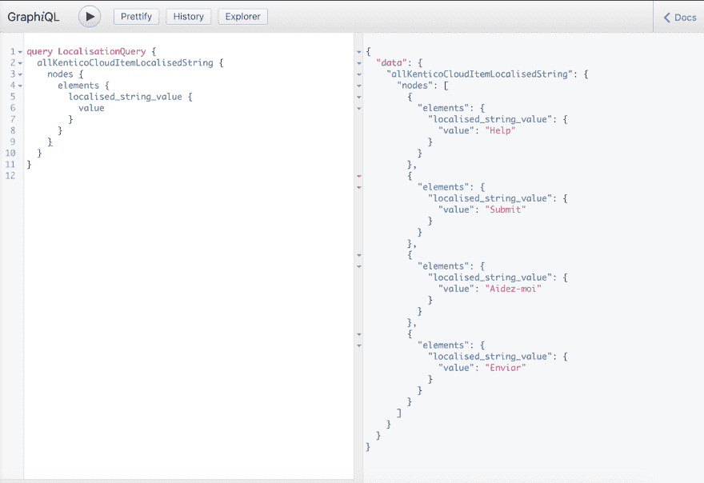
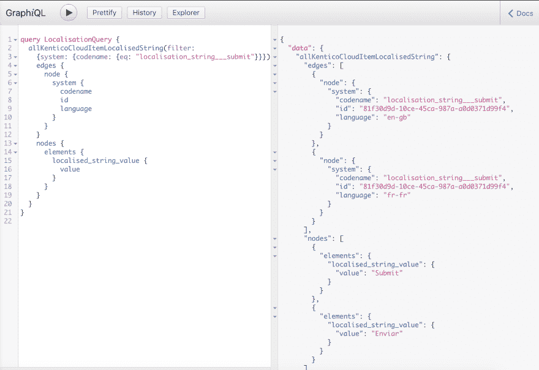
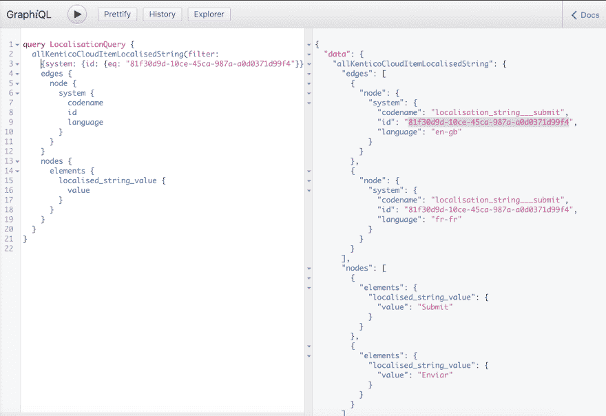

# 从 Kentico Cloud 向 GatsbyJS 和 GraphQL 添加和检索本地化字符串

> 原文：<https://dev.to/ileshmistry/adding-and-retrieving-localized-strings-from-kentico-cloud-to-gatsbyjs-and-graphql-3fed>

每个网站或应用程序都有文本元素，通常是静态的，很少改变——想想你的页眉或页脚中的项目(如版权文本)。对于许多网站来说，诱惑是简单地将它硬编码到主模板中。然而，当你把多语言网站或共享模板混合在一起时，这很快就变成了一个坏主意。将内容管理这些项目的能力交给编辑是必要的。

如果你熟悉像 [Kentico EMS](https://www.kentico.com/) 这样的内容管理系统，那么你将会遇到术语[资源字符串或本地化字符串](https://docs.kentico.com/k12sp/multilingual-websites/setting-up-a-multilingual-user-interface/working-with-resource-strings)。这些本地化的字符串取代了站点中的静态文本，是“键”和“值”对的组合。当需要时，CMS 使用“密钥”来检索您选择的文化或语言的“值”。这些本地化字符串的使用为编辑人员提供了所需的额外内容管理控制。

大多数 CMS 都提供了处理这些本地化字符串的方法。然而，对于“headless”，API 优先的 CMS，没有现成的特性，必须建立一个最佳实践。我将使用 [Kentico Cloud](https://kenticocloud.com/) ，这是一个 CaaS ( [内容即服务](https://en.wikipedia.org/wiki/Content_as_a_service))平台，它专注于内容优先的方法，为您提供创建、管理和分发内容的能力，而不必担心内容将如何以及在哪里显示。如果你需要了解更多关于 Kentico Cloud 以及如何开始使用它的信息，你可以通过我之前的帖子[开始使用 Kentico Cloud](https://www.ileshmistry.com/getting-started-with-kentico-cloud/) 来了解这个产品。

*免责声明–语言仅适用于某些 Kentico 云计划。对于本文中的方法，我假设已经在您选择的订阅计划中启用了文化！*

Kentico 云的灵活性意味着有许多方法可以实现相同的目标。经历过几次之后，我将带您逐步了解创建和检索本地化字符串的最佳实践方法。

## 识别你的语言

我们的第一步是确定如何从网站的前端识别文化或语言。由于 Kentico Cloud 纯粹是一个内容中心，所以它没有像 Kentico EMS 这样的产品所提供的本地化 web 部件和小部件。我们需要一种替代方式来获取这种文化代码。

这里有几个选择。您可以在您的站点或应用程序中使用简单的语言切换器控件。或者，它可以简单地从 URL 中导出，例如*[【www.mysite.com/en-gb/about-us】](http://www.mysite.com/en-gb/about-us)*或*[【www.mysite.com/about-us?lang=en-gb】](http://www.mysite.com/about-us?lang=en-gb)*。

无论采用哪种方法，一旦知道了文化代码，就可以获得所需文化的任何“键”和“值”对。

## 设置您的内容类型

如果您想查看如何构建本地化的字符串，第一步是查看您的[内容类型](https://docs.kenticocloud.com/tutorials/set-up-projects/define-content-models/creating-and-deleting-content-types)。您将创建一个本地化字符串内容项。

这里有一个从“*本地化字符串*内容类型派生的[内容项](https://docs.kenticocloud.com/tutorials/write-and-collaborate/write-content/adding-content-items)，它有一个“值”字段。

正如我前面提到的，本地化字符串在一对“键”和“值”中工作。Kentico Cloud 的好处在于,“密钥”是可以从内容项目的“代码名称”中获得的，这样可以省去您为其创建额外字段的麻烦。

您最有可能利用内容项的 id，但是拥有代码名称也很有用。

## 添加您的内容

设置好内容类型后，下一步是获取内容，确保您添加了所有语言的内容(我假设您已经在设置中设置了语言！).

*(如果您需要知道如何将内容从一种文化切换到另一种文化，请查看 Kentico Cloud 文档中的[切换语言](https://docs.kenticocloud.com/tutorials/write-and-collaborate/create-multilingual-content/switching-languages)部分。)*

此时要记住的一件事是，如果您想在目标文化中使用与您的原始文化相似的文本(或者只是给自己一个起点)，那么一旦切换到新的文化，您就可以使用[从语言](https://docs.kenticocloud.com/tutorials/write-and-collaborate/create-multilingual-content/translating-content-items#a-translating-a-content-item)复制选项。

## 使用 GatsbyJS 和 GraphQL 检索本地化内容

现在我们有了在 Kentico Cloud 中创建的本地化字符串内容类型和内容项，下一步是检索内容。我正在使用棒极了并且非常流行的静态站点生成器 [GatsbyJS](https://dev.to/) 和 [GraphQL](https://graphql.org/) ，一种用于 API 的查询语言。

*(给你的另一个假设...我们假设您已经为您的项目设置了 GatsbyJS + GraphQL。如果没有，你可以在这里找到一个起点， [GatsbyJS 来源于 Kentico Cloud](https://dev.to/docs/sourcing-from-kentico-cloud/) 。)*

有了 Kentico Cloud 中的内容项，您应该能够在执行 GraphQL 查询时看到它们。

下面是一个 GraphQL 查询示例，您将使用 GatsbyJS 从 Kentico Cloud 中检索内容项的 ID 和 CodeName。请将此视为检索“值”所需的“密钥”。您可以将“codename”和“id”作为潜在选项，在下面的 GraphQL 查询中使用。
[T3】](https://res.cloudinary.com/practicaldev/image/fetch/s--G1yKybqK--/c_limit%2Cf_auto%2Cfl_progressive%2Cq_auto%2Cw_880/https://assets-eu-01.kc-usercontent.com:443/17021868-aaab-01f5-57ef-cf27d8c987b3/a8f464a7-402a-4880-9dd6-ffe21ad7249b/GraphiQL-retrieve-lang-nodes.png)

您可以使用以下 GraphQL 查询检索所有本地化字符串。
[T3】](https://res.cloudinary.com/practicaldev/image/fetch/s--hOTr3l1S--/c_limit%2Cf_auto%2Cfl_progressive%2Cq_auto%2Cw_880/https://assets-eu-01.kc-usercontent.com:443/17021868-aaab-01f5-57ef-cf27d8c987b3/c7162d86-bf5e-4edc-8da5-0940926e2eb6/GraphiQL-retrieve-lang-variants.png)

然而，要检索实际的“值”，在 GraphQL 查询中还需要做一些事情。

这是一个 GraphQL 查询的例子，我使用了“CodeName”。
[T3】](https://res.cloudinary.com/practicaldev/image/fetch/s--BSBXg_22--/c_limit%2Cf_auto%2Cfl_progressive%2Cq_auto%2Cw_880/https://assets-eu-01.kc-usercontent.com:443/17021868-aaab-01f5-57ef-cf27d8c987b3/75f95cb4-8f3e-4751-ba15-cd63bd9d7f11/GraphiQL-retrieve-lang-variants-based-on-condition-codename.png)

这是一个 GraphQL 查询的例子，我使用了 ID。
[T3】](https://res.cloudinary.com/practicaldev/image/fetch/s--g5bMuFbD--/c_limit%2Cf_auto%2Cfl_progressive%2Cq_auto%2Cw_880/https://assets-eu-01.kc-usercontent.com:443/17021868-aaab-01f5-57ef-cf27d8c987b3/27bd7196-5aaa-49cf-a65b-b6981b65933e/GraphiQL-retrieve-lang-variants-based-on-condition-id.png)

正如您所看到的，一旦您知道您需要哪个“键”,那么就很容易获得“值”,还可以使用这个 GraphQL 查询格式检测您需要在 GatsbyJS 中检索的语言变量。

## 单独项目

在我们继续之前，评估一下您的本地化字符串内容项是很重要的。为每个项目创建文化版本不会增加内容项目的数量，所以你不太可能跳过计划。但是，本地化字符串内容项的数量是需要记住的。此外，考虑您订阅的环境/项目的数量，这可能会成倍增加您拥有的内容项的总数。

在创建内容模型时，我们总是提倡实用主义。此外，可以考虑将本地化字符串作为一个单独的项目来创建，并提供给所有需要使用它们的项目。这是一个已经在我们的几个项目中使用的解决方案，它确保所有本地化的字符串对所有项目和所有环境都可用，消除了更新的开销。

## 摘要-概述在 Kentico Cloud 中创建本地化内容的步骤

这里有很多需要考虑的地方，所以让我们回顾一下:

*   创建用于本地化字符串项的内容类型。
*   使用每个本地化字符串项的值添加适当的内容项。
*   为所创建的内容项创建相关的区域性替代项。
*   一旦知道了所需的区域性，就可以在 GraphQL 节点中查找需要显示的本地化字符串，并使用 filter 选项来帮助您返回特定的本地化字符串。
*   利用 GatsbyJS 布局/React 代码中的查询。
*   确保创建一个新项目来存放所有本地化的字符串。

就像 CaaS 领域的许多事情一样，有许多方法来处理任务。还有其他处理本地化的方法，但是，由于以前遇到过这种情况，我推荐这种方法。

本地化只是您在使用 CaaS 平台时将要面临的众多挑战之一。如果您正在与 Kentico Cloud 合作，并且面临着特殊的挑战，那么请联系 [Ilesh Mistry](//mailto:ilesh.m@mmtdigital.co.uk) 以了解我可以如何帮助您。

...

最初发布于[https://www.ileshmistry.com](https://www.ileshmistry.com/adding-and-retrieving-localised-strings-from-kentico-cloud-to-gatsbyjs-and-graphql/)