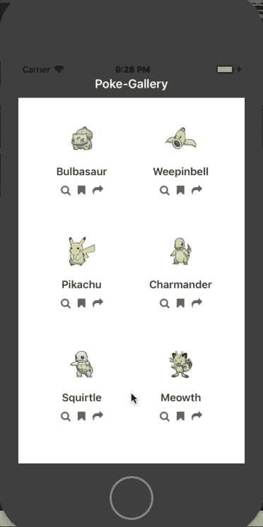
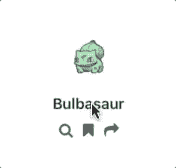
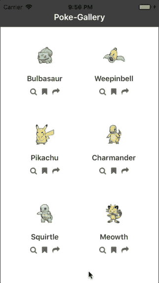
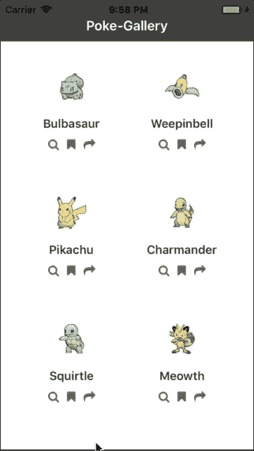
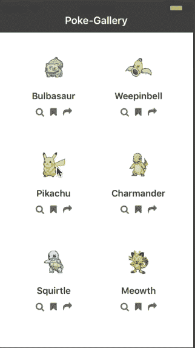

# 向 React 本地应用添加动画——第 1 部分:基本动画

> 原文：<https://dev.to/wernancheta/adding-animations-to-your-react-native-app-part-1-basic-animations-14ip>

动画是用户体验的重要组成部分，尤其是移动应用。当用户与应用程序中的 UI 元素交互时，动画为用户提供了清晰的反馈。动画通过动作的运用让应用变得生动。

每当应用程序需要执行长时间的操作时，可以使用动画来娱乐用户。同时，它还可以用来通知用户操作的状态。最重要的是，动画可以用来教用户如何与应用程序互动。这是通过在隐藏或显示 UI 元素时使用有意义的过渡来实现的。

在这个系列中，我们将看看如何在 React 本地应用中实现动画。在每一部分中，您将学到以下内容:

*   如何实现基本动画，如缩放，弹簧和变换。
*   当用户从一个页面导航到另一个页面时，如何实现过渡动画。
*   用户与 UI 元素交互时如何实现手势动画？

## 先决条件

为了学习本教程，您必须具备 React 和 React Native 的基础知识。本教程假设您具备以下概念的应用知识:

*   状态
*   裁判和道具
*   组件生命周期方法
*   基于类的功能组件

除此之外，您还应该熟悉 ES6 的一些特性。比如对象析构和扩展操作符。

我还假设您的计算机是为 React 本机开发设置的。如果你正在使用 [Expo](https://expo.io/) ，你也可以跟着做，因为本教程不需要使用任何本地模块。但是我会让您处理让应用程序运行所需的修改。

## 你将建造什么

在整个系列中，我们将只构建一个应用程序。我们将随着我们的进展添加上述动画。

在这个系列的第一部分，这里是最终输出的样子:

[](https://res.cloudinary.com/practicaldev/image/fetch/s--M0GTzmpN--/c_limit%2Cf_auto%2Cfl_progressive%2Cq_66%2Cw_880/https://d2mxuefqeaa7sj.cloudfront.net/s_E4AC20E49A0067C1947CB6DF434358FF2AEC2028FB0038226D770EAC1C5A6720_1529155782472_rn-animations-part1-demo.gif)

该应用程序将是一个口袋妖怪画廊应用程序，用户可以查看口袋妖怪的细节。该应用程序将有最少的功能，以保持动画的重点。

## 设置项目

为了让我们尽快进入动画部分，我已经建立了一个 [React 原生项目](https://github.com/anchetaWern/RNRealworldAnimations)，它拥有应用程序所需的所有屏幕和组件。您可以使用下面的命令克隆它:

```
git clone https://github.com/anchetaWern/RNRealworldAnimations.git 
```

repo 默认为包含整个系列最终输出的`master`分支。切换到`starter`分支，这样您就可以跟随系列的这一部分:

```
cd RNRealworldAnimations
git checkout starter 
```

切换后，安装所有需要的软件包:

```
npm install 
```

接下来，执行以下命令来添加`android`和`ios`目录:

```
react-native upgrade 
```

该项目使用 [React 原生矢量图标](https://github.com/oblador/react-native-vector-icons)，并且需要链接到原生项目，因此也要执行以下命令:

```
react-native link 
```

安装完成后，您应该能够在您的仿真器或设备上运行该应用程序:

```
react-native run-android
react-native run-ios 
```

## 缩放动画

我们要实现的第一种动画是比例动画，看起来像这样:

[](https://res.cloudinary.com/practicaldev/image/fetch/s--kSZI6wJR--/c_limit%2Cf_auto%2Cfl_progressive%2Cq_66%2Cw_880/https://d2mxuefqeaa7sj.cloudfront.net/s_E4AC20E49A0067C1947CB6DF434358FF2AEC2028FB0038226D770EAC1C5A6720_1529156972093_button-press-scale-animation.gif)

我们想要做的是，当用户按下卡片时，放大卡片的尺寸。一旦他们发布，我们就缩小规模。我们将要处理的组件是`Card`组件(`src/components/Card.js`)。

React Native 中的动画可以通过以下步骤实现:

1.  导入动画模块。
2.  声明一个动画值。
3.  指定动画值将如何随时间变化。
4.  设置动画样式并呈现组件的动画版本。
5.  开始播放动画。

第一步是导入动画模块。React Native 已经提供了一些模块，允许我们将动画添加到我们的应用程序中，并导入它们:

```
// src/components/Card.js
import {
  // previously imported modules
  Animated, // provides methods for animating components
  Easing // for implementing easing functions
} from "react-native"; 
```

接下来，声明一个动画值。在像`Card`组件这样的功能组件中，这可以在返回要呈现的组件之前完成:

```
const Card = ({
  // props destructuring
}) => {
  let scaleValue = new Animated.Value(0); // declare an animated value 
```

在上面的代码中，我们将动画值初始化为零。大多数时候，这是你想要做的。这是因为每个组件开始总是静态的，只有当用户与它交互或者它在前景中变得可见时，它们才会移动。这个动画值的更新允许我们移动组件，稍后你会看到。它与*状态*具有相同的概念，尽管动画值专门用于动画。

下一步是指定动画值如何随时间变化。所有的动画值都有一个`interpolate`方法，允许我们在动画开始后更新它的值。这个方法接受一个包含`inputRange`和`outputRange`属性的对象。每一个都有一个相互映射的数组值:

```
const cardScale = scaleValue.interpolate({
  inputRange: [0, 0.5, 1],
  outputRange: [1, 1.1, 1.2]
}); 
```

当我说“相互映射”时，我的意思是:

*   0 → 1
*   0.5 → 1.1
*   1 → 1.2

我们已经将动画值初始化为`0`。这是我们在`inputRange`中指定的值之一，对应的`outputRange`值是`1`。这里的`outputRange`指的是组件的比例因子。`1`表示它与原始大小相同，因为任何乘以 1 的整数总是等于它本身。

接下来，是`0.5`是到`1.1`。这意味着当动画达到一半时，我们希望缩放组件，使其比原始大小大 10%。当动画达到顶峰时，我们希望它能再大 20%。注意，我们只需要为输入和输出范围指定一个样本。动画库将自动计算出您指定的数字之间的任何内容。这可以确保动画尽可能流畅。

实现动画的下一步是设置动画样式并呈现组件的动画版本。你要做的就是把`<View style={styles.card}>`换成`<Animated.View style={transformStyle}>`。所以你实际上是用`Animated.View`包装了`Card`组件的全部内容。代码看起来是这样的:

```
let transformStyle = { ...styles.card, transform: [{ scale: cardScale }] };

return (
  <TouchableWithoutFeedback>
    <Animated.View style={transformStyle}>
      <Image source={item.pic} style={styles.thumbnail} />
      <Text style={styles.name}>{item.name}</Text>
      <View style={styles.icons}>
        <IconButton
          icon="search"
          onPress={() => {
            viewAction(item.name, item.full_pic);
          }}
          data={item}
        />
        <IconButton icon="bookmark" onPress={bookmarkAction} data={item} />
        <IconButton icon="share" onPress={shareAction} data={item} />
      </View>
    </Animated.View>
  </TouchableWithoutFeedback> ); 
```

在上面代码的第一行，我们创建了一个新的`style`对象，由卡片的默认样式(`styles.card`)和转换样式组成。如果你熟悉 CSS 动画，这应该对你有意义。但是如果没有，上面的代码使用 CSS `scale`转换声明来根据动画值的当前值缩放卡片的大小。

渲染动画组件时，应该使用动画版本。React Native 自带三个原始组件:`View`、`Text`、`Image`和`ScrollView`。要使用这些的动画版本，你所要做的就是在它们前面加上`Animated`，这样`View`就变成了`Animated.View`等等。

实现动画的最后一步是实际启动它。在起始代码中，`Card`组件正在使用`onPress`事件处理程序。是的，我们实际上可以从那里开始动画:

```
<TouchableWithoutFeedback
  onPress={() => {
    scaleValue.setValue(0);
    Animated.timing(scaleValue, {
      toValue: 1,
      duration: 250,
      easing: Easing.linear,
      useNativeDriver: true
    }).start();

    cardAction();
  }}
/> 
```

唯一的问题是，当用户按住组件时，上面的代码没有真正考虑到这一点。如果您尝试运行它，组件将简单地返回到它的原始大小，即使用户仍然按住它。

谢天谢地，`TouchableWithoutFeedback`组件已经附带了一个`onPressIn`和`onPressOut`和[事件处理程序](https://facebook.github.io/react-native/docs/touchablewithoutfeedback.html#onpressin)。这使我们能够捕捉到用户何时按下按钮或者何时已经松开按钮:

```
<TouchableWithoutFeedback
  onPressIn={() => {
    scaleValue.setValue(0);
    Animated.timing(scaleValue, {
      toValue: 1,
      duration: 250,
      easing: Easing.linear,
      useNativeDriver: true
    }).start();

    cardAction();
  }}
  onPressOut={() => {
    Animated.timing(scaleValue, {
      toValue: 0,
      duration: 100,
      easing: Easing.linear,
      useNativeDriver: true
    }).start();
  }}
> 
```

分解上面的代码，首先，我们浏览一下`onPressIn`方法的主体。首先，我们将动画值设置为`0`。这有效地重置了每次用户启动时的动画:

```
scaleValue.setValue(0); 
```

接下来，我们通过使用`timing`动画来开始动画。这允许我们在特定时间段内更新动画值。此方法接受两个参数:一个动画值和一个包含动画设置的对象。

在下面的代码中，我们告诉它在`250`毫秒内将动画值更新为`1`，它将使用`linear`缓动函数:

```
Animated.timing(scaleValue, {
  toValue: 1, // update the animated value to
  duration: 250, // how long the animation will take in milliseconds
  easing: Easing.linear, // easing function to use (https://facebook.github.io/react-native/docs/easing.html)
  useNativeDriver: true // delegate all the animation related work to the native layer
}).start(); // start the animation 
```

当用户释放组件时，我们所要做的就是在一段特定的时间内将动画值恢复到初始值。这通过缩小组件的大小来有效地反转动画:

```
onPressOut={() => {
  Animated.timing(scaleValue, {
    toValue: 0, // reset the animated value to 0
    duration: 100, // animate over 100ms
    easing: Easing.linear,
    useNativeDriver: true
  }).start();
}} 
```

请注意，当您处理由用户控件触发的动画时，您希望使用尚未内置动画行为的 React 本机组件。以按钮为例，React Native 也有`Button`、`TouchableOpacity`和`TouchableNativeFeedback`组件。这些都非常相似，但是当用户与它们交互时，它们都有内置的动画行为。这就是为什么我们使用`TouchableWithoutFeedback`来完全控制动画，而不需要覆盖内置行为。

## 旋转动画

下一种类型的动画是旋转动画，看起来像这样:

[](https://res.cloudinary.com/practicaldev/image/fetch/s--SKqcZ1TH--/c_limit%2Cf_auto%2Cfl_progressive%2Cq_66%2Cw_880/https://d2mxuefqeaa7sj.cloudfront.net/s_E4AC20E49A0067C1947CB6DF434358FF2AEC2028FB0038226D770EAC1C5A6720_1529157038546_button-press-rotate-animation.gif)

这里我们想在用户按下按钮时旋转按钮。它与前面的`Card`组件的缩放动画有相同的机制，唯一的区别是我们旋转组件而不是缩放它。

这一次，我们将使用`IconButton`组件(`src/components/IconButton.js`)。`IconButton`是一个基于类的组件，声明动画值的最佳位置是在`constructor`内部:

```
constructor(props) {
  super(props);
  this.rotateValue = new Animated.Value(0); // declare animated value
} 
```

在`render`方法中，我们指定动画值将如何变化。因为我们在做旋转动画，所以`outputRange`是不同的。这一次，我们使用一个字符串值来指定动画值将旋转的角度:

```
render() {
  const { icon, onPress, data } = this.props;

  let rotation = this.rotateValue.interpolate({
    inputRange: [0, 1],
    outputRange: ["0deg", "360deg"] // degree of rotation
  });
  // next: add transformStyle 
} 
```

接下来，声明旋转组件的样式:

```
let transformStyle = { transform: [{ rotate: rotation }] }; 
```

渲染组件:

```
<TouchableWithoutFeedback
  onPressIn={() => {
    Animated.timing(this.rotateValue, {
      toValue: 1,
      duration: 700,
      easing: Easing.linear
    }).start();
    onPress(data);
  }}
  onPressOut={() => {
    Animated.timing(this.rotateValue, {
      toValue: 0,
      duration: 350,
      easing: Easing.linear
    }).start();
  }}
>
  <Animated.View style={transformStyle}>
    <Icon name={icon} style={styles.icon} size={icon_size} color={icon_color} />
  </Animated.View> </TouchableWithoutFeedback> 
```

从上面的代码中可以看出，启动和停止动画的代码与缩放动画非常相似。当用户在上面交互时，我们向期望值移动，然后当用户释放时，我们反向移动。

另一件需要注意的事情是，我们并没有激活组件本身，而是激活了它的子组件(`Animated.View`)。注意，被动画化的组件并不总是需要成为被交互组件的子组件(`TouchableWithoutFeedback`)。它可以位于渲染树中的任何其他位置。只要您想要制作动画的组件当前正在被渲染(它不必是可见的)，您就可以制作它的动画。

## 春季动画

下一种类型的动画是弹簧动画，看起来像这样:

[](https://res.cloudinary.com/practicaldev/image/fetch/s--nHtb36Zr--/c_limit%2Cf_auto%2Cfl_progressive%2Cq_66%2Cw_880/https://d2mxuefqeaa7sj.cloudfront.net/s_E4AC20E49A0067C1947CB6DF434358FF2AEC2028FB0038226D770EAC1C5A6720_1529157484072_modal-spring-animation.gif)

这一次，我们将使用`AnimatedModal`组件(`src/components/AnimatedModal.js`)。目前，它还没有“动画”，所以让我们继续做吧。

与我们迄今为止使用的前两个组件不同，这个组件依赖于*状态。*如果打开`App.js`文件，当`isModalVisible`设置为`true`时模态打开:

```
viewAction = (pokemon, image) => {
  // ...
  this.setState({
    // ...
    isModalVisible: true
  });
}; 
```

然后在`AnimatedModal`的`render`方法内部，默认情况下，我们将它的`bottom`值设置为等于屏幕高度的负值。这有效地隐藏了组件。当`isModalVisible`设置为`true`时，`bottom`值更新为`0`。这将使组件返回到其原始位置:

```
import {
  /* previously imported modules here */
  Animated, // add this
  Easing // add this
} from "react-native";
const { height, width } = Dimensions.get("window");

type Props = {};
export default class AnimatedModal extends Component<Props> {
  render() {
    const { title, image, children, onClose } = this.props;
    let bottomStyle = this.props.visible ? { bottom: 0 } : { bottom: -height }; // show or hide the component from view
  }
} 
```

这是可行的，但是当组件隐藏或从视图中显示时，实际上没有动画发生。让我们继续解决这个问题:

```
constructor(props) {
  super(props);
  this.yTranslate = new Animated.Value(0); // declare animated value for controlling the vertical position of the modal
} 
```

在`render`方法中，指定动画开始后`bottom`值将如何变化。在这种情况下，我们希望动画值(`yTranslate`)在动画开始时是`0`。完成后它会变成一个特定的高度:

```
render() {
  const { title, image, children, onClose } = this.props;

  let negativeHeight = -height + 20;
  let modalMoveY = this.yTranslate.interpolate({
    inputRange: [0, 1],
    outputRange: [0, negativeHeight]
  });

  let translateStyle = { transform: [{ translateY: modalMoveY }] }; // translateY is the transform for moving objects vertically
  // next: render the component
} 
```

分解上面的代码，首先，一旦动画结束，我们需要确定最终的`bottom`值。这里，我们得到屏幕高度的负等值，并加上`20`:

```
let negativeHeight = -height + 20; 
```

但是为什么呢？如果您向下滚动到组件的样式声明，您会发现`bottom`值被设置为屏幕高度的负等值:

```
const styles = {
  container: {
    position: "absolute",
    height: height,
    width: width,
    bottom: -height, // look here
    backgroundColor: "#fff"
  }
  // ... other styles
}; 
```

因此，将组件的`Y`位置(垂直位置)转换为`-height`意味着它将抵消样式中声明的`bottom`值。请记住，当两个负值相减时，它们会相互抵消，因为减数(等式最右边的数字)会转换为正数，运算变成加法:

```
translateY = -1 - -1;
translateY = -1 + 1;
translateY = 0; 
```

这有效地将组件带回到其原始位置。我们添加的`20`是屏幕最上面部分的高度(显示电池、时间和信号的地方)。我们真的不想用模态来代替那些。

接下来，将`translateStyle`应用于组件:

```
return (
  <Animated.View style={[styles.container, translateStyle]}>
    <Header title={title}>
      <TouchableOpacity onPress={onClose}>
        <Text style={styles.closeText}>Close</Text>
      </TouchableOpacity>
    </Header>
    <View style={styles.modalContent}>{children}</View>
  </Animated.View> ); 
```

在模态的头上，我们有一个`TouchableOpacity`允许我们关闭模态。这将执行从`App.js`文件中作为*道具*传递的`onClose`方法:

```
<AnimatedModal
  title={"View Pokemon"}
  visible={this.state.isModalVisible}
  onClose={() => {
    this.setState({
      isModalVisible: false
    });
  }}
>
  ...
</AnimatedModal> 
```

完成所有必要的设置后，我们如何开始动画呢？我们知道动画应该在`isModalVisible`的值更新时开始。但是我们如何知道*状态*实际上是什么时候更新的呢？嗯，我们可以使用`componentDidUpdate`生命周期方法来监听组件何时更新。每次*状态*更新时都会调用这个函数，因为我们使用的*属性*依赖于*状态的*值(`visible`)。

代码如下:

```
componentDidUpdate(prevProps, prevState) {
  if (this.props.visible) {
    // animate the showing of the modal
    this.yTranslate.setValue(0); // reset the animated value
    Animated.spring(this.yTranslate, {
      toValue: 1,
      friction: 6
    }).start();
  } else {
    // animate the hiding of the modal
    Animated.timing(this.yTranslate, {
      toValue: 0,
      duration: 200,
      easing: Easing.linear
    }).start();
  }
} 
```

除了我们从一个生命周期方法而不是从一个事件处理程序开始动画之外，上面的代码没有什么新的东西。另一个原因是我们使用了弹簧动画。这类似于`timing`动画，尽管传递给它的选项不同。

spring 动画只要求您为选项传递`toValue`,但是这里我们也传递`friction`。这让我们可以指定在弹簧上施加多大的摩擦力。更高的`friction`意味着更少的弹性。我们指定的值接近默认值`7`。当模态变得可见时，这为向上运动增加了一点弹性:

```
Animated.spring(this.yTranslate, {
  toValue: 1,
  friction: 6 // how much friction to apply to the spring
}).start(); 
```

你可能想知道为什么我们创建自己的模态组件，而不是 React Native 的[模态组件](https://facebook.github.io/react-native/docs/modal.html)。那是因为它已经自带了[动画功能](https://facebook.github.io/react-native/docs/modal.html#animationtype)。但缺点是很难定制动画，因为默认行为会妨碍它。

## 宽度动画

下一种类型的动画是宽度动画，它看起来像这样:

[](https://res.cloudinary.com/practicaldev/image/fetch/s--IVPuP5Jz--/c_limit%2Cf_auto%2Cfl_progressive%2Cq_66%2Cw_880/https://d2mxuefqeaa7sj.cloudfront.net/s_E4AC20E49A0067C1947CB6DF434358FF2AEC2028FB0038226D770EAC1C5A6720_1529157554455_width-animation.gif)

在上面的演示中，我们制作了代表口袋妖怪个体统计数据的条形宽度的动画。

这一次，打开`src/components/AnimatedBar.js`文件。如果你现在运行这个程序，这些条应该是静态的。我们要做的是将它的宽度从`0`动画到合适的宽度。

首先声明动画值:

```
constructor(props) {
  super(props);
  this.width = new Animated.Value(0);
} 
```

然后在`render`方法中，我们将组件的`width`设置为等于动画值:

```
render() {
  let barWidth = {
    width: this.width
  };
  return <Animated.View style={[styles.bar, barWidth]} />; } 
```

是啊，没错。在上面的代码中，我们实际上不需要指定动画值将如何随时间变化。如果我们需要制作组件的`width`、`height`、`margin`或`padding`动画，那么使用`interpolate`方法是可选的。如果您想更好地控制动画值的变化，您仍然可以使用它。但是由于`width`是一个非常线性的属性，我们并不真的需要这样做。此外，如果宽度随着时间的推移以统一的方式变化，动画看起来会更好。

接下来，创建一个启动动画的函数。为了使每个条的宽度不会同时显示，我们添加了一个基于当前索引的`delay`。第一个属性(HP)会有一个`0`的`index`，所以没有延迟。第二个会有 150 毫秒的延迟，第三个会有两倍的延迟，以此类推。这使我们能够实现您在之前的演示中看到的层叠效果:

```
animateBar = () => {
  const { value, index } = this.props;
  this.width.setValue(0); // initialize the animated value
  Animated.timing(this.width, {
    toValue: value,
    delay: index * 150 // how long to wait before actually starting the animation
  }).start();
}; 
```

当组件被安装并且它的*道具*被更新时，我们开始动画:

```
componentDidMount() {
  this.animateBar();
}

componentDidUpdate() {
  this.animateBar();
} 
```

你可能会问为什么我们需要在`componentDidMount`和`componentDidUpdate`都开始动画。嗯，答案是组件只在 app 启动时挂载一次。这是因为它的父对象(`AnimatedModal`)总是被渲染。它只是因为负的`bottom`值而被隐藏起来。第一次打开`AnimatedModal`时，执行`AnimatedBar`中的`componentDidMount`功能。但是对于随后的视图，只执行`componentDidUpdate`功能。

另外，请注意，每次打开模型时，我们都会更新 stats 的值。这允许我们即使用户连续两次观看了一个特定的口袋妖怪，仍然可以制作出`width`的动画:

```
// pre-written code on the App.js file
viewAction = (pokemon, image) => {
  this.pokemon_stats = [];
  pokemon_stats.forEach(item => {
    this.pokemon_stats.push({
      label: item,
      value: getRandomInt(25, 150)
    });
  });
}; 
```

接下来，在`BigCard`组件的`mainContainer`下面，确保调用了`renderDataRows`函数。该函数呈现了`DataRow`组件，该组件又呈现了`AnimatedBar`:

```
// src/components/BigCard.js
render() {
  /* previously written animation code here */

 return (
  <View style={styles.container}>
    <View style={styles.mainContainer}>
      ...current contents here
    </View>
  </View>
  {data && (
    <View style={styles.dataContainer}>{this.renderDataRows(data)}</View>
  )}
} 
```

最后一步是确保`AnimatedBar`呈现在`DataRow`组件中。代码已经预先写好了，所以你所要做的就是确保`<AnimatedBar>`在`src/components/DataRow.js`文件中的某个地方被渲染。

## 序列动画

我们要看的最后一种动画是序列动画，它看起来像这样:

[](https://res.cloudinary.com/practicaldev/image/fetch/s--gFw7Mjky--/c_limit%2Cf_auto%2Cfl_progressive%2Cq_66%2Cw_880/https://d2mxuefqeaa7sj.cloudfront.net/s_E4AC20E49A0067C1947CB6DF434358FF2AEC2028FB0038226D770EAC1C5A6720_1529157684074_sequence-animation.gif)

上面的演示中发生了很多事情，让我们来分解一下。序列动画基本上是一个接一个执行的不同动画的集合。在上面的演示中，我们按顺序执行以下动画:

*   不透明度动画 -将口袋妖怪的大图像从零不透明度变为一不透明度。
*   **翻译动画** -改变标题的位置。从顶部开始，直到大口袋妖怪图像下方的适当位置。
*   **缩放动画** -缩放口袋妖怪名字的大小。

你已经知道如何实现最后两个动画，所以我不打算详细解释实现它们的代码。此外，请注意，这最后一个动画有点过头了，你真的不想在现实世界的应用程序中这样做。

说完了，让我们开始吧。打开`src/components/BigCard.js`文件，声明我们将使用的三个动画值:

```
import {
  /* previously imported modules */ Animated,
  Easing
} from "react-native";

export default class BigCard extends Component<Props> {
  // add the code below
  constructor(props) {
    super(props);
    this.imageOpacityValue = new Animated.Value(0);
    this.titleTranslateYValue = new Animated.Value(0);
    this.titleScaleValue = new Animated.Value(0);
  }
} 
```

在`render`方法中，我们指定这三个值将如何变化。插值不透明度与插值组件的比例或垂直位置非常相似。唯一不同的是风格。在下面的代码中，我们将`opacity`设置为插值。这非常类似于我们之前为口袋妖怪状态栏制作的`width`动画:

```
render() {
  const { image, title, data } = this.props;
  // interpolate the images opacity
  const imageOpacity = this.imageOpacityValue.interpolate({
    inputRange: [0, 0.25, 0.5, 0.75, 1],
    outputRange: [0, 0.25, 0.5, 0.75, 1]
  });
  // construct the image style
  const imageOpacityStyle = {
    opacity: imageOpacity
  };
  // interpolate the vertical position of the title
  const titleMoveY = this.titleTranslateYValue.interpolate({
    inputRange: [0, 1],
    outputRange: [0, 280]
  });
  // interpolate the scale of the title
  const titleScale = this.titleScaleValue.interpolate({
    inputRange: [0, 0.5, 1],
    outputRange: [0.25, 0.5, 1]
  });
  // construct the styles for the title
  const titleTransformStyle = {
    transform: [{ translateY: titleMoveY }, { scale: titleScale }]
  };

  // next: render the component
} 
```

接下来，我们渲染组件并指定插值样式:

```
return (
  <View style={styles.container}>
    <View style={styles.mainContainer}>
      <Animated.Image
        source={image}
        style={[styles.image, imageOpacityStyle]}
        resizeMode={"contain"}
      />
      <Animated.View style={[styles.titleContainer, titleTransformStyle]}>
        <Text style={styles.title}>{title}</Text>
      </Animated.View>
    </View>
    ...previous code here
  </View> ); 
```

请注意，`titleContainer`的`top`值为`-100`。这是标题的起始位置。如果您在前面的演示中注意到了，这将导致标题直接位于当前本地时间的下方:

```
const styles = {
  // .. other styles
  titleContainer: {
    position: "absolute",
    top: -100
  }
  // .. other styles
}; 
```

当组件更新时，我们启动动画。如果你打开`App.js`文件，你会看到`BigCard`组件依赖于*状态*的当前值作为它的三个*属性*。这允许我们使用`componentDidUpdate`来监听*状态的变化:*

```
<BigCard
  title={this.state.pokemon}
  image={this.state.image}
  data={this.state.stats}
/> 
```

回到`BigCard`组件，下面是`componentDidUpdate`的代码:

```
componentDidUpdate() {
  // reset the animated values
  this.imageOpacityValue.setValue(0);
  this.titleTranslateYValue.setValue(0);
  this.titleScaleValue.setValue(0);

  // start the sequence
  Animated.sequence([
    Animated.timing(this.imageOpacityValue, {
      toValue: 1,
      duration: 1000,
      easing: Easing.linear
    }),
    Animated.timing(this.titleTranslateYValue, {
      toValue: 1,
      duration: 300,
      easing: Easing.linear
    }),
    Animated.timing(this.titleScaleValue, {
      toValue: 1,
      duration: 300,
      easing: Easing.linear
    })
  ]).start();
} 
```

分解上面的代码，首先，我们重置单个动画值，然后开始序列动画。`sequence`方法接受一组动画。在这种情况下，我们只使用定时动画，但你实际上可以混合[弹簧](https://facebook.github.io/react-native/docs/animated.html#spring)和[衰减](https://facebook.github.io/react-native/docs/animated.html#decay)。另一个区别是，我们只启动序列动画本身，而不是其中的单个动画。

当然，你可以使用我们之前在宽度动画中添加了`delay`设置的方法。`sequence`方法并不真正允许您指定每个动画之间的延迟。如果你想这样，那么有[错开](https://facebook.github.io/react-native/docs/animated.html#stagger)的方法。

## 结论

就是这样！在本系列的第一部分中，您已经学习了如何使用 React Native 的`Animated` API 实现基本动画。正如你所看到的，在 React Native 中实现动画是非常代码繁重的。这是因为它没有提供让你轻松实现最基本类型动画的组件。但这是我们为更好地控制动画进展所付出的代价。

我们实际上还没有涵盖动画库提供的所有动画功能。具体来说，我们还没有涵盖:

*   动画.衰变
*   动画.平行
*   动画.交错

如果你想了解这些，请务必查看[文档](https://facebook.github.io/react-native/docs/animated.html)。

你可以在自己的[分支](https://github.com/anchetaWern/RNRealworldAnimations/tree/part1) ( `part1`)上查看这部分系列的最终源代码。

请继续关注下一部分，我们将看看如何实现页面转换动画。

*原载于[推手博客](https://blog.pusher.com/animation-react-native-part-1/)*