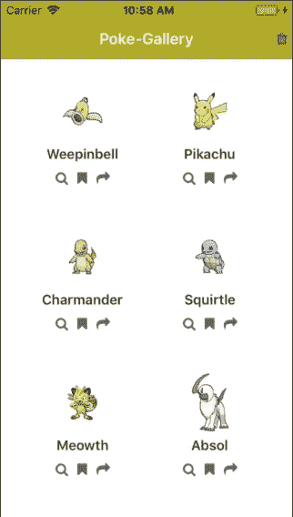
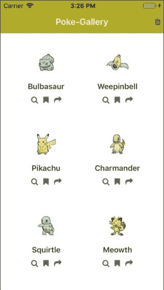
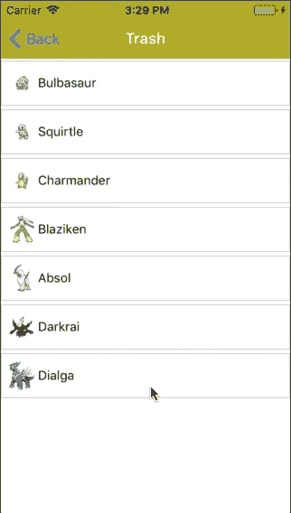
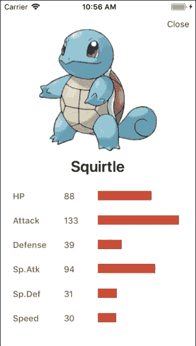

# 向 React 本地应用添加动画——第 3 部分:手势动画

> 原文：<https://dev.to/wernancheta/adding-animations-to-your-react-native-app-part-3-gesture-animations-3l06>

欢迎来到向 React 本机应用程序添加动画的三部分系列的最后一部分。在这一部分中，我们将看看如何响应用户的手势，并使参与交互的组件产生动画效果。

## 先决条件

要学习本教程，您需要了解 React 和 React Native 的基础知识。

回顾本系列的前几部分会有所帮助，但不是必需的。尽管本教程假设您知道如何在 React Native 中实现基本动画。比如缩放、旋转和序列动画。我们将在实现手势动画时应用这些相同的概念。

## 你将建造什么

在这个系列的这一部分，我们将看看如何实现不同种类的手势，以及如何制作它们的动画。

以下是您将要构建的内容:

[](https://res.cloudinary.com/practicaldev/image/fetch/s--mz_XtrKO--/c_limit%2Cf_auto%2Cfl_progressive%2Cq_66%2Cw_880/https://d2mxuefqeaa7sj.cloudfront.net/s_115C812B8243F8C747802527A22CB63F3A3C1BF41FEB8D4721AEFEDEECD662D3_1530241427144_all-gestures.gif)

你可以在其 [GitHub repo](https://github.com/anchetaWern/RNRealworldAnimations) 上找到本教程的完整源代码。

## 设置项目

要跟进，首先需要克隆回购:

```
git clone https://github.com/anchetaWern/RNRealworldAnimations.git 
```

之后，切换到`part2`分支并安装所有的依赖项:

```
cd RNRealworldAnimations
git checkout part2
npm install 
```

接下来，初始化`android`和`ios`文件夹，然后链接本机模块:

```
react-native upgrade
react-native link 
```

完成后，您应该能够在您的设备或模拟器上运行该应用程序:

```
react-native run-android
react-native run-ios 
```

`part2`分支包含该系列第二部分的最终输出。这就是我们想要开始的地方，因为每个部分都是建立在前一部分的基础上的。

## 拖拽

我们要实现的第一个手势是拖放，看起来像这样:

[](https://res.cloudinary.com/practicaldev/image/fetch/s--zQB2R0sP--/c_limit%2Cf_auto%2Cfl_progressive%2Cq_66%2Cw_880/https://d2mxuefqeaa7sj.cloudfront.net/s_115C812B8243F8C747802527A22CB63F3A3C1BF41FEB8D4721AEFEDEECD662D3_1530171143536_drag-and-drop.gif)

### 移除动画标题

在我们开始实现这个手势之前，我们首先要移除在本系列第二部分中制作的动画标题。这是因为当用户开始拖动卡片时，动画会碍事。

要删除动画标题，打开`src/screens/Main.js`并删除这些行:

```
import AnimatedHeader from "../components/AnimatedHeader";

<AnimatedHeader
  title={"Poke-Gallery"}
  nativeScrollY={nativeScrollY}
  onPress={this.shuffleData}
/>; 
```

您可以在此处查看上述[变更的具体提交差异。注意，这里还有其他的变化，但是现在只注意与删除`AnimatedHeader`组件有关的变化。一旦完成，您也应该能够删除`src/components/AnimatedHeader.js`文件。](https://github.com/anchetaWern/RNRealworldAnimations/commit/b0d9ccb7d3cf79feccaa278982d01d12c7399c05#diff-b0a6c7c40d6cbc644f5d286b0a79fa4a)

接下来，更新`src/components/CardList.js`并将`Animated.ScrollView`转换为常规。既然我们将不再使用`AnimatedHeader`，保留滚动动画的代码是没有意义的:

```
<ScrollView>
  <View style={[styles.scroll_container]}>
    <FlatList ... />
  </View> </ScrollView> 
```

你可以在这里查看具体的[提交差异](https://github.com/anchetaWern/RNRealworldAnimations/commit/b0d9ccb7d3cf79feccaa278982d01d12c7399c05#diff-7c6a1b60deaba243be304c4123215d65)。请注意，我也添加了一些道具，但我们将在稍后讨论。

### 实施手势

我们试图实现的手势叫做“平移”。当用户在屏幕上拖动他们的拇指(或任何手指)来移动东西的时候。在这种情况下，我们希望用户能够拖动卡片，这样他们就可以把它放到一个特定的拖放区。

为了实现拖放，我们需要做的事情如下:

1.  更新`Card`组件以使用 React Native 的 [PanResponder 模块](https://facebook.github.io/react-native/docs/panresponder.html)。这使得它可以在屏幕上拖动。
2.  创建一个`DropArea`组件，它将被用作纸牌的投放点。该组件的样式将根据当前是否拖动了一张卡片以及它是否在拖放区内来更新。
3.  更新主屏幕以包含`DropArea`。然后创建函数作为道具传递给`CardList`、`Card`和`DropArea`组件。这使我们可以从主屏幕上控制它们。

在我们继续之前，让我们花点时间来分解一下我们想要完成的任务:

1.  当用户触摸卡片并拖动它时，我们希望它缩小并降低其不透明度。
2.  当用户按住一张卡片时，我们希望隐藏所有其他的卡片，以便将焦点放在他们拿着的卡片上。唯一需要显示的组件是`DropArea`和卡。
3.  当用户将卡片拖到`DropArea`的目标区域时，我们希望将`DropArea`的边框和文本颜色改为绿色。这表明用户在目标上，他们可以将卡放在那里。
4.  如果用户在放下区域之外放开卡片，我们将它放回原来的位置，隐藏`DropArea`，并显示所有被隐藏的卡片。

现在这已经很清楚了，第一步是将`Card`组件从功能性组件转换成基于类的组件。我们在这个组件中实际上不会使用状态，所以这个改变只是为了更好地组织代码。当你这样做的时候，也删除动画卡`onPressIn`和`onPressOut`的代码。我们真的不希望他们妨碍我们试图实现的姿态。下面是更改后新代码结构的样子。你可以在这里查看[差异](https://github.com/anchetaWern/RNRealworldAnimations/commit/b0d9ccb7d3cf79feccaa278982d01d12c7399c05?diff=split#diff-d99b8305e62aa26a276f475d589ace28):

```
// src/components/Card.js
// imports here
// next: import PanResponder

export default class Card extends Component<Props> {
  constructor() {}

  render() {
    // destructure the props here
    // the return code here
  }
} 
```

接下来，我们需要从`react-native`导入`PanResponder`模块:

```
import {
  // ..previously imported moodules here..
  PanResponder
} from "react-native"; 
```

`PanResponder`模块是 React Native 对平移、滑动、长按和挤压等手势的响应方式。

接下来，更新`constructor`并初始化我们将要使用的动画值。在这种情况下，我们需要一个缩放和不透明度动画。我们还使用了一个新的`Animated.ValueXY`，这是控制卡片在屏幕上位置的动画值:

```
// src/components/Card.js
constructor(props) {
  super(props);

  this.pan = new Animated.ValueXY(); // for animating the card's X and Y position
  this.scaleValue = new Animated.Value(0); // for scaling the card while the user drags it
  this.opacityValue = new Animated.Value(2); // for making the card translucent while the user drags it

  this.cardScale = this.scaleValue.interpolate({
    inputRange: [0, 0.5, 1], // animate to 0.5 while user is dragging, then to 1 or 0 once they let go
    outputRange: [1, 0.5, 1]
  });

  this.cardOpacity = this.opacityValue.interpolate({
    inputRange: [0, 1, 2], // default value is 2, so we'll animate backwards
    outputRange: [0, 0.5, 1]
  });
} 
```

接下来，在`componentWillMount`中，在道具析构的正下方，创建一个新的 PanResponder:

```
componentWillMount() {
  const {
    // existing props here..
  } = this.props;

  // add the following:
  this.panResponder = PanResponder.create({
    onStartShouldSetPanResponder: () => true,
    onMoveShouldSetPanResponder: () => true,
    onPanResponderGrant: (e, gestureState) => {
      // next: add code for onPanResponderGrant
    },
    onPanResponderMove: (e, gesture) => {

    },
    onPanResponderRelease: (e, gesture) => {

    }
  });
} 
```

分解上面的代码:

*   `onStartShouldSetPanResponder` -用于指定是否允许 PanResponder 响应触摸反馈。注意，我们只是提供了`true`，但是理想情况下，你应该提供一个函数，这个函数包含一个检查你是否想要启动手势的条件。例如，如果你有某种“锁”功能，用户需要在移动东西之前打开它。
*   `onMoveShouldSetPanResponder` -用于检查是否响应稍后将附加 PanResponder 的组件的拖动。同样，我们刚刚指定了`true`，但是如果你需要检查一个特定的条件是否返回`true`，这就是你想要放置它的地方。

奇怪的是，即使你提供了以上所有的`false`或者根本不提供，它仍然可以在 iOS 模拟器上工作。但即使是这种情况，仍然指定它是一个好的做法，因为您永远不知道不同的设备在现实世界中的行为。

*   `onPanResponderGrant` -当 PanResponder 开始将用户的动作识别为手势时，执行您在此提供的功能。因此，当用户开始拖动卡片时，即使只是一点点，该功能也会被执行。这是我们想要动画卡片的地方，所以它变得更小和半透明。
*   `onPanResponderMove` -当用户在屏幕上拖动手指时执行。这是您想要执行动画来改变卡片位置的地方。这也是您想要检查卡片是否在放置区域内的地方，这样您就可以动画显示`DropArea`组件的样式。
*   `onPanResponderRelease` -当用户完成手势时执行。这是他们的手指放开屏幕的时候。这里，您还需要检查卡片是否在拖放区域内，这样您就可以相应地制作动画了。

在我看来，这些是你想要提供的最常见的功能。但是还有[其他可用的](https://facebook.github.io/react-native/docs/panresponder.html#create)。

现在，让我们为每个手势生命周期函数添加代码。对于`onPanResponderGrant`，我们将同时制作`scaleValue`和`opacityValue`的动画。在它下面，我们有一个名为`toggleDropArea`的函数，用于更新状态，所以它隐藏了所有其他的卡，显示了`DropArea`组件。我们稍后将从主屏幕提供这个功能，然后到卡片列表，最后到每个卡片组件。现在，不要忘记从`this.props`开始销毁它:

```
// src/components/Card.js
onPanResponderGrant: (e, gestureState) => {
  Animated.parallel([
    Animated.timing(this.scaleValue, {
      toValue: 0.5, // scale it down to half its original size
      duration: 250,
      easing: Easing.linear,
      useNativeDriver: true
    }),
    Animated.timing(this.opacityValue, {
      toValue: 1,
      duration: 250,
      easing: Easing.linear,
      useNativeDriver: true
    })
  ]).start();

  toggleDropArea(true, item); // supplied from the src/screens/Main.js down to src/components/CardList and then here. Accepts the drop area's visibility and the item to exclude from being hidden
};
// next: add code for onPanResponderMove 
```

接下来是`onPanResponderMove`。在这里，我们做了与本系列第二部分中实现动画标题时相同的事情。也就是说，使用`Animated.event`将卡片的当前位置映射到`this.pan`。这使得我们可以在用户拖动卡片时动画显示它的位置。`dx`和`dy`是手势开始后 X 和 Y 位置的累计距离。我们将这些用作`this.pan.x`和`this.pan.y`的值:

```
onPanResponderMove: (e, gesture) => {
  Animated.event([null, { dx: this.pan.x, dy: this.pan.y }])(e, gesture);
  if (isDropArea(gesture)) {
    targetDropArea(true);
  } else {
    targetDropArea(false);
  }
},
// next: add code for onPanResponderRelease 
```

注意，`Animated.event`返回一个函数，这就是为什么我们提供`e`(事件)和`gesture`作为它返回的函数的参数。

在`onPanResponderRelease`时，我们通过使用`isDropArea`功能检查卡片是否在放置区域内。同样，这个功能会像`toggleDropArea`功能一样作为道具从主屏幕上传递。如果卡片在拖放区域内，我们将它的不透明度设置为零，这样它就不再可见。然后我们调用`removePokemon`函数(作为道具从主屏幕传递)将其从状态中移除:

```
onPanResponderRelease: (e, gesture) => {
  toggleDropArea(false, item); // hide the drop area and show the hidden cards

  if (isDropArea(gesture)) {
    Animated.timing(this.opacityValue, {
      toValue: 0,
      duration: 500,
      useNativeDriver: true
    }).start(() => {});

    removePokemon(item); // remove the pokemon from the state
  } else {
    // next: add code for animating the card back to its original position
  }
}; 
```

接下来，将卡片动画到其原始位置。这里，我们简单地反向做我们在`onPanResponderGrant`上声明的动画。但是这里最重要的部分是动画`this.pan`。因为我们使用的是向量值，所以我们指定了一个对象，其中包含了`x`和`y`位置的独立值。这是一件好事，我们可以简单地指定`0`为两者的值，使它们回到原来的位置。无需计算卡片的位置或任何类似的复杂操作:

```
// src/components/Card.js
Animated.parallel([
  Animated.timing(this.scaleValue, {
    toValue: 1,
    duration: 250,
    easing: Easing.linear,
    useNativeDriver: true
  }),
  Animated.timing(this.opacityValue, {
    toValue: 2,
    duration: 250,
    easing: Easing.linear,
    useNativeDriver: true
  }),
  Animated.spring(this.pan, {
    toValue: { x: 0, y: 0 },
    friction: 5,
    useNativeDriver: true
  })
]).start(); 
```

接下来，我们来看看`render`方法。在这里，除了我们提供的动画样式和用`Animated.View`代替之前的`TouchableWithoutFeedback`之外，其他都是一样的。允许部件移动的最重要的部分是对应于`this.pan`的`x`和`y`值的`transform`样式，以及`PanResponder`道具(`{...this.panResponder.panHandlers}`)的供应:

```
// src/components/Card.js
render() {
  const {
    item,
    cardAction,
    viewAction,
    bookmarkAction,
    shareAction
  } = this.props;

  let [translateX, translateY] = [this.pan.x, this.pan.y];

  let transformStyle = {
    ...styles.card,
    opacity: item.isVisible ? this.cardOpacity : 0,
    transform: [{ translateX }, { translateY }, { scale: this.cardScale }]
  };

  return (
    <Animated.View style={transformStyle} {...this.panResponder.panHandlers}>
      ...
    </Animated.View>
  );
} 
```

此外，我们还期望每个`item`都有一个`isVisible`属性。它将用于隐藏或显示卡片。这个属性是我们在用户开始或停止手势时更新的。

接下来，我们现在可以继续创建`DropArea`组件。如果你之前看过演示，这就是当用户开始手势时右上角显示的小方框。代码如下:

```
// src/components/DropArea.js
import React, { Component } from "react";
import { View, Text, Dimensions } from "react-native";

const DropArea = ({ dropAreaIsVisible, setDropAreaLayout, isTargeted }) => {
  const right = dropAreaIsVisible ? 20 : -200;
  const color = isTargeted ? "#5fba7d" : "#333";
  return (
    <View
      style={[styles.dropArea, { right }, { borderColor: color }]}
      onLayout={setDropAreaLayout}
    >
      <Text style={[styles.dropAreaText, { color }]}>Drop here</Text>
    </View>
  );
};

const styles = {
  dropArea: {
    position: "absolute",
    top: 20,
    right: 20,
    width: 100,
    height: 100,
    backgroundColor: "#eaeaea",
    borderWidth: 3,
    borderStyle: "dashed", // note: doesn't work on android: https://github.com/facebook/react-native/issues/17251
    alignItems: "center",
    justifyContent: "center"
  },
  dropAreaText: {
    fontSize: 15
  }
};

export default DropArea; 
```

如果你检查上面的代码，实际上没有动画发生。我们所做的只是基于来自道具的以下布尔值来改变样式:

*   `dropAreaIsVisible` -组件是否可见。
*   `isTargeted` -一张牌是否在其区域内。

`setDropAreaLayout`是一项功能，允许我们更新屏幕中拖放区位置的主屏幕状态。我们需要这些信息来确定一张卡是否在投放区域内。

接下来，更新主屏幕。首先，将`isVisible`属性添加到每个口袋妖怪:

```
 // src/screens/Main.js
    const animationConfig = {...}

    // add this:
    let updated_pokemon = pokemon.map(item => {
      item.isVisible = true;
      return item;
    }); 
```

在组件内部，由于我们不再使用动画标题，现在需要为`headerTitle`添加一个值:

```
// src/screens/Main.js inside navigationOptions
headerTitle: "Poke-Gallery", 
```

初始化状态:

```
state = {
  pokemon: updated_pokemon, // change pokemon to updated_pokemon
  isDropAreaVisible: false
}; 
```

在`render`方法中，我们在`CardList`之前渲染`DropArea`，这样它的`z-index`就比其他任何卡片都低。这样，当用户拖动卡片时，卡片总是在卡片列表的顶部。不要忘记传递我们期待来自`DropArea`组件的道具。我们稍后会声明这些:

```
// src/screens/Main.js
import DropArea from "../components/DropArea"; // add this somewhere below the react-native imports

return (
  <View style={styles.container}>
    <DropArea
      dropAreaIsVisible={this.state.isDropAreaVisible}
      setDropAreaLayout={this.setDropAreaLayout}
      isTargeted={this.state.isDropAreaTargeted}
    />
    ..previously rendered components here ..next: update CardList
  </View> ); 
```

更新`CardList`,让它拥有我们期待的道具:

```
<CardList
  ...previous props here
  scrollEnabled={!this.state.isDropAreaVisible}
  toggleDropArea={this.toggleDropArea}
  dropAreaIsVisible={this.state.isDropAreaVisible}
  isDropArea={this.isDropArea}
  targetDropArea={this.targetDropArea}
  removePokemon={this.removePokemon}
/> 
```

接下来，我们现在可以为传递的函数添加代码。首先是`toggleDropArea`。正如您之前看到的，每当用户启动和完成手势时，都会调用这个函数。它所做的只是根据传递给它的`isVisible`参数翻转每个项目的`isVisible`属性。当用户发起手势时，`isVisible`为`true`。这意味着`DropArea`是可见的，但是其余的卡是隐藏的。传递给这个函数的参数`item`是包含被拖动的卡片细节的对象。因此，我们使用它来查找要从隐藏中排除的项目的索引。然后，我们用新数据更新状态:

```
// src/screens/Main.js
toggleDropArea = (isVisible, item) => {
  if (item) {
    let pokemon_data = [...this.state.pokemon];
    let new_pokemon_data = pokemon_data.map(item => {
      item.isVisible = !isVisible;
      return item;
    });
    let index = new_pokemon_data.findIndex(itm => itm.name == item.name);

    if (isVisible) {
      new_pokemon_data[index].isVisible = true;
    }

    this.setState({
      isDropAreaVisible: isVisible,
      pokemon: new_pokemon_data
    });
  }
}; 
```

`setDropAreaLayout`的工作是更新`isDropArea`函数要使用的`dropAreaLayout`:

```
// src/screens/Main.js
setDropAreaLayout = event => {
  this.setState({
    dropAreaLayout: event.nativeEvent.layout
  });
}; 
```

`isDropArea`是改变拖放区样式的逻辑所在。它还用于确定卡片是否将被带回其原始位置或被放入放置区域。注意，下面的条件不是 100%可靠的。`gesture.moveX`和`gesture.moveY`实际上并不是卡片在屏幕上的位置。相反，这些是最近移动的触摸的最新屏幕坐标。这意味着该位置基于用户触摸的位置。因此，如果用户抓住卡片的下部，那么他们必须将卡片举得比放下区域高得多，以便瞄准它。抓住卡片的左边也是一样。为此，他们将不得不把卡片移动到掉落区域的右侧，以便瞄准它。所以最安全的触摸位置是中间、右边或顶部:

```
// src/screens/Main.js
isDropArea = gesture => {
  let dropbox = this.state.dropAreaLayout;
  return (
    gesture.moveY > dropbox.y + DROPAREA_MARGIN &&
    gesture.moveY < dropbox.y + dropbox.height + DROPAREA_MARGIN &&
    gesture.moveX > dropbox.x + DROPAREA_MARGIN &&
    gesture.moveX < dropbox.x + dropbox.width + DROPAREA_MARGIN
  );
}; 
```

上面的函数将触摸的位置与放置区域的位置进行比较。我们添加了一个`DROPAREA_MARGIN`来说明添加到`DropArea`组件的顶部和右边距。

`targetDropArea`更新状态，以便更改拖放区的文本和边框颜色:

```
// src/screens/Main.js
targetDropArea = isTargeted => {
  this.setState({
    isDropAreaTargeted: isTargeted
  });
}; 
```

`removePokemon`从状态中删除被放下的项目。这也使用 LayoutAnimation 在卡片掉落后用弹簧动画制作其余卡片的动画:

```
// src/screens/Main.js
removePokemon = item => {
  let pokemon_data = [...this.state.pokemon];
  let index = pokemon_data.findIndex(itm => itm.name == item.name);
  pokemon_data.splice(index, 1);

  LayoutAnimation.configureNext(animationConfig);

  this.setState({
    pokemon: pokemon_data
  });
}; 
```

接下来，更新`CardList`组件以接受所有需要传递给`Card`组件的道具。我们还需要可选地启用 ScrollView 的滚动功能(`scrollEnabled`道具)，因为当用户开始拖动一张卡片时，它会碍事。最后，`FlatList`默认情况下也支持滚动，所以我们也禁用它，只依赖`ScrollView`来滚动:

```
// src/components/CardList.js
const CardList = ({
  // previous props here..
  scrollEnabled,
  toggleDropArea,
  isDropArea,
  targetDropArea,
  removePokemon
}) => {
  return (
    <ScrollView scrollEnabled={scrollEnabled}>
      <View style={[styles.scroll_container]}>
        <FlatList
          scrollEnabled={false}
          ...previous props here
          renderItem={({ item }) => {
            <Card
              ...previous props here
              toggleDropArea={toggleDropArea}
              isDropArea={isDropArea}
              targetDropArea={targetDropArea}
              removePokemon={removePokemon}
            />
          }}
        />
      </View>
    </ScrollView>
  );
}); 
```

还要更新`Card`组件以接受由`CardList`组件传递给它的属性:

```
// src/components/Card.js
componentWillMount() {
    const {
      /* previously accepted props here */
      toggleDropArea,
      isDropArea,
      targetDropArea,
      removePokemon
    } = this.props;
} 
```

接下来，更新布局设置文件以导出`DROPAREA_MARGIN`:

```
// src/settings/layout.js
const DROPAREA_MARGIN = 20;
export { DROPAREA_MARGIN }; 
```

最后，更新主屏幕，使其使用`DROPAREA_MARGIN`:

```
// src/screens/Main.js
import { DROPAREA_MARGIN } from "../settings/layout"; 
```

完成后，您应该会获得与前面的演示相似的输出。

### 解决 Android 上的平面列表拖放问题

您可能已经知道，Android 和 iOS 之间存在实现差异。如果你以前使用过这两个平台，那么你也知道 Android 的 React Native 在 iOS 之后。这意味着在使用 React Native 时，您可能会遇到更多 Android 特有的问题和陷阱。

这部分是专门用来处理 Android 相关问题的，当涉及到`FlatList`组件的时候。它的问题是，当用户拖动卡片时，改变`Card`组件的不透明度和 z-index 并不能达到与 iOS 相同的效果。在 Android 上，每一行都有某种包装器来包装每个`Card`组件。这个包装器不会受到为`Card`组件声明 z 索引的影响。即使用户拖动时`Card`组件当前是隐藏的，卡片实际上也不能被拖出它所在的行，因为一旦你这样做，它就变成隐藏的了。

经过几天的寻找解决方案，我放弃了，决定坚持使用自定义列表。

打开，`src/components/CardList.js`并将其转换为基于类的组件:

```
export default class CardList extends Component<Props> {
  render() {
    const { data, scrollEnabled } = this.props;

    return (
      <ScrollView scrollEnabled={scrollEnabled}>
        <View style={[styles.scroll_container]}>{this.renderPairs(data)}</View>
      </ScrollView>
    );
  }

  // next: add renderPairs method
} 
```

`renderPairs`函数返回每一行，并使用`renderCards`函数呈现卡片:

```
renderPairs = data => {
  let pairs = getPairsArray(data);

  return pairs.map((pair, index) => {
    return (
      <View style={styles.pair} key={index}>
        {this.renderCards(pair)}
      </View>
    );
  });
};

// next: add renderCards function 
```

接下来，添加`renderCards`方法。这负责渲染单个`Card`组件:

```
renderCards = pair => {
  const {
    cardAction,
    viewAction,
    bookmarkAction,
    shareAction,
    toggleDropArea,
    isDropArea,
    targetDropArea,
    removePokemon
  } = this.props;

  return pair.map(item => {
    return (
      <Card
        key={item.name}
        item={item}
        cardAction={cardAction}
        viewAction={viewAction}
        bookmarkAction={bookmarkAction}
        shareAction={shareAction}
        toggleDropArea={toggleDropArea}
        isDropArea={isDropArea}
        targetDropArea={targetDropArea}
        removePokemon={removePokemon}
      />
    );
  });
}; 
```

在类外部，就在`styles`声明之前，创建一个名为`getPairsArray`的函数。该函数将接受一个项目数组，并对其进行重组，以便每行都有一对项目:

```
// src/components/CardList.js
const getPairsArray = items => {
  var pairs_r = [];
  var pairs = [];
  var count = 0;
  items.forEach(item => {
    count += 1;
    pairs.push(item);
    if (count == 2) {
      pairs_r.push(pairs);
      count = 0;
      pairs = [];
    }
  });
  return pairs_r;
};

const styles = { ... } // next: update styles 
```

不要忘记为每双鞋添加款式:

```
const styles = {
  /* previously added styles here */
  pair: {
    flexDirection: "row"
  }
}; 
```

完成后，您现在应该能够在拖放区拖放卡片了。

如果您在让它工作时遇到问题，您可以在这里检查具体的[提交](https://github.com/anchetaWern/RNRealworldAnimations/commit/eb387a123b030b2d7d5089be675018f048017f56)。

## 刷卡

我们要实现的下一个手势是滑动，看起来像这样:

[](https://res.cloudinary.com/practicaldev/image/fetch/s--UwoobieX--/c_limit%2Cf_auto%2Cfl_progressive%2Cq_66%2Cw_880/https://d2mxuefqeaa7sj.cloudfront.net/s_115C812B8243F8C747802527A22CB63F3A3C1BF41FEB8D4721AEFEDEECD662D3_1530171140999_swipe-animation.gif)

这一部分是从拖放手势构建的。所以你在上面看到的口袋妖怪列表是被丢弃的。向右滑动项目会将其完全移除。

让我们看看为了实现这一点需要做些什么:

1.  创建一个将添加滑动手势的`Swiper`组件。这些是您在上面的演示中看到的项目。
2.  创建一个垃圾屏幕。在这里，`Swiper`组件将用于显示拖放到拖放区的项目。
3.  更新主屏幕以添加一个用于导航到回收站屏幕的按钮。`pokemon`状态(包含口袋妖怪列表的数组)也需要更新，因此被丢弃的口袋妖怪将被删除并复制到另一个状态(`removed_pokemon`)，该状态包含被丢弃的口袋妖怪的数组。这将被用作垃圾屏幕的数据源。

### 创建一个 Swiper 组件

让我们继续创建`Swiper`组件。首先，进口所有我们需要的东西:

```
// src/components/Swiper.js
import React, { Component } from "react";
import {
  View,
  Image,
  Text,
  Dimensions,
  Animated,
  PanResponder
} from "react-native";

const width = Dimensions.get("window").width; // for calculating the distance swiped 
```

接下来，创建组件。当用户向右滑动一个项目时，它会将该项目从`removed_pokemon`状态中移除，因此我们需要接受要移除的`item`。我们还需要通过`dismissAction`，它将从状态中删除该项目:

```
const Swiper = ({ item, dismissAction }) => {
  // next: add animated values
}; 
```

接下来，我们初始化将要使用的动画值。我们希望项目向左或向右移动(`translateX`)，并在移动时使其半透明(`opacityValue`):

```
let translateX = new Animated.Value(0);
let opacityValue = new Animated.Value(0);

let cardOpacity = opacityValue.interpolate({
  inputRange: [0, 1],
  outputRange: [1, 0.5]
});

// next: add PanResponder code 
```

接下来，创建 PanResponder:

```
let panResponder = PanResponder.create({
  onStartShouldSetPanResponder: () => true,
  onMoveShouldSetPanResponder: () => true,
  onPanResponderMove: (e, gesture) => {
    // next: add code for onPanResponderMove
  },
  onPanResponderRelease: (e, { vx, dx }) => {}
}); 
```

当用户开始手势时，我们将`dx`的值映射到动画值`translateX`。我们之前对`Card`组件做了同样的事情。唯一不同的是，这一次，我们只翻译了`X`位置。在那下面，我们也制作了`opacityValue`的动画。我们使用了一个非常低的`duration`值，所以一旦手势开始，组件将立即变成半透明:

```
onPanResponderMove: (e, gesture) => {
  Animated.event([null, { dx: translateX }])(e, gesture);
  Animated.timing(opacityValue, {
    toValue: 1,
    duration: 50,
    useNativeDriver: true
  }).start();
};
// next: add code for onPanResponderRelease 
```

当用户结束手势时，我们决定是将组件带回到它的原始位置，还是将剩余的距离动画化到最右边。幸运的是，我们实现它的方式非常简单。我们将`dx`(手势在`X`轴上的累积距离)的绝对值与屏幕总宽度的一半进行比较。因此，如果用户设法将组件拖动到屏幕的一半以上，那么这意味着他们想要删除该项。我们也在检查`dx`是否不是负数。只有当用户向右滑动时，我们才认为手势有效。这是可行的，因为如果用户向左滑动，`dx`将具有负值。

至于动画值，我们简单地用屏幕的宽度作为最终值。如果`dx`大于`0`，那么这意味着他们向右滑动，所以我们有一个正的`width`值。否则，我们使用负的`width`:

```
onPanResponderRelease: (e, { vx, dx }) => {
  if (Math.abs(dx) >= 0.5 * width && Math.sign(dx) != -1) {
    dismissAction(item);
    Animated.timing(translateX, {
      toValue: dx > 0 ? width : -width,
      duration: 200,
      useNativeDriver: true
    }).start();
  } else {
    // next: add code for bringing back the component to its original position
  }
}; 
```

如果条件失败，我们将组件弹回其原始位置，并恢复其原始不透明度:

```
Animated.parallel([
  Animated.spring(translateX, {
    toValue: 0,
    bounciness: 20,
    useNativeDriver: true
  }),
  Animated.timing(opacityValue, {
    toValue: 0,
    duration: 5,
    useNativeDriver: true
  })
]).start(); 
```

接下来，我们渲染实际的组件:

```
// src/components/Swiper.js
return (
  <Animated.View
    style={{
      transform: [{ translateX }],
      opacity: cardOpacity,
      ...styles.bar
    }}
    {...panResponder.panHandlers}
  >
    <Image source={item.pic} style={styles.thumbnail} resizeMode="contain" />
    <Text style={styles.name}>{item.name}</Text>
  </Animated.View> ); 
```

以下是款式:

```
const styles = {
  bar: {
    height: 50,
    flexDirection: "row",
    borderWidth: 1,
    borderColor: "#ccc",
    alignItems: "center",
    marginTop: 2,
    marginBottom: 2,
    paddingLeft: 5
  },
  thumbnail: {
    width: 35,
    height: 35
  }
};

export default Swiper; 
```

### 创建垃圾桶屏幕

垃圾桶屏幕是显示`Swiper`组件的地方。拖放到拖放区的所有项目都将显示在此页面上:

```
// src/screens/Trash.js
import React, { Component } from "react";
import { View, FlatList, LayoutAnimation } from "react-native";
import Swiper from "../components/Swiper";

type Props = {};
export default class Trash extends Component<Props> {
  static navigationOptions = ({ navigation }) => {
    return {
      headerTitle: "Trash",
      headerStyle: {
        elevation: 0,
        shadowOpacity: 0,
        backgroundColor: "#B4A608"
      },
      headerTitleStyle: {
        color: "#FFF"
      }
    };
  };

  state = {
    removed_pokemon: [] // array containing the items that were dropped from the Main screen
  };

  // next: add componentDidMount
} 
```

当组件被安装时，我们称之为`fillRemovedPokemon`。这将简单地复制作为导航参数从主屏幕传递到这个屏幕的`removed_pokemon`状态的`removed_pokemon`的内容。这样，这个屏幕就有了自己的状态，我们可以操纵它:

```
componentDidMount() {
  this.fillRemovedPokemon(this.props.navigation.state.params.removed_pokemon);
} 
```

下面是`fillRemovedPokemon`方法:

```
fillRemovedPokemon = removed_pokemon => {
  this.setState({
    removed_pokemon
  });
}; 
```

接下来，我们呈现实际的列表:

```
render() {
  return (
    <View style={styles.container}>
      {this.state.removed_pokemon && (
        <FlatList
          data={this.state.removed_pokemon}
          renderItem={({ item }) => (
            <Swiper item={item} dismissAction={this.dismissAction} />
          )}
          keyExtractor={item => item.id.toString()}
        />
      )}
    </View>
  );
} 
```

`dismissAction`负责移除用户想要移除的项目。在这里，我们使用 LayoutAnimation 来轻松地更新已经移除的项目的 UI。在这种情况下，我们使用它来自动填充被移除的项目留下的空白空间:

```
// src/components/Swiper.js
dismissAction = item => {
  LayoutAnimation.configureNext(LayoutAnimation.Presets.spring);
  let removed_pokemon = [...this.state.removed_pokemon];
  let index = removed_pokemon.findIndex(itm => itm.name == item.name);

  removed_pokemon.splice(index, 1);

  this.setState({
    removed_pokemon
  });
}; 
```

以下是款式:

```
const styles = {
  container: {
    flex: 1,
    backgroundColor: "#fff"
  }
}; 
```

### 更新主屏幕

接下来，更新`src/screens/Main.js`文件。首先，包括`IconButton`组件。我们将使用它在标题中显示一个按钮:

```
import IconButton from "../components/IconButton"; 
```

更新`navigationOptions`以包含`headerRight`。这允许我们在标题的右侧呈现一个组件。`navigateToTrash`方法是作为导航参数传递的，稍后您会看到:

```
static navigationOptions = ({ navigation }) => {
  const { params } = navigation.state; // add this
  return {
    headerTitle: "Poke-Gallery",
    // add this:
    headerRight: (
      <IconButton
        icon="trash"
        onPress={() => {
          params.navigateToTrash();
        }}
      />
    ),
   // previous header config here...
  };
}; 
```

接下来，更新状态初始化代码以包含`removed_pokemon`的默认值:

```
state = {
  pokemon: updated_pokemon,
  removed_pokemon: [], // add this
  isDropAreaVisible: false
}; 
```

之后，我们将`navigateToTrash`函数设置为导航参数:

```
constructor(props) {
  /* previously added constructor code here */

  this.props.navigation.setParams({
    navigateToTrash: this.navigateToTrash
  });
} 
```

下面是`navigateToTrash`方法。我们实际上不能从`navigationOptions`内部使用这个屏幕的状态，这就是为什么我们将这个函数设置为导航参数:

```
navigateToTrash = () => {
  this.props.navigation.navigate("Trash", {
    removed_pokemon: this.state.removed_pokemon
  });
}; 
```

接下来，更新`removePokemon`方法以包含对`removed_pokemon`的操作:

```
removePokemon = item => {
  let pokemon_data = [...this.state.pokemon];
  let removed_pokemon_data = [...this.state.removed_pokemon]; // add this
  let index = pokemon_data.findIndex(itm => itm.name == item.name);
  let removed_pokemon = pokemon_data.splice(index, 1); // add 'let removed_pokemon' to this line
  removed_pokemon_data.push(removed_pokemon[0]); // add this
  LayoutAnimation.configureNext(animationConfig);

  this.setState({
    pokemon: pokemon_data,
    removed_pokemon: removed_pokemon_data // add this
  });
}; 
```

最后，更新`Root.js`文件，将垃圾屏幕作为应用程序的一个屏幕:

```
import TrashScreen from "./src/screens/Trash";

const transitionConfig = () => {
  // previous transition config here...
};

const MainStack = createStackNavigator(
  {
    // previous screens here..
    Trash: {
      screen: TrashScreen
    }
  }
  // previous config
); 
```

一旦完成，你应该能够测试滑动手势。

## 捏

我们要实现的最后一个手势是捏手势，它看起来像这样:

[](https://res.cloudinary.com/practicaldev/image/fetch/s--BMD0GKNH--/c_limit%2Cf_auto%2Cfl_progressive%2Cq_66%2Cw_880/https://d2mxuefqeaa7sj.cloudfront.net/s_115C812B8243F8C747802527A22CB63F3A3C1BF41FEB8D4721AEFEDEECD662D3_1530241189295_pinch-animation.gif)

在上面的演示中，用户使用收缩手势来放大和缩小图像。在我看来，这个手势是你能实现的最复杂的手势之一。因此，我们将使用 [React 本机手势处理程序](https://kmagiera.github.io/react-native-gesture-handler/)库来简化它，而不是用 PanResponder 来实现。

在我们继续之前，让我们看一下实现这一点所涉及的工作:

1.  安装 React 本机手势处理程序并将其链接到项目。
2.  创建一个`PinchableImage`组件。在这里，我们将使用手势处理程序库来实现缩放手势。
3.  更新`BigCard`组件，用`PinchableImage`组件替换原始图像。

### 安装 react-native-手势处理器

您可以使用以下命令安装手势处理程序:

```
npm install --save react-native-gesture-handler 
```

在撰写本教程时，`react-native link`并没有真正将本地模块链接到项目中。所以我们只能用椰子来代替。这也意味着如果你打算在 iOS 和 Android 上测试，你必须为 Android 手动安装。

如果你只需要在 Android 上测试，你应该可以用`react-native link`链接原生模块。我们将很快进入 Android 安装，首先让我们进入 iOS。

#### iOS 配置

`cd`进入`ios`目录并初始化一个新的`Podfile`:

```
cd ios
pod init 
```

接下来，用下面的内容替换它的内容。在这里，我们将 React 本机模块添加为 pods，然后在它的下面(`pod 'RNGestureHandler` `'`)是我们包含手势处理程序的实际模块的地方:

```
target 'RNRealworldAnimations' do

  rn_path = '../node_modules/react-native'
  pod 'yoga', path: "#{rn_path}/ReactCommon/yoga/yoga.podspec"
  pod 'React', path: rn_path, subspecs: [
    'Core',
    'CxxBridge',
    'DevSupport',
    'RCTActionSheet',
    'RCTAnimation',
    'RCTGeolocation',
    'RCTImage',
    'RCTLinkingIOS',
    'RCTNetwork',
    'RCTSettings',
    'RCTText',
    'RCTVibration',
    'RCTWebSocket',
  ]

  pod 'DoubleConversion', :podspec => "#{rn_path}/third-party-podspecs/DoubleConversion.podspec"
  pod 'glog', :podspec => "#{rn_path}/third-party-podspecs/glog.podspec"
  pod 'Folly', :podspec => "#{rn_path}/third-party-podspecs/Folly.podspec"

  pod 'RNGestureHandler', :path => '../node_modules/react-native-gesture-handler/ios'
end

post_install do |installer|
  installer.pods_project.targets.each do |target|
    if target.name == "React"
      target.remove_from_project
    end
  end
end 
```

之后，安装所有的吊舱:

```
pod install 
```

完成后，您现在可以运行您的项目了:

```
cd ..
react-native run-ios 
```

#### 安卓配置

要在 Android 上配置它，打开`android/settings.gradle`文件并在`include ':app'`之前添加以下内容:

```
include ':react-native-gesture-handler'
project(':react-native-gesture-handler').projectDir = new File(rootProject.projectDir, '../node_modules/react-native-gesture-handler/android') 
```

接下来，打开`android/app/build.gradle`并在`react-native-vector-icons`后包含`react-native-gesture-handler`:

```
dependencies {
  compile project(':react-native-vector-icons')
  compile project(':react-native-gesture-handler')
  // ...other dependencies here
} 
```

接下来，打开`android/app/src/main/java/com/rnrealworldanimations/MainApplication.java`并导入相应的手势处理程序库:

```
// other previously imported libraries here
import com.facebook.soloader.SoLoader; // previously imported library
import com.swmansion.gesturehandler.react.RNGestureHandlerPackage; // add this 
```

然后在`getPackages`里面用:

```
protected List<ReactPackage> getPackages() {
  return Arrays.<ReactPackage>asList(
      new MainReactPackage(),
      new VectorIconsPackage(),
      new RNGestureHandlerPackage() // add this
  );
} 
```

最后，打开`android/app/src/main/java/com/rnrealworldanimations/MainActivity.java`并导入手势处理器库:

```
package com.rnrealworldanimations;

import com.facebook.react.ReactActivity;
import com.facebook.react.ReactActivityDelegate; // add this
import com.facebook.react.ReactRootView; // add this
import com.swmansion.gesturehandler.react.RNGestureHandlerEnabledRootView; // add this 
```

在类内部，使用`ReactActivityDelegate`在根视图上启用手势处理程序:

```
public class MainActivity extends ReactActivity {

    @Override
    protected String getMainComponentName() {
        return "RNRealworldAnimations";
    }

    // add everything below this line
    @Override
    protected ReactActivityDelegate createReactActivityDelegate() {
      return new ReactActivityDelegate(this, getMainComponentName()) {
        @Override
        protected ReactRootView createRootView() {
          return new RNGestureHandlerEnabledRootView(MainActivity.this);
        }
      };
    }
} 
```

一旦完成，从您的终端执行`react-native run-android`来重建和运行项目。

### 创建可折叠图像组件

创建一个`src/components/PinchableImage.js`文件并添加以下内容。React 本机手势处理程序只负责处理手势，当用户执行这些手势时，您仍然需要编写应用动画的代码。这就是为什么我们仍然需要包含`Animated`模块:

```
import React, { Component } from "react";
import { Animated, View, Dimensions } from "react-native";
import { PinchGestureHandler, State } from "react-native-gesture-handler";

const { width, height } = Dimensions.get("window"); // used for dealing with image dimensions

export default class PinchableImage extends Component {
  // next: add constructor
} 
```

大多数时候，你需要从手势处理器模块中提取的只是你想要处理的手势和`State`。在这种情况下，我们要使用`PinchGestureHandler`。但是你也可以使用像`FlingGestureHandler`这样的处理程序来实现我们之前做的滑动手势，或者使用`PanGestureHandler`来实现拖放。最重要的是，您可以将这些手势处理程序结合在一起，以创建更复杂的交互。

接下来，在`constructor`中，我们初始化将要使用的动画值:

*   `baseScale` -图像的默认比例值。在这里，我们将它设置为`1`，这样如果它变得比`1`大，那么用户将使图像变大。如果它小于`1`，那么用户正在使它变小。
*   `pinchScale` -收缩手势的刻度值。
*   `scale` -用于变换比例的实际比例值。
*   `lastScale` -用于更新`baseScale`的刻度值。
*   `imageScale` -图像的当前比例值。

代码如下:

```
// src/components/PinchableImage.js
constructor(props) {
  super(props);
  this.baseScale = new Animated.Value(1);
  this.pinchScale = new Animated.Value(1);
  this.scale = Animated.multiply(this.baseScale, this.pinchScale);
  this.lastScale = 1;
  this.imageScale = 0;
} 
```

在整个手势的生命周期中，`_onPinchHandlerStateChange`方法将被执行。之前，我们已经使用过`onPanResponderGrant`、`onPanResponderMove`和`onPanResponderRelease`。但是当使用手势处理器时，它被合并到一个方法中。不过这一次，有了用于响应手势不同状态的[处理程序状态](https://kmagiera.github.io/react-native-gesture-handler/docs/state.html)。下面是它如何映射到 PanResponder 方法:

*   `onPanResponderGrant` - `State.BEGAN`
*   `onPanResponderMove` - `State.ACTIVE`
*   `onPanResponderRelease` - `State.END`

此外，还有`State.UNDETERMINED`、`State.CANCELLED`和`State.FAILED`。

因为当手势开始或结束时，我们不需要执行任何操作，所以我们将所有东西包装在`State.ACTIVE`状态中。在它里面，我们计算`newImageScale`。我们首先确定用户的手指是彼此远离还是彼此靠近。如果`event.nativeEvent.scale`是负的，那么它意味着用户试图缩小它。否则(大于`0`)用户正在放大它。然后我们用它来决定是否从`imageScale`中增加或者减去`currentScale`。代码如下:

```
// src/components/PinchableImage.js
_onPinchHandlerStateChange = event => {
  if (event.nativeEvent.oldState === State.ACTIVE) {
    let currentScale = event.nativeEvent.scale; // the distance travelled by the user's two fingers

    this.lastScale *= event.nativeEvent.scale; // the value we will animated the baseScale to
    this.pinchScale.setValue(1); // everytime the handler is triggered, it's considered as 1 scale value

    // the image's new scale value
    let newImageScale =
      currentScale > 0
        ? this.imageScale + currentScale
        : this.imageScale - currentScale;

    // next: add code for checking if scale is within range
  }
}; 
```

接下来，我们确定`newImageScale`是否在范围内。如果是，那么我们使用弹簧动画来缩放图像:

```
if (this.isScaleWithinRange(newImageScale)) {
  Animated.spring(this.baseScale, {
    toValue: this.lastScale,
    bounciness: 20,
    useNativeDriver: true
  }).start();
  this.imageScale = newImageScale; // don't forget to update the imageScale
} else {
  // next: add code for animating the component if it's not within range
} 
```

如果它不在范围内，那么我们将图像缩放回其原始大小:

```
this.lastScale = 1;
this.imageScale = 0;
Animated.spring(this.baseScale, {
  toValue: 1,
  bounciness: 20,
  useNativeDriver: true
}).start(); 
```

`isScaleWithinRange`功能用于确定刻度是否仍在特定范围内。在这种情况下，我们不希望图像变得小于其一半大小(`0.5`)，也不希望它变得比其原始大小大五倍(`5`):

```
// src/components/PinchableImage.js
isScaleWithinRange = newImageScale => {
  if (newImageScale >= 0.5 && newImageScale <= 5) {
    return true;
  }
  return false;
}; 
```

为了让组件响应挤压手势，我们将所有内容都包装在`PinchGestureHandler`组件中。这个处理程序只需要你传递在手势生命周期中执行的`onHandlerStateChange`属性。在它里面是当用户做手势的时候你想要激活的组件。下面是`render`的方法:

```
render() {
  return (
    <PinchGestureHandler
      onHandlerStateChange={this._onPinchHandlerStateChange}
    >
      <View style={styles.container}>
        <View style={styles.imageContainer}>
          <Animated.Image
            resizeMode={"contain"}
            source={this.props.image}
            style={[
              styles.pinchableImage,
              {
                transform: [{ scale: this.scale }]
              }
            ]}
          />
        </View>
      </View>
    </PinchGestureHandler>
  );
} 
```

您还可以通过将组件包装在多个手势处理程序中来组合多个手势。

接下来，添加样式:

```
const styles = {
  container: {
    flex: 1
  },
  imageContainer: {
    width: width,
    overflow: "visible",
    alignItems: "center"
  },
  pinchableImage: {
    width: 250,
    height: height / 2 - 100
  }
}; 
```

### 更新 BigCard 组件

接下来，我们更新`BigCard`组件，使用`PinchableImage`代替我们当前拥有的`Animated.Image`:

```
// src/components/BigCard.js
import PinchableImage from "./PinchableImage"; 
```

在组件内部，我们将`titleMoveY`的最终输出范围更新为等于屏幕尺寸的一半:

```
import { /*previously imported modules*/ Dimensions } from "react-native";
const { height } = Dimensions.get("window");

export default class BigCard extends Component<Props> {
  const titleMoveY = this.titleTranslateYValue.interpolate({
    inputRange: [0, 1],
    outputRange: [0, height / 2]
  });
} 
```

所有其他动画值(`titleScale`保持不变)。请注意，我们还删除了图像不透明度的动画值。这意味着当用户查看详细信息屏幕时，图像将不再是动画。它将执行的唯一动画是当用户使用收缩手势时。

接下来，用`PinchableImage`替换`Animated.Image`:

```
return (
  <View style={styles.container}>
    <View style={styles.imageContainer}>
      <View style={styles.mainContainer}>
        <PinchableImage image={image} />
        ...
      </View>
    </View>
  </View> ); 
```

完成后，你应该能够在图像上使用收缩手势来放大或缩小图像。

## 结论

就是这样！在本教程中，您已经学习了如何实现拖放、滑动和挤压手势。您还了解了实现手势动画是多么的代码繁重。好在有 React 本地手势处理程序这样的库，使得响应用户手势变得容易。

本教程的完整源代码可以在这个 [GitHub repo](https://github.com/anchetaWern/RNRealworldAnimations) 上获得。如果你想要这个系列的最终输出，一定要切换到`part3`分支。

*原载于[推手博客](https://blog.pusher.com/animation-react-native-part-3/)*