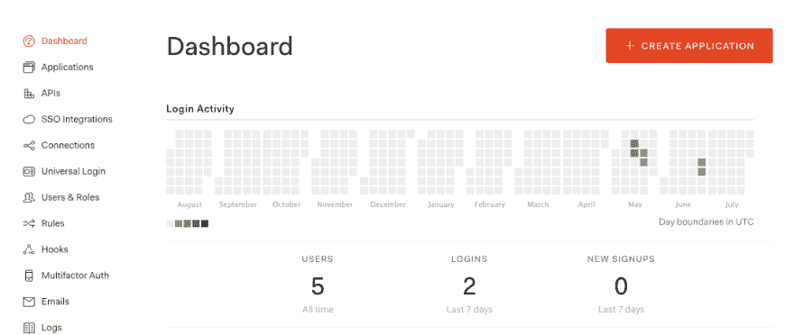
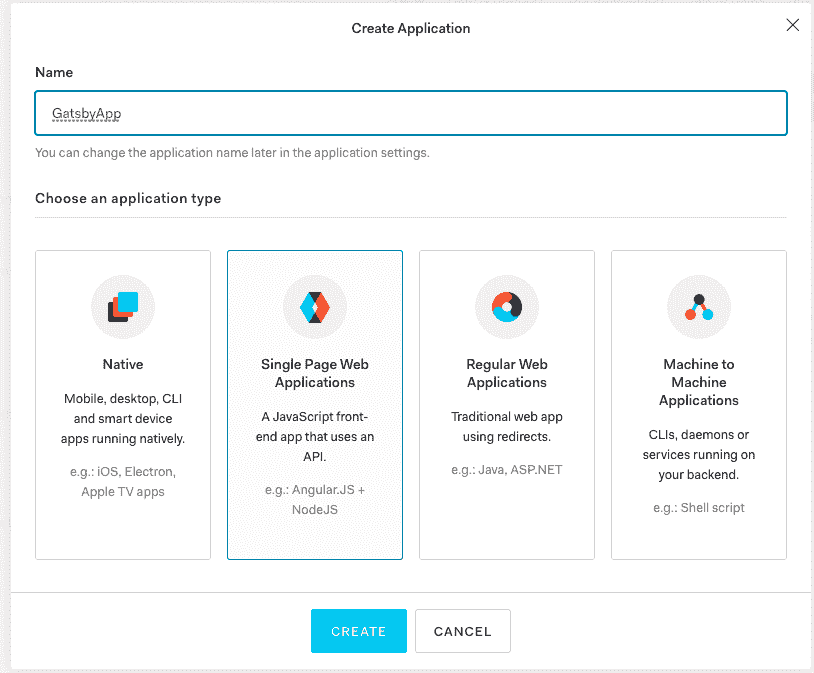
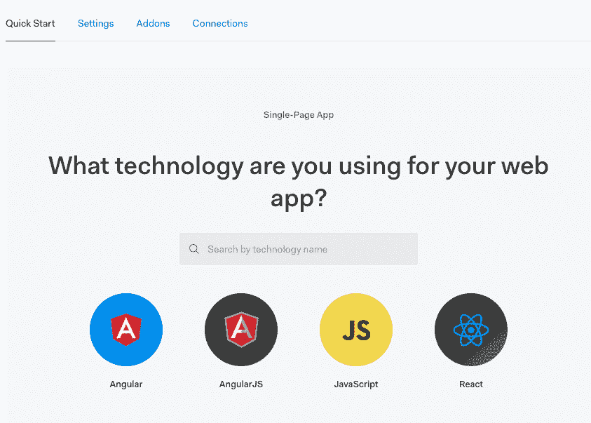

# 使用 Auth0 向 Hasura 和 Gatsby web 应用程序添加身份验证

> 原文：<https://dev.to/hasurahq/adding-authentication-to-hasura-and-gatsby-web-app-with-auth0-4749>

不久前，我们与 [Jason Lengstorf](https://twitter.com/jlengstorf) 就如何与 [Gatsby](https://www.gatsbyjs.org) 和 [Hasura](https://hasura.io) 一起创建一个实时 web 应用进行了现场直播。如果你不熟悉 Hasura，可以看看这篇博文:

> 弗拉迪米尔·诺维克[@弗拉迪米尔诺维克](https://dev.to/vladimirnovick)我刚刚发布了毫不费力的实时 GraphQL API 与无服务器业务逻辑运行在任何云[link.medium.com/DET666lI3T](https://t.co/qr5UNZTGYJ)上午 11:47-05 2019 年 2 月[](https://twitter.com/intent/tweet?in_reply_to=1092751461824585728)[](https://twitter.com/intent/retweet?tweet_id=1092751461824585728)[](https://twitter.com/intent/like?tweet_id=1092751461824585728)

在这个实时流中，我们创建了 Gatsby 静态 web 应用程序，并使用 GraphQL 订阅添加了很酷的实时功能。对于这个任务，我们使用 [Hasura](https://hasura.io) 实时编码 GraphQL 服务器。

液体错误:内部

在那个流中，我还没有涉及 auth，所以最近我们决定和 Jason 一起做另一个流来弥补这个缺口。

[https://www.youtube.com/embed/2xscUCo4KVs](https://www.youtube.com/embed/2xscUCo4KVs)

在这个流中，我们没有讨论 Gatsby 设置，但是我们讨论了使用 Auth0 的 Hasura 认证解决方案。我还在我的博客文章[中写了其他认证方法，Hasura 认证解释了](https://dev.to/hasurahq/hasura-authentication-explained-2c95)，但是对于 Auth0 步骤如下:

# 设置 Auth0 域

前往[auth0.com](https://auth0.com)并登录，如果您还没有帐户，请注册。登录后，您将进入仪表板屏幕。在那里，你需要创建你的应用程序。

[](https://res.cloudinary.com/practicaldev/image/fetch/s--DuXP40Gr--/c_limit%2Cf_auto%2Cfl_progressive%2Cq_auto%2Cw_880/https://thepracticaldev.s3.amazonaws.com/i/w8eo6or3rue43bvd2q1v.png)
[T6】](https://res.cloudinary.com/practicaldev/image/fetch/s--q5PogcIR--/c_limit%2Cf_auto%2Cfl_progressive%2Cq_auto%2Cw_880/https://thepracticaldev.s3.amazonaws.com/i/9eeiaxpmkyogefobzn9b.png)

我们将选择一个单页应用程序，在我们创建应用程序后，我们可以选择如何将 Auth0 集成到我们的 web 应用程序中。

[](https://res.cloudinary.com/practicaldev/image/fetch/s--RyeQGthL--/c_limit%2Cf_auto%2Cfl_progressive%2Cq_auto%2Cw_880/https://thepracticaldev.s3.amazonaws.com/i/2qrigqw5jba9oqhnmr4l.png)

我不会涵盖这一步，因为它是不言自明的，并且在 Auth0 控制台中有很好的记录。一个重要的部分是，我们需要将`Authorization: Bearer`令牌路径到我们的 GraphQL API。

# 用 Auth0 设置我们的 Hasura

现在，当我们将正确的 auth token 传递给 Hasura 时，我们需要执行几个步骤:

*   注册时，我们需要在 Hasura 端点上执行突变，并插入一个用户 id 为 Auth0 的新用户。这可以通过使用 Auth0 规则来完成。从我们的`Dashboard`中，我们导航到`Rules`选项卡并创建一个新规则。该规则的代码将是:

```
function (user, context, callback) {
  const userId = user.user_id;
  const nickname = user.nickname;

  const admin_secret = "adminsecret";
  const url = "https://myendpoint/v1/graphql";
  request.post({
      headers: {'content-type' : 'application/json', 'x-hasura-admin-secret': admin_secret},
      url:   url,
      body:    `{\"query\":\"mutation($userId: String!, $nickname: String) {\\n          insert_users(\\n            objects: [{ id: $userId, name: $nickname }]\\n            on_conflict: {\\n              constraint: users_pkey\\n              update_columns: [last_seen, name]\\n            }\\n          ) {\\n            affected_rows\\n          }\\n        }\",\"variables\":{\"userId\":\"${userId}\",\"nickname\":\"${nickname}\"}}`
  }, function(error, response, body){
       console.log(body);
       callback(null, user, context);
  });
} 
```

Enter fullscreen mode Exit fullscreen mode

这里我们将使用 Hasura admin secret 进行服务器到服务器的通信。

**记住——永远不要在客户端使用管理密码**

*   在我们的令牌生成之前，我们需要向 JWT 令牌添加所谓的自定义声明，这样哈苏拉将能够从 JWT 令牌获得所需的信息。所以我们需要用下面的代码创建另一个规则:

```
function (user, context, callback) {
  const namespace = "https://hasura.io/jwt/claims";
  context.idToken[namespace] = 
    { 
      'x-hasura-default-role': 'user',
      'x-hasura-allowed-roles': ['user'],
      'x-hasura-user-id': user.user_id
    };
  callback(null, user, context);
} 
```

Enter fullscreen mode Exit fullscreen mode

*   最后一步是添加`HASURA_GRAPHQL_JWT_SECRET`作为 Hasura 的环境变量。要生成配置，您可以使用以下工具:[https://hasura.io/jwt-config](https://hasura.io/jwt-config)

# 总结

您可以在我之前提到的博客文章中阅读更多关于身份验证和权限的内容，或者通过跟随我们的 Hasura 后端教程(网址为 [learn.hasura.io](https://learn.hasura.io) )在大约 30 分钟内创建自己的带有身份验证和访问控制的实时 GraphQL 后端来获得一些实践经验