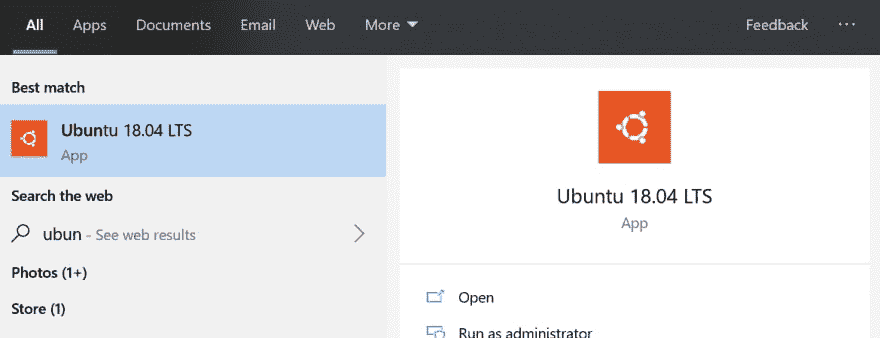
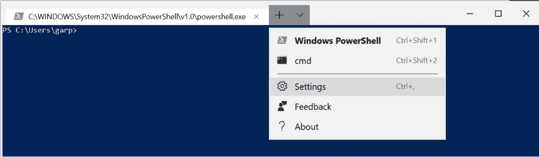
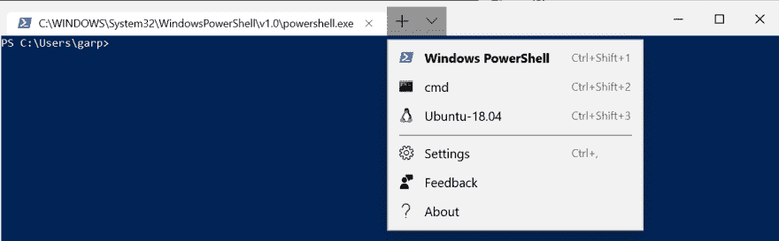
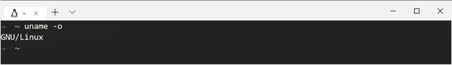

# 将 MSL 外壳添加到 Windows 终端

> 原文：<https://dev.to/ganesshkumar/adding-msl-shell-to-windows-terminal-gil>

在 Windows 10 上使用 Windows Subsystem for Linux，WSL 安装了任何风格的 Linux 之后，你打开微软最新的 Windows 终端，并没有在其中找到你的 linux shell？

那么这本指南是给你的。

*   确保您已经从 Windows 商店安装了所需的 Linux 版本。

[](https://res.cloudinary.com/practicaldev/image/fetch/s--BIRIhYmJ--/c_limit%2Cf_auto%2Cfl_progressive%2Cq_auto%2Cw_880/https://thepracticaldev.s3.amazonaws.com/i/6ysprb0yxpvvgg029976.png)

*   在 Windows 终端中，单击下拉图标并选择设置。或者，您可以使用`Ctrl + ,`快捷方式打开它。这将在您的文本编辑器中打开`profiles.json`文件

[](https://res.cloudinary.com/practicaldev/image/fetch/s--OaFVCJUG--/c_limit%2Cf_auto%2Cfl_progressive%2Cq_auto%2Cw_880/https://thepracticaldev.s3.amazonaws.com/i/hamezss5fa5k90lceggo.png)

*   在 profiles.json 文件中，找到`profiles`部分。profiles 是一个数组，数组中的每个元素都映射到一个 shell (powershell 或 cmd 或任何 linux shell)

```
 "profiles" : 
    [
        {
            "acrylicOpacity" : 0.5,
            "background" : "#012456",
            "closeOnExit" : true,
            "colorScheme" : "Campbell",
            "commandline" : "powershell.exe",
            "cursorColor" : "#FFFFFF",
            "cursorShape" : "bar",
            "fontFace" : "Consolas",
            "fontSize" : 10,
            "guid" : "{61c54bbd-c2c6-5271-96e7-009a87ff44bf}",
            "historySize" : 9001,
            "icon" : "ms-appx:///ProfileIcons/{61c54bbd-c2c6-5271-96e7-009a87ff44bf}.png",
            "name" : "Windows PowerShell",
            "padding" : "0, 0, 0, 0",
            "snapOnInput" : true,
            "startingDirectory" : "%USERPROFILE%",
            "useAcrylic" : false
        },
        {
            "acrylicOpacity" : 0.75,
            "closeOnExit" : true,
            "colorScheme" : "Campbell",
            "commandline" : "cmd.exe",
            "cursorColor" : "#FFFFFF",
            "cursorShape" : "bar",
            "fontFace" : "Consolas",
            "fontSize" : 10,
            "guid" : "{0caa0dad-35be-5f56-a8ff-afceeeaa6101}",
            "historySize" : 9001,
            "icon" : "ms-appx:///ProfileIcons/{0caa0dad-35be-5f56-a8ff-afceeeaa6101}.png",
            "name" : "cmd",
            "padding" : "0, 0, 0, 0",
            "snapOnInput" : true,
            "startingDirectory" : "%USERPROFILE%",
            "useAcrylic" : true
        }
    ], 
```

*   在这个数组中为您的 linux shell 添加一个条目。要填充它，您需要以下值
    *   命令来启动您的 shell
        *   要获得 WSL shells 列表，运行命令`wsl.exe --list`
        *   要启动特定的 WSL shell，请运行`wsl.exe -d <shell_name_from_above>`
        *   要将主目录设置为默认目录，请在 wsl.exe 命令中添加`~`
        *   我们启动 Ubuntu-18.04 的命令是`wsl.exe ~ -d Ubuntu-18.04`
    *   新的 GUID(此数组中的唯一 ID)
        *   通过运行`uuidgen`命令，可以从 linux shell 中生成一个随机 GUID
        *   用新的 GUID 替换下面代码片段中的`<guid>`(保持 paranthesis 不变)
    *   条目的名称和图标
        *   给一个可识别的名字，比如`Ubuntu-18.04`
        *   对于图标，您可以给出系统中的任何文件系统路径。我选择使用与 Windows 终端一起打包的默认 linux 企鹅徽标。因此，我将`ms-appx:///ProfileIcons/{9acb9455-ca41-5af7-950f-6bca1bc9722f}.png`设置为我的图标路径。

```
 {
            "acrylicOpacity":0.75,
            "closeOnExit":true,
            "colorScheme":"Campbell",
            "commandline":"wsl.exe ~ -d Ubuntu-18.04",
            "cursorColor":"#FFFFFF",
            "cursorShape":"bar",
            "fontFace":"Consolas",
            "fontSize":12,
            "guid":"{<guid>}",
            "historySize":9001,
            "icon" : "ms-appx:///ProfileIcons/{9acb9455-ca41-5af7-950f-6bca1bc9722f}.png",
            "name":"Ubuntu-18.04",
            "padding":"0, 0, 0, 0",
            "snapOnInput":true,
            "startingDirectory":"%USERPROFILE%",
            "useAcrylic":true
        } 
```

*   只要您保存了`profiles.json`文件，Windows 终端就会获取这些更改，您就可以看到您的 WSL shell 了。

[](https://res.cloudinary.com/practicaldev/image/fetch/s--R2h7phKw--/c_limit%2Cf_auto%2Cfl_progressive%2Cq_auto%2Cw_880/https://thepracticaldev.s3.amazonaws.com/i/zloo3vpsgvhdhxoge317.png)

*   启动一个 shell 并开始配置它。我已经将我的 shell 配置为扩展名为`oh-my-zsh`的`zsh` shell。

[](https://res.cloudinary.com/practicaldev/image/fetch/s--4Ywn8F6x--/c_limit%2Cf_auto%2Cfl_progressive%2Cq_auto%2Cw_880/https://thepracticaldev.s3.amazonaws.com/i/rb9036qyltxyn202a986.png)