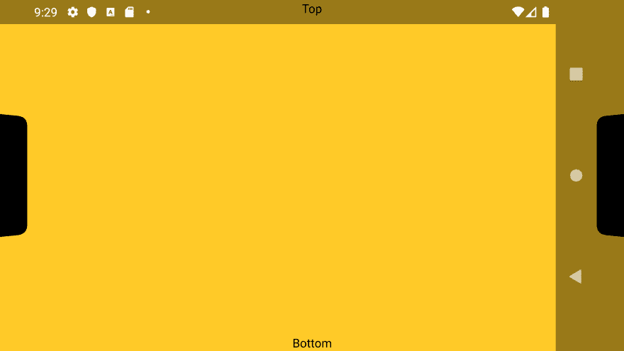
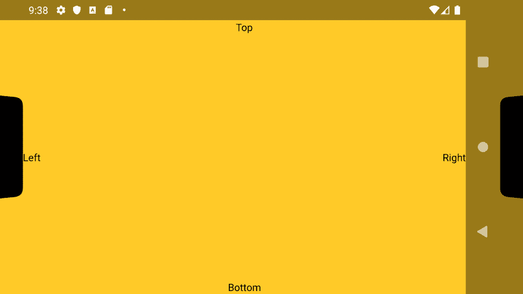
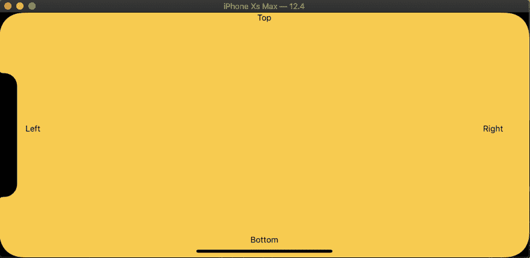
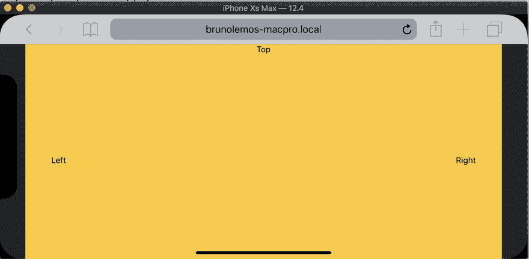
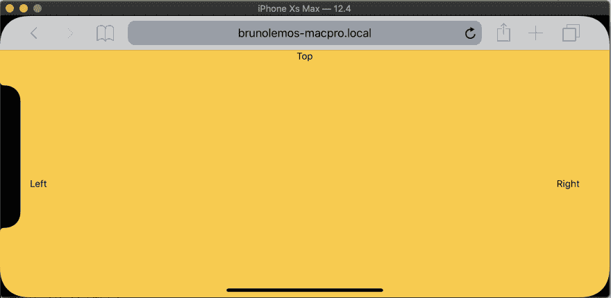

# 为您的 React 原生应用添加 Notch 支持:Android、iOS 和 Web

> 原文：<https://dev.to/brunolemos/adding-notch-support-to-your-react-native-android-app-3ci3>

在本教程中，我们将学习如何用几行代码在 Android、iOS 和 Web 上正确支持缺口(又名“显示剪切”)。

这是我们的 Android 模拟器，展示了一个`Double cutout`:

[](https://res.cloudinary.com/practicaldev/image/fetch/s--Gri5ZY2e--/c_limit%2Cf_auto%2Cfl_progressive%2Cq_auto%2Cw_880/https://thepracticaldev.s3.amazonaws.com/i/43d6q5g8xat0c80mzzl0.png)

> 如果你没有带 Notch 的 Android 设备，打开一个 Android 模拟器，通过进入`Android Settings > System > Advanced > Developer options > Display cutout > Double cutout`来模拟显示剪切

你可以在上面的截图中看到，壁纸显示在槽口后面。这是正确的行为，你的应用也应该这样做。

但是，让我们看看当我们呈现一个简单的应用程序时会发生什么:

[](https://res.cloudinary.com/practicaldev/image/fetch/s--CvISvoOn--/c_limit%2Cf_auto%2Cfl_progressive%2Cq_auto%2Cw_880/https://thepracticaldev.s3.amazonaws.com/i/x0kes5ij335w3anar4w4.png)

默认情况下，应用程序不处理缺口。你可以在上面的图片中看到，它渲染了两个黑条，让用户感觉屏幕变小了。这是不好的，让我们来解决这个问题。

有趣的事情开始了。经过几个小时的研究和尝试不同的方法，我发现这是你需要添加到你的`MainActivity.java` :
中的

```
public class MainActivity extends ReactActivity { 
+    @Override
+    protected void onCreate(Bundle savedInstanceState) {
+        if (Build.VERSION.SDK_INT >= Build.VERSION_CODES.P) {
+            WindowManager.LayoutParams layoutParams = new WindowManager.LayoutParams();
+            layoutParams.layoutInDisplayCutoutMode = WindowManager.LayoutParams.LAYOUT_IN_DISPLAY_CUTOUT_MODE_SHORT_EDGES;
+            getWindow().setAttributes(layoutParams);
+            getWindow().addFlags(WindowManager.LayoutParams.FLAG_TRANSLUCENT_STATUS);
+            getWindow().addFlags(WindowManager.LayoutParams.FLAG_TRANSLUCENT_NAVIGATION);
+        }
+
+        super.onCreate(savedInstanceState);
+    } 
```

这段代码做了三件事:将`layoutInDisplayCutoutMode`设置为`edgeInsets`以停止显示黑条，并将`status`和`navigation`都设置为`translucent`以在凹口和导航按钮后面呈现我们的应用程序。

下面是添加这段代码后的结果:

[](https://res.cloudinary.com/practicaldev/image/fetch/s--YX2FZ2Uk--/c_limit%2Cf_auto%2Cfl_progressive%2Cq_auto%2Cw_880/https://thepracticaldev.s3.amazonaws.com/i/cr974dpqm5zku2k7uzkd.png)

是啊！这是一个进步。现在我们使用整个屏幕。但你可以看到文本内容被隐藏的缺口。

React Native 有一个内置组件叫做 [SafeAreaView](https://facebook.github.io/react-native/docs/safeareaview) 。它解决了这个问题，但是...只在 iPhone X 上，它仍然不支持 Android。

感谢 [@janicduplessis](https://twitter.com/janicduplessis) ，我们可以使用[react-native-safe-area-context](https://github.com/th3rdwave/react-native-safe-area-context)，它支持我们想要的所有平台:iOS、Android 和 Web！

> 如果您使用 Expo，这个库将包含在 SDK v35 中
> 
> 如果你使用 react-native < 0.60, you can apply [这个补丁](https://gist.github.com/brunolemos/ec886065b695d54ba25af7de47475c90#file-react-native-safe-area-context-0-3-5-patch)使用[补丁包](https://github.com/ds300/patch-package)

api 看起来是这样的:

```
const safeAreaInsets = useSafeArea() 
```

我们将填充添加到`View` :

```
<View
  style={{
    flex: 1,
    paddingTop: safeAreaInsets.top,
    paddingBottom: safeAreaInsets.bottom,
    paddingLeft: safeAreaInsets.left,
    paddingRight: safeAreaInsets.right,
  }}
> 
```

这是最后的结果:

[](https://res.cloudinary.com/practicaldev/image/fetch/s--uX7EpTXR--/c_limit%2Cf_auto%2Cfl_progressive%2Cq_auto%2Cw_880/https://thepracticaldev.s3.amazonaws.com/i/bttzd6occxsuxnz7skdd.png)

它完美地工作🎉🎉🎉Android 已经准备好了，现在让我们看看我们的 iOS 应用程序看起来怎么样:

[](https://res.cloudinary.com/practicaldev/image/fetch/s--T0RWY-50--/c_limit%2Cf_auto%2Cfl_progressive%2Cq_auto%2Cw_880/https://thepracticaldev.s3.amazonaws.com/i/iu1l559zbtxig483pf5u.png)

iOS 也已经很完美了！🎉那是三局两胜。web 怎么样？让我们看看:

[](https://res.cloudinary.com/practicaldev/image/fetch/s--Mt8FhIgZ--/c_limit%2Cf_auto%2Cfl_progressive%2Cq_auto%2Cw_880/https://thepracticaldev.s3.amazonaws.com/i/h3wc0zcbizv5nteeqosy.png)

哼，网页还是显示黑条。

> 如果你的应用还不支持 web，看看我的另一个教程:[如何使用 React Native、react-native-web 和 monorepo](https://dev.to/brunolemos/tutorial-100-code-sharing-between-ios-android--web-using-react-native-web-andmonorepo-4pej) 在 iOS、Android & Web 之间共享代码

但是这很容易解决，你只需要将`viewport-fit=cover`添加到你的`viewport`元标签:

```
-<meta name="viewport" content="width=device-width, initial-scale=1"> +<meta name="viewport" content="width=device-width, initial-scale=1, viewport-fit=cover"> 
```

[](https://res.cloudinary.com/practicaldev/image/fetch/s--yx7hpBhI--/c_limit%2Cf_auto%2Cfl_progressive%2Cq_auto%2Cw_880/https://thepracticaldev.s3.amazonaws.com/i/u3cg890xnzb3grah5tpf.png)

瞧！我们的应用程序现在正确地支持 iOS，Android 和 Web 上的刻痕！再一次，多亏了令人敬畏的 react-native-safe-area-context，事情变得如此简单。

下面是上面代码的要点，T2 的推文，如果你想转发的话，还有我的推特账号: [@brunolemos](https://twitter.com/brunolemos) 💚

感谢阅读！