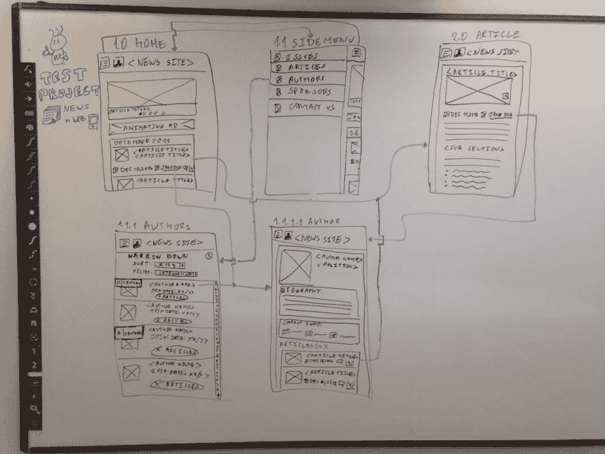
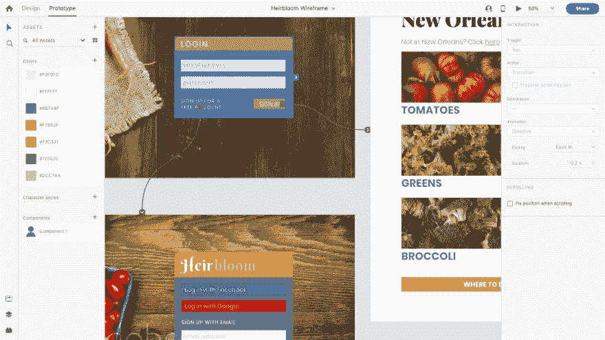

# Adobe XD 有助于将原型带到下一个级别

> 原文：<https://dev.to/danmurphy79/adobe-xd-helps-bring-prototypes-to-the-next-level-5fbf>

应用程序设计的早期阶段可能会很混乱。很多想法都被抛来抛去，所有的事情都被提交到白板上进行考虑。在最初的想法开始成型后，白板往往会变得更加混乱，试图给这种混乱添加看似随机的形状和箭头的线框往往只会让事情变得更加混乱。更不用说，一个应用程序在很大程度上与使用该应用程序的触觉有关，你无法用干擦记号笔和白板来复制这一点。

 
这就是原型软件为你的团队设计注入活力的地方。有很多可供选择，包括 Sketch、Axure 和 Proto.io，但如果你像我一样，对 Adobe Creative Suite 的一些其他应用感到舒适，Adobe XD 是一个很好的选择。
借助 XD，UI/UX 设计师可以使用画板无缝引入设计团队在 Photoshop、Illustrator 或 Sketch 中创建的文件，并赋予它们交互性。有一个有很多菜单项的页面？只需在原型模式下选择一个项目，抓住蓝色手柄，将一条线拖到您希望它链接到的页面。然后，当你点击“播放”按钮预览你的设计时，链接会像你希望的那样在应用上线时运行。
 
Adobe XD 能够适应各种各样的屏幕尺寸，使团队能够确切地看到他们的应用程序在不同屏幕尺寸和维度的不同设备上的表现。为了确保您的应用程序在正确的设备上有正确的感觉，Adobe 提供了一系列免费的 UI 套件，确保 iOS 或 Android 中的滑块和按钮看起来就像它们在操作系统的其他部分一样。可定制的收藏允许更多地访问将在整个应用程序中重复使用的项目，从字体到图标到颜色。

Adobe XD 允许团队所有级别的人员进行协作，从设计师到工程师，再到产品所有者和利益相关者。一旦设计的第一稿完成并提交审阅，就会向团队的每个成员发送一个链接。从那里，他们可以提供关于用户体验或设计的反馈。有了 pins，反馈可以更加具体，将更改精确到粒度级别。

一旦给出了评论，进行了更改，并且每个人都对应用程序的外观和感觉感到满意，XD 提供了一个共享开发的选项，它为开发人员提供了所有相关信息和文件的链接，从每个元素使用的颜色和字体到 css 样式。这使得每个人都在同一页面上，并使设计师、工程师和产品所有者之间的合作更加容易。