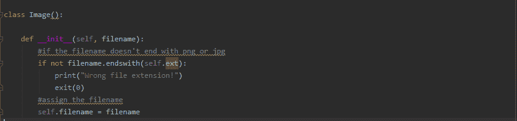
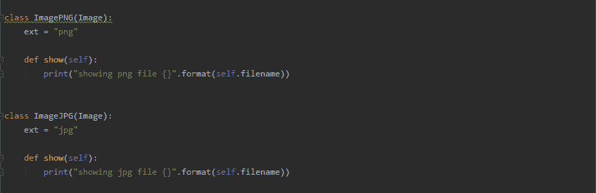
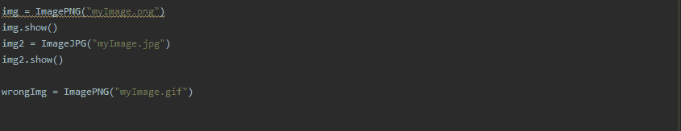
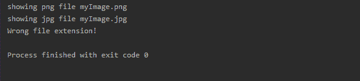

# 高级 Python: OOP 多态性

> 原文：<https://dev.to/tim_tr/advanced-python-oop-polymorphism-5a80>

编程中的大量内容都是关于编程中所谓的“面向对象”的一面。

Python 也支持 OOP。本教程将向您展示如何在面向对象的代码中实现多态性。

多态性是关于一个拥有多个子类的超类。子类从超类继承，超类不需要知道哪个子类正在继承和执行。如果这还没有意义，请不要担心，看看下面的例子就明白了:

假设我们有一个显示图像的程序，但是图像可以是 PNG 或 JPG 格式。在我们的例子中，程序将根据图像的格式打印不同的东西。

因此，我们将从创建所有子类都将继承的基类开始。当图像具有错误的扩展名时，该类也会打印一个错误。

现在来看将从“图像”类继承的子类。这些类还有一个名为“show”的方法，它将打印一条定制的消息。注意父类/超类不需要知道哪个子类继承才能工作。

现在让我们制作对象并调用“显示”方法:

这是输出结果:

希望你学到了东西，下期见:)！