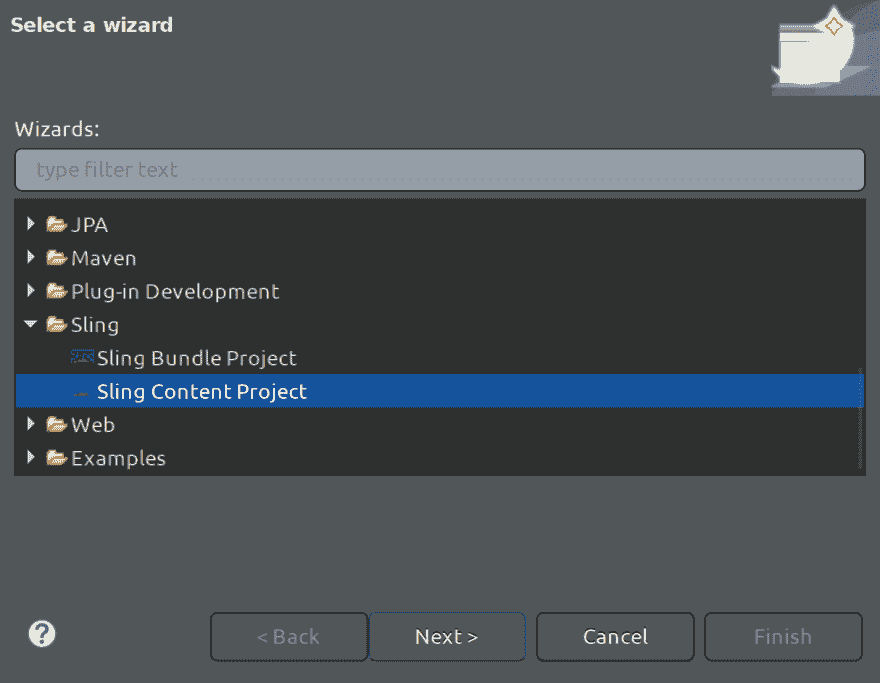
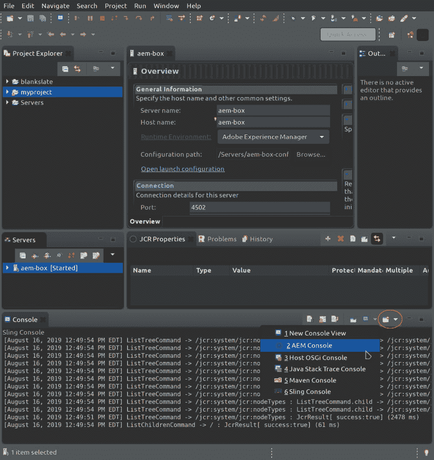
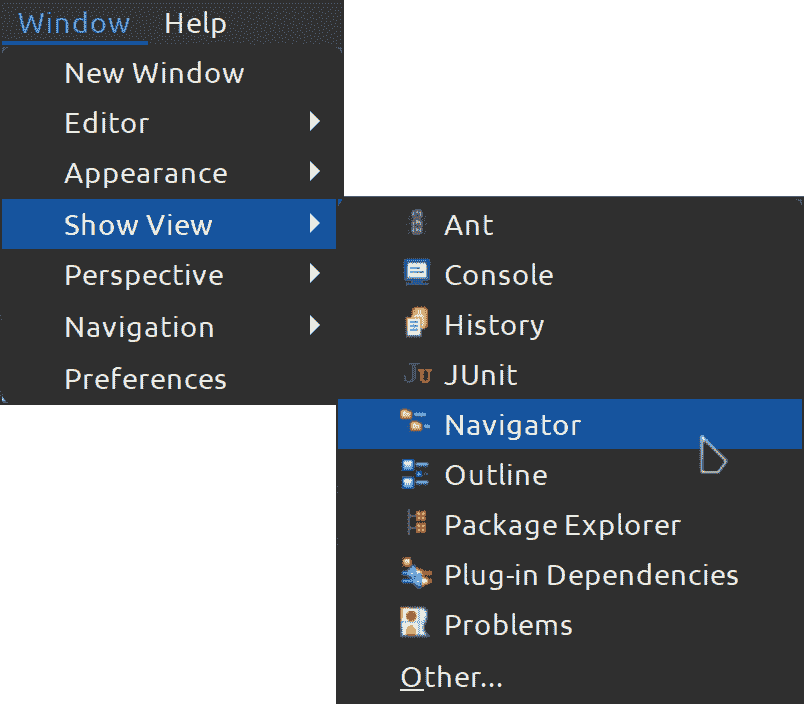
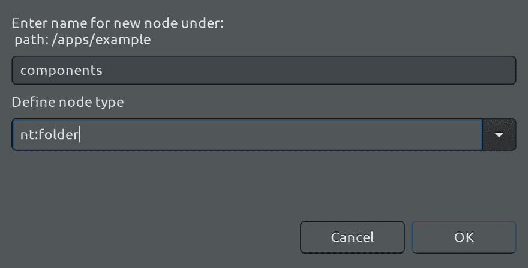
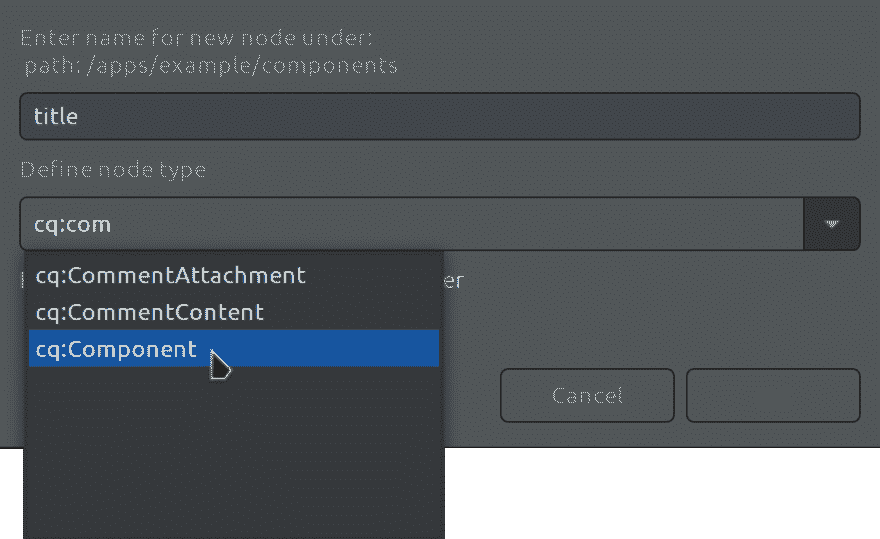
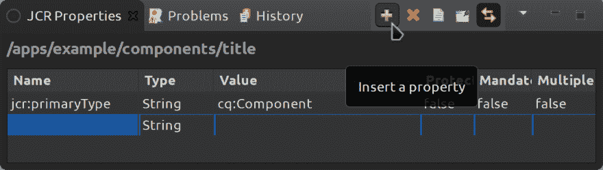

# 用于 Eclipse 的 AEM 开发工具

> 原文：<https://dev.to/jimfrenette/aem-developer-tools-for-eclipse-c1f>

这个页面包含了使用 Eclipse 和 Adobe Experience Manager (AEM)的技巧和资源。第一篇技巧文章介绍了如何设置一个简单的 Sling 内容项目，并使用它在本地文件系统和 AEM 的 Java 内容存储库(JCR)之间传输文件。

### 要求

*   下载并安装面向 Java EE 开发人员的 Eclipse IDE(Eclipse Kepler 或更新版本)，[eclipse.org/downloads/packages/release](https://www.eclipse.org/downloads/packages/release)

*   安装 [AEM 开发者工具](https://eclipse.adobe.com/aem/dev-tools/)了解更多信息，[helpx . adobe . com/experience-manager/6-4/sites/developing/using/AEM-eclipse . html](https://helpx.adobe.com/experience-manager/6-4/sites/developing/using/aem-eclipse.html)

### 设置

1.  **AEM 透视图**
    从菜单中选择窗口>透视图>打开透视图> AEM

2.  **新建吊索内容项目**
    从菜单中选择文件>新建>项目>吊索>吊索内容项目

    <figure>[](https://res.cloudinary.com/practicaldev/image/fetch/s--J2pHQpZg--/c_limit%2Cf_auto%2Cfl_progressive%2Cq_auto%2Cw_880/https://thepracticaldev.s3.amazonaws.com/i/rxvxmivihvbxmk3n94ej.png) 

    <figcaption>如果需要勾选“显示所有向导”</figcaption>

    </figure>

3.  出现提示时，选择或创建 AEM 服务器，或者在“服务器”面板中右键单击并选择“新建”>“服务器”>“Adobe Experience Manager”。对于使用默认管理员帐户凭据的本地主机 AEM 服务器实例，默认设置应该可以正常工作。

    > 如果您的 AEM 实例运行在一个[虚拟机(VM)](https://jimfrenette.com/2019/01/aem-dispatcher-centos-virtual-machine-setup/) 中，您可能希望更新您的 hosts 文件，以便将主机名映射到机器的 IP 地址。例如，`192.168.122.111 aem-box`

4.  **资源**T3】如果在项目创建向导期间没有添加服务器，或者需要添加项目资源。
    在 Servers 面板中，
    右键单击服务器，
    选择 Add and Remove，
    拖动可用资源到 configured 栏，
    例如 add `myproject`

5.  **AEM 控制台**
    从打开的控制台菜单(下图中的红圈)中，选择 AEM 控制台来监控服务器启动同步和后续文件传输。
    在服务器面板中，右键单击服务器，根据需要启动或停止。

    [](https://res.cloudinary.com/practicaldev/image/fetch/s--oyX36gbE--/c_limit%2Cf_auto%2Cfl_progressive%2Cq_auto%2Cw_880/https://thepracticaldev.s3.amazonaws.com/i/ztwnpievp8pbqxq6xmxh.png) 
    <small>AEM 日食透视并打开控制台菜单</small>

### 导航器

默认情况下，Project Workspace 选项卡忽略显示从 JCR 导入的`.content.xml`文件。这可以使用面板中的下拉菜单进行更改。选择“过滤器和自定义”以打开对话框来配置要显示的文件。

我更喜欢将 Navigator 面板添加到透视图中，而不是使用它，因为它将显示我所有的文件和文件夹，无需任何修改。

[](https://res.cloudinary.com/practicaldev/image/fetch/s--55EpLxuM--/c_limit%2Cf_auto%2Cfl_progressive%2Cq_auto%2Cw_880/https://thepracticaldev.s3.amazonaws.com/i/5x6kd0igcetsypihd497.png) 

<figure>

<figcaption>
向透视图添加导航器
</figcaption>

</figure>

### 传送文件

要将文件和文件夹传输到 AEM 服务器，请右键单击文件或文件夹，然后选择“导出到服务器”。这可以在导航器或项目面板中完成。“Sling 存储库导出”对话框将提示您输入要将内容导出到的存储库。通常，这将与配置的 AEM 服务器的名称相匹配。

要从 AEM 服务器传输文件和文件夹，请右键单击文件或文件夹，然后选择“从服务器导入”。

> 如果您在尝试导入/导出\
> **时收到此错误，说明在此项目中没有找到有效的过滤器！** \
> 使用 Eclipse 中的项目浏览器从工作区中删除项目。然后使用向导重新创建它。如果你的[项目被链接到](#project-linking)，忽略`jcr_root`已经存在的消息，它是一个符号链接。

要将保存的文件更改自动传输到服务器，请检查服务器发布设置。选项包括:

*   从不自动发布
*   资源更改时自动发布
*   生成事件后自动发布

#### 导入

**用 CRXDE Lite 创建的文件夹和文件**

对于已经在 CRXDE Lite 中创建的文件夹、文件和节点，在 Eclipse 中还没有相应的 Sling 内容项目。这里有一些关于如何从 JCR 导入这些内容的技巧。

1.  按照上面“设置>步骤 2”中的描述创建新的 Sling 内容项目。

2.  编辑`META-INF/vault`中的`filter.xml`文件，根据需要包含 JCR 存储库文件夹路径。例如，

```
<workspaceFilter vesion="1.0">
  <filter root="/apps/myproject"/>
  <filter root="/content/my-project"/>
</workspaceFilter> 
```

1.  在新的 Sling 内容项目`jcr_root`文件夹中，根据需要使用 CRXDE Lite 项目中使用的名称重命名`apps`和`content`下的`example`文件夹。

2.  现在，您应该能够右键单击文件夹并选择 Sling > Import from server...

### 项目链接

您可能有一个现有的 AEM repo 和/或项目文件夹，您不希望将其移动到 eclipse 工作区中。这些步骤将向您展示如何将它们链接到上面创建的新的 Sling 内容项目。

> 使用向导创建项目时，请考虑使用与您链接的现有 AEM 项目文件夹相同的名称。如果重命名由向导创建的项目，可能需要将其重新附加到服务器。在服务器面板中右键单击并选择添加和删除。

1.  链接一个已经有自己的`jcr_root`和`META-INF`文件夹的现有 AEM 项目。移除向导创建的`jcr_root`和`META-INF`文件夹，如果它们已经存在于源项目中。举个例子，

```
cd ~/eclipse-workspace/myproject
rm -rf jcr_root
rm -rf META-INF 
```

1.  将新的`eclipse-workspace`项目符号链接到现有的 AEM 项目`jcr_root`。例如，如果您现有的项目`jcr_root`在`/home/dinesh/dev/aem/myproject/src/main/content/jcr_root`中

```
cd ~/eclipse-workspace/myproject

ln -sv /home/dinesh/dev/aem/myproject/src/main/content/jcr_root jcr_root 
```

1.  重复`META-INF`

```
ln -sv /home/dinesh/dev/aem/myproject/src/main/content/META-INF META-INF 
```

### 组件

此示例显示了如何创建组件。

在项目面板中，展开`myproject` > `jcr_root[nt:folder]`。

右键单击`/apps/example`文件夹，选择新建>节点。

[](https://res.cloudinary.com/practicaldev/image/fetch/s--tBwVQzk8--/c_limit%2Cf_auto%2Cfl_progressive%2Cq_auto%2Cw_880/https://thepracticaldev.s3.amazonaws.com/i/bq8dt9jb6bgegkamsnic.png) 

<figure>

<figcaption>
新增节点菜单
</figcaption>

</figure>

**姓名** : `components`

[](https://res.cloudinary.com/practicaldev/image/fetch/s--YoWPnba2--/c_limit%2Cf_auto%2Cfl_progressive%2Cq_auto%2Cw_880/https://thepracticaldev.s3.amazonaws.com/i/bbk6ktljhwwqrfy0ds3o.png) 

<figure>

<figcaption>
新建 nt:文件夹节点
</figcaption>

</figure>

> 如果出现此错误:无法验证节点类型，因为项目 myproject 未与服务器关联或服务器未启动。启动服务器和/或验证项目是已配置的[资源](#resources)。

右键单击新的`components`文件夹并选择新的>节点。

[](https://res.cloudinary.com/practicaldev/image/fetch/s--eenEbzmf--/c_limit%2Cf_auto%2Cfl_progressive%2Cq_auto%2Cw_880/https://thepracticaldev.s3.amazonaws.com/i/pweoc5olsfr2t7nrsqar.png) 

<figure>

<figcaption>
新 cq:组件节点
</figcaption>

</figure>

**姓名** : `title`

#### 代理组件

对于新的`title`组件，我们将使用[代理组件模式](https://docs.adobe.com/content/help/en/experience-manager-core-components/using/developing/guidelines.html#proxy-component-pattern)。更多信息，[创建代理组件](https://docs.adobe.com/content/help/en/experience-manager-core-components/using/get-started/using.html#create-proxy-componentsinformation)包含更多关于使用核心组件的文档。

选择`title`组件，在 JCR 属性面板中启用它的上下文。选择绿色加号以插入属性。

[](https://res.cloudinary.com/practicaldev/image/fetch/s--ndZ1NGme--/c_limit%2Cf_auto%2Cfl_progressive%2Cq_auto%2Cw_880/https://thepracticaldev.s3.amazonaws.com/i/vr5hbg33e6bw5e00se2g.png) 

<figure>

<figcaption>
JCR 属性面板-插入属性
</figcaption>

</figure>

添加以下属性，以便将核心组件版本`v1`与超类型一起使用。

**姓名** : `sling:resourceSuperType`

**值** : `core/wcm/components/title/v1/title`

> 定期导出到 AEM JCR，以验证和测试您的代码更改。

最初发表于[jimfrenette.com/aem/eclipse-developer-tools](https://jimfrenette.com/aem/eclipse-developer-tools/)