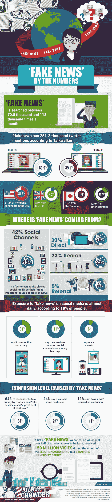

# 人工智能控制“假新闻”市场！

> 原文：<https://dev.to/dev_ganesh/ai-to-control-the-fake-news-market-20n1>

假新闻是互联网走向错误方向的原因:无论是来自可疑的网站还是来自虚假的社交媒体档案，将假新闻放到网上仍然是当前互联网形势下最大的(如果不是最大的)问题之一。当马克·扎克伯格在[国会](https://www.theguardian.com/technology/2018/apr/11/mark-zuckerbergs-testimony-to-congress-the-key-moments)接受讯问时，他说“我们需要的是一个[人工智能](https://dev.to/apium_hub/artificial-intelligence--in-math-i-trust-5fhl)来阻止整个假新闻市场，他能够理解哪些内容来自相关来源，哪些信息没有报道真实的事实”。现在的问题是:我们是否已经到了人工智能可以理解什么是“真”什么不是的地步？让我们试着用更简单的方式来分解它。

## 它是如何工作的

* * *

整个过程将基于超快速分割测试:基本上，当涉及到研究一篇文章是否合法时，人们通常会做的是简单的谷歌搜索，如果有许多文章以相同的方式报道相同的新闻，那么它应该是真实的。人工智能将被要求立即做到这一点，查看多个结果，并遵循由[谷歌算法](http://fortune.com/2017/04/25/google-search-algorithm-fake-news/)列出的网站信任流。一旦所有的结果都得到阐述，编程的人工智能将决定结果是否遵循相关来源的信息，例如纽约时报。

### 关联语言特征

检测假新闻最可靠的方法之一是检查不同来源文章的共同语言特征。这些特征包括情绪、复杂性和结构。经常制造假新闻的消息来源更可能使用夸张、主观和充满情感的词语。

假新闻的另一个共同特征是耸人听闻的标题。由于标题是吸引观众注意力的关键，因此标题已经成为吸引更多人兴趣的工具。假新闻几乎总是使用耸人听闻的标题，因为它们只是部分受到真实事实的限制。

已经有一种人工智能(机器学习算法)被广泛用于打击垃圾邮件。这些算法分析文本，并确定电子邮件是否来自一个真实的人，或者它是否是一个大规模分发的消息，旨在出售某些东西或传播政治信息。改进和调整这些算法将使检查和比较一篇文章的标题和正文与文章的实际内容成为可能。这可能是评估帖子准确性的另一个线索。

考虑到人工智能的某些方面使得从过去的行为中学习成为可能，最好的方法是训练机器学习算法，以根据过去已经被证明是假的文章进行改进。通过这样做，有可能确定最明显的共性，并建立一个基础，在此基础上我们可以预测一篇文章是假的可能性。

### 权衡事实

权衡新闻所依赖的事实是另一个重要方面。人工智能已经发展到这样一个阶段，即有可能检查某篇文章中的事实(可以使用自然语言处理引擎来检查标题和故事的主题，包括地理位置)，并将它们与其他网站覆盖相同主题的事实进行比较。这样做之后，事实可以相互权衡，这为故事的可信度增加了另一个维度。

在加密权衡中，事实也可能适得其反，因为在许多情况下，初始报告来自加密项目。当消息被传播时，故事中不真实的部分也被复制。这就是为什么增加新闻评估的另一个重要方面很重要——保持对消息来源声誉的良好跟踪。

### 源誉

关注新闻来源本身是评估新闻的一个非常重要的方面。机器学习算法已经成功地检查了新闻来源的准确性和政治偏见。

人工智能还可以用来寻找与来源的维基百科页面的相关性，可以根据各种标准对其进行检查和评级。例如，维基百科对某个来源的描述越长，可信度越高。此外，当描述一个不可靠的消息来源时，像“极端”或“阴谋”这样的词经常被使用。另一件要看的事情是源的 URL 文本。不太可靠的来源更可能有一个包含许多特殊字符和复杂子目录的 URL。

保持新闻来源的良好记录也非常重要，因为需要不断更新来源声誉。每一条新闻都应该影响源的整体得分，因为快速准确地评估每一种情况是很重要的。

### 艾作为假新闻的创造者

用人工智能打击假新闻，最大的挑战之一就是与自身的军备竞赛。人工智能已经习惯于创建令人难以置信的“deepfakes”(照片和视频，其中某人的脸被替换或镜头被操纵，使其看起来好像这个人说了一些他实际上没有说的话)。即使是智能手机应用程序也能够进行这种操作，这使得几乎任何人都可以使用这项技术。

研究人员已经开发了能够识别被操纵的图像和视频材料的人工智能。例如，通过视频放大，可以检测人的脉搏模式，以确认一个人是真实的还是计算机生成的。这仅仅是开始，因为双方的技术将会越来越好。

### 谷歌呢？

正如在分裂测试段落中提到的，谷歌的算法确定哪个网站有好的和可靠的内容，正因为如此，负责假新闻报道的人工智能必须经过“谷歌训练”:按照爬虫的标准，所有列出政治、医学、战争等敏感主题新闻的页面。必须首先检查，看看是否在其他地方有可能的差异。

### 人类的智力仍然至关重要

人类仍将在新闻评估过程中发挥重要作用。在一些复杂的情况下，人类将不得不与技术合作来有效地应对这种情况。人工智能的发展应该会减少这种情况的数量，但很可能在相当长的一段时间内仍然需要人工干预。

观众意识和批判性思维是人类智慧的附加方面。应该鼓励人们总是调查信息，而不是简单地分享信息。分享意味着给一篇文章以可信度。认识你并信任你的人更有可能相信分享的帖子，而不一定会质疑它的真实性。

好消息是，接触真实报道的观众更有可能区分真实和虚假信息。因此，只要尽可能地分享真实信息，就可以做很多事情。

## 一旦找到

如果人工智能发现网上有一篇带有扭曲信息的随机病毒文章，它将被要求向相关部门报告。目前，这是手动完成的，这就是为什么当他们不断获得分享和评论时，许多不同的信息会被留下。随着自动化和快速的人工智能，这将是一个真正的游戏改变者。

## 一些数据

去年，人们对假新闻的兴趣持续上升。当前的假新闻市场目前在谷歌搜索上每月 7.08 万次/11.8 万次点击之间波动，在推特上每月有超过 25.12 万次提及。在最近的一次民意调查中，据估计 64%的受访者表示假新闻造成了“巨大的混乱”，如下图所示。

## 现在可能吗？

让我们在这里直截了当地说:这种[人工智能技术](https://apiumhub.com/tech-blog-barcelona/top-tech-trends-technology-landscape/)已经有可能创造、管理和开发，因为它基本上与[移动应用开发](https://www.apadmi.com/)的过程相同。这些问题围绕着脸书、Twitter 和 Tumblr(这是最近俄罗斯账户在微博平台上传播虚假信息的丑闻之后的最后一个)，因为当一条内容不符合指导方针时，每一个都有自己的架构和报告流程。

## 这是创业的事情

没有多少公司试图开发一种能够控制和管理疯狂流量的人工智能，同时不断地将测试与许多其他结果进行分割，以保证新闻报道的准确性和用户体验。毫无疑问，最聪明的一个是 Factmata:一家以马克·库班为首的总部位于伦敦的创业公司。不仅 Factmata 吸引了像 Craigslist 的创始人克雷格·纽马克这样的名人，Twitter 的联合创始人比兹·斯通也是如此。他们目前被列入 2018 年最值得关注的初创公司名单。

## 假新闻信息图:数字

* * *

### [T4】](https://apiumhub.com/wp-content/uploads/2018/06/Fake_News_Numbers_Infographic-700x3124-1-1.jpg)

## 结论

在不久的将来，人工智能将成为新闻和内容管理的中心，很可能会遵循谷歌和脸书的指导方针、条款和条件。在接下来的 5 年里，我们应该期待的是一个用户友好的界面，它能告诉我们哪里有什么可疑的文章。