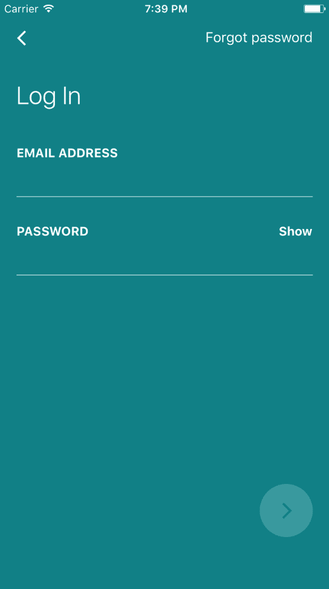

# 具有 React 原生功能的 AirBnB 克隆第 2 部分:登录屏幕 UI

> 原文：<https://dev.to/kris/airbnb-clone-with-react-native-part-2-login-screen-ui-3nn5>

### 分分钟做一个功能齐全的房产 app

通过在几分钟内发布 iOS 和 Android 的房地产应用程序，成为下一个 Trulia、Zillow 或 Airbnb。下载我们的功能性 [React Native Real Estate](https://www.instamobile.io/app-templates/real-estate-app-template-react-nativeref=4094&campaign=dev.to) 应用程序模板，与 Firebase 后端集成，立即启动您自己的应用程序。这个用 React Native 编写的漂亮的应用程序模板非常注重细节，代表了启动新移动应用程序开发的最佳方式。

> 本教程是一个项目的第二部分，旨在帮助我们用 React Native 构建 AirBnB 克隆。在此找到第 1 部分[。](https://dev.to/kris/airbnb-clone-with-react-native-part-1-home-screen-ui-3dnl)

在本教程中，我们将从第一部分中我们为 AirBnB 克隆实现主屏幕 UI 的地方继续。这里，我们将在同一个项目中创建登录屏幕 UI。所以我强烈建议阅读教程的第一部分，以便更好地理解 React Native AirBnB clone 项目的整体结构。

我们将创建一个简单的 AirBnB 登录界面克隆，如下图所示:

所以让我们开始吧！

#### 创建登录屏幕组件

首先，我们需要在我们的*屏幕*文件夹中创建一个 *Login.js* 文件。然后，我们可以开始用下面的代码片段中显示的一般起始代码编写 Login.js 组件: