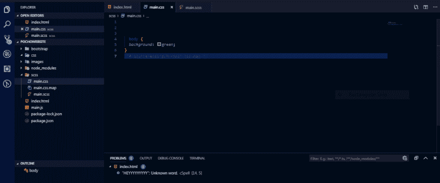
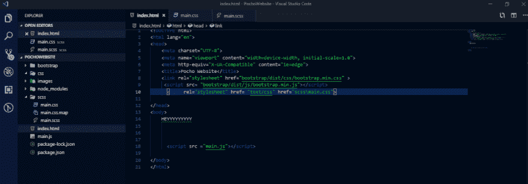
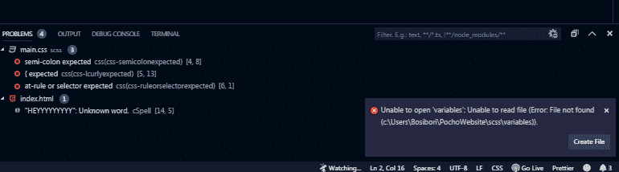

# 救命啊！！:在 Lite-Server 中安装 Sass

> 原文：<https://dev.to/winniebosy/alert-installing-sass-in-lite-server-40dc>

我在处理我的 sass 文件时遇到了麻烦，这使得在我的 index.html 文件上渲染更改变得很有挑战性。我正在使用 lite-server 作为我正在进行的一个有趣项目的本地服务器。我将公布我的文件结构，希望能得到帮助。我不知道我错在哪里..任何帮助都将不胜感激。谢谢

以下是我的文件结构:

以下是我的萨斯 index.html 链接[参考]:

编译后显示错误:

