# Alexa goes Azure:如何用 Azure 函数编写一个技能

> 原文：<https://dev.to/tsjdevapps/alexa-goes-azure-how-to-write-a-skill-with-azure-functions-4hip>

> 本文是 [#ServerlessSeptember](https://dev.to/azure/serverless-september-content-collection-2fhb) 的一部分。在这个无服务器的内容集合中，您可以找到其他有用的文章、详细的教程和视频。9 月份，每天都有来自社区成员和云倡导者的新文章发布，没错，每天都有。
> 
> 在[https://docs.microsoft.com/azure/azure-functions/](https://docs.microsoft.com/azure/azure-functions/?WT.mc_id=servsept_devto-blog-cxa)了解更多关于微软 Azure 如何实现你的无服务器功能。

# 简介

在这篇文章中，我想告诉你，通过编写不同的技能作为 Azure 函数，用自定义功能扩展你的 Alexa 设备是多么容易。

### Alexa？！

但首先我们来说说 Alexa。Alexa 是亚马逊开发的虚拟助手，首先用于亚马逊 Echo 和亚马逊 Echo Dot 智能音箱。它能够进行语音交互，播放音乐，制作待办事项列表，设置闹钟，播放播客，播放有声读物，并提供天气，交通，体育和其他实时信息，如新闻。但是，您可以通过使用自己的功能编写自定义技能来轻松扩展基本功能。

# 措词

我想对措辞做一个简单的介绍，这样每个人都可以在以后了解代码示例。

### 技能

一个*技能*是语音体验，可以由第三方开发。它扩展了可用的功能，可以通过语音命令或配套应用程序激活或停用。从技术的角度来看，一个技能就是一个 JSON 上的交换。

### 调用名称

一个*调用名*是一个触发技能的单词或短语。它相当于一个应用程序图标，通常与技能名称相匹配。

### 意图

用户试图完成的事情被称为*意图*。在这里，开发人员能够定义功能，一项技能可以有许多不同的意图。

### 话语

*话语*是人们在提出请求时会用到的特定短语。它们必须被编码来告诉 Alexa 会发生什么。有时这意味着打出几十个非常细微的变化。

### [插槽](#slot)

*槽*是与意图相关的变量。Amazon 提供了许多内置的时间段类型，如日期、数字、持续时间或时间。开发人员可以为特定于自己技能的变量创建自定义插槽。

# 第一个 Alexa 技能

每个技能由两部分组成。我们需要在 Amazon 的[开发者控制台中提供的元信息，以及我们将在 Azure 上托管的业务逻辑。先说业务逻辑。](https://developer.amazon.com)

打开 Visual Studio 并创建一个新的 Azure Functions 项目。选择一个名称，例如 *AlexaSkillAzureFunctions* 和一个存储文件的位置。确保 *Azure 函数 v2(。NET Core)* 被选中，选择*空*作为应用。

[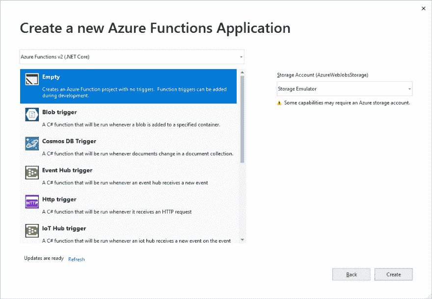](https://res.cloudinary.com/practicaldev/image/fetch/s--zP_QfGmR--/c_limit%2Cf_auto%2Cfl_progressive%2Cq_auto%2Cw_880/https://thepracticaldev.s3.amazonaws.com/i/pzksuhqhlo8bf3a6nh6a.png)

现在让我们创建我们的第一个 Azure 函数。选择作为**触发器** *Http 触发器*和作为**授权级别** *匿名*。

[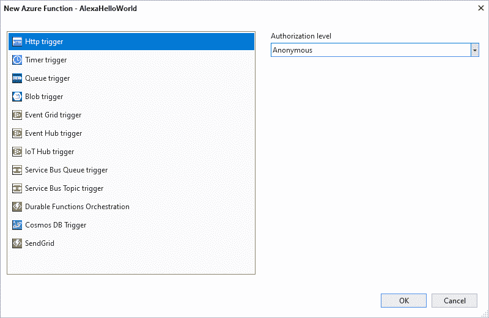](https://res.cloudinary.com/practicaldev/image/fetch/s--ab0VgWLn--/c_limit%2Cf_auto%2Cfl_progressive%2Cq_auto%2Cw_880/https://thepracticaldev.s3.amazonaws.com/i/zjjvxpb8aaebou2148jn.png)

删除 *Run* 方法的全部内容，因为我们将创建自己的内容。同样从 *HttpTrigger* 属性中移除 **get** 并插入 *alexa/helloworld* 作为 **Route** 。最后但同样重要的是，将返回类型更改为对象。

```
[FunctionName("AlexaHelloWorld")]
public static object Run(
  [HttpTrigger(AuthorizationLevel.Anonymous, "post", Route = "alexa/helloworld")] 
  HttpRequest req)
{

} 
```

现在我们想通过在 C#中创建一个包含我们的响应对象的匿名对象来返回一个有效的技能响应。

```
[FunctionName("AlexaHelloWorld")]
public static object Run(
  [HttpTrigger(AuthorizationLevel.Anonymous, "post", Route = "alexa/helloworld")] 
  HttpRequest req)
{
  return new
  {
    version = "1.0",
    response = new
    {
      outputSpeech = new
      {
        type = "PlainText",
        text = "Hello World from an Azure Function!"
      },
      shouldEndSession = true
    }
  };            
} 
```

在这个例子中，我们将返回一个语音输出。所以 Alexa 会说提供的句子。

现在我们准备将 Azure 功能发布到 Azure。让我们通过在 Visual Studio 中单击项目上下文菜单中的 *Publish* 来实现这一点。

[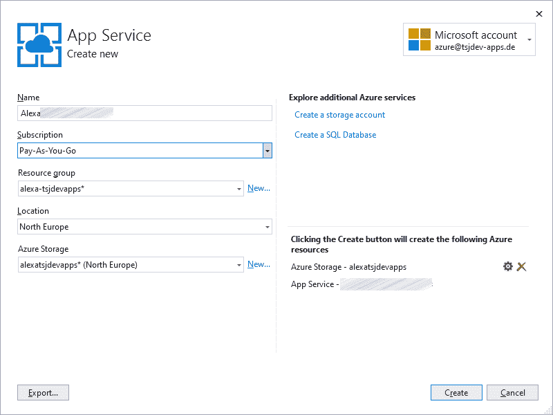](https://res.cloudinary.com/practicaldev/image/fetch/s--XQLjPKa3--/c_limit%2Cf_auto%2Cfl_progressive%2Cq_auto%2Cw_880/https://thepracticaldev.s3.amazonaws.com/i/0tcp8dze6ag2cwujh7cn.png)

包含业务逻辑的第一部分已经准备好了，我们需要为我们的技能提供一些元信息。亚马逊的[开发者控制台中提供了元信息。你可以用你的普通亚马逊账户登录，或者如果你愿意，你可以创建一个新账户。](https://developer.amazon.com)

[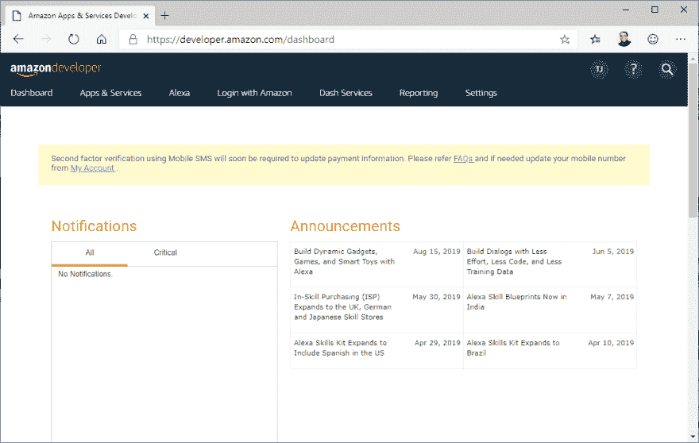](https://res.cloudinary.com/practicaldev/image/fetch/s--9XpBNpmX--/c_limit%2Cf_auto%2Cfl_progressive%2Cq_auto%2Cw_880/https://thepracticaldev.s3.amazonaws.com/i/3fj7wu7u0cgq6td6ooy2.png)

在这里，我们从导航栏中选择 *Alexa* ，然后从弹出菜单中选择 *Alexa 技能工具包*导航到技能面板。

[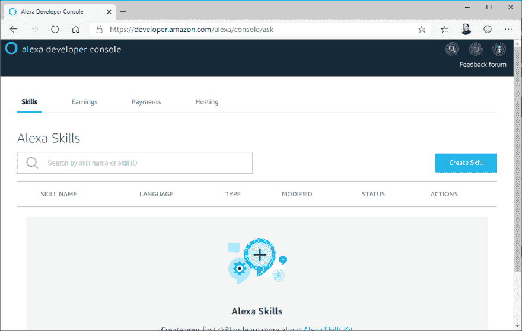](https://res.cloudinary.com/practicaldev/image/fetch/s--rsoW2et0--/c_limit%2Cf_auto%2Cfl_progressive%2Cq_auto%2Cw_880/https://thepracticaldev.s3.amazonaws.com/i/wn7i8rpuhj3cdndqkk1j.png)

在这个控制面板中，我们可以通过点击右上角的蓝色按钮**创建技能**来创建新技能。我们需要提供一个*名称*、*默认语言*、一个*模型*和一个*托管选项*。

对于我们的 *Hello World 技能*我们将使用 **Hello World** 、**英语(美国)**、**自定义**和**提供您自己的**。

[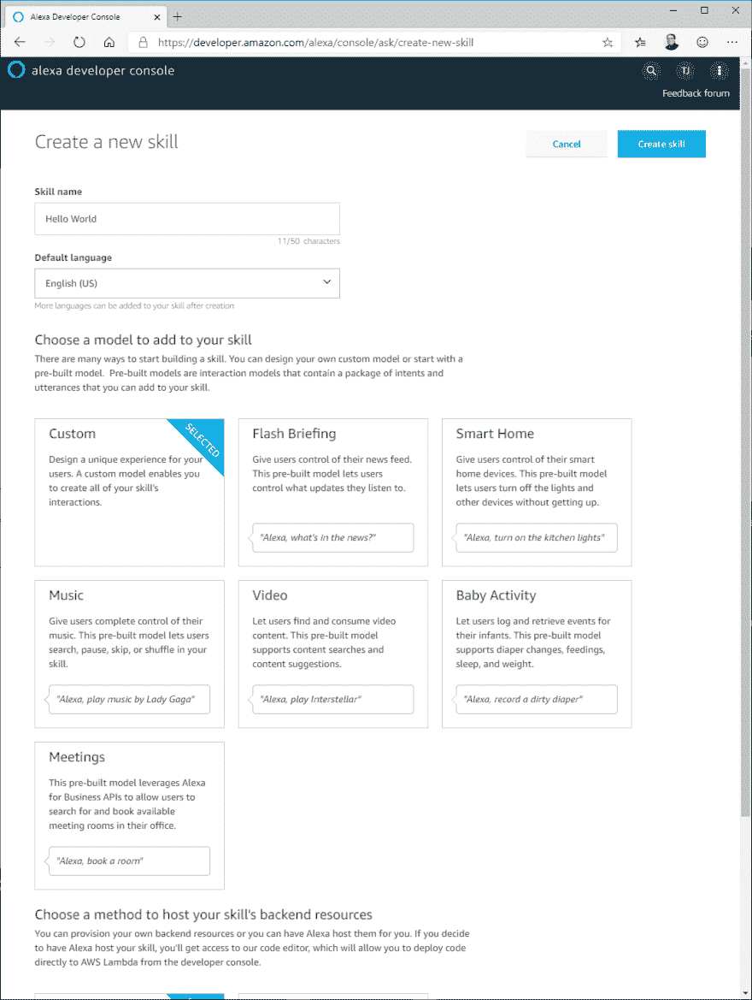](https://res.cloudinary.com/practicaldev/image/fetch/s--N9qHZAZk--/c_limit%2Cf_auto%2Cfl_progressive%2Cq_auto%2Cw_880/https://thepracticaldev.s3.amazonaws.com/i/41lakoc79210it55dwp1.png)

在下一步中，我们可以选择一个模板。我们将选择**从头开始**，因为我们将自己设置一切。

[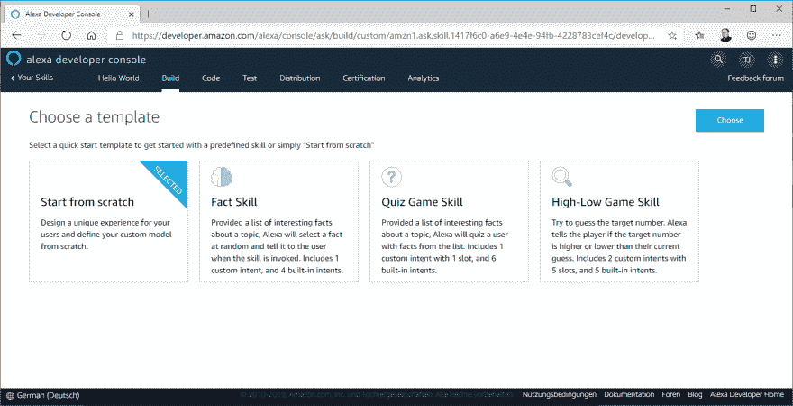](https://res.cloudinary.com/practicaldev/image/fetch/s--ttE27yvS--/c_limit%2Cf_auto%2Cfl_progressive%2Cq_auto%2Cw_880/https://thepracticaldev.s3.amazonaws.com/i/pjo866vbwpwmh1iw8vjg.png)

现在我们的技能已经被创造出来了，但是还没有发挥作用。如你所见，有一份*技能构建清单*，我们需要检查清单上的所有要点。

[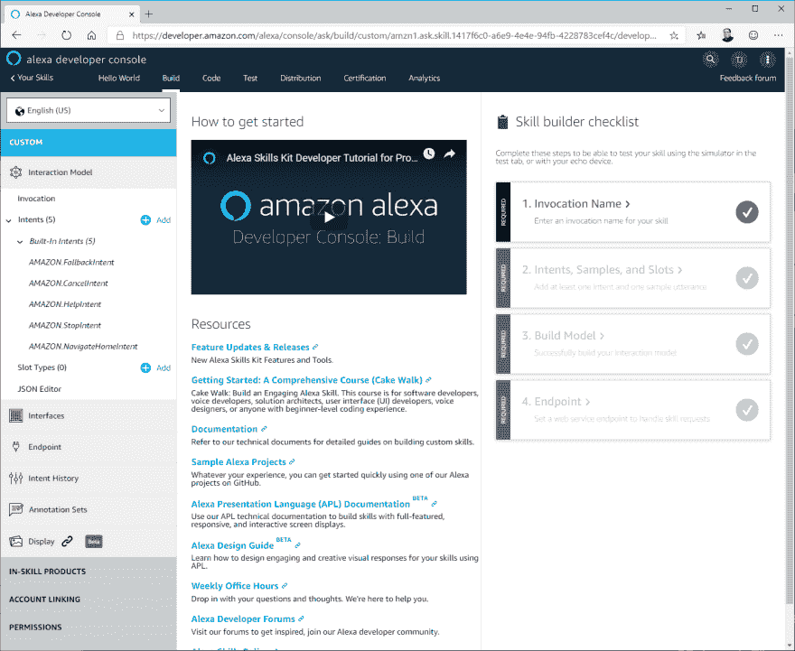](https://res.cloudinary.com/practicaldev/image/fetch/s--b3DYevnb--/c_limit%2Cf_auto%2Cfl_progressive%2Cq_auto%2Cw_880/https://thepracticaldev.s3.amazonaws.com/i/54ea6t5jabq252uj0rm1.png)

让我们从**调用名**开始。你可能还记得，这是开始我们技能的短语。它被自动设置为技能的选定名称，这是有意义的。所以用户可以通过说 **Alexa，打开 Hello World** 来调用我们的技能。

下一步是**意向、样品和槽位**。由于我们总是返回相同的响应，因此我们可以跳过这一步。但是目前仪表板有一个问题。所以我们在左窗格打开*亚马逊。取消*并插入*取消*为**样本发声**并点击**保存模型**确认。

[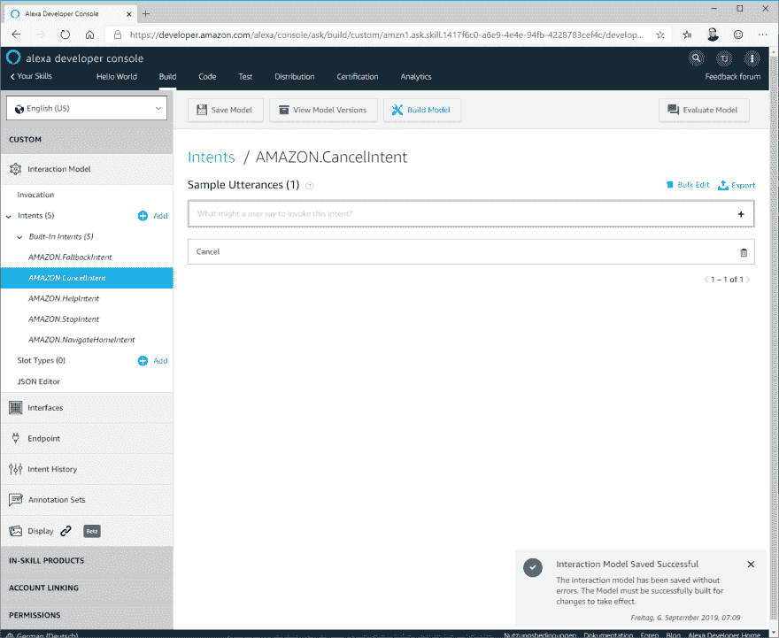](https://res.cloudinary.com/practicaldev/image/fetch/s--x-wASoBj--/c_limit%2Cf_auto%2Cfl_progressive%2Cq_auto%2Cw_880/https://thepracticaldev.s3.amazonaws.com/i/9ghtnwzh2cbt34bth3hi.png)

最后但同样重要的是，我们需要更新端点。选择 **HTTPS** 并插入你的 *Azure 函数*端点。从下拉列表中选择值**我的开发端点是一个子域，它拥有来自证书颁发机构的通配符证书**。

[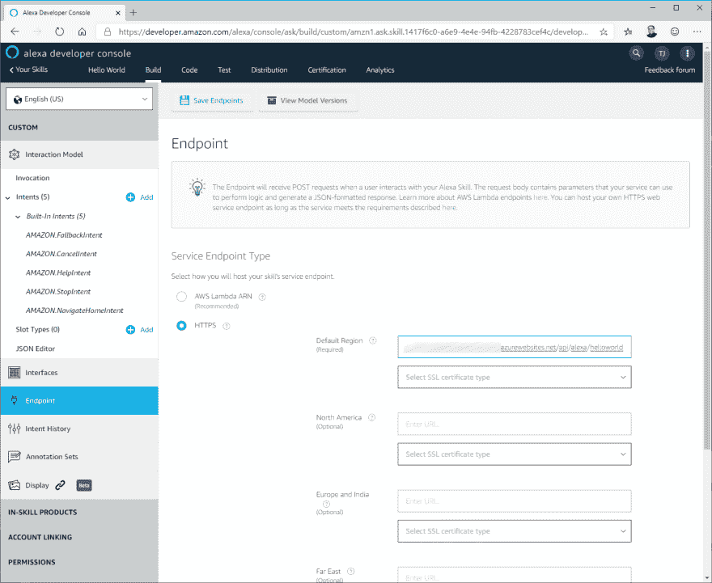](https://res.cloudinary.com/practicaldev/image/fetch/s--62bPglCS--/c_limit%2Cf_auto%2Cfl_progressive%2Cq_auto%2Cw_880/https://thepracticaldev.s3.amazonaws.com/i/tc9roxh38yd75cen9wlz.png)

点击**保存端点**确认选择，并再次点击**调用**。现在点击**建造模型**按钮开始建造过程。

[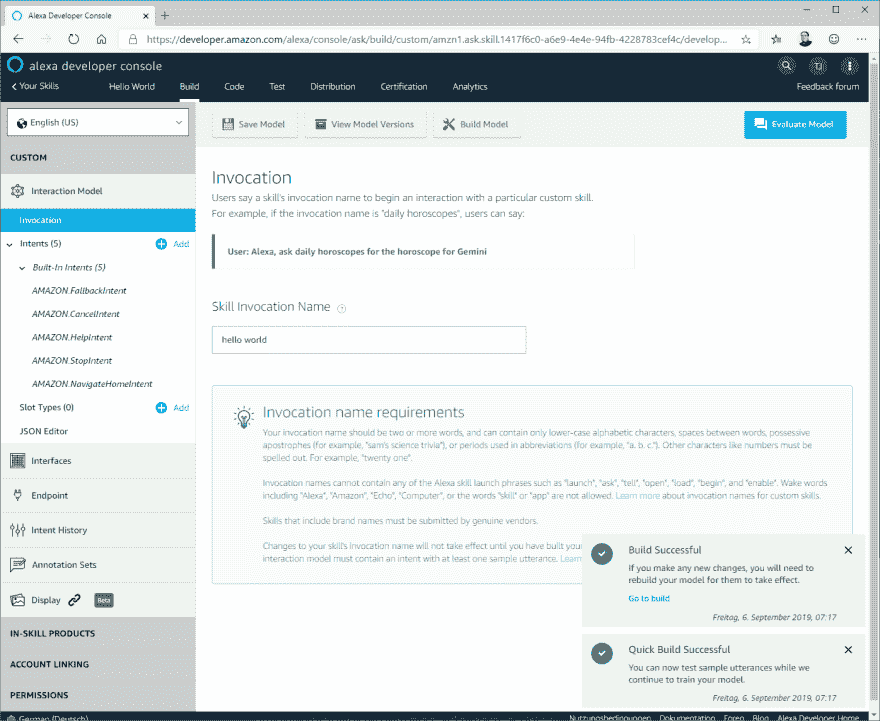](https://res.cloudinary.com/practicaldev/image/fetch/s--T_uDbfSE--/c_limit%2Cf_auto%2Cfl_progressive%2Cq_auto%2Cw_880/https://thepracticaldev.s3.amazonaws.com/i/089lk6okqtvaijpr78u7.png)

现在我们准备测试我们的技能。如果你有一个用相同的邮件地址为开发者控制台注册的 Echo 设备，你可以直接在设备上测试你的技能，否则使用仪表板上的**测试**选项。在这两种情况下，您都需要通过从下拉菜单中选择**开发**来启用测试。

您可以使用麦克风与您的技能交流，也可以用它聊天。在我的例子中，我使用聊天功能并插入*打开 hello world* 来开始我们的新技能。

[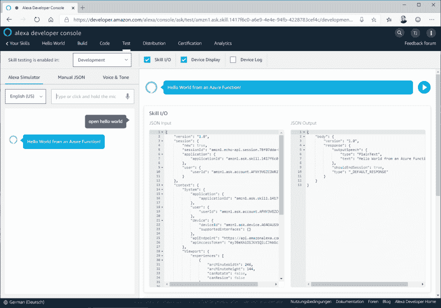](https://res.cloudinary.com/practicaldev/image/fetch/s--e3joxDN3--/c_limit%2Cf_auto%2Cfl_progressive%2Cq_auto%2Cw_880/https://thepracticaldev.s3.amazonaws.com/i/rebyheabdryysuoq5p1o.png)

恭喜你已经使用 Azure 函数开发了你的第一个 Alexa 技能。

# 使用插槽

我将与您分享另一项技能，展示如何使用老虎机。

我正在用 C#编写我的技能，幸运的是有一个 NuGet 包可以轻松处理请求和响应。因此，让我们将[Alexa.NET](https://www.nuget.org/packages/Alexa.NET/)添加到 Azure Function 项目中。

[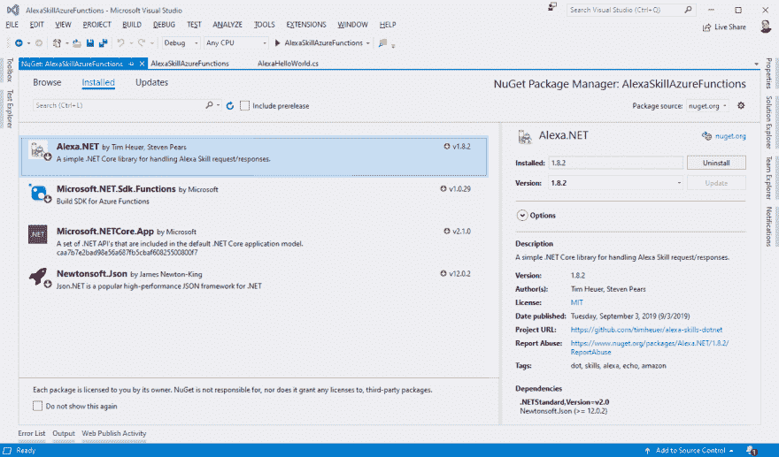](https://res.cloudinary.com/practicaldev/image/fetch/s--LWO7q1ai--/c_limit%2Cf_auto%2Cfl_progressive%2Cq_auto%2Cw_880/https://thepracticaldev.s3.amazonaws.com/i/dm5xhrfiop8ptvqy09gm.png)

现在让我们创建一个名为 *AlexaHelloName* 的新 Azure 函数。作为**触发器**选择 *Http 触发器*，作为**授权级别**选择*匿名*。用下面的代码更新函数的逻辑:

```
[FunctionName("AlexaHelloName")]
public static async Task<SkillResponse> Run(
  [HttpTrigger(AuthorizationLevel.Anonymous, "post", Route = "alexa/helloname")] 
  HttpRequest req)
{
  // read content as skill request
  var payload = await req.ReadAsStringAsync();
  var skillRequest = JsonConvert.DeserializeObject<SkillRequest>(payload);

  // get type of request
  var requestType = skillRequest.GetRequestType();

  // handle launchrequest
  if (requestType == typeof(LaunchRequest))
  {
      return ResponseBuilder
        .Ask("Welcome. I can great people. Please give me a name.",
             new Reprompt("Whom shall I welcome?"));
  }

  // handle intentrequest
  if (requestType == typeof(IntentRequest))
  {
    var intentRequest = skillRequest.Request as IntentRequest;

    // handle greetingintent
    if (intentRequest.Intent.Name == "GreetingIntent")
    {
      var name = intentRequest.Intent.Slots["name"].Value;
      return ResponseBuilder.TellWithCard($"Hello {name}. I am pleased to meet you.",
        "Hello!", $"{name.ToUpper()}");
    }
  }

  // default response
  return ResponseBuilder.Tell("Oops, something went wrong here.");
} 
```

如你所见，第一步我们将把 JSON 请求反序列化成一个`SkillRequest`对象。我们通过检查`RequestType`来检查用户是否启动了我们的请求。不是`LaunchRequest`就是`IntentRequest`。如果是一个`IntentRequest`，我们从槽中提取*名称*并创建一个响应。

让我们回到开发者控制台，添加一个名为 *Hello Name* 的新技能。设置和我们的第一个技能一样。我准备了一个 JSON 文件，包含我们技能的所有元数据。因此，您点击左侧窗格中的 *JSON 编辑器*，并用以下 JSON 定义替换内容:

```
{  "interactionModel":  {  "languageModel":  {  "invocationName":  "hello name",  "intents":  [  {  "name":  "AMAZON.FallbackIntent",  "samples":  []  },  {  "name":  "AMAZON.CancelIntent",  "samples":  []  },  {  "name":  "AMAZON.HelpIntent",  "samples":  []  },  {  "name":  "AMAZON.StopIntent",  "samples":  []  },  {  "name":  "AMAZON.NavigateHomeIntent",  "samples":  []  },  {  "name":  "GreetingIntent",  "slots":  [  {  "name":  "name",  "type":  "AMAZON.US_FIRST_NAME"  }  ],  "samples":  [  "Please welcome {name}",  "Welcome {name}",  "Please greet {name}",  "Greet {name}",  "I'm {name}",  "My name is {name}"  ]  }  ],  "types":  []  }  }  } 
```

点击**保存模型**和**构建模型**以应用我们的更改。现在，您需要添加端点并选择正确的 SSL 处理，就像我们的第一项技能一样，我们可以开始测试我们的技能了。

[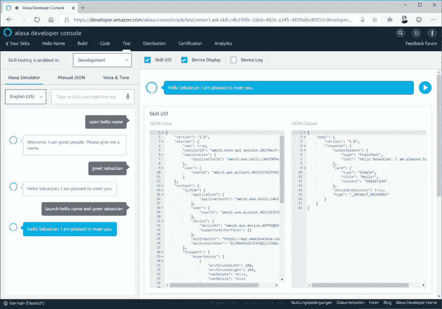](https://res.cloudinary.com/practicaldev/image/fetch/s--Fs3298WM--/c_limit%2Cf_auto%2Cfl_progressive%2Cq_auto%2Cw_880/https://thepracticaldev.s3.amazonaws.com/i/6htkubed3scofiv0to7o.png)

有很多方法可以利用我们的技能。第一个是启动技能:*打开你好名字*，然后提供一个*名字*。或者你可以直接把名字传给我们的技能:*发射 hello name，问候 sebastian* 。

# 结论

现在你知道了使用 Azure 函数创建自定义技能的基础。好处是可以使用任何编程语言，因为一个技能只是一个 JSON 的交换。

我迫不及待地想看看你为 Alexa 准备的第一个技能。请在评论中与我分享您的想法或发布版本。