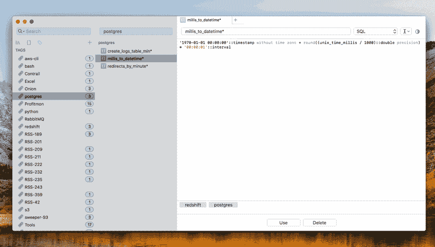
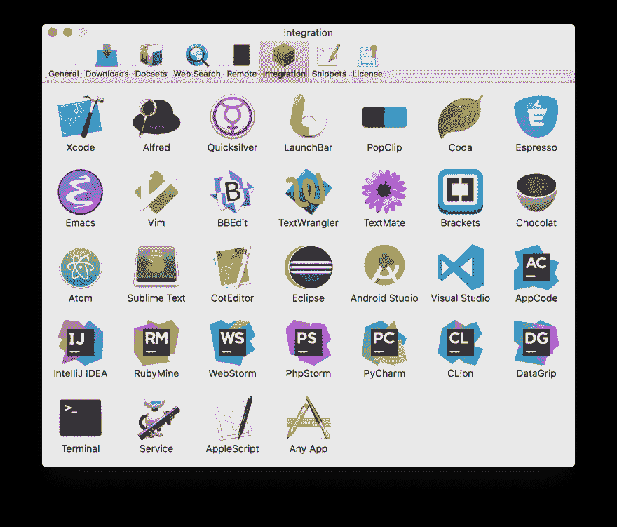

# 阿尔弗雷德和达什:改善您的工作流程

> 原文：<https://dev.to/tbutterwith/alfred-and-dash-improving-your-workflow-50nj>

## 阿尔弗雷德

> Alfred 是一款屡获殊荣的 Mac OS X 应用程序，它通过热键、关键词、文本扩展等提高您的效率。

上面的陈述直接摘自[阿尔弗雷德网站](https://www.alfredapp.com/)，但它只是触及了阿尔弗雷德所能做的事情的表面。除了搜索功能，与其他应用程序集成的能力是一个真正的游戏规则改变者，可以提高您的效率。
Alfred 本身是 Spotlight 搜索的替代品，但当你添加 [Powerpack](https://www.alfredapp.com/powerpack/) 允许你编写自己的工作流程并与其他应用程序完全集成时，它真的会大放异彩。

## 破折号

> Dash 是一个 API 文档浏览器和代码片段管理器。

使用 Dash 是我编程生涯中最大的优化之一。能够通过文档和“备忘单”的本地副本进行搜索，而不是打开 web 浏览器来搜索我要找的内容。Dash 不仅存储文档集，它还能够存储代码片段，这些代码片段可以被标记以帮助搜索。由于它的自动完成功能，这些代码片段可以在其他应用程序中使用。这对于存储代码模板非常方便，让您可以考虑编写功能代码而不是模板。

<figure>

<figcaption>Example text expansion from Dash in VS Code</figcaption>

</figure>

## 工作流程

工作流允许您向 Alfred 添加跨应用程序功能，从而实现更复杂的任务，并允许您自动执行大量重复性任务。阿尔弗雷德网站上有很多这样的工具，但我将把重点放在[仪表板集成](https://www.alfredapp.com/blog/productivity/dash-quicker-api-documentation-search/)上，因为这是我发现最有用的。

<figure>

<figcaption>The available Alfred Workflows</figcaption>

</figure>

如果您安装了 Alfred powerpack 和 Dash，则可以在 Dash 的“首选项”部分找到该工作流程。

双击 Alfred 图标后，工作流应该会自动安装。

## 定制您的文档集

在 Dash 偏好设置面板的“下载”部分，有许多官方和用户提供的文档集可供下载。有一个方便的搜索栏，允许您在所有文档集中搜索您正在寻找的任何特定集合。
安装后，可使用文档集优先窗格自定义搜索文档集的关键字。搜索词越短，Alfred 就能越快地识别出您在 Dash 中搜索的关键词。

<figure>

<figcaption>Quick Access React Documentation</figcaption>

</figure>