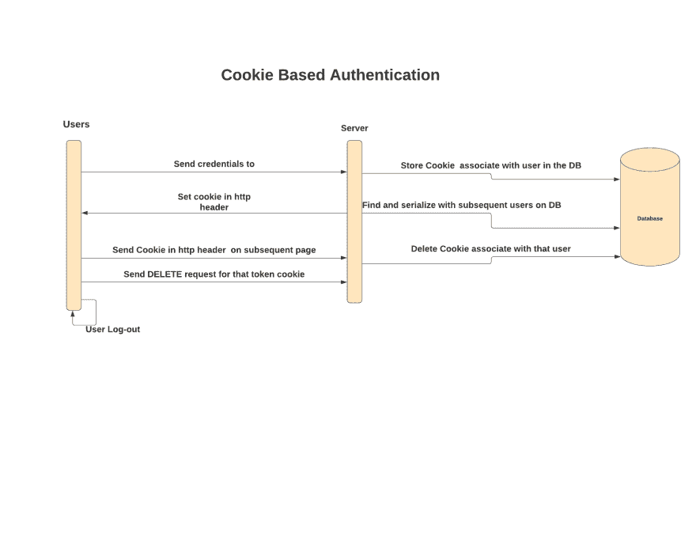
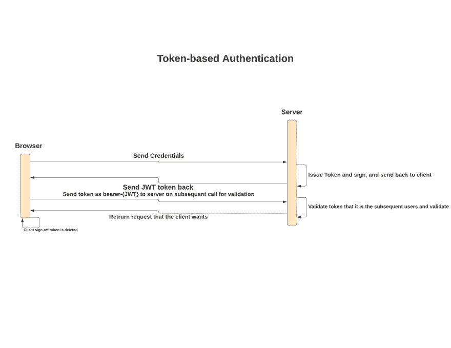

# 关于身份验证，您需要知道的一切都在这里

> 原文：<https://dev.to/edwardgunawan/all-you-need-to-know-about-authentication-is-here-3h25>

*T4】*

登录和注销是 web 应用程序特性的核心。开发人员通常会觉得一个没有用户登录和注销能力的应用程序是不完整的，因为它在应用程序中创建了个性化，并使应用程序更加安全和健壮。因此，理解身份验证机制对于所有开发人员创建可靠的应用程序至关重要。几乎所有现代应用程序都大量实施了身份验证。根据应用程序的类型和开发人员的实现选择，维护会话可能会创建安全的应用程序，也可能会增加应用程序的漏洞。作为一名开发人员，最近有很多关于在哪里存储用户身份验证令牌的讨论。基于 Cookie 或基于令牌的身份验证会创建更安全的应用程序吗？使用 Cookies 更安全吗，本地存储怎么样？

在应用程序中维护会话的首选身份验证机制和方法是什么？

在我们深入探讨应用程序首选哪种身份验证机制，并讨论应该在哪里存储身份验证令牌之前，我们需要了解各种类型的身份验证及其工作原理。

有两种类型的身份验证—基于 cookie 的身份验证和基于令牌的身份验证。我将快速解释这两种认证方法是如何工作的。然后，我将深入探讨实现其中任何一种身份验证的利弊，以便您知道如何为您的应用程序存储身份验证令牌。

### 基于 Cookie 的认证

基于 Cookie 的身份验证是有状态的，这意味着客户端和服务器需要保留令牌来管理用户页面之间的会话。

cookie 是用户的唯一标识符和生成的具有到期日期的令牌的名称-值对。cookie 通常存储在客户端和服务器上。服务器将 cookie 存储在数据库中，以跟踪每个用户会话，而客户端将保存会话标识符。

基于 Cookie 的身份验证的工作方式如下:

1.  用户通过输入凭据登录
2.  服务器验证用户的凭证是否正确，并使用存储在数据库中的会话信息创建一个 cookie
3.  带有会话 ID 和其他信息的 cookie 也存储在浏览器中
4.  当用户浏览浏览器上的各种页面时，会对照数据库验证 cookie，以验证用户凭证是否有效
5.  当用户注销时，会话也会从数据库中删除

### 基于令牌的认证

当我们谈到基于令牌的身份认证时，我们经常会提到 JWT (JSON Web Token)，因为它已经被广泛应用于各行各业，并且已经成为身份认证事实上的标准。JWT 是一个开放标准，它定义了一种紧凑、安全、独立的方式在 JSON 各方之间传输数据。JWT 是一种无状态类型的身份验证。这意味着服务器不会在数据库中存储任何会话信息。它不需要记录哪个用户已经登录或者哪个令牌是为哪个用户颁发的。取而代之的是，客户端将向服务器发送带有格式为`bearer-{JWT-token}`的头部的后续请求，或者更常见的是，客户端将在 POST 请求的主体中或者作为 URL 参数发送请求。

基于令牌的身份验证的工作方式如下:

1.  用户使用其凭据登录
2.  服务器验证用户的凭证，创建签名令牌，并将令牌发送回客户端。
3.  令牌存储在客户端的本地存储或会话存储中。
4.  随后对服务器的请求将包括这个令牌，通常以载体-{ JWT-令牌}的格式嵌入报头中
5.  一旦用户注销，令牌在客户端被销毁；不需要与服务器交互，因为服务器是无状态的。

JSON Web 令牌包含 3 个部分:

1.  页眉
2.  有效负载(保存用户 ID) +截止日期
3.  签名

由于在现代 web 应用程序、单页面应用程序(SPA)、web APIs 和物联网中的广泛使用，基于令牌的身份认证已经获得了很大的普及。但是，如果开发人员没有正确实现身份验证，它会给应用程序带来新的漏洞。

### Cookie vs 基于令牌的认证

了解这些身份验证机制的工作原理有助于您以正确的方式开发用户身份验证。基于您正在开发的应用程序的类型，您有更多的选项可以选择。了解这两种身份验证机制的优点和缺点有助于您在两者之间做出明智的选择，并保护您的应用程序免受恶意攻击。

### 使用基于 Cookie 的认证的优势

#### HttpOnly 和 Secure 标志

在 cookies 中实现或存储您的令牌使应用程序有状态。具有 HttpOnly 标志将保护 cookie 免受恶意 JavaScript 攻击(即 XSS 攻击)。XSS 攻击是一种实体向受害者网站注入恶意脚本的攻击。当受害者试图访问执行恶意代码的网页时，就会发生真正的攻击。它通常以提交或内嵌 iframe 图像的形式隐藏。此外，可以创建带有安全标志的会话 cookies，以防止令牌通过未加密的通道传输。因此，请始终通过 HTTPS 传输数据，这样攻击者就无法窃听浏览器和服务器之间的通信通道，然后窃取 cookie 来冒充用户。

#### 减少客户端的工作，增加服务器的工作

通过在服务器中创建 cookie 并在响应头中插入“set-cookie ”,浏览器将自动向服务器发送每个后续请求的验证信息。因此，客户端不需要手动管理页面之间的 cookie 状态。

### 使用基于 Cookie 的认证的缺点

#### CSRF 或 XSRF 攻击

CSRF 攻击是指实体运行恶意 JavaScript 脚本，在不知道所用浏览器的情况下攻击网站。它更像是一种以目标为中心的攻击，入侵者想知道用户想要执行什么操作。CSRF 攻击不容易理解，因为您需要知道源攻击者来自哪里。为了防止 CSRF，您可以实现一个同步器标记。这个链接来自于 [StackOverflow](https://stackoverflow.com/questions/16049721/how-is-using-synchronizer-token-pattern-to-prevent-csrf-safe) 更详细地解释了它是如何以及是什么，如果你想了解更多关于同步器令牌的话。对于同步器标记，您需要为 UI 中的同步标记实现另一个 JavaScript 逻辑。因此，它会增加系统的复杂性。

#### 性能和可扩展性

需要数据库存储来存储与用户相关联的 cookies。它增加了状态管理的复杂性，并且更难维护。每次用户在每个页面上向服务器发送后续请求时，您都需要从数据库中读取数据来验证用户是否被授权。这造成了很多失误，每次不同的用户登录时，他们的凭据需要存储在数据库中，每个后续请求都需要从数据库中进行验证和查找，当用户注销时，cookies 需要从数据库中删除。

此外，现代应用程序不仅构建在 web 上，而且还是本地的。为移动应用程序实现 cookies 更具挑战性，也更不可靠，因为它需要在各种本机环境中运行。网络上的 Cookies 是在超文本语言(Http)中创建的，它为所有浏览器创建了一个统一的环境。由于大多数用户会重复使用相同的浏览器和计算机，会话 cookies 可以跟踪用户的活动。此外，对于移动设备，不仅应用程序将在不同的操作系统上运行，而且每个本机应用程序也有自己的规则。当在相同的设备上使用时，浏览器在与本地应用不同的“沙箱”中运行，这使得为本地应用实现 cookies 非常困难。

### 使用基于令牌的认证的优势

#### 无国籍

无状态的主要好处是降低了应用程序的复杂性和逻辑性。因此，它将更易于管理、扩展和分离，并且不容易出错。每个令牌都是独立的，不需要后端逻辑来验证每个请求。后端只需要对令牌进行签名即可验证。像 OAuth 这样的第三方服务可以处理令牌的发布，让后端执行检查令牌有效性的单一功能。

#### 表现

JWT 令牌可以解码会话令牌来验证用户的真实性和权限，而不是为后端发出另一个数据库来读取、写入和删除令牌。例如，如果您有一个由`/API/`用户组成的 API 来在应用程序中创建一个用户，那么只有拥有 Admin 权限的用户才能执行该操作。在传统的基于 cookie 的令牌设计中，您需要对数据库执行查找，然后验证会话是否过期。然后，您必须执行另一个查找来检查用户是否有正确的权限。最后，提交一个 Post 请求来创建用户。另一方面，使用 JWT，您可以在浏览器上存储用户在 JWT 的角色权限，解码 JWT 令牌以验证用户的权限，并提交创建用户的 Post 请求，所有这些都可以从浏览器完成。

#### CSRF 平安无事

与基于 cookie 的身份验证不同，基于令牌的身份验证不容易受到 CSRF 攻击，因为攻击者站点首先需要窃取令牌，然后才能对合法网站进行 AJAX 调用。

### 使用基于令牌的认证的缺点

#### XSS 进攻

实现基于令牌的身份验证的应用程序需要意识到跨站点脚本攻击。当入侵者可以从您的应用程序内部执行恶意 JavaScript 时，就会发生跨站点脚本攻击。这种攻击通常发生在表单输入没有经过清理，并且在提交表单之前对数据进行了正确验证的情况下。因此，JWT 令牌是脆弱的。然而，现代 web 框架有内置的功能来净化输入，以防止表单提交过程中的任意代码。例如，默认情况下，React 表单输入是自动清理的，除非您将输入设置更新为`dangerouslySetInnerHTML`。在使用基于令牌的身份验证时，防止 XSS 攻击的其他方法是将令牌到期时间限制设置为一小时，这样即使令牌被盗，它也会很快变得不可用。

### 设计考虑——令牌存储在哪里？

通常将 JWT 令牌存储在本地存储中，这在大多数情况下效果很好，因此推荐使用。但是，在本地存储中存储 JWT 令牌存在一些需要注意的问题，例如跨站点脚本攻击。我将在下面基于令牌的身份验证的缺点部分详细讨论如何解决它。存储令牌的另一个地方是在 cookie 中。然而，由于 JWT 令牌可能很大，您需要知道在 cookie 中存储它的最大大小(详细说明)。最后，将令牌存储在会话存储中的作用与本地存储相同。但是，一旦用户关闭浏览器，令牌将被删除。

#### JWT 的大小

与会话 cookie 相比，JWT 的大小可能相对较大，因为大多数 cookie 都小于 JWT 的平均大小。JWT 令牌的大小最多为 8KB，这比 4KB 的 cookies 大得多。根据数据传输的方式，如果向 JWT 令牌添加许多声明，它的大小可能会有问题。

### 该用哪个？

#### Cookie 的用例

如果您完全控制服务器端，并且它是一个浏览器应用程序，让服务器控制应用程序的状态将会减轻客户端的负担，并创建一个更健壮的应用程序。基于 Cookie 的身份验证非常适合基于浏览器的身份验证，并且已经得到了广泛的研究，这是一个更安全的选择。它可以将会话限制在某个操作或某个时间段，如果有任何安全问题，它可以使用户无效。

#### 用例为令牌

如果您想灵活地处理各种域和环境，建议使用基于令牌的身份验证令牌。您不需要处理两种不同的身份验证方案来支持浏览器流量。

#### 用例为混合

生产系统通常使用这两种机制来创建灵活性和健壮的应用程序。例如，OAuth 使用特定的承载令牌和寿命更长的刷新令牌来获取承载令牌。

### 总结起来

对于身份验证，没有一种方法适合所有情况，但是根据您的应用程序的使用情况，有一种首选的方法。每种认证机制都有其优点和缺点。 ***在更健壮的基于 cookie 的认证(但性能较差)和客户端的基于令牌的认证(性能较好但不健壮)之间有一个折衷。*** 根据不同的场景，使用两者的混合可以产生比单独使用一个更安全的系统。

这一切都归结为用例、分析权衡和偏好。然而，要创建一个更安全的应用程序，您需要了解这两种身份验证的工作原理及其利弊，以便能够以正确的方式实现您的身份验证。

感谢阅读！如果你喜欢这篇文章，请随意[订阅](https://edward-huang.com/subscribe/)我的时事通讯，接收关于科技职业的每周文章、有趣的链接和内容！

### 引用

*   [web 应用-存储认证令牌的最佳位置客户端-信息安全堆栈交换](https://security.stackexchange.com/questions/80727/best-place-to-store-authentication-tokens-client-side)
*   [SPA 中认证(ReactJS 和 VueJS)的正确方式](https://medium.com/@jcbaey/authentication-in-spa-reactjs-and-vuejs-the-right-way-e4a9ac5cd9a3)
*   [如何在 React 中保护 JWT 令牌？-开发社区👩‍💻👨‍💻](https://dev.to/realabbas/how-to-secure-jwt-token-in-react-172a)
*   web 应用程序——在 sessionStorage 中存储 JWT 安全吗？-信息安全堆栈交换
*   [Cookies vs . token:权威指南- DZone 集成](https://dzone.com/articles/cookies-vs-tokens-the-definitive-guide)
*   如何使用同步器令牌模式来防止 CSRF 安全？-堆栈溢出
*   认证-将认证令牌存储在 Cookie 或报头中？-信息安全堆栈交换
*   什么是跨站点脚本，如何解决这个问题？
*   [移动设备中 cookies 的使用，如何管理](https://www.allaboutcookies.org/mobile/)