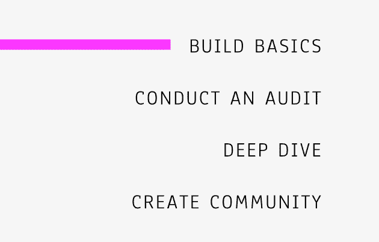

# 咏叹调简介

> 原文：<https://dev.to/lkopacz/an-introduction-to-aria-states-30nm>

*最初发布于[a11ywithlindsey.com](https://www.a11ywithlindsey.com/blog/introduction-aria-states)。如果你想看屏幕阅读器如何解释这些的视频示例，它们就在源代码中！*

嘿朋友们！今天的博文来自我的 [Patreon 乡亲们的](https://www.patreon.com/a11ywithlindsey)民意调查。这是我之前一篇关于[揭开咏叹调](https://www.a11ywithlindsey.com/blog/beginning-demystify-aria)神秘面纱的帖子的后续。咏叹调可能非常神秘和令人生畏，但它很方便。我最喜欢的使用方法之一是将状态传达给屏幕阅读器。

我在 a11y 社区看到了积极的趋势。a11y 不是使用类来样式化元素，而是在 CSS 中使用 ARIA 属性来进行样式化。这有助于加强可访问性标准，防止人们欺骗可访问性。我今天要讲的属性是`aria-expanded`、`hidden`、`aria-hidden`和`aria-current`。

## `aria-expanded`属性

`aria-expanded`是少数几个没有 HTML5 等效属性的 aria 属性之一。如果我错了，请发微博给我，但是在我写这篇文章的时候，我相信这是正确的。在[可访问的手风琴帖](https://www.a11ywithlindsey.com/blog/javascript-accessibility-accordions)中，我用`aria-expanded`来传达版块的状态。

为什么这很有帮助？让我们以我在上一段链接的博客文章中提到的手风琴为例:

[https://codepen.io/littlekope0903/embed/OYqNOd/?height=600&default-tab=result&embed-version=2](https://codepen.io/littlekope0903/embed/OYqNOd/?height=600&default-tab=result&embed-version=2)

注意:我修改了上面例子中的代码，让 CSS 更多地绑定到属性，而不是 CSS 类。

如果你在屏幕阅读器上浏览，你会看到这样的内容:“第一部分，折叠，按钮。”然后，当您使用屏幕阅读器命令打开它时，它会显示:“第 1 部分，展开，按钮。”(如果你想看这个的视频样本，可以看看[的原始博文](https://www.a11ywithlindsey.com/blog/introduction-aria-states)。)

想象一下，如果我们去掉`aria-expanded`属性，我是在[单独的代码笔](https://codepen.io/littlekope0903/pen/GazpwN/)中做的。

注意:我在这里保留了大部分原始代码。这样，我就可以演示视觉上的打开和关闭。此外，它还展示了它对于屏幕阅读器用户是如何不起作用的。

如果不添加`aria-expanded`属性，当我按下打开菜单时，它不会停止读取“第 1 部分，按钮”告诉我手风琴是否打开。打断有助于理解空间。(如果你想看这个的视频样本，可以看看[原创博文](https://www.a11ywithlindsey.com/blog/introduction-aria-states)。)

你注意到了吗，当我打开按钮时，它不显示该部分是打开的还是关闭的？这对于屏幕阅读器用户了解正在发生的事情是至关重要的。对于屏幕阅读器用户来说，保留状态的口头交流是令人困惑的。

每当我们隐藏在用户操作下扩展的内容时，使用`aria-expanded`。当你使用 JavaScript 来切换它时，它会成为一个更好的用户体验。

## `hidden`属性

如果你看到了我上面的笔记，你可能已经看到我修改了代码。之前，我让 accordion 使用了一个`aria-hidden`属性(稍后会详细介绍)。点击按钮后，我会将值切换为`true`或`false`。原因是因为`hidden`相当于 HTML 中的`display: none`。

当我开始使用可访问性时，向屏幕阅读器隐藏内容的动机让我感到困惑。为什么我要将它们从内容中排除？？我曾经很抗拒**曾经**使用`hidden`，但是现实有时候是必须的。对于某些形式的内容，我们不想向用户公开内容，除非我们与它进行交互。例如，对于 modals 和 accordions，我们只想在它们打开时看到里面的东西。

### 什么时候用`aria-hidden`

`aria-hidden`和`hidden`有一个显著的区别:

> `aria-hidden`只对屏幕阅读器隐藏元素，而`hidden`对所有人隐藏。

我问自己，有没有主要是为了装饰的 HTML 元素？如果是这样，我可能想用`aria-hidden`对屏幕阅读器隐藏它，但不是对视觉正常的用户。

我最喜欢使用`aria-hidden`的原因之一是防止重复。例如，这是 Twitter 的主页按钮:

```
<a class="js-nav js-tooltip js-dynamic-tooltip">
  <span class="Icon Icon--home Icon--large"></span>
  <span class="Icon Icon--homeFilled Icon--large u-textUserColor"></span>
  <span class="text" aria-hidden="true">Home</span>
  <span class="u-hiddenVisually a11y-inactive-page-text">Home</span>
  <span class="u-hiddenVisually a11y-active-page-text">
    Home, current page.
  </span>
  <span class="u-hiddenVisually hidden-new-items-text">
    New Tweets available.
  </span>
</a> 
```

在这种情况下，屏幕阅读器根据页面的上下文宣布“a11y 页面文本”之一。我希望你注意这一行代码:

```
<span class="text" aria-hidden="true">Home</span> 
```

这就是屏幕上的那个。我们为屏幕阅读器提供了动态选项，如“主页”、“主页、当前页面”和“加载新推文”如果我们能看到视觉提示，我们就不需要主页按钮上的上下文。

也就是说，我的规则是如果我们切换状态，我使用`hidden`。如果有重复或不必要的内容，我会使用`aria-hidden`。

## `aria-current`属性

有趣的是，这个对我来说是全新的。直到我看到 [Eric Bailey](https://twitter.com/ericwbailey/) 关于 [a11y 项目](https://a11yproject.com/)重新设计的推文，我才知道这件事:

> 埃里克·贝利[@埃里克·贝利](https://dev.to/ericwbailey)我为即将到来的 [@A11YProject](https://twitter.com/A11YProject) 重新设计感到自豪的一个小细节是使用`[aria-current]'作为我们目录组件的样式挂钩。而不是用一个”。is-current”类或类似的类，我们为您在页面上的位置键入视觉外观到语义状态。2019 年 06 月 01 日下午 16:44[](https://twitter.com/intent/tweet?in_reply_to=1134863254310797312)[](https://twitter.com/intent/retweet?tweet_id=1134863254310797312)13[](https://twitter.com/intent/like?tweet_id=1134863254310797312)96

关于网络和可访问性实践最好的部分是我每天都学到新的东西。看到这条推文后，我在 aria-current 上找到了 [Léonie 的帖子。他们指出的一点是，我们主要使用 CSS 来可视化地显示“当前”元素。在我的 Drupal 时代，如果你在一个反映当前 URL 的菜单项上，大多数主题都有一个`.is-active`类。](https://tink.uk/using-the-aria-current-attribute/)

正如 Léonie 所说，这种方法的问题是 CSS 主要是可视化的。样式的含义(有一个例外)为 0 向屏幕阅读器公开。使用 aria-current 有助于确保我们将上下文传达给屏幕阅读器用户。根据 [WAI-ARIA 1.1](https://www.w3.org/TR/wai-aria-1.1/#aria-current) ，有几个值`aria-current`可以采用:

*   **page** 对于一组分页链接中的一个链接，导航中表示的当前页面等。
*   **步骤**为基于步骤的流程。
*   **日期**为当前日期。
*   **时间**为当前时间。

此外，一组元素中应该只有一个元素可以有一个`aria-current`值。否则会把屏幕阅读器搞糊涂！

## 结论

我计划将来有更多关于 ARIA 和 state 的博客帖子。我希望这能帮助你揭开更多 aria 属性的神秘面纱。

请在推特上告诉我你的想法！还有，我现在有一个 [patreon](https://www.patreon.com/a11ywithlindsey) ！如果你喜欢我的作品，考虑成为赞助人。如果你认捐了 5 美元或更多，你将能够对未来的博客文章进行投票！干杯！祝你一周愉快！