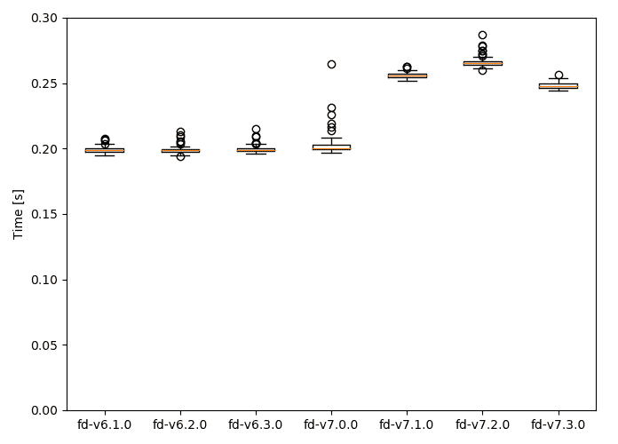
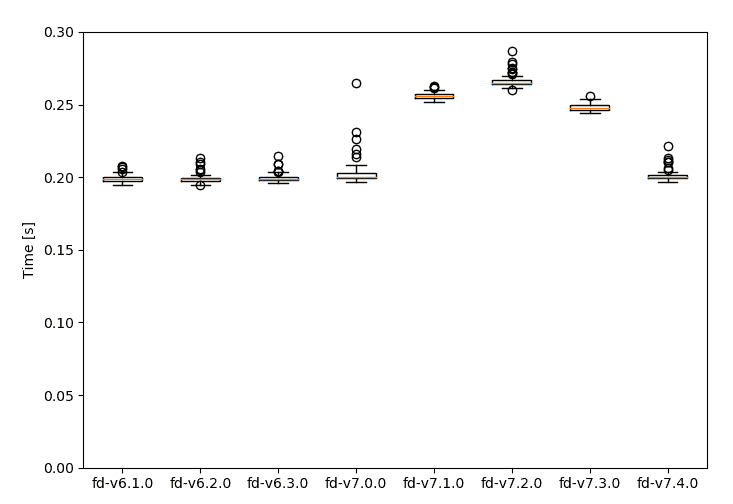

# 意外的性能下降

> 原文：<https://dev.to/sharkdp/an-unexpected-performance-regression-11ai>

我发现很难用自动化的方式跟踪性能退化。在过去的几年里，我一直致力于[一个叫做`fd`](https://github.com/sharkdp/fd) 的工具，它的目标是成为*快速*和用户友好(但不一定功能完整)的 [`find`](https://www.gnu.org/software/findutils/) 的替代品。

正如您对文件搜索工具的期望，`fd`是一个 I/O 密集型程序，其性能受外部因素的控制，如文件系统速度、缓存效果以及特定于操作系统的方面。为了获得可靠和有意义的计时结果，我开发了一个名为`hyperfine` 的[命令行基准测试工具，它负责预热运行(对于热缓存基准测试)或缓存清除准备命令(对于冷缓存基准测试)。它还执行跨多次运行的分析，并通过检测统计异常值来警告用户外部干扰。](https://github.com/sharkdp/hyperfine)

但这只是问题的一小部分。真正的挑战是找到一个合适的基准集，在广泛的环境中测试程序的不同方面。为了对影响像`fd`这样的程序的运行时间的大量因素有一个感觉，让我告诉你我最近发现的一个特别的性能回归。

我保留了一小部分旧的`fd`可执行文件，以便快速运行不同版本的特定基准。我注意到在其中一个基准测试中，`fd-7.0.0`和`fd-7.1.0`之间出现了显著的性能倒退:

我快速查看了 7.0 和 7.1 之间的提交，看看是否有任何可能引入这种回归的更改。我找不到任何明显的候选人。

接下来，我决定通过重新编译特定的提交并运行基准来执行一个小的二分搜索法。令我惊讶的是，我无法重现我用旧版本的预编译二进制文件测得的快速时间。每一次提交都产生缓慢的结果！

这种情况只有一种可能:旧的二进制文件更快，因为它们是用*旧版本的 Rust 编译器*编译的。在`fd-7.1.0`发布前不久出来的版本是 [Rust 1.28](https://blog.rust-lang.org/2018/08/02/Rust-1.28.html) 。它对 Rust 二进制文件的构建方式做了一个重大改变:它放弃了默认分配器`jemalloc`。

为了确保这是回归的根本原因，我通过 [jemallocator](https://crates.io/crates/jemallocator) 机箱重新启用了`jemalloc`。果然，这让时间又回来了:

随后，我运行了整个“基准测试套件”。我发现通过从系统分配器切换到 jemalloc，速度持续提高了 40%(见下面的结果)。最近发布的 [`fd-7.4.0`](https://github.com/sharkdp/fd/releases) 现在重新启用 jemalloc 作为`fd`的分配器。

不幸的是，我仍然没有一个好的解决方案来自动跟踪性能退化——但是我对您的反馈和想法非常感兴趣。

### 基准测试结果

简单模式，热缓存:

| 命令 | 平均值[毫秒] | 最小[毫秒] | 最大值[毫秒] | 亲戚 |
| --- | --- | --- | --- | --- |
| `fd-sysalloc '.*[0-9]\.jpg$'` | 252.5 ± 1.4 | Two hundred and fifty point six | Two hundred and fifty-five point five | One point two six |
| `fd-jemalloc '.*[0-9]\.jpg$'` | 201.1 ± 2.4 | One hundred and ninety-seven point six | Two hundred and seven | One |

简单模式、隐藏和忽略的文件、热缓存:

| 命令 | 平均值[毫秒] | 最小[毫秒] | 最大值[毫秒] | 亲戚 |
| --- | --- | --- | --- | --- |
| `fd-sysalloc -HI '.*[0-9]\.jpg$'` | 748.4 ± 6.1 | Seven hundred and thirty-nine point nine | Seven hundred and fifty-five | One point four two |
| `fd-jemalloc -HI '.*[0-9]\.jpg$'` | 526.5 ± 4.9 | Five hundred and twenty point two | Five hundred and thirty-six point six | One |

文件扩展名搜索，热缓存:

| 命令 | 平均值[毫秒] | 最小[毫秒] | 最大值[毫秒] | 亲戚 |
| --- | --- | --- | --- | --- |
| `fd-sysalloc -HI -e jpg ''` | 758.4 ± 23.1 | Seven hundred and forty-five point seven | Eight hundred and twenty-three | One point four |
| `fd-jemalloc -HI -e jpg ''` | 542.6 ± 2.7 | Five hundred and thirty-eight point three | Five hundred and forty-six point one | One |

文件类型搜索，热缓存:

| 命令 | 平均值[毫秒] | 最小[毫秒] | 最大值[毫秒] | 亲戚 |
| --- | --- | --- | --- | --- |
| `fd-sysalloc -HI --type l ''` | 722.5 ± 3.9 | Seven hundred and sixteen point two | Seven hundred and twenty-nine point five | one point three seven |
| `fd-jemalloc -HI --type l ''` | 526.1 ± 6.8 | Five hundred and seventeen point six | Five hundred and thirty-nine point one | One |

简单模式，冷缓存:

| 命令 | 平均 | 最小[秒] | 最大值[s] | 亲戚 |
| --- | --- | --- | --- | --- |
| `fd-sysalloc -HI '.*[0-9]\.jpg$'` | 5.728 ± 0.005 | Five point seven two three | Five point seven three three | One point zero four |
| `fd-jemalloc -HI '.*[0-9]\.jpg$'` | 5.532 ± 0.009 | Five point five two one | Five point five three nine | One |

<small>例如，我需要在运行`fd`基准测试之前关闭 Dropbox 和 Spotify，因为它们对运行时间有重大影响。</small>

<small>如开头所说，我没有好的方法来自动跟踪这个。所以我花了一些时间来发现这种回归:-(</small>