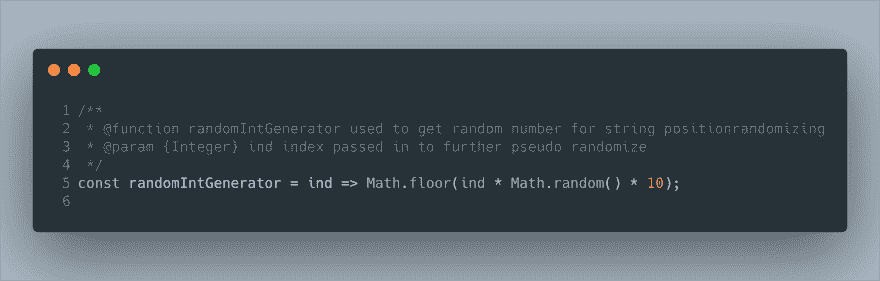

# 字谜生成器

> 原文：<https://dev.to/jacobmgevans/anagram-generator-5ej9>

TL；我为一个字谜创作者做了一个挑战，我分解了一些过程。你可以在 GitHub[https://github.com/JacobMGEvans/test-field](https://github.com/JacobMGEvans/test-field)找到它

# 为什么要做一个？

我在 Twitter 上看到有人在做字谜测试器/生成器，所以我决定...我在机场呆了几个小时，然后坐飞机，需要做些事情。

我尝试做的第一件事是随机改变元素的索引，可能在混合中使用带有一个`Math.random()`的`.sort()`。我得到了一些我想要的东西。

## 改变方法，做一件事通常有许多不同的方法。

*   对我来说，第一步仍然是创建一个伪随机数，以便以后使用。我有一个想法，它将采取一些不同的输入，以增加随机性。我考虑过添加 Date.now()这个函数，但是对于这个目的来说，这似乎有点过了。
*   下一步将是实际的字谜代码。我会在最后用 Jest 测试来发布整个事情。

*   传入字符串参数为 param 的函数将有一个条件数组。按()或。unshift()也是。

`const randomIntGenerator = ind => Math.floor(ind * Math.random() * 10);`

`const convertAnagram = str => { const memory = []; }`
好了，酷开。

*   从这里开始，我想在`convertAnagram()`中创建一个方法，使用`randomIntGenerator()`开始改变字符串。这将是一个基于随机数奇数或偶数值的条件，如果是偶数，它将推送到数组，如果是奇数，它将取消移位*将值插入数组的 0 索引中*逻辑如下:

`const anagramify = (ele, ind) => randomIntGenerator(ind) % 2 ? memory.push(ele) : memory.unshift(ele);` 

*   现在如果你想，“等等，循环在哪里...?"干得好。最后一个方法是我从

    ## [那里学来的心照不宣的编程(无指针)凯尔谢夫林](/kyleshevlin) <button name="button" type="button" data-info="{&quot;className&quot;:&quot;User&quot;,&quot;style&quot;:&quot;full&quot;,&quot;id&quot;:3113,&quot;name&quot;:&quot;Kyle Shevlin&quot;}" class="crayons-btn follow-action-button whitespace-nowrap c-btn--secondary fs-base " aria-label="Follow user: Kyle Shevlin" aria-pressed="false">跟随</button>

    [@ fastly 高级软件工程师。爱#JavaScript。在他关于函数式编程的 egghead.io 课程中，重点介绍了# react js&# redux applications](/kyleshevlin)，逻辑的下一步是利用`Array.from(str)`创建一个数组到`.map()`，我相当肯定你也可以有效地`[...str].map()`。那么传入`.map()`的是什么呢？这是表达式分析的方法🤣🤣

`Array.from(str).map(anagramify);`

*   最后一步是返回连接在空字符串上的数组，将数组转换回字符串。

`return memory.join('');`

以下是全部内容加上一些注释，我使用了 betterComments 扩展和 JSdocs，这样它们看起来就不像普通的多行注释了:

[![@function randomIntGenerator used to get random number for string positionrandomizing 
  @param {Integer} ind index passed in to further pseudo randomize 
const randomIntGenerator = ind => Math.floor(ind * Math.random() * 10); 
  @function convertAnagram converts a string into an anagram of itself. 
  @param {String} str string to be transformed. 
  @note This could likely be converted to a recursive function. 
const convertAnagram = str => { 
  const memory = []; 
  const anagramify = (ele, ind) => 
    randomIntGenerator(ind) % 2 ? memory.push(ele) : memory.unshift(ele); 
  Array.from(str).map(anagramify); 
  return memory.join( raw ``); 
}; 
export { convertAnagram };](img/6f53a586dea3872fe756d8051d60b158.png)](https://res.cloudinary.com/practicaldev/image/fetch/s--AueEFOr1--/c_limit%2Cf_auto%2Cfl_progressive%2Cq_auto%2Cw_880/https://thepracticaldev.s3.amazonaws.com/i/wjw9o8h4asx9nvqgy1ne.png)

Jest 测试字谜生成器:
[![import 'jest'; import { convertAnagram } from "./index"; 
describe(` endraw anagram-generator test suite raw `, () => { 
  test(` endraw should receive string and convert it to an anagram with no side effects raw `, () => { 
    const TEST_STRING = ` endraw HELLOWORLD raw `; 
    const returnedString = convertAnagram(TEST_STRING); 
    expect(returnedString !== TEST_STRING).toBe(true); 
  }); 
  test(` endraw Is creating an anagram of a String raw `, () => { 
    const TEST_STRING = ` endraw PROGRAMMING`; 
    const returnedString = convertAnagram(TEST_STRING); 
    const sortedOriginal = [...TEST_STRING].sort(); 
    const sortedReturned = [...returnedString].sort(); 
    const boolReturned = sortedOriginal.every((ele, i) => ele === sortedReturned[i]); 
    expect(boolReturned).toBe(true); 
  }); 
});](img/cd614d0d89d162062165dfa5f6b1bf32.png)](https://res.cloudinary.com/practicaldev/image/fetch/s--e9ky6NiI--/c_limit%2Cf_auto%2Cfl_progressive%2Cq_auto%2Cw_880/https://thepracticaldev.s3.amazonaws.com/i/83tppdhmeo9l7ii4b9fv.png)