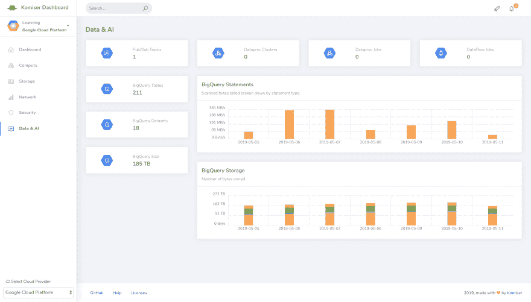
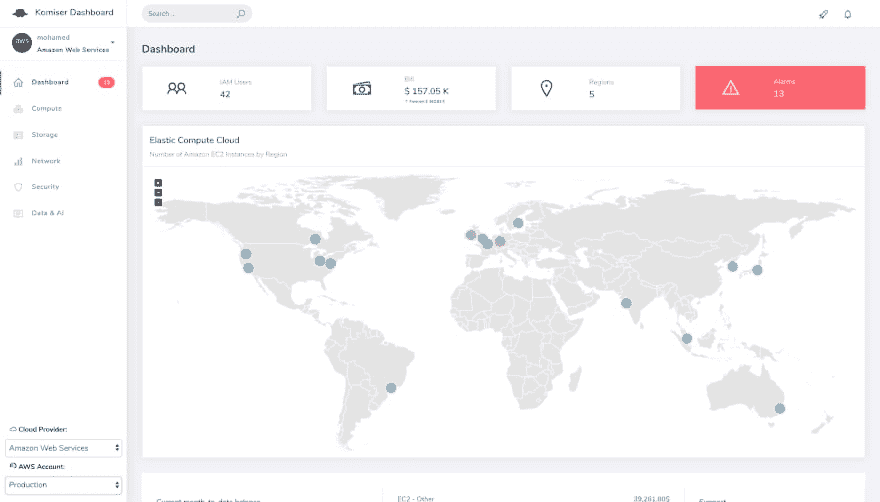

# 在一个控制面板中分析和管理 AWS 成本、使用情况和安全性

> 原文：<https://dev.to/mlabouardy/analyze-and-manage-aws-cost-usage-and-security-in-one-dashboard-5coi>

[https://www.youtube.com/embed/J-MKrg8JBtc](https://www.youtube.com/embed/J-MKrg8JBtc)

为了在 AWS 中构建 HA &弹性应用程序，您需要假设一切都会失败。因此，您总是在多个 AZ & regions 中设计和部署您的应用程序。因此，您最终会得到许多未使用的 AWS 资源(快照、ELB、EC2、弹性 IP 等),这可能会让您损失一大笔钱。

AWS 架构良好的框架的一个支柱是成本优化。这就是为什么您需要对您的 AWS 基础设施有一个全局的概述。幸运的是，AWS 提供了许多完全托管的服务，如 CloudWatch、CloudTrail、Trusted Advisor 和 AWS Config，来帮助您实现这一目标。但是，他们需要对 AWS 平台有深入的了解，而且他们不是直截了当的。

[](https://res.cloudinary.com/practicaldev/image/fetch/s--G8X2nBGl--/c_limit%2Cf_auto%2Cfl_progressive%2Cq_auto%2Cw_880/https://labouardy.cimg/dashboard-gcp.png)

这就是为什么我想出了 Komiser 这个工具，它通过查询 AWS API 来简化流程，在单个仪表板中实时获取有关几乎所有 AWS 关键服务的信息，如 EC2、RDS、ELB、S3、Lambda 等。

[](https://res.cloudinary.com/practicaldev/image/fetch/s--gkuEVVVz--/c_limit%2Cf_auto%2Cfl_progressive%2Cq_auto%2Cw_880/https://s3.eu-west-3.amazonaws.com/komiser-asseimg/dashboard-aws-multiple.png)

Komiser 是 100%开源的，它同时支持 AWS 和 GCP。Azure 支持将很快发布。

##  [ HelloOraculi ](https://github.com/HelloOraculi) / [科姆瑟](https://github.com/HelloOraculi/komiser)

### 开源云环境检查器👮

<article class="markdown-body entry-content container-lg" itemprop="text">

**科姆瑟回来了<g-emoji class="g-emoji" alias="tada" fallback-src="https://github.githubassets.cimg/icons/emoji/unicode/1f389.png">🎉</g-emoji>我们正在寻找新[路线图](https://oraculi.canny.io/)的维护者，如果你感兴趣，加入我们的 [Discord](https://discord.oraculi.io) 社区**

* * *

# [](https://camo.githubusercontent.com/1e79eaeab00dacbedbea6996284c4a2ee642e99ef5e382fac1d7852ba7492e4d/68747470733a2f2f63646e2e6b6f6d697365722e696f2f696d616765732f6b6f6d697365722d726561646d652e62616e6e65722e706e67)

#### [不和](https://discord.oraculi.io) | [讨论](https://github.com/mlabouardy/komiser/discussions) | [现场](https://komiser.io/)

[导读](https://docs.komiser.io/) | [如何向格斗家](https://docs.komiser.io/docs/docs/how-to-komiser/alerts) | [文档](https://docs.komiser.io/docs/intro)

[投稿](https://docs.komiser.io/docs/introduction/contribute) | [路线图](https://roadmap.oraculi.io)

[](https://github.com/mlabouardy/komiser/blob/master/LICENSE)[](https://hub.docker.com/r/mlabouardy/komiser)[](https://github.com/HelloOraculi/komiserLICENSE)[](https://circleci.com/gh/mlabouardy/komiser/tree/master)[](https://github.com/mlabouardy/komiser/issues)[](https://discord.oraculi.io/)

通过发现隐藏成本、监控支出增长以及根据客户建议进行有效的更改，保持在预算之内。

*云版本在私测阶段，免费登录[https://Cloud . orac uli . io](https://cloud.oraculi.io)T3】*

[ ](https://twitter.com/komiseree) [ ](https://twitter.com/intent/tweet?text=Optimize%20Cost%20and%20Security%20on%20AWS&url=https://github.com/mlabouardy/komiser&via=mlabouardy&hashtags=komiser,aws,gcp,cloud,serverless,devops)

## Komiser CLI，试试看！

* * *

开始使用 Komiser 最简单的方法是通过运行下面的`Homebrew`命令来安装 [Komiser CLI](https://docs.komiser.io/docs/overview/introduction/getting-started) 。没有自制的？在这里安装[。](https://docs.brew.sh/Installation)

```
brew tap HelloOraculi/komiser
brew install komiser 
```

**目录**

*   [什么是 Komiser？](https://github.com/HelloOraculi/komiser#what-is-komiser)
    *   谁在使用它？
*   [入门](https://github.com/HelloOraculi/komiser#getting-started)
    *   [下载](https://github.com/HelloOraculi/komiser#download)
    *   [安装在自动气象站上](https://github.com/HelloOraculi/komiser#installation-on-aws)
        *   将 Komiser CLI 连接到您的 AWS 帐户。
        *   [将 Komiser 部署到单一账户访问 EKS 集群(掌舵图)](https://github.com/HelloOraculi/komiser#deploy-komiser-to-single-account-access-eks-cluster-helm-chart)
        *   [将 Komiser 部署到多功能](https://github.com/HelloOraculi/komiser#deploy-komiser-to-a-multi-account-access-eks-cluster-helm-chart) …

</article>

[View on GitHub](https://github.com/HelloOraculi/komiser)

希望有帮助！CLI 仍处于早期阶段，因此欢迎您为 GitHub 上的项目做出贡献。