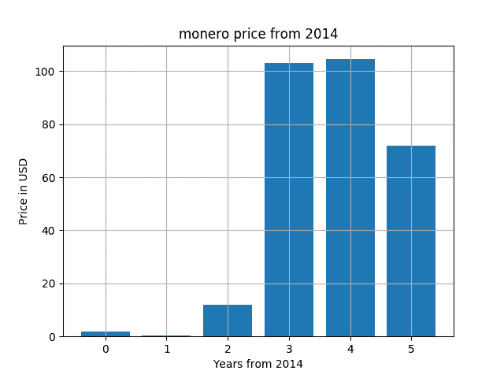
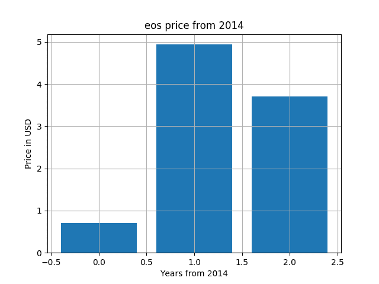
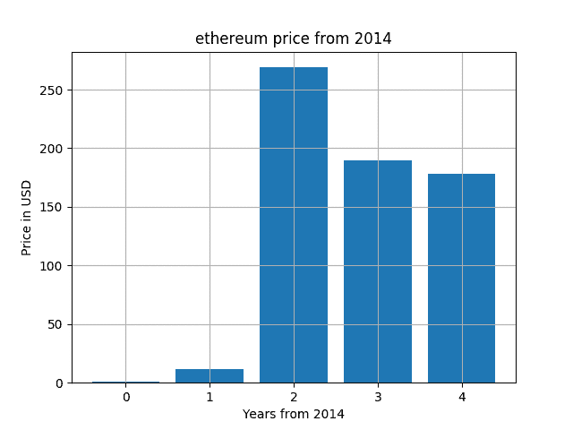

# 用 Python 分析比特币价格趋势

> 原文：<https://dev.to/codesharedot/analyzing-alt-coin-price-trend-with-python-4kff>

比特币发行几年后，许多不同的加密货币被创造出来。

比特币目前价值 10247 美元。其他硬币价格较低，但没有相同的市值。

许多硬币是以以太坊区块链为基础的。以太坊允许你在它们的链上创造硬币。我认为这是以太坊成为第二大最受欢迎的硬币的部分原因。

以太坊不同于比特币的意义在于，每个节点都运行一个虚拟机，称为以太坊虚拟机。这使您能够创建“智能合同”(程序)。

因此，2008 年后，许多另类硬币出现了崩盘趋势。这种情况会持续下去，还是恐惧周期已经结束，我们现在会看到一个上升趋势？公众是否对短时间框架持乐观态度？

## Alt 币

让我们使用 Python 来分析这些加密硬币的年度趋势。是的，用 Python 我们可以分析趋势。

该代码从市场 API 获取数据，并返回 JSON 数据。然后解析 JSON 数据并提取价格。然后用 [matplotlib](https://pythonbasics.org/matplotlib-bar-chart/) 创建图。

```
#!/usr/bin/python3 
import time
import os
import json
import requests
from bs4 import BeautifulSoup
import csv
import sys
from time import sleep
from time import gmtime, strftime
import matplotlib.pyplot as plt

enddate = strftime("%Y%m%d", gmtime())
r  = requests.get("https://coinmarketcap.com/currencies/monero/historical-data/?start=20140101&end={0}".format(enddate))
data = r.text

soup = BeautifulSoup(data, "html.parser")
table = soup.find('table', attrs={ "class" : "table"})

prices = []

for row in table.find_all('tr'):
    addPrice = False
    tag = row.findAll('td')
    for val in tag:
        value = val.text

        if "Sep 10" in value:
            print(value)
            addPrice = True

    if addPrice == True:
        prices.append( tag[3].text )

# flip list, months are in reverse order
prices = prices[::-1]
for i in range(0,len(prices)):
    prices[i] = float(prices[i])

#for price in prices:
#    price = float(price)

print(prices)
x = list(range(0, len(prices)))
print(x)

plt.title('monero price from 2014')
plt.ylabel('Price in USD')
plt.xlabel('Years from 2014')
plt.bar(x,prices)

os.system("rm -rf chart.png")
time.sleep(1)
#plt.savefig('chart.png')                            
plt.show() 
```

一些流行的另类硬币:

货币:

[](https://res.cloudinary.com/practicaldev/image/fetch/s--X37F5Fok--/c_limit%2Cf_auto%2Cfl_progressive%2Cq_auto%2Cw_880/https://thepracticaldev.s3.amazonaws.com/i/nd18sak2ufwsrw78lb29.png)

**eos:**
[](https://res.cloudinary.com/practicaldev/image/fetch/s--uCCMJYyG--/c_limit%2Cf_auto%2Cfl_progressive%2Cq_auto%2Cw_880/https://thepracticaldev.s3.amazonaws.com/i/8n7lrwan1161jo9ot3vv.png)

**以太坊:**
[](https://res.cloudinary.com/practicaldev/image/fetch/s--cYrK0gMD--/c_limit%2Cf_auto%2Cfl_progressive%2Cq_auto%2Cw_880/https://thepracticaldev.s3.amazonaws.com/i/c60r1mnln3sij35m8axx.png)

有上升趋势，但现在又是下降趋势。上升趋势的波动比下降趋势的波动大得多。它可能会再次发生。这不是财务建议。

## 相关链接

*   [密码市场](https://coinmarketcap.com/)
*   [创建加密货币图表](https://github.com/codesharedot/eos-price-chart)
*   [学习 Python](https://pythonbasics.org/)