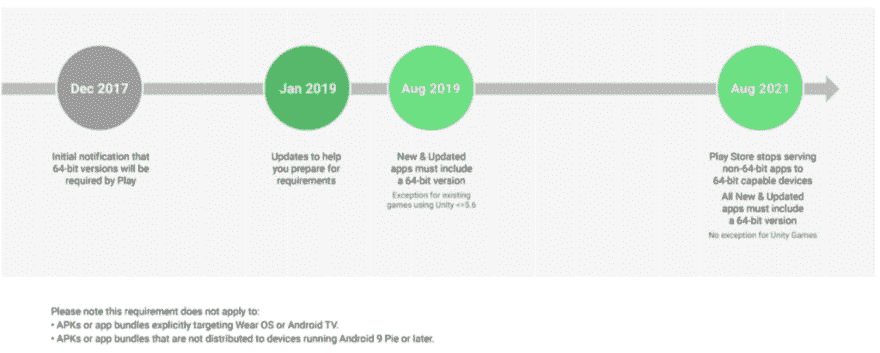
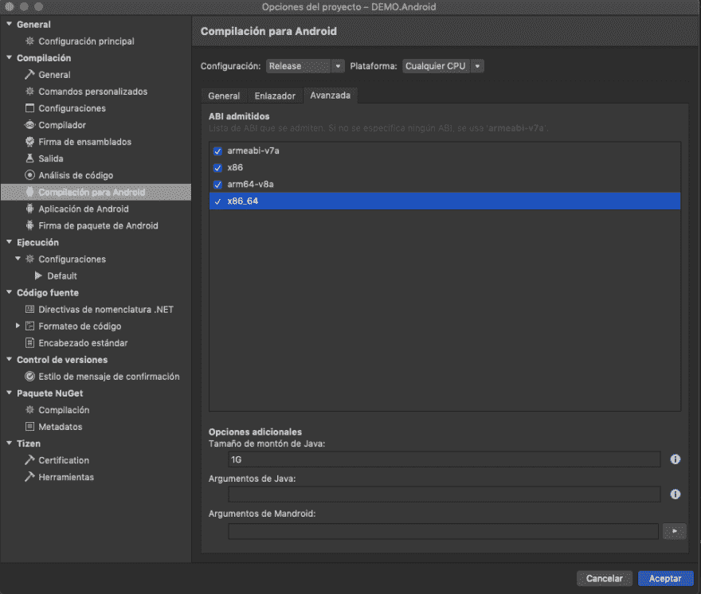

# 安卓 64x con Xamarin。形式

> 原文：<https://dev.to/luciomsp/android-64x-con-xamarinforms-6b8>

在我们开始之前，请记住 Google 在 2017 年 12 月提到，从今年起，开发人员要想在 Google Play 中运行，就必须发布 64 位应用程序(除 32 位版本之外)。8 月 1 日，该公司公布了过渡到 2021 年的最后期限。

**但是，谷歌这是做什么的？**

主要目的来自 Android 5 的发布。0 lollipop 及其 64 位兼容性，并不是所有开发人员都发布了能够表达新处理器功能的版本。值得注意的是，64 位应用程序的运行速度比 32 位应用程序快。

因此，该公司决定，所有新应用程序和本机代码更新在发布到 Google Play 时，除了提供 32 位版本外，还必须提供 64 位版本。作为例外，Google 将允许在 2021 年 8 月之前接受使用 Unity 5.6 或更高版本的现有游戏的 32 位更新。

**我在洗发精方面的发展。形式？**

我知道，大多数登录此博客的人都在寻找 xamarin . forms 开发的解决方案，这也不例外，本文将演示如何将您的 Android 应用程序配置为 xamprin，以提供 64 位版本。

**注**:由于洗发精制作的应用程序是本地的，因此本规则也适用。

我们开始

在我们的解决方案中，右键单击 Android 项目，然后选择“选项”->“Android build”->“advanced(高级)”。

确保将项目设置设置为“T1 发布”模式，并在“高级选项”选项卡中选择所需的体系结构选项，64 位表示“T2”x86 _ 64“”和“T4”arm 64-V8 a”

现在，我们的 Android 应用程序支持 64 位体系结构。

Más Información: [开发商 Android](https://developer.android.com/distribute/best-practices/develop/64-bit?hl=es-419)——[多核设备& Xamarin。安卓](https://docs.microsoft.com/en-us/xamarin/android/deploy-test/multicore-devices?WT.mc_id=docs-xamarinblog-jamont)

* * *