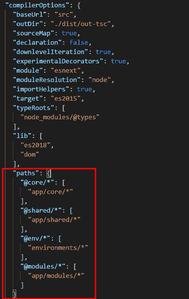

# 角度-导入语句的别名

> 原文：<https://dev.to/anji4246/angular-aliases-for-import-statements-4bb2>

<figure> 

<figcaption>别名用于导入报表</figcaption>

</figure>

### Angular-导入语句的别名

这是 angular 最酷的特性之一。每个开发人员都会遇到这样的情况，即 angular 应用程序的导入很混乱，难以阅读。

您可能会遇到类似这样的情况:

从'导入用户服务'../../../../Services/user-service；

从'导入用户组件../../../../components/user . component；

如果我们有相对路径的别名会更有帮助，这样可以提高代码的可读性。

为了在 angular 应用程序中实现这一点，您需要做的就是更新 tsconfig.json 文件。

如果您查看上面的配置，baseUrl 属性的默认属性被更新为“src”目录。然后，我们添加了一个名为 paths 的新属性，它是一个包含键值对的对象，这些键值对表示为应用程序中的路径定义的别名。

上面的代码可以重写如下:

从“@core/Services/user-service”导入 UserService

从' @ modules/user/components/user . component '导入 user component；

这种方式的代码更加清晰易读。

*原载于 2019 年 9 月 3 日*[*【http://techmonks.org】*](http://techmonks.org/angular-alias-paths/)*。*

* * *