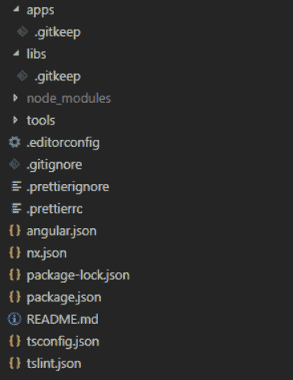

# Angular，其余用 Nest.js

> 原文：<https://dev.to/thisdotmedia/angular-and-the-rest-with-nest-js-2glo>

本周，我继续撰写系列文章 [Angular 和其余的](https://dev.to/thisdotmedia/angular-and-the-rest-4ho7)，前端使用 Angular，后端使用节点应用 [Nest.js](https://nestjs.com/) 。此外，后端应用程序将连接到运行在 [Docker](https://www.docker.com/) 容器上的 [PostgreSQL](https://www.postgresql.org/) 数据库实例。

本系列的第三部分将涵盖 Nrwl/Nx 项目，以构建一个包含 Angular 应用程序、Nest.js 应用程序和一组服务于这些应用程序的库的 monorepo。前端应用程序将实现 CRUD 操作，允许匿名用户管理和跟踪电影。

在本系列的下一期文章中，我们将继续使用 JWT (JSON Web Tokens)来支持应用程序中的身份验证，以将管理和跟踪电影的访问权限仅限于经过身份验证的用户。

如果您还没有阅读前两期，这里有一个快速提示，告诉您我们将要构建什么。

我开始构建 Angular 应用程序来跟踪我已经看过的和将来会看的电影。Angular 应用程序允许我在电影上执行所有的 CRUD、创建、读取、更新和删除操作。在后端，我将构建一个 Nest.js Web API。目前，它将提供一个 RESTful 端点来执行电影上的所有 CRUD 操作，并连接到 PostgreSQL 数据库。

> 如果你是 Nest.js 的新手，我推荐你阅读我的其他系列文章。本系列遵循一步一步的指南来教授 Nest.js 框架，从基础到更高级的主题。 [Nest.js 步步为营](https://www.codemag.com/Article/1907081/Nest.js-Step-by-Step)。

对于这篇文章和下一篇文章，我假设您对 Nrwl/Nx、Nest.js 和 Angular 有基本的了解。此外，如果需要的话，我会分享一些很棒的参考资料。

让我们开始使用 Nrwl/Nx 扩展创建 monorepo 工作区。

这个 monorepo 工作区的源代码可以在这个 GitHub [repo](https://github.com/bhaidar/movie-tracker/tree/develop) 上找到。

## 使用 Nrwl/Nx 工作空间构建 Monorepo

简而言之，Nrwl/Nx 由其提供的工具定义:

*   它包含帮助在项目中生成代码以确保一致性的示意图。
*   它包含有助于实施林挺规则和代码格式的工具。
*   它允许您可视化存储库中应用程序和库之间的依赖关系。
*   它允许针对代码更改执行命令:任何未提交的更改、两个特定 git 提交之间的比较、与另一个分支的比较等。这些命令可以测试、lint 等。仅受影响的文件，通过避免未受我们的更改影响的文件，节省了我们大量的时间。
*   它包括在角度应用中帮助解决竞态条件的工具。

> 我建议你阅读《企业角度:单一回购模式》一书，深入了解 Nrwl/Nx。
> 
> 要开始学习和使用 Nrwl/Nx，最好的资源是阅读他们的官方文档和教程。

### 什么是 Nx 工作空间？

Nx 工作空间是使用 Nx 创建的文件夹。该文件夹由一个 git 存储库组成，包含应用程序和库的文件夹；以及一些脚手架来帮助建筑，林挺和测试。

### 创建电影跟踪器 Nx 工作区

让我们按照下面的步骤创建**电影跟踪器**工作空间结构。

**步骤 1**
首先安装最新版本的 Angular CLI 和 Nrwl/Nx 原理图。运行以下命令:
`yarn global add @angular/cli @nrwl/schematics`

该命令会在全局范围内安装最新版本的 Angular CLI 和 Nrwl/Schematics。

**步骤 2**
让我们通过运行以下命令来创建电影跟踪器工作区:
`yarn create nx-workspace mt --directory=movie-tracker`

该命令下载并安装最新的`create-nx-workspace` CLI NPM 软件包。然后，CLI 会提示您一系列问题，允许您自定义 Nx 工作区。

我选择了以下内容:

*   `Which stylesheet format would you like to use?` **石头(.SCS)**
*   `What to create in the new workspace?` **清空**

**空**答案指示`create-nx-workspace` CLI 创建一个空工作区。我将很快向您展示我们如何控制要创建的应用程序和库。

回答完这两个问题后，CLI 会为您生成一个新的工作区。

**apps*和**libs** 文件夹是空的。我们将很快填满它们。

注意这个`nx.json`文件。这个文件是 Nx 特有的，用于跟踪在工作区中创建的所有项目。