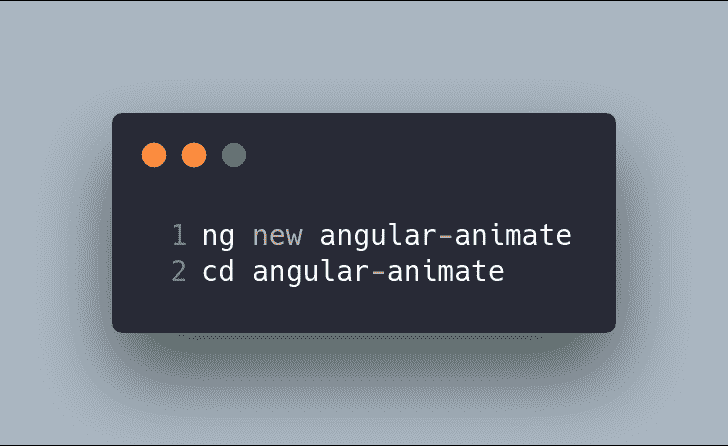
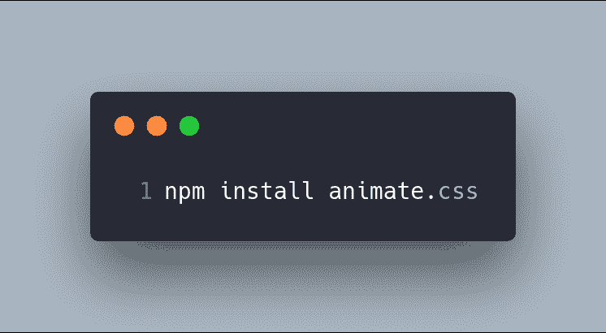
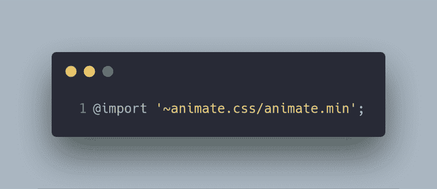
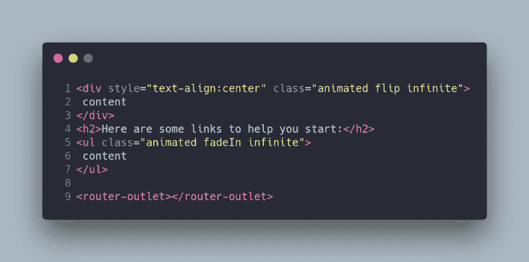

# Angular + Animate.css 五个简单步骤

> 原文：<https://dev.to/angular/angular-animate-css-in-five-easy-steps-8o6>

### Angular + Animate.css 简单五步

#### 循序渐进的角度教程

css 是一个跨浏览器的 CSS 动画库
，非常容易使用。

在这篇文章中，我将向你展示如何通过五个步骤来配置 Animate.css 以用于
Angular。

* * *

### 第一步:初始化你的项目

如果你想在 Angular 项目中使用 Animate.css，你可能已经有了一个初始化的项目。然而，对于本教程，让我们从零开始我们的项目。

* * *

### 第二步。安装 Animate.css

安装`animate.css`。

* * *

### 第三步。包含 Animate.css

有几种方法可以将 Animate.css 包含在我们的项目中:

*   打开`angular.json`并在样式数组中插入一个新条目:

*   打开`styles.css`并在文件中插入一个新条目:

* * *

### 第四步。添加动画 CSS 类

打开模板的组件，将动画 CSS 类添加到任何一个
HTML 元素中:

* * *

### 第五步。运行您的应用程序！

运行您的应用程序:

* * *

### 更多，更多，更多…

*   [Animate.css](https://daneden.github.io/animate.css/)

该岗位的 **GitHub** 分支为 https://github.com/Caballerog/angular-animate.css
T3

* * *

最初发布于[https://carloscaballero . io](https://carloscaballero.io)