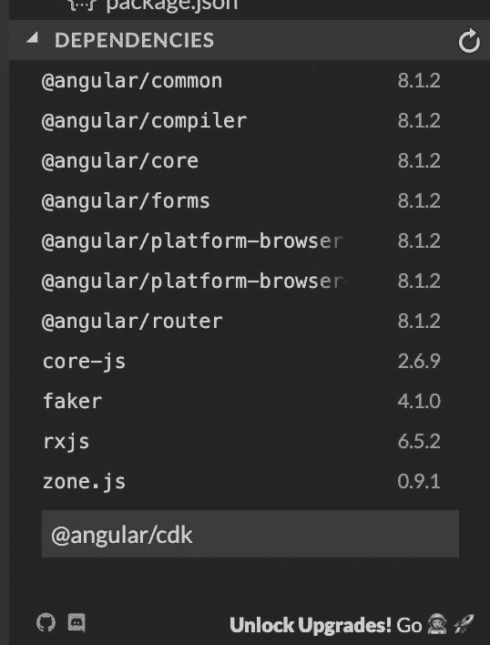
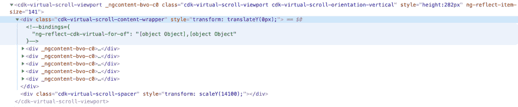

# 角 CDK 虚拟卷轴

> 原文：<https://dev.to/hassam7/angular-cdk-virtual-scroll-4ldj>

# 什么是虚拟滚动？

现代 web 应用程序很复杂。他们有许多移动部件，非常复杂，而且经常需要处理大量数据。

假设您有一个必须显示用户列表的应用程序，这是一个非常常见的用例。

随着列表中项目数量的增加，DOM 中元素的数量也会增加，从而导致更多的内存和 cpu 使用。我们可以通过只渲染所有项目的有限集合来减少内存和 cpu 消耗，我们可以通过查看容器的高度、滚动位置和单个项目的高度来确定这个有限集合，然后执行一些计算，告诉我们列表中的哪些项目应该在 DOM 中渲染，一旦用户滚动，我们就再次执行此计算，删除以前渲染的项目，并根据计算结果渲染新项目。所有这一切听起来非常复杂，它是，但好消息是，有角的材料 CDK 虚拟卷轴为你做这一切，然后更多。从现在起，我将把有角物质 CDK 虚拟卷轴称为虚拟卷轴

所以让我们开始吧！

# 先决条件

在我们开始之前，我们需要一个带有数据列表的示例应用程序，这样我们就可以玩它，稍后添加角度虚拟滚动到它。我已经创建了一个[小例子](https://stackblitz.com/edit/ngfor-faker)
这个例子是建立在使用 Angular 版本 8 的基础上的。它使用 fake 生成假数据，将其添加到数组中，并使用`*ngFor`将数组中的项呈现为模板中的 DOM 元素。

# 安装

安装材料 CDK 是相当直截了当。如果你正在跟进:在 stackblitz 演示中，点击依赖项，它就在列出项目文件的窗口下面(见下面的截屏),键入`@angular/cdk`,然后点击回车，这将安装材料 cdk。如果你想把它安装在你的 angular cli 项目中，只需输入`npm i --save @angular/cdk`

[](https://res.cloudinary.com/practicaldev/image/fetch/s--3xRmPtBT--/c_limit%2Cf_auto%2Cfl_progressive%2Cq_auto%2Cw_880/https://i.imgur.com/ScWpEbn.png)

一旦你安装了 CDK，我们就准备进入下一步:使用它！

# 用法

在我们开始使用虚拟卷轴之前，我们需要为它导入模块。还是导入吧。打开你的`app.module.ts`在最后一次导入后添加这行

`import { ScrollingModule } from '@angular/cdk/scrolling';`

这将导入`ScrollingModule`，现在我们需要告诉我们的`app.module.ts`导入这个模块的内容。为此，在导入数组中添加`ScrollingModule`你的`app.module.ts`将看起来像这样

```
 import  {  NgModule  }  from  '@angular/core';
import  {  BrowserModule  }  from  '@angular/platform-browser';
import  {  FormsModule  }  from  '@angular/forms';
import  {  AppComponent  }  from  './app.component';
import  {  ScrollingModule  }  from  '@angular/cdk/scrolling';

@NgModule({
imports:  [  BrowserModule,  FormsModule,  ScrollingModule  ],
declarations:  [  AppComponent  ],
bootstrap:  [  AppComponent  ]
})
export  class  AppModule  {  } 
```

Enter fullscreen mode Exit fullscreen mode

现在我们准备使用虚拟卷轴！

我们将修改我们的应用程序来使用虚拟滚动！这是到具有所需状态的 [stackblitz 应用程序](https://stackblitz.com/edit/ngfor-faker-material-cdk?file=src/app/app.component.html)的链接。这与我们最初的应用程序相同，但安装和导入了角 CDK。

打开`app.component.ts`，在`AppComponent`的构造函数里面你会看到

```
constructor()  {
  this.persons =  Array(100).fill(0).map(()  =>  { 
  return {
      name: faker.name.findName(),
      bio: faker.hacker.phrase(),
      avatar: faker.image.business()
    }
  })
} 
```

Enter fullscreen mode Exit fullscreen mode

这将创建一个包含 100 个对象的数组，每个对象包含由`faker`生成的名字、简历和头像。这个数组被分配给名为`persons`的实例变量

现在打开这个组件的模板文件(`app.component.html`)。

```
<div  class="search-wrapper cf">
  <input  type="text">
  <button (click)="undefined">Go To</button>
</div>

<div *ngFor="let person of persons;let i = index">
  <div class="card">
      
      <div  class="container">
        <h4><b>{{person.name}}</b></h4>
        <h4><b>ID: {{i}}</b></h4>
        <p>{{person.bio.substr(0, 30)}}</p>
      </div>
  </div>
</div> 
```

Enter fullscreen mode Exit fullscreen mode

该模板由一个按钮和点击处理程序组成，到目前为止它什么也不做。在按钮下面，我们使用`*ngFor`来迭代 person 数组，对于每个 person 数组，我们用 class card 创建一个 div。这个`card` div 由人名、id、简历和头像组成。我们只显示生物的前 30 个字符。

现在让我们修改我们的模板来使用虚拟滚动。为此，我们首先需要用`<cdk-virtual-scroll-viewport>`包装我们的 ngFor，然后用。`cdk-virtual-scroll-viewport`有一个被称为`[itemSize]`的必需输入。

`itemSize`代表我们正在渲染的项目的像素高度，在我们的例子中，这应该是我们的卡 div 的精确高度，即`141px`。另一件要注意的事情是，我们所有卡组件的高度应该相同。到目前为止，虚拟滚动条还不完全支持可变高度。我们稍后将研究变量高度的问题。

因此，让我们用`cdk-virtual-scroll-viewport`包装`*ngFor`，用`*cdkVirtualFor`替换`*ngFor`。在我们看到任何视觉变化之前，另一件需要做的事情是给我们的`cdk-virtual-scroll-viewport`赋予高度，我想一次显示两张用户卡，所以我给`cdk-virtual-scroll-viewport`赋予`282px` *的高度(单张卡的大小是 141，141 * 2 = 282)* 你可以在样式表中给我们的 add style 标签赋予高度。我将通过样式标签
添加高度

```
<cdk-virtual-scroll-viewport [itemSize]="141" style="height: 282px">
<div *cdkVirtualFor="let person of persons;let i = index">
  <div  class="card">
    
    <div  class="container">
        <h4><b>{{person.name}}</b></h4>
        <h4><b>ID: {{i}}</b></h4>
        <p>{{person.bio.substr(0, 30)}}...</p>
    </div>
</div>

</div>
</cdk-virtual-scroll-viewport> 
```

Enter fullscreen mode Exit fullscreen mode

现在我们可以看到我们的用户列表项被渲染了。让我们验证我们的 DOM 项目是动态创建和重用的。打开你的浏览器开发者工具，选择`Elements Panel`。找到下面屏幕截图中显示的 DOM 元素并展开它。

[](https://res.cloudinary.com/practicaldev/image/fetch/s--w3m6jk0b--/c_limit%2Cf_auto%2Cfl_progressive%2Cq_auto%2Cw_880/https://i.imgur.com/0dPEjTI.png)

现在，如果您滚动列表，您将看到创建了有限数量的 DOM 元素，这导致了内存和 cpu 使用的减少。

# 高度可变的物品

到目前为止，Virtual Scroll 不支持可变高度，但它正在开发中，并处于试验阶段，这意味着您不应该在生产中使用它，因为它的 api 可能会改变。

对于高度可变的项目，我们需要安装`@angular/cdk-experimental`。您可以通过点击 dependencies 并键入`@angular/cdk-experimental`然后点击 enter 键来安装到 stackblitz 中。它将为您安装实验性的 cdk。angular cli 用户可以通过`npm @angular/cdk-experimental`安装。

现在我们需要将它导入到我们的应用程序模块中。就像之前一样，在`app.module.ts`
中添加下面一行

```
import  {  ScrollingModule  as  ExperimentalScrollingModule}  from  '@angular/cdk-experimental/scrolling';
```

It will import `ScrollingModule` and rename it as `ExperimentalScrollingModule`. We need both `ScrollingModule` and `ExperimentalScrollingModule` for variable height to work. Now add `ExperimentalScrollingModule` into import array. You `app.module.ts` should look like this:

```
import  {  NgModule  }  from  '@angular/core';
import  {  BrowserModule  }  from  '@angular/platform-browser';
import  {  FormsModule  }  from  '@angular/forms';
import  {  AppComponent  }  from  './app.component';
import  {  ScrollingModule  }  from  '@angular/cdk/scrolling';
import  {  ScrollingModule  as  ExperimentalScrollingModule}  from  '@angular/cdk-experimental/scrolling';

@NgModule({
imports:  [  BrowserModule,  FormsModule,  ScrollingModule,  ExperimentalScrollingModule  ],
declarations:  [  AppComponent  ],
bootstrap:  [  AppComponent  ]
})
export  class  AppModule  {  } 
```

Enter fullscreen mode Exit fullscreen mode

现在打开`app.component.html`，用`autosize`替换`[itemSize]`。就是这样！现在你可以在你的虚拟滚动条中设置不同高度的元素，但是如前所述，这个特性是实验性的，不应该使用。你可以在这里找到自动调整[的例子](https://stackblitz.com/edit/cdk-virtual-scroll-autosize?file=src/app/app.module.ts)