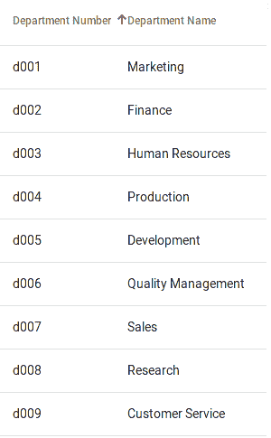

# jQuery 数据表开发人员的角度数据表:简单入门

> 原文：<https://dev.to/bbutlerfrog/angular-data-tables-for-jquery-datatables-developers-a-simple-start-26bm>

## 数据表与数据表

如果你像我一样已经开发了一段时间(所以你也觉得自己老了)，那么很有可能你已经在前端使用了 [jQuery](https://jquery.com/) (或者仍然在使用它)，从而使用了 [jQuery 数据表](https://datatables.net/)(都是一个单词)。还有一个很好的机会是，您正在为您的“绿地”(新代码)项目迁移到更新的 JavaScript(嗯，在这种情况下是 TypeScript)框架，如 [Angular](https://angular.io/) ，以创建 SPA(单页应用程序)，许多人都认为这是最好的方法。

那么，如何使用 [Angular Material](https://material.angular.io) 中的数据表(两个单词)来创建功能类似 jQuery 数据表的表格呢？让我们看看 Angular Material 数据表是如何工作的，它与 jQuery 数据表相比如何，以及如何用相同的数据创建相似的元素。

为了解决一些“内务管理”问题，我在我的网站上链接到的所有示例和这里显示的图片都使用了[雇员样本数据库](https://github.com/datacharmer/test_db)，正如我注意到的，jQuery DataTables 网站上也使用了该数据库。为了在这个例子中使用这些数据，我从我在 [Laravel Lumen](https://lumen.laravel.com) 中编写的 [API](https://github.com/bbutlerfrog/benfrogapi) 中检索它，但是显然你可以使用任何你想要的 API 和数据库将数据放入你的 Angular 项目中。我也准备假设 Angular 8 的基础知识，包括 [HttpClient](https://angular.io/tutorial/toh-pt6) 。我还强烈建议你看一下 Angular Material 网站上的 [CDK 表格文档](https://material.angular.io/cdk/table/api)(我第一次阅读这些文档时错过/跳过了，因为它几乎是作为题外话提到的)，因为我发现对 Angular 数据表的工作原理以及如何定制它们有一个坚实的理解是非常重要的。说了这么多，让我们来看一个简单的例子。

我跳过了关于静态数组的[“入门”](https://material.angular.io/components/table/overview#getting-started)教程，因为它已经存在了，而且(正如该教程提到的)，从前端静态数组构建的表实际上没有“真实世界”的用途。取而代之的是，我将继续之前的“AJAX-ing”数据的实践，非常像[这个函数](https://datatables.net/reference/option/ajax)我的“旧站点”，使用 AJAX:

```
function initDeptTable () {
  var table = $('#employee-dept').DataTable({
  "ajax" : {
  "url" : '../main/php/serverHTML.php?type=JSON&content=employee-dept',
  "cache": false,
  "contentType": "application/json",
} 
```

我的这个更新示例主要基于“通过 HTTP 检索数据的表”示例[这里是](https://material.angular.io/components/table/examples)，做了大量的“调整”,因为我有能力使用多种服务/类/接口/等等，以及我自己的 API。

在这个例子中，有两个简单的接口，一个用于条目的集合和计数，另一个用于条目本身。这是一个可靠的实践(正如您可能猜到的，如果您能够控制 API，通常最好在后端进行计数)。我做的唯一改变是将这些文件分成多个文件:

```
export interface Department {
  DepartmentName: string;
  DepartmentNumber: string;
} 
```

```
import { Department } from './department.model';

export interface DepartmentApi {
    items: Department[];
    total_count: number;
} 
```

与 jQuery 数据表相比，这可能看起来有点复杂(到目前为止还有一些工作)，但是请记住，我们正在获取动态表内容，这是我们将 JSON 重新格式化为我们需要的特定格式的方法，消除了在后端或使用自定义 JavaScript 重新格式化的需要。我不得不使用这个 PHP 来重新格式化我以前的 JSON，就像 jQuery 数据表的 [this](a%20href=) 一样。随着对构建表的每个步骤的更多控制，我们也获得了更多的灵活性。比如我准备把[这个教程](https://blog.angular-university.io/angular-material-data-table)的一部分整合进来(注意是针对 Angular 6 的，不过大部分还是可以用的)。具体来说，为我们的数据使用一个可观察值的概念，而不是 MatTableDataSource [(这是为什么)](https://material.angular.io/components/table/overview#datasource)。这里有一个服务可以提供这种观察:

```
import { Injectable } from '@angular/core';
import { Observable, throwError } from 'rxjs';
import { HttpClient, HttpParams, HttpErrorResponse } from '@angular/common/http';
import { catchError, retry } from 'rxjs/operators';

import { DepartmentApi } from './shared/department-api.model';

@Injectable({
  providedIn: 'root'
})
export class DepartmentsService {

  constructor(private http: HttpClient) { }

  DepartmentUrl = 'https://api.benfrog.net/departments';

  getDepartments(sortDirection: string, sortParameter: string ):Observable<DepartmentApi> {
    sortDirection = sortDirection.trim();
    sortParameter = sortParameter.trim();

    let httpParams = new HttpParams({ fromObject: { sortDirection: sortDirection, sortBy: sortParameter } });

    return this.http.get<DepartmentApi>(this.DepartmentUrl, {params: httpParams})
    .pipe(
      retry(3), // retry a failed request up to 3 times
      catchError(this.handleError) // then handle the error
    );
  }

  private handleError(error: HttpErrorResponse) {
    if (error.error instanceof ErrorEvent) {
      // A client-side or network error occurred. Handle it accordingly.
      console.error('An error occurred:', error.error.message);
    } else {
      // The backend returned an unsuccessful response code.
      // The response body may contain clues as to what went wrong,
      console.error(
        'Backend returned code ${ 'error.status'}, ' +
        'body was: ${ 'error.error'} ');
    }
    // return an observable with a user-facing error message
    return throwError(
      'Something bad happened; please try again later.');
  };

} 
```

我们在这里做的是提供一个可观察对象，它调用 HttpClient 的 http.get()函数，期望返回一个“DepartmentApi”对象(Department 对象的数组和这些对象的计数)，并实现一些简单的错误处理:

```
return this.http.get<DepartmentApi>(this.DepartmentUrl, {params:                                httpParams})
    .pipe(
      retry(3), // retry a failed request up to 3 times
      catchError(this.handleError) // then handle the error
    );
  } 
```

在部门表组件的 ngOnInit 函数中(它的工作方式很像常用的 [jQuery $(document)。ready()](https://api.jquery.com/ready) 函数)，构造函数需要它自己的私有 HttpClient 实例，然后将它传递给上面的 departmentService 的实例，department service 利用它来获取我们的 API 数据(整个组件在这里是):

```
this.departmentsService = new DepartmentsService(this.http);
     merge(this.sort.sortChange)
      .pipe(
          startWith({}),
          switchMap(() => {
            this.isLoadingResults = true;
            return this.departmentsService!.getDepartments(this.sort.direction, this.sort.active)
          }),
          map(data => {
          // Flip flag to show that loading has finished.
          this.isLoadingResults = false;
          this.resultsLength = data.total_count;
          return data.items;
        })).subscribe(data =>this.data = data); 
```

大量的事情发生在少量的代码中，这是 Angular 的一个很好的特性，只要它不会给开发人员带来困惑。让我们把它分解开来(这也是一个很好的想法，让这个或任何其他数据流利用我们现在拥有的优秀的堆栈跟踪工具，如用于 Firefox 的 Visual Studio 代码调试器或 T2 Chrome。

首先，我们有一个 [RxJs Merge](https://rxjs-dev.firebaseapp.com/api/index/function/merge) (我们实际上合并了 [matSortChange](https://material.angular.io/components/sort/api#MatSort) 事件，但如果需要的话可以添加事件)，然后使用 RxJS Observable.pipe 函数，[，如这里所记录的](https://angular.io/guide/rx-library)。

一步一步地，管道使用字面上命名的 [RxJS StartWith()](https://rxjs-dev.firebaseapp.com/api/operators/startWith) 函数从一个空的[可观察对象](https://angular.io/guide/observables)开始，然后是 [RxJs switchMap 函数](https://rxjs-dev.firebaseapp.com/api/operators/switchMap)(这里有一个 switchMap 如何工作的深度划分
[)当我们开始从那个服务获取数据时，这里的](https://blog.angular-university.io/rxjs-switchmap-operator)基本上是用 departments service . get departments()的输出来切换那个空的可观察对象。然后，map 函数删除一个修饰性加载标志，将 resultsLength 变量设置为 data.length，最后返回项目数组(Department[]对象)。因为我们[订阅了](https://angular.io/guide/observables#subscribing)这个可观察值，所以每当部门数据更新时，我们的表也会更新。如果这听起来很熟悉，很可能是因为它与 jQuery AJAX 共享这一优势(observable 实际上更加复杂和灵活，因为它不需要直接调用来更新我们的表数据)。

完成的样表的 HTML 是[这里是](https://github.com/bbutlerfrog/angular-tables/blob/master/src/app/department-table/department-table.component.html)。我对上面的例子做了很少的修改，我们最终得到了这个(非常简单的)表格:
[](https://res.cloudinary.com/practicaldev/image/fetch/s--aMym1DzH--/c_limit%2Cf_auto%2Cfl_progressive%2Cq_auto%2Cw_880/https://thepracticaldev.s3.amazonaws.com/i/554k5prkcpa2iuy60w1f.png)

在这一点上，任何人询问所有这些是否“值得”都是可以理解的，特别是因为我们仍然没有来自 jQuery 数据表的基本元素，比如搜索和分页。然而，在下一个例子中，我们将继续展示 Angular 实现这些特性的能力和灵活性(以及新发现的灵活性)。