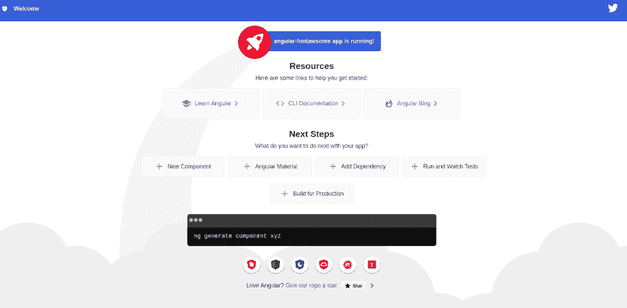
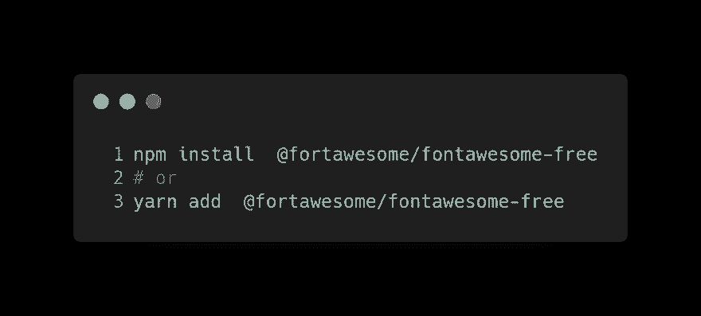
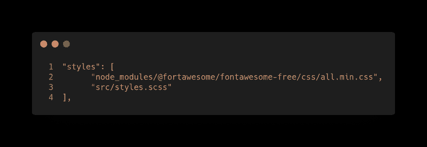
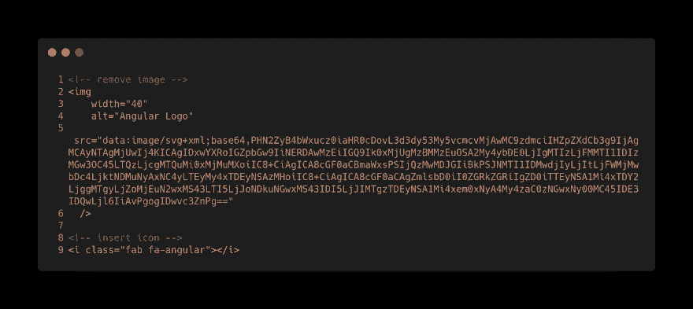

# 五个简单的步骤

> 原文：<https://dev.to/angular/angular-fontawesome-in-five-easy-steps-3oe9>

## 棱角+字体五步轻松搞定

循序渐进的角度教程

FontAwesome 是互联网上最受欢迎的图标工具包，经过重新设计，从零开始构建。除此之外，还有图标字体连字、SVG 框架、面向 React 等流行前端库的官方 NPM 包，以及对新 CDN 的访问。

在这篇文章中，我将向你展示如何配置 fontawesome 来使用 angular，只需要 5-1 个步骤。

在这些步骤中，我们将在不使用特定的[角度包](https://github.com/FortAwesome/angular-fontawesome)的情况下配置 fontawesome。在未来的帖子中，它将使用官方包进行配置，这甚至更简单，我们将让 fontawesome 与相同的 Angular 生态系统一起工作。

[](https://res.cloudinary.com/practicaldev/image/fetch/s--RWdn2Ydq--/c_limit%2Cf_auto%2Cfl_progressive%2Cq_auto%2Cw_880/https://cdn-images-1.medium.com/max/3776/0%2AlZYG_cxRyWJZRYEO.png)

## 第 1 步(或 0 步)。初始化您的项目

如果您正在考虑在 angular 项目中使用 fontawesome，您可能已经有了一个初始化的项目。然而，对于本教程，让我们从头开始我们的项目。

[](https://res.cloudinary.com/practicaldev/image/fetch/s--GW0__CUh--/c_limit%2Cf_auto%2Cfl_progressive%2Cq_auto%2Cw_880/https://cdn-images-1.medium.com/max/2000/0%2ApVlESyupc10utI0y.png)

## 第二步。安装字体真棒

安装 fontawesome。

[](https://res.cloudinary.com/practicaldev/image/fetch/s--idwm2SfI--/c_limit%2Cf_auto%2Cfl_progressive%2Cq_auto%2Cw_880/https://cdn-images-1.medium.com/max/2136/0%2ATk4E0vytaprkEv57.png)

## 第三步。包括字体真棒

有几种方法可以将 fontawesome 包含在我们的项目中:

1.  打开 angular.json 并在样式数组中插入一个新条目:

[](https://res.cloudinary.com/practicaldev/image/fetch/s--VCPcA-Zn--/c_limit%2Cf_auto%2Cfl_progressive%2Cq_auto%2Cw_880/https://cdn-images-1.medium.com/max/3008/0%2AelzGG0lJuoFzCXyz.png)

1.  打开 styles.scss 并在文件中插入一个新条目:

[](https://res.cloudinary.com/practicaldev/image/fetch/s--oFYBsjlp--/c_limit%2Cf_auto%2Cfl_progressive%2Cq_auto%2Cw_880/https://cdn-images-1.medium.com/max/2568/0%2ALxKy8giIE_8FDUBU.png)

## 第四步。添加 fontawesome CSS 类

打开模板的组件，在任何 html 元素中添加 fontawesome CSS 类:

[](https://res.cloudinary.com/practicaldev/image/fetch/s--QldSYZP1--/c_limit%2Cf_auto%2Cfl_progressive%2Cq_auto%2Cw_880/https://cdn-images-1.medium.com/max/4000/0%2AKtY7FbAoUjswj5zu.png)

## 第五步。运行您的应用程序！

运行您的应用程序:

```
ng serve 
```

## 
  
越来越多越来越多……

*   [Fontawesome](https://github.com/FortAwesome/Font-Awesome)

该岗位的 **GitHub** 分支机构为 https://github.com/Caballerog/angular-fontawesome-1

* * *

*最初发布于[https://www . carloscaballero . io](https://www.carloscaballero.io/how-to-reach-your-goals-1000-github-stars-in-the-first-open-source-software/)2019 . 09 . 03。*