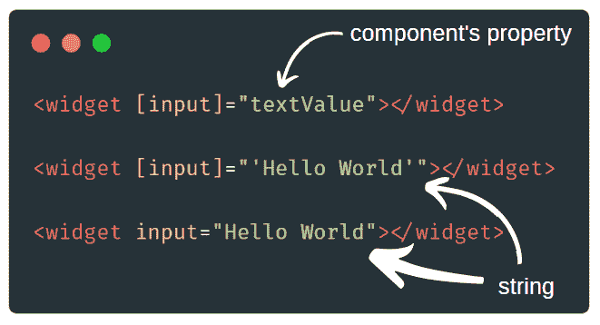

# [Pro-Tip]角度输入语法

> 原文：<https://dev.to/angular/angular-input-syntax-5e50>

又到了**角识丸**的时候了！💊学习新东西只需要 10 秒钟🔥比如早上吃维他命😃

当使用`[input]="value"`时，Angular 将该值解释为一个表达式。所以你可以在那里放置一个来自组件的变量引用，甚至是数学公式。当你使用`input="value"`时，这个值被解释为一个字符串！看一下这个例子:

如果你想把这种知识药丸直接发到你的邮箱，请在[https://angular-academy.com/blog/](https://angular-academy.com/blog/)订阅。我将定期发送它们！记住，学习新东西只需要 10 秒钟！