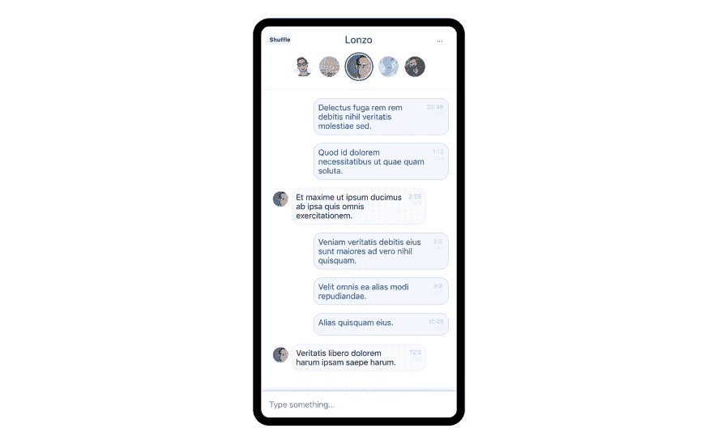
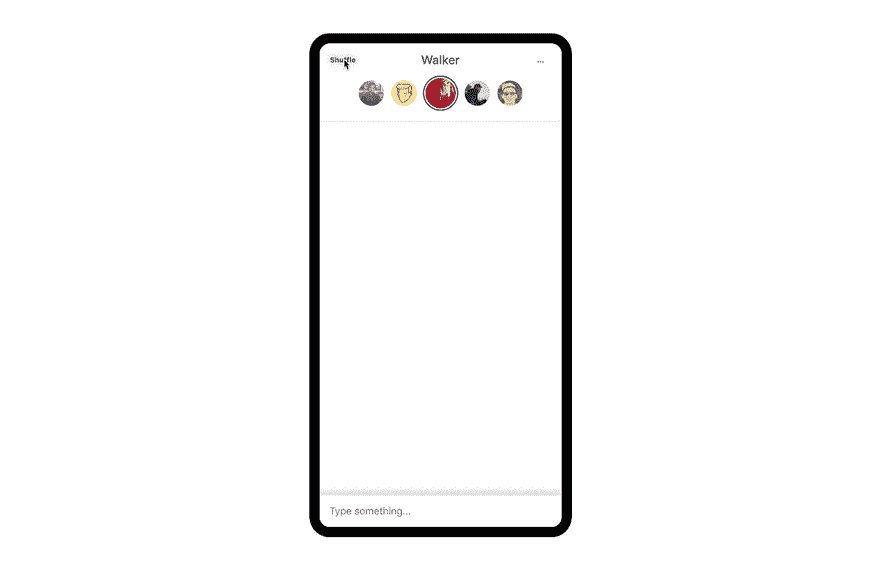

# 用 Pose 制作 React 应用程序动画

> 原文：<https://dev.to/darthknoppix/animate-your-react-app-with-pose-492a>

## 如何使用 Pose 将 React 应用变成动画

[](https://res.cloudinary.com/practicaldev/image/fetch/s--EjaRCrlH--/c_limit%2Cf_auto%2Cfl_progressive%2Cq_auto%2Cw_880/https://blog.sethcorker.com/conteimg/2019/06/Screenshot-2019-06-23-at-4.52.06-pm.png)

网络上的动画可能具有挑战性，因为有许多方法可以达到相同的目标。您可以使用 CSS 来实现过渡或更复杂的动画，或者您可以尝试许多可用于动画的 JS 库中的一个。

你是否曾经问过自己以下问题之一:

> 为什么动画在 React 中这么难？
> 
> 我如何在挂载时激活一个组件？
> 
> 我是使用 CSS 还是 JS 来制作组件动画？

我尽可能使用 CSS 动画，但是它们很快就会变得难以控制，超出了基本的`:hover`和`:focus`状态。通过切换 React 组件的类可以实现很多功能，但我发现最灵活、最容易使用的方法是使用 React 动画库[姿势](https://popmotion.io/pose/)，来自 [Popmotion](https://popmotion.io/) 的优秀人员。我在这里使用的技术可以用在 React，React Native 和 Vue 中。它易于使用，非常强大，并产生了很好的动画效果。

### 为什么要在 web 应用程序中添加动画？

如果你不完全相信为什么应该在 React 应用程序中使用动画，请允许我提出一些理由。

1.  **你已经使用 React/Vue 了**如果你已经使用了基于现代组件的 JS 框架，比如 React 或 Vue，你就已经知道它的好处了。React 允许用户使用动态的、响应性强的界面。有了 React，动画变得比以往任何时候都更容易，而且不一定是一场噩梦。
2.  让你的用户高兴用户不会点击一个按钮，然后等待服务器返回一个完整的页面，用户的期望是丰富的体验，动画增强了这种体验。这是锦上添花，提升你的应用程序。
3.  静态网页告诉用户什么也没发生。动画有助于了解用户在做什么，以及它如何影响应用程序的变化。一个动态的加载指示器，告诉用户你的应用是活跃的，并且(希望)在后台做一些事情。点击删除按钮，看到项目淡出或滑走，让用户相信动作已经发生。它不是凭空出现的。

知道你知道为什么，让我们来看看我是如何使用 Pose 动画一个简单的 UI。

## 一个聊天 App 例子

[](https://res.cloudinary.com/practicaldev/image/fetch/s--uW1PvVdA--/c_limit%2Cf_auto%2Cfl_progressive%2Cq_66%2Cw_880/https://blog.sethcorker.com/conteimg/2019/06/chat-anim.2019-06-23-5_18_48-pm.gif) 

<figcaption>动作中的动画</figcaption>

**看看运行中的代码或者[看看 GitHub 上的回购](https://github.com/Darth-Knoppix/chat-pose-example) :**

[https://codesandbox.io/embed/chat-s0yz6?module=src/App.js](https://codesandbox.io/embed/chat-s0yz6?module=src/App.js)

### 消息气泡动画的工作原理

```
const ChatWindow = posed.ol({
  visible: {
    staggerChildren: 120
  },
  hidden: {
    staggerChildren: 100
  }
});

const MessageItem = posed.li({
  visible: {
    x: 0,
    opacity: 1
  },
  hidden: {
    x: ({ fromDirection }) => (fromDirection === "left" ? -350 : 350),
    opacity: 0
  }
});

function Chat({ messages, visible }) {
    return(
        <ChatWindow
          className="chat"
          pose={visible ? "visible" : "hidden"}
        >
          {messages.map(m => (
            <MessageItem
              className={`container ${m.isOwner ? "sent" : "received"}`}
              fromDirection={m.isOwner ? "right" : "left"}
              key={m.id}
            />)
          }
    </ChatWindow>);
} 
```

<figcaption>Simplified view of Chat, focused on the animation aspect</figcaption>

让这个动画工作的两个主要组件是*聊天窗口*和*消息项*。我们使用`posed.ol`创建一个组件，当它变得可见时，子组件上的动画错开 120 毫秒，当组件隐藏时，错开 100 毫秒。我们可以用一个简单的道具来控制*聊天*是否可见。然后我们使用`posed.li`作为子组件。它们开始时处于隐藏状态，离开屏幕 350 像素(向左或向右，取决于我们是消息的发送者还是接收者)，因此当它们被告知变得可见时，它们会向不透明度 1 和 x 坐标 0 的方向移动。就是这样。

Pose 为我们处理动画，我们简单地定义我们想要动画的可能状态，pose 完成剩下的工作。这是一个非常灵活的系统，很容易理解，用最少的努力就能产生非常好的结果。

### 人物徽章如何动画进出

```
import React from "react";
import posed, { PoseGroup } from "react-pose";
import Person from "./Person";

const PersonItem = posed.li({
  enter: {
    opacity: 1,
    scale: 1,
    delay: ({i}) => i * 100
  },
  exit: {
    opacity: 0,
    scale: 0,
    delay: ({i}) => i * 20
  }
});

function PersonSelector({ people }) {
  return (
    <ul className="person-selector">
      <PoseGroup animateOnMount>
        {people.map((p, i) => (
          <PersonItem className="item" key={p.id} i={i}>
            <Person {...p} />
          </PersonItem>
        ))}
      </PoseGroup>
    </ul>
  );
}

export default PersonSelector; 
```

<figcaption>The PersonSelector component that sits at the top of the chat window</figcaption>

我们利用内置的**进入**和**退出**状态为我们的 *PersonItem。*我们希望动画发生在 mount 上，所以我们用 **animateOnMount** 将孩子包装在一个 *PoseGroup* 中。当组件安装或**人**道具改变时，这将触发动画。我们还以类似于我们的*聊天窗口*组件中的 **staggerChildren** 属性的方式使用 **delay** 属性。当每个人淡入淡出和放大时，这会产生交错的动画效果。

### 如何给 React 应用添加动画？

今天就开始吧，看看姿势的[入门指南，它会带你了解基本原理，这样你就可以开始为你的 React 应用注入活力了。(以及 React Native 或 Vue)。Pose 是一个很棒的库，它可以提供好看的动画，而不必花费数小时调整 CSS 动画或处理其他一些复杂的动画库。设置您的状态或姿势，让 Pose 来处理剩下的事情。](https://popmotion.io/pose/learn/popmotion-get-started/)