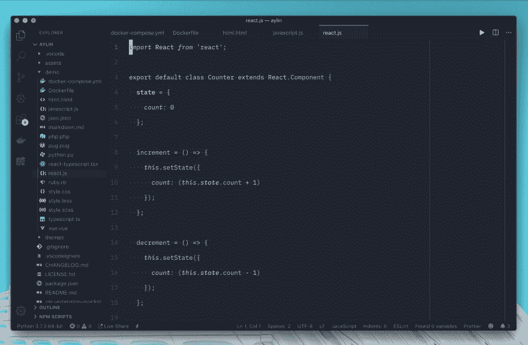

# 宣布艾林:一个现代和最小的 VS 代码与明亮的颜色暗的主题

> 原文：<https://dev.to/_ahmed_ab/announcing-aylin-a-modern-and-minimal-vs-code-dark-theme-with-bright-colors-22bd>

我很高兴地宣布我的新主题为“艾林”🌌。它可以从 VS 代码市场 [Aylin](https://marketplace.visualstudio.com/items?itemName=AhmedAbdulrahman.aylin) 获得。去测试一下，留下你的反馈。

捐助💪
如果您使用它并遇到问题，您可以在 Github 上报告问题。

编码快乐！💻✨