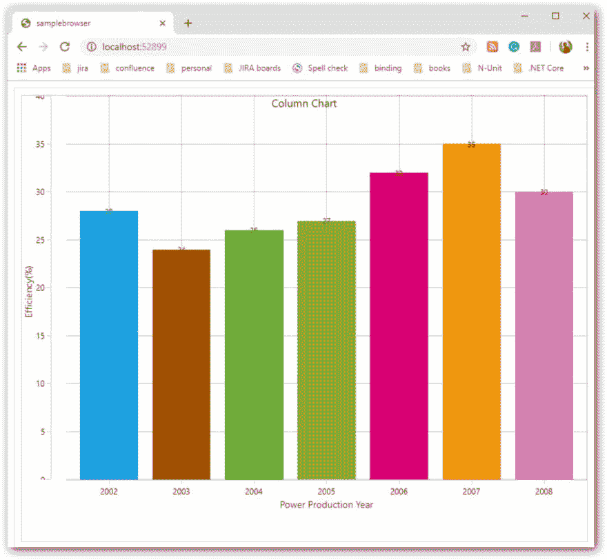

# 宣布我们与 Uno Platform 的新合作

> 原文：<https://dev.to/syncfusion/announcing-our-new-collaboration-with-uno-platform-2d77>

## Syncfusion 与 Uno 平台的合作

Syncfusion 很高兴能够成为 [UnoConf 2019](https://unoconf.com/) 的一部分，并参加 [Uno 跨平台开发平台](https://platform.uno/)2.0 版本的新发布。我们昨天宣布使用我们的 UWP 工具包支持 Uno 平台的网格、时间表和图表控件。杰罗姆·拉班甚至在主题演讲中演示了我们的工具！

我们希望为 Uno 提供更多的控制。我们试图通过[简短调查](https://www.surveymonkey.com/r/BRFYXYD)来衡量开发者社区的兴趣。这将让我们看到什么样的控件和功能会有所帮助。这将有助于我们未来与 Uno 平台的合作。请花点时间分享您对此调查的兴趣。

## 会议集锦

如果你无法参加 Uno 会议，你可以在 YouTube [这里](https://www.youtube.com/watch?v=tYk2us6W6Gg)观看所有会议的视频。

<figure>

<figcaption>Syncfusion’s chart control in Uno Platform</figcaption>

</figure>

<figure>

<figcaption>Syncfusion’s grid control</figcaption>

</figure>

## 为什么是 Uno？

总部位于蒙特利尔的 Uno Platform 的独特之处在于，它允许开发人员使用 C#和 XAML 从单个代码库构建原生移动、桌面和 WebAssembly 应用程序。它是一个开源的、专业支持的平台。在一个每天都有数百个新想法的领域，它们正迅速获得动力。

与 Uno 这样的公司合作对我们来说非常重要。它打开了为 web 汇编、iOS 和 Android 编写代码的大门。Uno 对 Xamarin Forms 的支持允许目前使用 Xamarin Forms 驱动的应用程序的企业将其应用程序带到 web 上，而无需进行昂贵的重写。添加了 [Syncfusion 控件](https://www.syncfusion.com/)使得开发速度更快。

<figure>

<figcaption>Jerome Laban at the UnoConf 2019 keynote</figcaption>

</figure>

软件开发一直在快速向前推进，随着技术的变化和发展，很容易落后。Syncfusion 致力于让世界各地的开发人员都能获得编码资源和工具。我们相信自由职业者和大公司都能对这个行业做出有价值的贡献。像 Uno 这样的公司，他们分享我们的愿景，真正为整个软件开发生态系统做出贡献。

你可以在 [Twitter](https://twitter.com/Syncfusion) 、[脸书](https://www.facebook.com/Syncfusion/)或 [LinkedIn](https://www.linkedin.com/company/syncfusion/) 上关注我们，获取我们为 Uno 平台发布新控件的最新动态。Uno 的团队已经计划在 2020 年 9 月 22-24 日举办第二次 UnoConf。我们计划去那里。

宣布我们与 Uno 平台新合作的帖子[首先出现在](https://www.syncfusion.com/blogs/post/collaboration-syncfusion-uno-platform.aspx) [Syncfusion 博客](https://www.syncfusion.com/blogs)上。